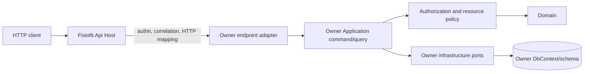
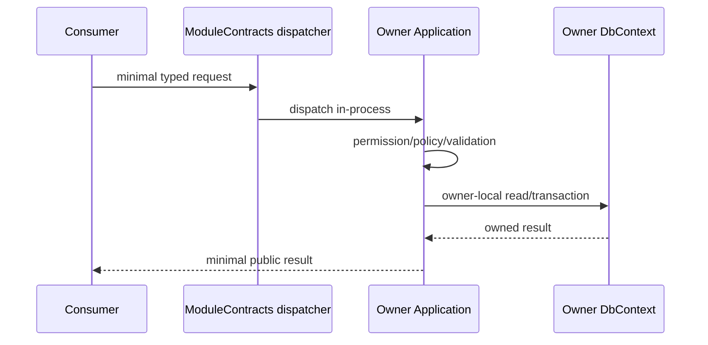
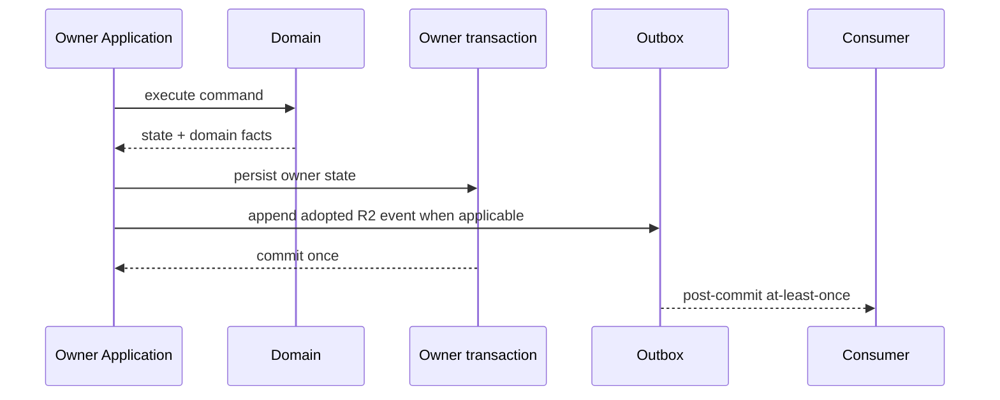
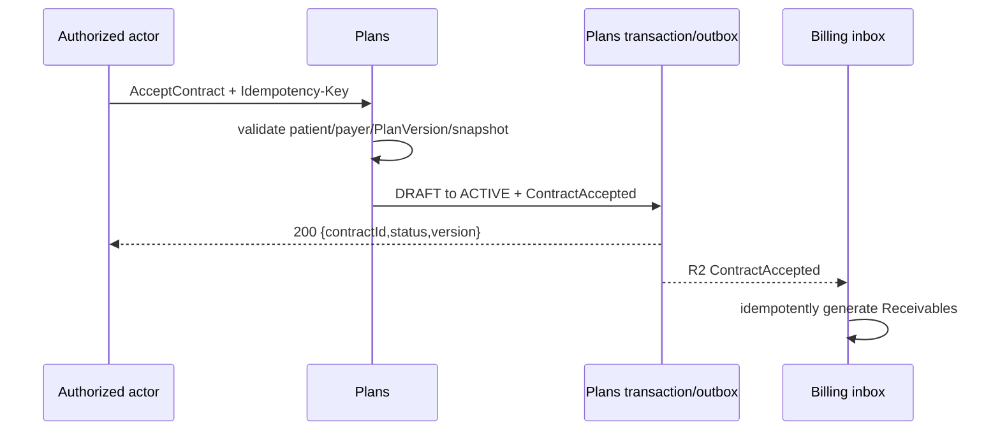
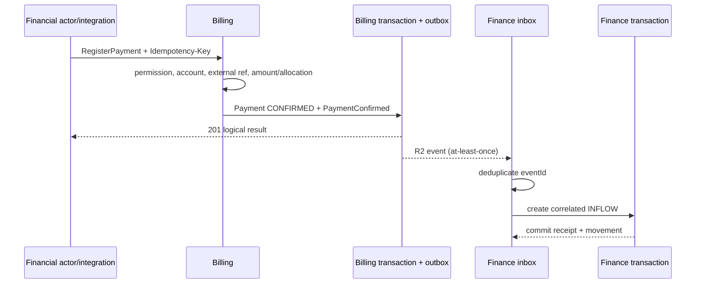
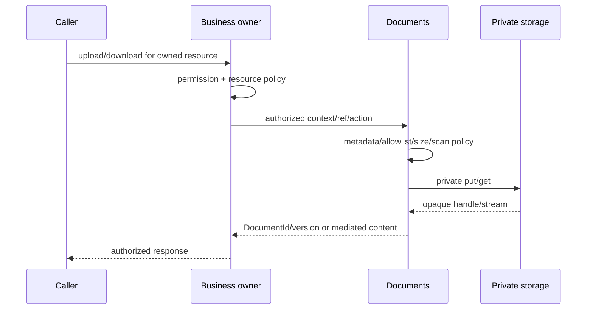

# API-001 — Application / API Contracts

## 1. Status

- **Task:** API-001
- **Status:** DONE — PASS
- **Date:** 2026-09-16
- **Nature:** contratos conceituais de aplicação, módulos e HTTP; nenhuma implementação
- **Readiness:** `READY_WITH_DEFERRED_DETAILS` para BOOT-001
- **Next:** BOOT-001 — Solution Skeleton

Os critérios de API-001 foram atendidos. Operações cujo comportamento depende de alçada, step-up, retenção, RT, exportação clínica, MakeupCredit durante pausa ou precedência financeira permanecem contratualmente visíveis, mas com implementação negada até o fechamento da decisão indicada. Isso não bloqueia o skeleton.

Os 137 commands e 77 queries são um mapa de cobertura contratual, não um backlog de implementação, plano de entrega ou autorização para materializar 214 handlers/endpoints. Uma operação `READY` está suficientemente definida para uma implementação futura, mas só entra em desenvolvimento quando uma tarefa ou vertical slice separada a selecionar explicitamente.

## 2. Objective

Converter o modelo conceitual, state machines, autorização, eventos, arquitetura física e modelo lógico em contratos explícitos de aplicação e API, sem expor entidades, persistência ou internals. Este documento define commands, queries, read models, ownership, rotas, autorização, transações, idempotência, concorrência, erros, contratos entre módulos e regras de compatibilidade.

## 3. Inputs

Foram lidos integralmente `PROJECT_OS.md` e seu último handoff; `docs/ai/FISIOFIT_AI_PROFILE.md`; Context Map; Ownership Map; Domain Events; ARC-003; DB-001; ADR-001..006; MODEL-001..005; STATE-001; AUTH-001; Glossary; Business Parameters; Rules Index; Process Index e Decision Log. A biblioteca `.prompts`, quando disponível, é apenas metodologia e não foi usada como fonte de verdade.

## 4. API Principles

1. API não é o domínio: request/response nunca são entity, aggregate, EF model, repository, DbContext ou domain event interno.
2. Todo endpoint tem exatamente um bounded context owner; `Fisiofit.Api` autentica, correlaciona, trata erro e delega, mas não decide regra.
3. Commands representam intenção de negócio; queries representam leitura e não alteram fonte transacional.
4. IDs externos são UUID opacos. Nunca revelam sequência, schema, tabela ou semântica codificada.
5. Dinheiro é `{ amount, currency }`; instantes são ISO 8601 com offset/UTC; datas civis são `YYYY-MM-DD`; horários recorrentes são locais e interpretados no timezone institucional.
6. Deny-by-default e resource policies são aplicados no servidor e no owner do recurso. Frontend, role, evento recebido ou posse de ID não autorizam operação.
7. Histórico não recebe DELETE genérico. Cancelar, encerrar, reverter, retificar, adicionar adendo, reabrir e inativar são ações explícitas.
8. Transação termina no DbContext/context owner. Não existe transação distribuída nem HTTP interno.
9. Comunicação síncrona cross-context usa contratos mínimos em `Fisiofit.ModuleContracts`; propagação assíncrona usa somente eventos canônicos de DOMAIN_EVENTS.
10. Clinical é segregado; Billing e Finance são owners distintos; Documents e Reports herdam a autorização/sensibilidade da fonte.
11. n8n usa APIs/webhooks autorizados na borda, nunca PostgreSQL ou endpoint administrativo universal.
12. OpenAPI futuro refletirá estes contratos, não os substituirá.

### 4.1 Physical module mapping

| Physical module | Logical endpoint/contract owners |
|---|---|
| Access | Identity & Access |
| Registry | Organization, People, Patients, Staff |
| CRM | CRM |
| Operations | Scheduling, Pilates |
| Clinical | Clinical |
| Revenue | Plans & Enrollment, Billing, Finance |
| Communication | Communication |
| Documents | Documents |
| Audit | Privacy & Audit |
| Reports | Reports |

O módulo físico apenas hospeda contexts; não se torna owner genérico.

### 4.2 Request path



## 5. Application Contract Principles

- Command e query têm nome de negócio, owner único, actor/current context, entrada mínima e resultado explícito.
- Commands não aceitam `createdAt`, `createdBy`, status calculado, audit fields ou owner server-controlled.
- Queries retornam read models próprios para list, detail, edit, report ou integration; DTO universal é proibido.
- Public module contracts são organizados pelo namespace do owner e carregam apenas fatos mínimos.
- Domain invariants permanecem no Domain; coordenação, autorização e transação ficam na Application; parsing/HTTP ficam no Host/adapter.
- Command síncrono concluído retorna resultado síncrono. `202 Accepted` é reservado a export/job realmente assíncrono.
- Resultados padrão: `CreatedResource { id, version? }`, `CommandSuccess { id, version?, status? }` ou resposta específica mínima; não há envelope gigante.
- Toda validação cross-context síncrona ocorre antes do commit local; uma mudança concorrente posterior é tratada por guard/evento/reconciliação conforme o risco.

## 6. HTTP Conventions

| Verb | Semântica |
|---|---|
| GET | consulta segura e sem efeitos de negócio; pode registrar telemetria/audit de leitura sensível |
| POST | criação, ação de domínio, comando não idempotente por natureza ou job |
| PUT | substituição completa somente quando houver recurso configurável com contrato completo; raro |
| PATCH | alteração parcial de draft/configuração corrente com whitelist; nunca contorna state machine |
| DELETE | apenas remoção técnica/draft explicitamente descartável; não usado para fatos históricos |

Transições como `cancel`, `finalize`, `reverse`, `refund`, `close`, `reopen`, `pause`, `resume`, `complete`, `deactivate` e `end` são `POST` em subrecursos de ação. Requests de mutation usam `application/json`; upload pode usar `multipart/form-data` ou fluxo binário futuro, sempre com metadata validada.

### 6.1 Status codes

| Status | Uso |
|---|---|
| 200 | query, ação com representação mínima útil ou replay idempotente |
| 201 | novo recurso criado; `Location` quando houver rota de leitura autorizada |
| 202 | job/export realmente assíncrono aceito, com operation id e status route |
| 204 | ação concluída sem corpo útil |
| 400 | JSON/parâmetro/formato sintaticamente inválido |
| 401 | principal ausente/inválido |
| 403 | autenticado, mas permission/policy/scope negou |
| 404 | recurso inexistente ou ocultado por política anti-enumeração |
| 409 | estado/regra concorrente ou conflito de negócio/idempotência |
| 412 | `If-Match`/expected version não corresponde |
| 422 | request sintático válido, mas invariante/regra de domínio impede a intenção |
| 428 | `If-Match` obrigatório ausente no End de GuardianLink (seção 27.1); não é versão divergente |
| 429 | limite arquitetural excedido; `Retry-After` quando aplicável |
| 500 | falha inesperada sanitizada |

`409` é usado quando o conflito depende do estado atual ou de unicidade/coordenação; `422` quando a intenção não satisfaz regra estável mesmo com o recurso na versão informada. `412` é exclusivo de precondition de concorrência fornecida pelo cliente.

## 7. Route Versioning

- Baseline: versionamento por path, `/api/v1/...`, conforme ADR-007.
- Rotas usam substantivos plurais, IDs opacos e nesting somente quando expressa ownership/ação local.
- REST simples é preferido; ações explícitas são usadas quando há transição de domínio.
- Nova versão maior é exigida para mudança incompatível de rota, semântica, obrigatoriedade, representação ou autorização observável.
- Correções compatíveis, campos opcionais e novos endpoints permanecem em v1.
- API externa e `ModuleContracts` têm ciclos de compatibilidade independentes.

## 8. Request Contracts

Todo request declara apenas dados do use case. Campos controlados pelo servidor são rejeitados ou ignorados com erro de validação, nunca aceitos silenciosamente. Referências cross-context são UUIDs opacos; `reasonCode` usa catálogo quando houver e `reasonDetail` é limitado/auditado. Money exige moeda. Intervalos usam início inclusivo/fim exclusivo. Campo omitido é diferente de `null` somente quando o contrato o declarar.

### 8.1 Critical request examples

```json
// CreatePatientProfile — POST /api/v1/patients
{
  "personId": "uuid",
  "primaryUnitId": "uuid",
  "guardianLinks": [{ "personId": "uuid", "isPrimary": true }],
  "responsiblePayerPersonId": "uuid"
}
```

```json
// MergePerson — POST /api/v1/people/merges
{
  "sourcePersonId": "uuid",
  "targetPersonId": "uuid",
  "classification": "SIMPLE",
  "reasonCode": "DUPLICATE_CONFIRMED"
}
```

```json
// ScheduleAppointment — POST /api/v1/appointments
{
  "purpose": "EXPERIMENTAL",
  "personId": "uuid",
  "professionalId": "uuid",
  "unitId": "uuid",
  "startsAt": "2026-09-20T13:00:00-03:00",
  "endsAt": "2026-09-20T14:00:00-03:00",
  "opportunityId": "uuid"
}
```

```json
// AddPatientToClass — POST /api/v1/classes/{classId}/memberships
{
  "patientId": "uuid",
  "enrollmentId": "uuid",
  "effectiveFrom": "2026-09-21"
}
```

```json
// RecordAttendance — POST /api/v1/class-occurrences/{occurrenceId}/attendances
{
  "participantId": "uuid",
  "result": "PRESENT",
  "arrivalAt": "2026-09-21T09:03:00-03:00",
  "expectedOccurrenceVersion": 7
}
```

```json
// FinalizeClinicalEntry — POST /api/v1/clinical/entries/{id}/finalize
{
  "expectedVersion": 4,
  "finalizationPolicyVersion": "uuid"
}
```

```json
// AcceptContract — POST /api/v1/contracts/{id}/accept
{
  "acceptedTermsVersion": "2026-09",
  "acceptedAt": "2026-09-16T15:00:00-03:00"
}
```

```json
// RegisterPayment — POST /api/v1/payments; Idempotency-Key required
{
  "payerPersonId": "uuid",
  "amount": { "amount": "350.00", "currency": "BRL" },
  "method": "PIX",
  "financialAccountId": "uuid",
  "externalReference": "provider-reference",
  "allocations": [{ "receivableId": "uuid", "amount": "350.00" }]
}
```

```json
// ReversePayment — POST /api/v1/payments/{id}/reversals; Idempotency-Key required
{
  "amount": { "amount": "100.00", "currency": "BRL" },
  "reasonCode": "DUPLICATE_PAYMENT",
  "expectedPaymentVersion": 3
}
```

```json
// IssueRefund — POST /api/v1/refunds; Idempotency-Key required
{
  "paymentId": "uuid",
  "amount": { "amount": "100.00", "currency": "BRL" },
  "financialAccountId": "uuid",
  "reasonCode": "SERVICE_CANCELLED"
}
```

```json
// TransferFunds — POST /api/v1/finance/transfers; Idempotency-Key required
{
  "sourceAccountId": "uuid",
  "destinationAccountId": "uuid",
  "amount": { "amount": "500.00", "currency": "BRL" },
  "occurredAt": "2026-09-16T10:00:00-03:00",
  "reasonCode": "CASH_DEPOSIT"
}
```

```json
// ClosePeriod — POST /api/v1/finance/closings/{id}/close; Idempotency-Key required
{
  "expectedVersion": 2,
  "cutoffAt": "2026-09-30T23:59:59-03:00",
  "billingSourceVersion": "opaque-version",
  "acknowledgedPendingItems": true
}
```

## 9. Response Contracts

- Create retorna `201` com `id`, `version?`, `status?` e `Location` quando a leitura for autorizável.
- Mutation retorna somente identificação, estado/versão alterados e dados necessários ao próximo passo.
- Query usa read model específico; list item é menor que detail.
- Nenhuma resposta expõe persistence row, navigation property, audit internals, JSONB cru, storage key/path, stack trace, SQL ou exception type.
- Dados clínicos só aparecem em rotas Clinical e projeções explicitamente autorizadas; valores financeiros não vazam para endpoints operacionais.
- ETags são opacos e derivados da version do recurso; cliente não interpreta seu conteúdo.

```json
// Exemplos mínimos
{ "id": "uuid", "status": "ACTIVE", "version": 1 }
```

```json
// 202 de exportação clínica assíncrona
{ "operationId": "uuid", "status": "ACCEPTED", "statusUrl": "/api/v1/clinical/exports/uuid" }
```

## 10. Error Model

Erros HTTP usam Problem Details RFC 9457 (`application/problem+json`) com extensões estáveis:

```json
{
  "type": "https://api.fisiofit.example/problems/clinical-entry-already-finalized",
  "title": "Business rule violation",
  "status": 422,
  "code": "CLINICAL_ENTRY_ALREADY_FINALIZED",
  "detail": "The requested transition is not allowed.",
  "traceId": "opaque-correlation-id",
  "errors": [{ "field": "expectedVersion", "code": "STALE_VALUE", "message": "The resource changed." }]
}
```

Categorias estáveis: `VALIDATION_ERROR`, `NOT_FOUND`, `CONFLICT`, `BUSINESS_RULE_VIOLATION`, `FORBIDDEN`, `UNAUTHORIZED`, `CONCURRENCY_CONFLICT`, `IDEMPOTENCY_CONFLICT`, `RATE_LIMITED`, `INTERNAL_ERROR`. `detail` é seguro e localizado futuramente; decisões de cliente usam `code`, não parsing de texto.

## 11. Validation Boundaries

| Layer | Responsibility | Example |
|---|---|---|
| HTTP/syntactic | JSON, type, UUID, required shape, size, enum wire value | malformed date → 400 |
| Application | use-case completeness, reference orchestration, idempotency, transaction | FinancialAccount lookup |
| Domain | aggregate invariant, state transition, capacity owned by Pilates | class full → 422 |
| Authorization | permission, scope, resource policy, state-sensitive access | other professional draft → 403 |
| Cross-context | minimum current fact from owner public contract | inactive Patient → 422/409 by operation |
| Infrastructure | uniqueness/optimistic condition/reliable receipt | stale ETag → 412 |

Controller/endpoint adapter não duplica domínio. Falha de dependência síncrona indisponível é sanitizada e não autoriza fallback permissivo.

## 12. Authentication

A API assume principal autenticado com `user identity`, conta atual e roles/permissions/scopes apropriados. Provider IAM, token/session shape, MFA, recovery e revocation mechanics permanecem deferred. Rotas de health/public callback podem ser anônimas apenas por decisão explícita; todo endpoint de negócio deste catálogo exige autenticação. Inbound webhook usa identidade técnica/assinatura, não role humana.

## 13. Authorization

1. Host valida autenticação e cria current actor.
2. Application exige permission específica.
3. Owner avalia resource policy, scope, estado e explicit deny no instante do uso.
4. Operação sensível registra audit e, quando marcado, exige step-up/approval antes de implementar.
5. `OWNER_MANAGER` não recebe Clinical; `DEVELOPER_IT` não recebe autoridade de negócio; `PHYSIOTHERAPIST` não recebe Finance; `SECRETARY_RECEPTION` não lê prontuário completo.
6. Consumers de evento, n8n e service identities têm finalidade mínima; evento recebido não concede command authority.

## 14. Resource Policies

| Policy | Owner/evaluation | Applies to |
|---|---|---|
| `ACTIVE_ACCOUNT` | Identity/current request | all business calls |
| `NO_SELF_PRIVILEGE_ESCALATION` | Identity | role/permission grants |
| `UNIT_SCOPE` | resource owner with Identity grants | administrative operations |
| `ACTIVE_PROFESSIONAL_RELATIONSHIP` | Staff facts + consumer decision | clinical/agenda/class work |
| `OWN_APPOINTMENT` | Scheduling | professional appointment actions |
| `OWN_CLASS` | Pilates | roster, occurrence, attendance |
| `ASSIGNED_PATIENT` / `CLINICAL_CARE_RELATIONSHIP` | Clinical | clinical read/write |
| `CLINICAL_DRAFT_AUTHOR` | Clinical | draft update/finalize |
| `FINANCIAL_SCOPE` | Billing/Finance | all financial reads/writes |
| `OWNER_APPROVAL_REQUIRED` | People | sensitive merge |
| `BREAK_GLASS_ELIGIBLE` | Clinical | exceptional patient/resource access |
| `DOCUMENT_CONTEXT_ACCESS` | business owner then Documents | upload/read/download/remove |
| `REPORT_SOURCE_SENSITIVITY` | Reports + source owners | report reads/exports |
| `CURRENT_RESOURCE_STATE` | each owner | every transition |

## 15. Sensitive Operations

Step-up is a capability requirement, not a selected mechanism.

| Operation | Reason | Approval/step-up | Audit |
|---|---|---|---|
| role/permission change | required | step-up required before implementation | security |
| sensitive Person merge | required | Owner approval + step-up required | sensitive |
| Clinical rectify/addendum | required | clinical authority; step-up recommended | clinical |
| break-glass | reason + justification | step-up required | reinforced clinical |
| Clinical export | reason/scope | legal/RT workflow + step-up deferred; default deny | reinforced clinical |
| Payment reversal/refund | required | threshold/approver + step-up deferred; default deny | financial |
| manual adjustment/negotiation | required | alçada deferred | financial |
| transfer/reconciliation/closing | according to action | step-up recommended; reopen required | financial |
| sensitive audit read/export | purpose | scoped approval/step-up recommended | security |

## 16. Idempotency

`Idempotency-Key` é obrigatório somente onde a repetição pode criar efeito único/material ou retry externo. Scope lógico:

`actor/service identity + owner context + operation + key + canonical request hash`.

- Mesmo scope/key/hash: retorna o mesmo resultado lógico e status compatível, sem refazer efeito.
- Mesma key com hash diferente: `409 IDEMPOTENCY_CONFLICT`.
- Keys não são globais; receipt pertence ao owner.
- External payment reference, provider e account complementam a proteção e não substituem a key.
- Retention física da receipt permanece deferred; o contrato exige janela publicada futura maior que o retry esperado.
- Webhooks registram external event reference/raw hash minimizado, verificam assinatura/timestamp/replay e só então invocam command do owner.

## 17. Concurrency

ETag/`If-Match` é adotado seletivamente para recursos expostos com `version`. Body `expectedVersion` é aceito nos contratos in-process e nos exemplos de action quando `If-Match` não puder representar múltiplos roots; HTTP deve preferir `If-Match` para um root.

| Resource/operation | Mechanism | Conflict |
|---|---|---|
| Clinical Assessment/Entry draft edit/finalize | ETag/If-Match over logical version | 412 `CONCURRENCY_CONFLICT` |
| Attendance record/correction | occurrence/attendance expected version | 412; append correction only |
| Class membership/occurrence seat | atomic owner transaction + lock/version; no client token required by default | 409 `PILATES_CLASS_FULL`/conflict |
| Makeup reserve/cancel | atomic compare-and-set + unique active reservation | 409 |
| Payment/reversal/allocation/refund | idempotency + Payment/Receivable versions + stable local transaction | 409/412 |
| Closing close/reopen | ETag/If-Match + unique period + append snapshot | 412 |
| editable calendars/schedules/configuration | ETag when read-modify-write UI exists | 412 |

Não existe token universal. Append-only facts dependem de unique/idempotency/transaction, não de atualização in-place.

## 18. Pagination

- Padrão inicial: offset pagination `page` (1-based) + `pageSize`.
- Default e máximo são configuração operacional documentada; baseline sugerida para implementação: default 25, máximo 100, ambos alteráveis sem quebrar contrato.
- Response: `{ items, page, pageSize, totalCount }`; `totalCount` pode ser omitido somente em feed futuro explicitamente cursor-based.
- Ordenação determinística sempre inclui tie-breaker opaco (`id`) após sort público.
- Cursor fica reservado a timelines/feeds cujo volume ou estabilidade demonstre necessidade; nenhuma rota v1 o exige inicialmente.

## 19. Filtering

Cada query define whitelist de filtros no Query Catalog. Nomes de coluna, expressões livres e filtros por campos internos são proibidos. Datas usam intervalos explícitos; status aceitos são wire enums documentados. Search não executa deduplicação/merge: `search` localiza candidatos; `FlagDuplicate`/`MergePerson` são operações separadas.

## 20. Sorting

Formato: `sort=field,-otherField`. Cada query aceita somente fields publicados; inválido retorna `400 VALIDATION_ERROR`. Defaults são estáveis e declarados no Query Catalog. Nenhum sort por JSONB, coluna audit/internal ou storage metadata.

## 21. Public Module Contracts

`Fisiofit.ModuleContracts` contém namespaces por owner, requests/results imutáveis e mínimos, sem entities ou abstração genérica de serviço. O caller depende do contrato, nunca do assembly do módulo owner.

```text
Fisiofit.ModuleContracts/
  Identity/ Organization/ People/ Patients/ Staff/
  CRM/ Scheduling/ Pilates/ Clinical/
  Plans/ Billing/ Finance/
  Communication/ Documents/ Audit/ Reports/
```



## 22. Synchronous Cross-Module Queries

| Consumer | Owner | Contract | Purpose | Minimal result | Failure modes |
|---|---|---|---|---|---|
| all owners | Identity | `AuthorizeOperation` | current grants/scope input; owner still evaluates resource | allow/deny/condition reference | unauthenticated, revoked, deny |
| Patients/Staff/CRM/Identity | People | `ResolvePersonIdentity` | validate canonical Person/merge alias | canonicalPersonId, state | not found, merged, inactive |
| Plans/Communication | Patients | `GetPatientAdministrativeEligibility` | active profile/payer/contact purpose | patientId, state, payer ref | inactive, missing payer |
| Scheduling/Pilates/Clinical | Staff | `GetProfessionalEligibility` | active relation/unit/leave | eligible, professionalId, unit scope | inactive, leave, wrong unit |
| consumers | Organization | `GetUnitAndCalendar` | active Unit/Room info and business calendar | ids, timezone, dates/version | inactive/not found |
| Pilates/CRM | Scheduling | `CheckSchedulingConflict` | patient/professional interval conflict | available, conflicts[] minimized | invalid interval, conflict |
| Clinical | Scheduling | `GetAppointmentCareContext` | prove assigned patient/professional/time | minimal care context | not found, terminal mismatch |
| Clinical/Scheduling | Pilates | `GetOccurrenceCareContext` | prove occurrence participant/professional | minimal context, occurrence state | not found, unauthorized |
| Pilates | Plans | `GetEnrollmentEligibility` | current service/frequency/vigência | eligible, enrollmentId, frequency | inactive, paused, out of period |
| Pilates/Scheduling/Plans | Billing | `GetFinancialRestrictionStatus` | immediate operational guard | restricted, effectiveFrom, reasonCode? | unavailable, stale version |
| Plans | Patients | `GetCurrentPayerRelationship` | snapshot parties at contract creation | payerPersonId, linkId, effectiveFrom | missing/ambiguous |
| Plans | Billing | `GenerateReceivablesForAcceptedContract` | create unique obligations from accepted snapshot | generationId, receivableIds/status | duplicate, invalid snapshot |
| Billing | Finance | `GetReceivableFinancialAccount` | validate selectable active account | accountId, type, currency, active | not found/inactive/currency mismatch |
| Finance | Billing | `GetBillingPositionAtCutoff` | versioned closing input | totals, sourceVersion, cutoff | unavailable/version changed |
| Clinical/other owners | Documents | `StorePrivateDocument` / `ReadPrivateDocument` | bytes/handle after owner authorization | document/version/checksum/stream descriptor | scan pending, rejected, unavailable |
| Communication | People | `ResolveAuthorizedContact` | delivery contact for approved purpose | contact endpoint/tokenized value | absent/opt-out if applicable |

Não há contrato `IEverythingService`, retorno de PatientEntity, query via event ou chamada HTTP interna.

## 23. Command → Event Relationships

Eventos abaixo são os canônicos já adotados; `internal` significa domain event sem contrato público. Em R2, outbox é gravada na mesma transação do fato.



| Command | Possible canonical events |
|---|---|
| ChangeInstitutionalCalendar | `InstitutionalCalendarChanged` |
| MergePerson / ReversePersonMerge | `PersonMergeCompleted` / `PersonMergeReversed` |
| Create/Activate/DeactivatePatientProfile | `PatientProfileCreated`, `PatientActivated`, `PatientDeactivated` |
| ChangeResponsiblePayer | `ResponsiblePayerChanged` |
| Start/EndEmployment; Register/EndProfessionalLeave | `EmploymentStarted/Ended`, `ProfessionalLeaveRegistered/Ended` |
| Opportunity/Task commands | corresponding CRM internal events only |
| Schedule/Reschedule/Cancel/Complete/MarkNoShow Appointment | `AppointmentScheduled/Rescheduled/Cancelled/Completed/NoShowRecorded` |
| ApplyCalendarException | `CalendarExceptionApplied` |
| ChangeClassSchedule | `ClassScheduleChanged` |
| Add/EndMembership | `ClassMembershipStarted/Ended` |
| Generate/CancelOccurrence; AssignSubstitute | `ClassOccurrenceCreated/Cancelled`, `SubstituteAssigned` |
| Record/CorrectAttendance; makeup commands | internal Pilates events only |
| FinalizeAssessment/ClinicalEntry | `AssessmentFinalized`, `ClinicalEntryFinalized` |
| RectifyClinicalEntry/AddClinicalAddendum | `ClinicalEntryRectified`, `ClinicalAddendumAdded` |
| UseBreakGlass / complete Clinical export | `BreakGlassUsed`, `ClinicalRecordExported` |
| Accept/Complete/CancelContract | `ContractAccepted/Completed/Cancelled` |
| Activate/Pause/Resume/Cancel/CompleteEnrollment | matching `Enrollment*` event |
| ChangeEnrollmentFrequency | `EnrollmentFrequencyChanged` |
| GenerateReceivables | `ReceivablesGenerated` |
| Register/ConfirmPayment | `PaymentConfirmed` |
| ReversePayment | `PaymentPartiallyReversed` or `PaymentReversed` |
| CompleteRefund | `RefundCompleted`; issue/cancel remain internal |
| Apply/RemoveFinancialRestriction | matching restriction event |
| ClosePeriod/ReopenPeriod | `MonthClosed`, `ClosingReopened` |
| Finance local commands | internal `Expense*`, `MoneyTransferred`, `ReconciliationAdjusted` as catalogued |

## 24. Identity API

Commands sustentados: `CreateUserAccount`, `DisableUserAccount`, `AssignRole`, `GrantPermission`, `RevokeRoleOrPermission`, `TerminateUserSessions`. Queries: `GetUserAccount`, `SearchUserAccounts`, `GetEffectiveAccess`. O target é sempre explícito; `NO_SELF_PRIVILEGE_ESCALATION` e audit security são obrigatórios. Provider, sessão, claims e step-up físico são deferred; operações privilegiadas ficam deny até esse gate, sem inventar impersonation.

## 25. Organization API

Commands: `CreateUnit`, `UpdateUnitDetails`, `DeactivateUnit`, `RegisterRoom`, `DeactivateRoom`, `CreateInstitutionalCalendar`, `RegisterHoliday`, `ChangeCalendarEffectivePeriod`. Queries: `GetUnitDetails`, `ListUnits`, `GetInstitutionalCalendar`, `ListRooms`. Room é informativa e não possui endpoint de reserva/capacidade. Configurações editáveis usam ETag quando expostas para read-modify-write.

## 26. People API

Commands: `CreatePerson`, `UpdatePersonIdentity`, `UpdatePersonContact`, `ManagePersonRelationship`, `FlagPotentialDuplicate`, `MergePerson`, `ReversePersonMerge` (deferred pela policy de reversal). Queries: `GetPersonDetails`, `SearchPeople`, `GetPersonRelationships`, `GetMergeReview`. Busca usa nome, CPF normalizado quando permitido, contato e Unit; resultado é minimizado e não executa deduplicação automática.

## 27. Patients API

Commands: `CreatePatientProfile`, `ActivatePatientProfile`, `DeactivatePatientProfile`, `ManageGuardian`, `ManageAdministrativeResponsible`, `ChangeResponsiblePayer`, `ManageEmergencyContact`. Queries: `GetPatientDetails`, `SearchPatients`, `GetPatientAdministrativeSummary`, `GetPatientRelationships`. A API não duplica Person; dados civis são lidos por composição autorizada. O read administrativo nunca incorpora prontuário.

### 27.1 IMP-003A — Guardian HTTP contract reconciliation

**2026-09-23 — contratos definitivos para implementação futura; nenhum endpoint implementado por esta revisão.** Esta especialização de `CMD-018 ManageGuardian` e `QRY-064 GetPatientRelationships` cobre somente PatientProfile e Person já existentes e `kind=GUARDIAN`. Os demais relacionamentos do catálogo não são entregues nem promovidos por este slice. A implementação, quando executada em tarefa própria, pertence a Patients.

Reconciliação com IMP-003-DESIGN, seção 24:

- criação preserva `POST /api/v1/patients/{patientId}/guardians`; `{patientId}` apenas explicita o parâmetro antes chamado `{id}`;
- consulta publica o mapping de QRY-064 em `/relationships?kind=GUARDIAN`, sem criar GET alternativo em `/guardians`;
- encerramento publica a ação aditiva `/guardians/{guardianLinkId}/end` de CMD-018, sem novo command ID;
- `isPrimary` é o nome HTTP definitivo para o mesmo atributo conceitual `isPrimaryLegalGuardian`; não há duas flags nem mudança de cardinalidade. O exemplo anterior do design é substituído; o contrato ainda não foi implementado;
- Create/End continuam sem `Idempotency-Key` e sem receipt; ETag de criação identifica o vínculo criado, e somente End exige `If-Match`;
- ausência de `If-Match` é `428`; divergência é `412`, reservado pela seção 6.1 a uma precondition fornecida. Essa extensão é restrita ao novo End e não muda endpoints existentes;
- não há GET individual de GuardianLink aprovado: Create não anuncia `Location` para uma rota inexistente. QRY-064 fornece identificação e ETag de cada vínculo.

#### 27.1.1 Create — CMD-018

`POST /api/v1/patients/{patientId}/guardians`, `Content-Type: application/json`. `patientId` é UUID não vazio de PatientProfile, não PersonId. Não exige `If-Match` nem exige/consome `Idempotency-Key`.

| Campo do body | Obrigatoriedade | Semântica |
|---|---|---|
| `guardianPersonId` | obrigatório, UUID não vazio | Person existente, canônica/CURRENT, distinta da Person do paciente; validada por contrato público People |
| `effectiveFrom` | obrigatório, `YYYY-MM-DD` | início inclusivo; hoje ou futuro na data de negócio institucional |
| `effectiveTo` | opcional, data ou null | fim exclusivo maior que `effectiveFrom`; omitido equivale a null |
| `isPrimary` | obrigatório, boolean | principal legal; `false` é válido, sem exigir que exista outro principal |

```json
{
  "guardianPersonId": "01990000-0000-7000-8000-000000000002",
  "effectiveFrom": "2026-09-23",
  "effectiveTo": null,
  "isPrimary": true
}
```

Somente esses campos são aceitos. Não se aceita identidade civil inline, `relationshipToPatient`, `endReason`, status, versão ou autoria fornecida pelo cliente. PatientProfile deve estar `ACTIVE`. People continua owner da identidade: Person inexistente/ocultada falha antes da escrita; Person não corrente falha fechada, sem merge/repoint automático. Não há criação de Person.

Períodos são `[effectiveFrom, effectiveTo)`, com fim null sem limite. Proibir overlap do mesmo par paciente/guardian, duplicidade do mesmo início e overlap de principais do paciente, inclusive em períodos finitos ou futuros. Guardians diferentes não principais podem coexistir; zero principal é válido. Retroatividade permanece gated. Validações de conjunto e inserção são atômicas na transação Patients da seção 27.1.4.

Sucesso: `201 Created`, `Cache-Control: no-store`, header `ETag` do vínculo e body `GuardianLinkResult` abaixo. Não retorna EF entity ou dados People; a projeção de identificação é obtida pela consulta autorizada. Nenhum `Location` individual é emitido neste slice.

#### 27.1.2 List — QRY-064

`GET /api/v1/patients/{patientId}/relationships?kind=GUARDIAN`.

| Parâmetro | Contrato |
|---|---|
| `patientId` (path) | UUID não vazio de PatientProfile existente e autorizado |
| `kind` (query) | obrigatório; somente `GUARDIAN` neste slice; ausente, desconhecido ou outro tipo retorna `400 VALIDATION_ERROR` |
| `effectiveOn` | data `YYYY-MM-DD` opcional; seleciona `effectiveFrom <= d` e (`effectiveTo == null` ou `d < effectiveTo`) |
| `page` / `pageSize` | offset, inteiros positivos; defaults 1/25 e máximo 100 nesta slice, conforme configuração operacional da seção 18; acima do máximo retorna 400 |
| `sort` | whitelist `effectiveFrom` ou `-effectiveFrom`; default `-effectiveFrom`, com `guardianLinkId` ascendente como desempate opaco fixo |

Parâmetros/filtros/sorts fora dessa whitelist retornam 400. Sem `effectiveOn`, retorna **todos os períodos autorizados**, históricos, correntes e futuros, paginados; não aplica “hoje” implicitamente. Com o filtro, somente vínculos vigentes na data, mantendo os mesmos DTOs, autorização e ordenação. Consultar o passado é permitido; escrever retroativamente continua proibido. `temporalState` usa `effectiveOn` quando fornecido, senão a data de negócio capturada para a resposta: `FUTURE`, `CURRENT` ou `HISTORICAL`, derivado do período.

Sucesso: `200 OK`, `Cache-Control: no-store`, `{ items, page, pageSize, totalCount }`. `totalCount` conta todos os vínculos após scope/kind/data e antes da paginação; página e count usam uma visão consistente do conjunto Patients no request. Offset não promete snapshot estável entre requests. PatientProfile inativo continua consultável. Paciente existente sem vínculos/filtro sem resultados retorna `200` com `items: []` e `totalCount: 0`; página além do fim retorna `items: []` e o count real. PatientProfile inexistente retorna `404 RESOURCE_NOT_FOUND`.

Cada item de `PatientRelationshipView` para `GUARDIAN` contém os campos de `GuardianLinkResult`, `kind: "GUARDIAN"`, `temporalState` e `guardian: { displayName }`. A leitura People é por IDs da página, minimizada e autorizada. CPF e telefone são **omitidos**, assim como nascimento, endereço, dados clínicos/financeiros e evidence interna. Referência People quebrada ou composição indisponível retorna `500 INTERNAL_ERROR` sanitizado, sem coleção parcial ou fallback permissivo; uma referência histórica inativa não é apagada/filtrada só por estar inativa.

```json
{
  "items": [{
    "guardianLinkId": "01990000-0000-7000-8000-000000000003",
    "patientId": "01990000-0000-7000-8000-000000000001",
    "guardianPersonId": "01990000-0000-7000-8000-000000000002",
    "effectiveFrom": "2026-09-23",
    "effectiveTo": null,
    "isPrimary": true,
    "version": 1,
    "etag": "\"opaque-link-validator\"",
    "kind": "GUARDIAN",
    "temporalState": "CURRENT",
    "guardian": { "displayName": "Nome de exibição" }
  }],
  "page": 1,
  "pageSize": 25,
  "totalCount": 1
}
```

`opaque-link-validator` é placeholder ilustrativo, não formato/valor a ser gerado. O cliente seleciona o item por `guardianLinkId` e copia seu `etag` completo para `If-Match`. A coleção não emite header ETag utilizável para encerrar um vínculo. Os tokens por item validam somente o recurso GuardianLink, não a projeção People ou o estado derivado por data.

#### 27.1.3 End — CMD-018

`POST /api/v1/patients/{patientId}/guardians/{guardianLinkId}/end`, `Content-Type: application/json`, `If-Match: <etag do vínculo>`. Ambos os IDs são UUIDs não vazios e o vínculo deve pertencer ao paciente da rota. Não exige/consome `Idempotency-Key`.

Body único: `{ "effectiveTo": "2026-10-01" }`. A data é obrigatória, exclusiva, maior que o início e não anterior à data de negócio. Não aceita `endReason` nem altera Person, início ou principalidade.

A ação encerra uma vez um vínculo corrente na data de negócio. Vínculo futuro, histórico, ou já encerrado explicitamente (evidence de End, mesmo com fim agendado) retorna `409 INVALID_STATE_TRANSITION` quando a versão corresponde. Se já há fim finito ainda futuro, End pode antecipá-lo, nunca estendê-lo: o novo fim deve ser menor que o anterior. Fim igual não gera uma segunda operação; retorna 409. O request não corrige passado nem cancela vínculo futuro. PatientProfile inativo pode ter vínculo corrente encerrado sem reativação.

Na transação Patients, validar a versão persistida, reavaliar temporalidade/cardinalidade e definir `effectiveTo` + evidence server-side + nova versão atomicamente. Preservar registro/histórico; não fazer DELETE. Para PatientProfile `ACTIVE`, resolver de People o nascimento mínimo necessário: se ainda menor na data do fim, a união dos períodos dos **outros** guardians deve cobrir continuamente `[effectiveTo, data em que completa 18 anos)`. Uma lacuna ou perda do último vigente retorna `422 GUARDIAN_COVERAGE_REQUIRED`; mera existência de outro vínculo futuro não basta. Nascimento necessário ausente/inconsistente ou dependência indisponível falha fechada com 500 sanitizado. Isso protege o invariant existente sem liberar cadastro/substituição atômica de menores.

Sucesso: `200 OK`, `Cache-Control: no-store`, novo header `ETag` e `GuardianLinkResult` atualizado. Um fim futuro mantém o vínculo temporalmente corrente até a data exclusiva, embora o comando de encerramento já tenha sido aplicado.

#### 27.1.4 GuardianLinkResult, versão e concorrência

`GuardianLinkResult` é DTO HTTP: `{ guardianLinkId, patientId, guardianPersonId, effectiveFrom, effectiveTo, isPrimary, version, etag }`. Create/End retornam somente esses fatos do vínculo, sem campos de persistência/evidence. `version` é inteiro lógico positivo persistido **no GuardianLink**, começa em 1 e aumenta em 1 a cada mutação bem-sucedida; não é versão de PatientProfile, Person, coleção, timestamp ou lock. Leituras, passagem do tempo e mudanças de display name não alteram a versão do vínculo.

O servidor deriva um ETag forte e opaco da identidade do vínculo e dessa versão, estável para o mesmo par e distinto entre vínculos/versões. Usa a sintaxe HTTP de entity-tag entre aspas, sem `W/`, seguindo seção 9; a codificação interna não é contrato do cliente. Não há codec ETag implementado na baseline inspecionada que exija outro formato. O JSON `etag` transporta exatamente a string do header, com aspas escapadas pelo JSON. Header nas respostas Create/End e `etag` na leitura QRY-064 representam a mesma versão persistida. Nenhum ETag de coleção/PatientProfile substitui esse token, nem se espera que o cliente o construa a partir do número.

End aceita exatamente um entity-tag forte concreto em `If-Match`. Header ausente → `428 PRECONDITION_REQUIRED`; vazio/malformado, fraco, lista ou wildcard `*` → `400 VALIDATION_ERROR` (não demonstra a versão lida). Token forte bem formado que não corresponde ao vínculo/versão corrente → `412 CONCURRENCY_CONFLICT`. Body `expectedVersion` não substitui o header. Após parsing sintático e autorização, validar a precondition antes dos conflitos de estado/regras temporais do End, inclusive em retries após mudança da data de negócio. Autenticação e autorização de recurso antecedem exposição de existência/versão; erros não devolvem versão/token corrente de recurso negado.

Todas as mutações do mesmo paciente usam a coordenação já aprovada no design: transação local `READ COMMITTED`, lock do PatientProfile antes de ler períodos/vínculo, nova leitura após eventual espera e validação dos invariants. End compara o token com a versão recarregada e condiciona a atualização ao par `(guardianLinkId, version)` esperado, incrementando a versão na mesma transação; uma atualização que perdeu a comparação retorna 412, sem efeito. O lock do pai coordena o conjunto; **não substitui** a versão persistida verificável do filho. Constraints locais protegem período, identidade e duplicidade como defesa adicional.

- Create/Create equivalentes ou com principais sobrepostos: uma criação tem sucesso, a outra observa o commit e retorna 409; criações compatíveis podem ambas concluir.
- End/End do mesmo vínculo com o mesmo ETag: uma conclui, a outra retorna 412, sem sobrescrever o primeiro fim. Com token relido após End, nova tentativa retorna 409 de estado.
- Create/End ou End/End de vínculos diferentes: serializam pelo paciente e reavaliam períodos/cobertura; tokens são por vínculo, mas os invariants do conjunto continuam obrigatórios. Não podem deixar um menor ativo descoberto por corrida.

#### 27.1.5 Autorização e PII

| Operação | Permission Patients | Policy |
|---|---|---|
| Create / End | `patients.guardian.manage` | `ACTIVE_ACCOUNT`, explicit deny prevalece, autorização do PatientProfile e `UNIT_SCOPE(primaryUnitId)` |
| List | `patients.profile.read` | mesmas condições de conta e recurso; acesso administrativo minimizado |

**Proveniência conferida:** AUTH-001 §9 enumera `patients.guardian.manage`; §§8.1, 13 e 26 aprovam leitura administrativa scoped de PatientProfile/vínculos. O literal `patients.profile.read` não está enumerado em AUTH-001 §9: sua concretização foi prevista em IMP-001-DESIGN §5 e já adotada expressamente no design aprovado IMP-002 §5, ambos normativos em PROJECT_OS. Reutiliza-se essa permission aprovada; não se inventa permission nem grant. Essa omissão literal do catálogo AUTH-001 fica registrada, sem alterar AUTH-001 ou bloquear um contrato que reutiliza a aprovação vigente.

Composição/validação People exige também o grant já existente `people.person.read` (AUTH-001 §9), revalidado pelo owner em contrato purpose-specific, como em IMP-001/002. Patients não empresta autoridade a People; somente a projeção necessária do terceiro é retornada após autorizar o paciente. Posse de PersonId/linkId ou permission de escrita não implica leitura administrativa ampla.

Owner/Secretary têm somente capacidades concedidas e vigentes no escopo; `CLINIC` requer grant explícito da ação. Developer/IT não recebe autoridade de negócio, e acesso assistencial mínimo de Physiotherapist não abre esta listagem administrativa. GuardianLink não concede conta, portal, consentimento, Clinical, Billing ou acesso genérico a terceiros. Não há permission nova nem step-up obrigatório novo.

Ausência de autenticação → 401; conta inativa, explicit deny, permission ausente ou ausência de scope administrativo → 403. Após esses checks, lookup scoped do paciente/vínculo inexistente ou fora do escopo → 404 genérico, sem consultar/revelar Person de terceiro antes de autorizar o paciente. Vínculo pertencente a outro paciente também é 404. Essa escolha anti-enumeração aplica-se somente aos novos mappings e segue a opção canônica da seção 6.1; não modifica o GET de paciente existente.

Todos os resultados, inclusive erros, usam `Cache-Control: no-store`. Respostas omitem CPF, telefone, nascimento, stack trace, SQL e dados clínicos/financeiros. Logs omitem também nomes, bodies e tokens de concorrência, conservando somente metadata operacional minimizada. Audit durável continua requisito de ativação: evidence local de criação/encerramento não substitui Audit. IAM de produção e ativação externa continuam gated.

#### 27.1.6 Retry sem Idempotency-Key

Create e End não exigem nem consomem `Idempotency-Key`, inclusive se o cliente a enviar. Nenhum `command_receipt` de GuardianLink é criado; não existe replay garantido da resposta original. O comportamento/receipt/idempotência obrigatória de `POST /api/v1/patients` (IMP-001) permanece inalterado.

Após perda da resposta Create, o cliente consulta QRY-064 sem `effectiveOn`, percorre as páginas e reconcilia guardian/intervalo/principalidade. Se o primeiro commit ocorreu, a repetição do mesmo request encontra duplicidade/overlap e retorna 409, sem segundo vínculo. Se a data de negócio avançou, também pode receber 422 de retroatividade antes do conflito; isso não prova que a primeira tentativa falhou. Se não houve commit, uma nova tentativa só cria após todas as validações atuais. Não presumir falha pelo timeout nem alterar datas para forçar uma operação nova: repetição de Create não é automaticamente nova intenção. Intervalo disjunto com início distinto só representa outro vínculo quando for uma intenção explícita do usuário.

Após perda da resposta End, repetir com o ETag anterior retorna 412 se o primeiro commit ocorreu. Reler o item em QRY-064 e conferir fim/versão permite reconhecer o resultado, mas não prova quem executou uma mutação concorrente. Não atualizar automaticamente o token para reaplicar o End: com versão atual e evidence de encerramento retorna 409, sem novo efeito. Falha antes do commit deixa o token anterior válido, sujeito às demais validações e concorrência.

#### 27.1.7 Error mapping — RFC 9457

Usar `application/problem+json`, `type`, `title`, `status`, `detail` seguro e extensões `code`, `traceId`, `errors` quando houver validação por campo. Reutilizar o padrão de URI `/problems/{code-em-kebab-case}` e códigos canônicos; não serializar exceção, persistence model, valores pessoais rejeitados ou detalhes de recurso negado.

| HTTP | `code` | Condição |
|---|---|---|
| 400 | `VALIDATION_ERROR` | JSON/UUID/data inválidos, campo obrigatório ausente, campo/query não suportado, paginação/sort/kind inválido ou If-Match não aceito |
| 401 | `UNAUTHORIZED` | principal ausente/inválido |
| 403 | `FORBIDDEN` | conta, explicit deny, permission ou scope geral negado, inclusive pelo contrato People |
| 404 | `RESOURCE_NOT_FOUND` | PatientProfile, Person de criação ou vínculo inexistente/ocultado; vínculo de outro paciente; não revelar qual terceiro ocultado existe |
| 409 | `CONFLICT` | duplicidade, overlap do mesmo guardian ou principalidade conflitante; sem segundo efeito |
| 409 | `INVALID_STATE_TRANSITION` | PatientProfile inativo na criação; vínculo não corrente, já encerrado, ou tentativa de manter/estender fim no End |
| 412 | `CONCURRENCY_CONFLICT` | If-Match fornecido não corresponde à versão persistida do vínculo |
| 428 | `PRECONDITION_REQUIRED` | If-Match ausente no End; nenhuma mutação |
| 422 | `BUSINESS_RULE_VIOLATION` | período vazio/invertido, guardian igual ao paciente ou Person não corrente |
| 422 | `RETROACTIVE_RELATIONSHIP_NOT_SUPPORTED` | criação/fim retroativo, fora do slice aprovado |
| 422 | `GUARDIAN_COVERAGE_REQUIRED` | End deixaria lacuna de guardian durante a menoridade de paciente ativo |
| 500 | `INTERNAL_ERROR` | falha interna/dependência ou inconsistência de referência/nascimento, sempre sanitizada |

```json
{
  "type": "https://api.fisiofit.example/problems/precondition-required",
  "title": "Precondition required",
  "status": 428,
  "detail": "If-Match is required for this operation.",
  "code": "PRECONDITION_REQUIRED",
  "traceId": "opaque-correlation-id"
}
```

## 28. Staff API

Commands: `CreateProfessionalProfile`, `UpdateProfessionalProfile`, `StartEmployment`, `EndEmployment`, `AssignProfessionalToUnit`, `EndProfessionalUnitAssignment`, `SetProfessionalAvailability`, `RegisterProfessionalLeave`, `EndProfessionalLeave`. Queries: `GetProfessionalDetails`, `SearchProfessionals`, `GetProfessionalAvailability`, `GetProfessionalAssignments`, `GetProfessionalLeaves`. Desligamento preserva autoria; Availability concreta permanece gated pela representação deferred.

## 29. CRM API

Commands: `CreateOpportunity`, `AssignOpportunity`, `RegisterContactActivity`, `InitiateContact`, `QualifyOpportunity`, `ScheduleExperimental`, `RecordProposal`, `StartNegotiation`, `ConvertOpportunity`, `LoseOpportunity`, `DisqualifyOpportunity`, `ReactivateOpportunity`, `CreateTask`, `StartTask`, `CompleteTask`, `CancelTask`. Queries: `GetOpportunityDetails`, `SearchOpportunities`, `GetOpportunityTimeline`, `GetPipelineBoard`, `GetMyTasks`. `ScheduleExperimental` orquestra contrato público de Scheduling; CRM não cria Appointment internamente. Conversão exige Contract/Enrollment, não Payment.

## 30. Scheduling API

Commands: `CreateScheduleRule`, `ChangeScheduleRule`, `EndScheduleRule`, `ScheduleAppointment`, `ConfirmAppointment`, `RescheduleAppointment`, `CancelAppointment`, `CompleteAppointment`, `MarkNoShow`, `CreateScheduleBlock`, `CancelScheduleBlock`, `ApplyCalendarException`. Queries: `GetAppointmentDetails`, `SearchAppointments`, `GetProfessionalAgenda`, `GetUnitAgenda`, `CheckAvailability`, `GetScheduleRule`. Terminal Appointment não recebe PATCH; correção de resultado terminal está deferred e não ganha endpoint permissivo.

## 31. Pilates API

Commands: `CreateClass`, `CreateClassSchedule`, `ChangeClassSchedule`, `AddPatientToClass`, `EndMembership`, `TransferPatientBetweenClasses`, `GenerateOccurrences`, `StartClassOccurrence`, `CancelClassOccurrence`, `CompleteClassOccurrence`, `AssignSubstitute`, `RecordAttendance`, `CorrectAttendance`, `GrantMakeupCredit`, `ReserveMakeup`, `CancelMakeupReservation`, `ConsumeMakeupReservation`, `ExpireMakeupCredit`. Queries: `GetClassDetails`, `SearchClasses`, `GetClassRoster`, `GetClassOccurrence`, `GetOccurrenceRoster`, `GetPatientMemberships`, `GetPatientMakeupCredits`, `SearchAvailableMakeupOccurrences`. Não existe overbook/override capacity. Geração de occurrences e reserva são idempotentes por chaves determinísticas/command receipt.

## 32. Clinical API

Rotas Clinical são isoladas e separadas por finalidade:

- summary: `GetPatientClinicalSummary`;
- timeline: `GetClinicalTimeline`;
- detail: `GetClinicalEntryDetails`, `GetAssessmentDetails`;
- authoring: `OpenCareEpisode`, `PauseCareEpisode`, `ResumeCareEpisode`, `CloseCareEpisode`, `CreateAssessment`, `EditAssessmentDraft`, `FinalizeAssessment`, `CreateClinicalEntry`, `EditClinicalEntryDraft`, `FinalizeClinicalEntry`;
- immutable correction: `RectifyClinicalEntry`, `AddClinicalAddendum`;
- exceptional: `UseBreakGlass`, `RequestClinicalExport`, `GetClinicalExportStatus`;
- documents: `AttachClinicalDocument`, mediated by Clinical then Documents.

Não existe `/patients/{id}/everything`, PATCH de registro finalizado ou export implícito em read.

### 32.1 Clinical finalize flow

```mermaid
sequenceDiagram
  participant P as Physiotherapist
  participant C as Clinical Application
  participant A as Authorization policies
  participant DB as Clinical transaction
  participant O as Clinical Outbox
  participant AU as Audit Inbox
  P->>C: FinalizeClinicalEntry + If-Match
  C->>A: permission + active relation + care + author
  A-->>C: allow
  C->>DB: validate draft/version; freeze content/metadata
  C->>O: ClinicalEntryFinalized metadata only
  DB-->>C: commit
  O-->>AU: R2 event, no clinical body
  C-->>P: 200 {id,status,version}
```

### 32.2 Break-glass

`POST /api/v1/clinical/break-glass-accesses` recebe `patientId`, resource scope, `reasonCode`, justification, requested duration/expiry and confirmation. Requer actor clinicamente elegível, permission própria, step-up antes de implementar, escopo/duração mínimos e reinforced audit. Retorna access id/expiry; não cria grant permanente. Secretary, Developer e Owner sem autoridade clínica recebem deny.

### 32.3 Clinical export

`POST /api/v1/clinical/exports` é command próprio e candidato a `202`; recebe paciente, escopo, cutoff, purpose e recipient/disclosure reference quando policy futura aprovar. A execução/job/provider, menores, RT e prova de entrega estão deferred; safe default é deny. O status nunca inclui conteúdo ou permanent URL.

## 33. Plans API

Commands: `CreatePlan`, `CreatePlanVersion`, `CreateContract`, `AcceptContract`, `CompleteContract`, `CancelContract`, `StartEnrollment`, `PauseEnrollment`, `ResumeEnrollment`, `CancelEnrollment`, `CompleteEnrollment`, `RenewContract`, `ChangeEnrollmentFrequency`. Queries: `GetPlanDetails`, `ListPlans`, `GetPlanVersion`, `GetContractDetails`, `SearchContracts`, `GetEnrollmentDetails`, `SearchEnrollments`, `GetEnrollmentEligibility`. Contract é snapshot; PlanVersion usada é imutável; renovação cria novo Contract; mudança de frequência cria vigência. Vencidos no cancelamento e MakeupCredit durante pausa continuam sem comportamento inventado.

### 33.1 Contract acceptance flow



## 34. Billing API

Commands: `CreateReceivablesForContract` (module/system, not general UI), `CreateBillingAdjustment`, `RegisterPayment`, `AllocatePayment`, `ReversePayment`, `IssueRefund`, `CompleteRefund`, `CancelRefund`, `CreateNegotiation`, `ApplyFinancialRestriction`, `RemoveFinancialRestriction`. Queries: `GetReceivableDetails`, `SearchReceivables`, `GetPatientBillingSummary`, `GetPaymentDetails`, `SearchPayments`, `GetRefundDetails`, `GetFinancialRestrictionStatus`, `GetDelinquencyQueue`. Ajuste/negociação/reversal/refund usam alçada deferred e default deny fora da rotina já aprovada. Payment confirmado não é editável/deletável.

### 34.1 RegisterPayment to Finance



## 35. Finance API

Commands: `CreateFinancialAccount`, `CreateExpense`, `PayExpense`, `CancelExpense`, `TransferFunds`, `ReconcileAccount`, `OpenClosingPeriod`, `ClosePeriod`, `ReopenPeriod`. `RegisterFinancialTransaction` não é um endpoint humano genérico: movimentos de Billing surgem por evento; ajustes manuais usam `ReconcileAccount`; payment de Expense e Transfer têm use cases próprios. Queries: `GetFinancialAccount`, `ListFinancialAccounts`, `GetAccountStatement`, `GetExpenseDetails`, `SearchExpenses`, `GetFinancialPosition`, `GetClosingDetails`, `ListClosings`, `GetCashFlow`. Closing usa cutoff/version snapshot; reabertura preserva versões.

## 36. Communication API

Commands: `SendMessage` (manual authorized intent), `QueueApprovedMessage` (module/service contract), `RetryMessageDelivery` quando a policy técnica permitir. Queries: `GetDeliveryStatus`, `SearchMessages`, `GetMessageTemplate`. Communication não recebe `MarkPatientDelinquent`, `LoseOpportunity` ou decisão clínica; recebe intenção autorizada e resolve contato mínimo. Status é técnico e não altera o fato originador.

## 37. Documents API

Commands técnicos: `StoreDocument`, `CreateDocumentVersion`, `RemoveDraftDocument`; queries: `GetDocumentMetadata`, `DownloadDocument`. Upload metadata inclui `ownerContext`, `ownerResourceId`, classification, filename, declared content type, length e checksum quando disponível. MIME/extension allowlist, maximum size, malware scan e quarantine são policies configuráveis; 10 MB clínicos permanece valor a validar, não regra final.



`DocumentId` não é capability token; autorização do owner é revalidada a cada read/download. Não há permanent public URL ou exposição de provider/key.

## 38. Audit API

Audit expõe somente queries administrativas autorizadas: `SearchAuditRecords`, `GetAuditRecordDetails`, `GetSensitiveAccessReview`. Não existe endpoint de update/delete de AuditLog, nem leitura genérica para qualquer usuário. Resultado contém actor/resource/correlation/result/reason class minimizados; nunca conteúdo clínico completo, bytes de documento, segredo ou dados financeiros desnecessários.

## 39. Reports API

Queries: `GetOperationalDashboard`, `GetFinancialReport`, `GetClinicalReport`, `GetAttendanceReport`, `GetRevenueReport`, `GetClosingReport`. Cada definição tem fields/sources/sensitivity fixos; filtros e sorts são whitelist. Não existe SQL arbitrário, report designer genérico ou write-back. Autorização é a interseção das fontes e freshness é exibida; export, quando futuro, herda todas as restrições da leitura.

## 40. Command Catalog

Abreviações: `local` = uma transação no DbContext do context; `none` = sem token de cliente; `key` = `Idempotency-Key`; `ETag` = `If-Match`/expected version. Actor sempre significa principal autenticado/service identity autorizado; permission e resource policy completas estão na seção 47.

Este catálogo define nomes e limites para impedir invenção posterior; ele não ordena nem autoriza a implementação dos commands. A classificação das exceções `GATED`/`DEFERRED` está na seção 41.1.

| ID | Context | Command | Actor | Authorization | Inputs | Result | Transaction Boundary | Idempotency | Concurrency |
|---|---|---|---|---|---|---|---|---|---|
| CMD-001 | Identity | CreateUserAccount | IAM governor | account.create + no-self-escalation | personId, initial access refs | id/status | Identity local | key | uniqueness |
| CMD-002 | Identity | DisableUserAccount | IAM governor | account.disable + target scope | accountId, reason | id/status | Identity local | key | ETag |
| CMD-003 | Identity | AssignRole | IAM governor | role.assign + no-self-escalation | accountId, role, scope, vigência | assignmentId | Identity local | key | ETag |
| CMD-004 | Identity | RevokeRoleOrPermission | IAM governor | role/permission.revoke | assignment/grantId, reason | success | Identity local | key | ETag |
| CMD-005 | Identity | TerminateUserSessions | self/governor | session.terminate | accountId, reason? | success | Identity local | key | none |
| CMD-006 | Organization | CreateUnit | Owner | structure.manage | clinicId, name | id/status | Organization local | optional | none |
| CMD-007 | Organization | UpdateUnitDetails | Owner | structure.manage | unitId, name/status fields | id/version | Organization local | no | ETag |
| CMD-008 | Organization | RegisterRoom | Owner | structure.manage | unitId, name/description | id | Organization local | no | none |
| CMD-009 | Organization | ChangeInstitutionalCalendar | Owner/granted Secretary | calendar.manage + Unit scope | scope, vigência, holidays | id/version | Organization local + event | key | ETag |
| CMD-010 | People | CreatePerson | Secretary/Owner | person.create + Unit scope | civil identity minimum | personId | People local | optional | uniqueness |
| CMD-011 | People | UpdatePersonIdentity | Secretary/Owner | person.update | personId, whitelisted fields | id/version | People local | no | ETag |
| CMD-012 | People | UpdatePersonContact | Secretary/Owner | contact.manage | personId, contact action/value | id/version | People local | no | ETag |
| CMD-013 | People | MergePerson | Secretary/Owner | merge.simple or sensitive approval | source/target/class/reason | mergeId/status | People local + R2 | key required | ETag on both refs |
| CMD-014 | People | ReversePersonMerge | Owner | policy deferred | mergeId, reason | mergeId/status | People local + R2 | key required | ETag; gated |
| CMD-015 | Patients | CreatePatientProfile | Secretary/Owner | profile.create + Unit scope | personId, unit, links | patientId/status | Patients local | optional | uniqueness |
| CMD-016 | Patients | ActivatePatientProfile | Secretary/Owner | profile.update | patientId, reason? | id/status/version | Patients local | key | ETag |
| CMD-017 | Patients | DeactivatePatientProfile | Secretary/Owner | profile.deactivate | patientId, reason | id/status/version | Patients local | key | ETag |
| CMD-018 | Patients | ManageGuardian | Secretary/Owner | patients.guardian.manage + Unit scope | Create: patientId, guardianPersonId, effectiveFrom, effectiveTo?, isPrimary; End: patientId, guardianLinkId, effectiveTo | GuardianLinkResult + ETag (§27.1) | Patients local | no (ambas as ações) | Create: lock/invariants; End: If-Match sobre versão persistida do vínculo + lock/invariants |
| CMD-019 | Patients | ManageAdministrativeResponsible | Secretary/Owner | admin_responsible.manage | patientId, personId, vigência | linkId/version | Patients local | no | ETag |
| CMD-020 | Patients | ChangeResponsiblePayer | Secretary/Owner | payer.change | patientId, payerPersonId, vigência, reason | linkId/version | Patients local | key | ETag |
| CMD-021 | Patients | ManageEmergencyContact | Secretary/Owner | emergency_contact.manage | patientId, contact/link data | id/version | Patients local | no | ETag |
| CMD-022 | Staff | CreateProfessionalProfile | Owner/granted Secretary | profile.create | personId, start data | professionalId | Staff local | optional | uniqueness |
| CMD-023 | Staff | StartEmployment | Owner | employment.start | professionalId, vigência | linkId | Staff local + R2 | key | ETag |
| CMD-024 | Staff | EndEmployment | Owner | employment.end | linkId, effectiveTo, reason | status | Staff local + R2 | key | ETag |
| CMD-025 | Staff | AssignProfessionalToUnit | Owner | unit.assign | professionalId, unitId, vigência | linkId | Staff local | no | ETag |
| CMD-026 | Staff | SetProfessionalAvailability | authorized staff/self | availability.manage | professionalId, definition, vigência | availabilityId/version | Staff local | no | ETag; representation gated |
| CMD-027 | Staff | RegisterProfessionalLeave | Owner/granted Secretary | leave.manage | professionalId, period, reason | leaveId/status | Staff local + R2 | key | overlap/version |
| CMD-028 | CRM | CreateOpportunity | Secretary/Owner | opportunity.create | personId, unit, source, next action | opportunityId/status | CRM local | optional | none |
| CMD-029 | CRM | AssignOpportunity | Secretary/Owner | opportunity.assign | opportunityId, ownerId | id/version | CRM local | no | ETag |
| CMD-030 | CRM | RegisterContactActivity | Secretary/Owner | opportunity.advance | opportunityId, kind/result/time | activityId | CRM local | optional | none |
| CMD-031 | CRM | MoveOpportunityStage | Secretary/Owner | stage-specific permission | opportunityId, target supported action | id/status/version | CRM local | no | ETag |
| CMD-032 | CRM | ScheduleExperimental | Secretary/Owner | opportunity.advance + scheduling.schedule | opportunityId, appointment request | opportunityId/appointmentId | Scheduling tx then CRM tx/workflow | key | conflict + ETag |
| CMD-033 | CRM | RecordProposal | Secretary/Owner | proposal.present | opportunityId, versioned terms snapshot | proposalId/version | CRM local | key | ETag |
| CMD-034 | CRM | ConvertOpportunity | Secretary/Owner | opportunity.convert | opportunityId, contract/enrollment refs | id/status | CRM local | key | ETag |
| CMD-035 | CRM | LoseOpportunity | Secretary/Owner | opportunity.lose | id, lossReasonId, next context | id/status | CRM local | key | ETag |
| CMD-036 | CRM | DisqualifyOpportunity | Secretary/Owner | opportunity.disqualify | id, reason | id/status | CRM local | key | ETag |
| CMD-037 | CRM | ReactivateOpportunity | Secretary/Owner | opportunity.reactivate | id, reason, next action | id/status | CRM local | key | ETag |
| CMD-038 | CRM | CreateTask | commercial actor | task.manage | opportunityId?, owner, due/action | taskId/status | CRM local | optional | none |
| CMD-039 | CRM | CompleteTask | task owner/authorized | task.manage + own scope | taskId, result | id/status | CRM local | key | ETag |
| CMD-040 | Scheduling | CreateScheduleRule | Secretary/Owner | block/calendar operation + Unit scope | subjects, recurrence, period | ruleId | Scheduling local | optional | overlap |
| CMD-041 | Scheduling | ChangeScheduleRule | Secretary/Owner | Unit scope | ruleId, new vigência/config | new rule/version | Scheduling local | key | ETag/conflict |
| CMD-042 | Scheduling | ScheduleAppointment | authorized actor | appointment.schedule + scope | purpose, subjects, interval, refs | appointmentId/status | Scheduling local | key for integration, optional UI | atomic conflict |
| CMD-043 | Scheduling | ConfirmAppointment | authorized actor | appointment.confirm + own/unit | id | id/status/version | Scheduling local | key | ETag |
| CMD-044 | Scheduling | RescheduleAppointment | Secretary/Owner | appointment.reschedule | id, new interval, reason | id/status/version | Scheduling local | key | ETag + conflict |
| CMD-045 | Scheduling | CancelAppointment | Secretary/Owner | appointment.cancel | id, reason | id/status/version | Scheduling local | key | ETag |
| CMD-046 | Scheduling | CompleteAppointment | authorized own/unit actor | appointment.complete | id, result time | id/status/version | Scheduling local | key | ETag |
| CMD-047 | Scheduling | MarkNoShow | authorized own/unit actor | appointment.no_show | id, recordedAt | id/status/version | Scheduling local | key | ETag |
| CMD-048 | Scheduling | CreateScheduleBlock | authorized actor | block.create | scope, interval/recurrence, reason | blockId | Scheduling local | optional | conflict |
| CMD-049 | Scheduling | ApplyCalendarException | Secretary/Owner | calendar_exception.manage | scope/date/effect/reason | exceptionId | Scheduling local + event | key | ETag |
| CMD-050 | Pilates | CreateClass | Secretary/Owner | class.create + Unit scope | name | classId/status | Pilates local | optional | none |
| CMD-051 | Pilates | CreateClassSchedule | Secretary/Owner | class.schedule_change | classId, recurrence, professional/unit/capacity | scheduleId | Pilates local | key | conflict/overlap |
| CMD-052 | Pilates | ChangeClassSchedule | Secretary/Owner | class.schedule_change | scheduleId, new effective config | new schedule/version | Pilates local | key | ETag/conflict |
| CMD-053 | Pilates | AddPatientToClass | authorized actor | membership.add + own/unit | patient/enrollment/class/effectiveFrom | membershipId | Pilates local | key | capacity/conflict transaction |
| CMD-054 | Pilates | EndMembership | authorized actor | membership.end | membershipId, effectiveTo, reason | id/status | Pilates local | key | ETag |
| CMD-055 | Pilates | TransferPatientBetweenClasses | authorized both classes | membership.transfer | source/destination/patient/date/reason | endedId/newId | one Pilates transaction | key | capacity/conflict |
| CMD-056 | Pilates | GenerateOccurrences | system/authorized | class schedule operation | scheduleId, date range/job key | generated ids/count | Pilates local | key/deterministic | unique generation |
| CMD-057 | Pilates | StartClassOccurrence | assigned actor | own class | occurrenceId, actualProfessional? | id/status/version | Pilates local | key | ETag |
| CMD-058 | Pilates | CancelClassOccurrence | authorized actor | occurrence.cancel | id, reason | id/status/version | Pilates local | key | ETag |
| CMD-059 | Pilates | CompleteClassOccurrence | assigned actor | own class | id, exception reason? | id/status/version | Pilates local | key | ETag/resolved call |
| CMD-060 | Pilates | AssignSubstitute | authorized actor | substitute.assign | occurrenceId, professionalId, reason | id/version | Pilates local | key | ETag/conflict |
| CMD-061 | Pilates | RecordAttendance | assigned/unit actor | attendance.record | occurrence/participant/result/arrival | attendanceId/version | Pilates local | key | expected occurrence version |
| CMD-062 | Pilates | CorrectAttendance | authorized actor | attendance.correct | attendanceId, new result, reason | correctionId/version | Pilates local append | key | expected attendance version |
| CMD-063 | Pilates | GrantMakeupCredit | authorized actor/system | makeup.grant | patient/source/policy refs | creditId/status | Pilates local | key | unique eligible source |
| CMD-064 | Pilates | ReserveMakeup | authorized actor | makeup.reserve | creditId, occurrenceId | reservationId/status | Pilates local | key | atomic credit+seat |
| CMD-065 | Pilates | CancelMakeupReservation | authorized actor | makeup.cancel_reservation | reservationId, reason | id/status | Pilates local | key | CAS/version |
| CMD-066 | Clinical | OpenCareEpisode | Physiotherapist | episode.open + care relationship | patient/context/responsible? | episodeId/status | Clinical local | optional | none |
| CMD-067 | Clinical | CreateAssessment | Physiotherapist | assessment.create | patient/context/template/content | assessmentId/version | Clinical local | optional | none |
| CMD-068 | Clinical | EditAssessmentDraft | author | edit_draft + draft author | id, patch whitelist, expectedVersion | id/version | Clinical local | no | ETag |
| CMD-069 | Clinical | FinalizeAssessment | author/clinical authority | assessment.finalize | id, expectedVersion/policy | id/status/version | Clinical local + R2 | key | ETag |
| CMD-070 | Clinical | CreateClinicalEntry | Physiotherapist | entry.create + care relationship | patient/episode/context/template/content | entryId/version | Clinical local | optional | none |
| CMD-071 | Clinical | EditClinicalEntryDraft | author | entry.edit_draft | id, patch, expectedVersion | id/version | Clinical local | no | ETag |
| CMD-072 | Clinical | FinalizeClinicalEntry | author/clinical authority | entry.finalize | id, expectedVersion/policy | id/status/version | Clinical local + R2 | key | ETag |
| CMD-073 | Clinical | RectifyClinicalEntry | clinical authority | entry.rectify + reason | targetId, correction, reason | rectificationId | Clinical local + R2 | key | append/target version |
| CMD-074 | Clinical | AddClinicalAddendum | clinical authority | entry.addendum | targetId, content, reason/context | addendumId | Clinical local + R2 | key | append/target state |
| CMD-075 | Clinical | UseBreakGlass | eligible clinical actor | break_glass.use | patient/resource/reason/justification/duration | accessId/expiry | Clinical local + R2 | key | current eligibility; gated |
| CMD-076 | Clinical | RequestClinicalExport | authorized clinical/privacy actor | record.export | patient/scope/cutoff/purpose | operationId/status | Clinical local/job + R2 on completion | key | cutoff/version; gated |
| CMD-077 | Clinical | AttachClinicalDocument | clinical actor | document.attach + target access | target, file metadata/content handle | link/document ids | Documents tx then Clinical tx/workflow | key | target version |
| CMD-078 | Plans | CreatePlan | Owner | plan.create | name/status | planId | Plans local | optional | none |
| CMD-079 | Plans | CreatePlanVersion | Owner | plan_version.create | planId, frequency, price/terms/vigência | versionId | Plans local | key | immutable publication |
| CMD-080 | Plans | CreateContract | Secretary/Owner | contract.create | patient/payer/planVersion/terms/dates | contractId/status | Plans local | optional | none |
| CMD-081 | Plans | AcceptContract | Secretary/Owner | contract.accept | id, termsVersion, acceptedAt | id/status/version | Plans local + R2 | key required | ETag |
| CMD-082 | Plans | StartEnrollment | Secretary/Owner | enrollment.activate | contractId, patient, effective/frequency | enrollmentId/status | Plans local + R2 | key | ETag |
| CMD-083 | Plans | PauseEnrollment | Secretary/Owner | enrollment.pause | id, period, reason | id/status/version | Plans local + R2 | key | ETag |
| CMD-084 | Plans | ResumeEnrollment | Secretary/Owner | enrollment.resume | id, resumedAt | id/status/version | Plans local + R2 | key | ETag/availability |
| CMD-085 | Plans | CancelEnrollment | Secretary/Owner | enrollment.cancel | id, reason/effectiveAt | id/status/version | Plans local + R2 | key | ETag; overdue policy gated |
| CMD-086 | Plans | RenewContract | Secretary/Owner | contract.renew/create/accept | priorId, new PlanVersion/terms | newContractId | Plans local + R2 | key | prior ETag |
| CMD-087 | Plans | ChangeEnrollmentFrequency | Secretary/Owner | frequency_change | id, new frequency/effectiveFrom | id/version | Plans local + R2 | key | ETag |
| CMD-088 | Billing | GenerateReceivables | Plans service identity | receivables.generate | accepted contract snapshot/correlation | generationId/receivableIds | Billing local | key/deterministic | unique contract workflow |
| CMD-089 | Billing | CreateBillingAdjustment | financial actor | receivable.adjust + alçada | receivableId, amount/type/reason | adjustmentId/balance | Billing local | key | Receivable ETag; gated |
| CMD-090 | Billing | RegisterPayment | financial actor/integration | payment.register + financial scope | payer, Money, method/account/ref/allocations | paymentId/status/version | Billing local + R2 | key required | uniqueness/version |
| CMD-091 | Billing | AllocatePayment | financial actor | payment.allocate | paymentId, allocations | balances/version | Billing local | key | locks + expected versions |
| CMD-092 | Billing | ReversePayment | financial actor | payment.reverse + alçada | paymentId, Money, reason | reversalId/payment status | Billing local + R2 | key required | Payment ETag; gated |
| CMD-093 | Billing | IssueRefund | financial actor | refund.issue + alçada | source, Money, account, reason | refundId/status | Billing local | key required | eligibility locks; gated |
| CMD-094 | Billing | CompleteRefund | financial actor/integration | refund.complete | refundId, completion ref | id/status | Billing local + R2 | key required | Refund ETag; gated |
| CMD-095 | Billing | CreateNegotiation | financial actor | negotiation.create + alçada | receivables, terms, reason | negotiationId | Billing local | key | affected versions; gated |
| CMD-096 | Billing | ApplyFinancialRestriction | system/financial actor | restriction.apply | patient/enrollment/basis/reason | restrictionId/status | Billing local + R2 | key | unique active episode |
| CMD-097 | Billing | RemoveFinancialRestriction | system/financial actor | restriction.remove | id, reason | id/status | Billing local + R2 | key | ETag |
| CMD-098 | Finance | CreateFinancialAccount | Owner | account.create | type/name/currency/opening basis | accountId/status | Finance local | optional | uniqueness |
| CMD-099 | Finance | CreateExpense | financial actor | expense.register | Money, category, scope/unit, dates | expenseId/status | Finance local | optional | none |
| CMD-100 | Finance | PayExpense | financial actor | expense.pay | expenseId, accountId, paidAt | id/status/transactionId | Finance local | key | Expense ETag/account lock |
| CMD-101 | Finance | CancelExpense | financial actor | expense.cancel | id, reason | id/status | Finance local | key | ETag |
| CMD-102 | Finance | TransferFunds | financial actor | money.transfer + alçada | accounts, Money, time, reason | transferId/transactionIds | Finance local atomic | key required | deterministic locks; gated thresholds |
| CMD-103 | Finance | ReconcileAccount | financial actor | account.reconcile | account, expected/actual, reason | adjustment/transaction ids | Finance local | key | account cutoff/version |
| CMD-104 | Finance | ClosePeriod | authorized financial actor | closing.close | closingId, cutoff/sourceVersion, expectedVersion | id/snapshotVersion/status | Finance local | key required | ETag |
| CMD-105 | Finance | ReopenPeriod | authorized financial actor | closing.reopen | id, reason, expectedVersion | id/status/version | Finance local | key required | ETag; step-up gated |
| CMD-106 | Communication | SendMessage | authorized source actor | message.send_manual | purpose, recipient ref, template/params | messageId/status | Communication local | key for integration | none |
| CMD-107 | Communication | QueueApprovedMessage | owner service identity | approved.trigger | source intent/correlation | messageId/status | Communication local | key required | source correlation unique |
| CMD-108 | Documents | StoreDocument | authorized owner workflow | upload + context access | owner ref, metadata, bytes/checksum | document/version ids | Documents local/storage workflow | key | checksum/version |
| CMD-109 | Documents | CreateDocumentVersion | authorized owner workflow | upload + context access | documentId, metadata/bytes | versionId | Documents local/storage workflow | key | ETag |
| CMD-110 | Documents | RemoveDraftDocument | authorized owner workflow | draft.remove | documentId, reason | success | Documents local | key | ETag/retention |
| CMD-111 | Organization | DeactivateUnit | Owner | structure.manage | unitId, reason | id/status/version | Organization local | key | ETag |
| CMD-112 | Organization | DeactivateRoom | Owner | structure.manage | roomId, reason | id/status/version | Organization local | key | ETag |
| CMD-113 | Organization | RegisterHoliday | Owner/granted Secretary | calendar.manage | calendarId, date/name | holidayId/version | Organization local + event | key | ETag |
| CMD-114 | People | ManagePersonRelationship | Secretary/Owner | person.update + scope | persons, kind, vigência/action | relationshipId/version | People local | no | ETag |
| CMD-115 | People | FlagPotentialDuplicate | authorized actor | duplicate.flag | person/candidate/evidence ref | flag/reference | People local | key | none |
| CMD-116 | Staff | UpdateProfessionalProfile | Owner/granted Secretary | profile.update | id, whitelisted professional fields | id/version | Staff local | no | ETag |
| CMD-117 | Staff | EndProfessionalUnitAssignment | Owner | unit.assign | linkId, effectiveTo, reason | id/status | Staff local | key | ETag |
| CMD-118 | Staff | EndProfessionalLeave | Owner/granted Secretary | leave.manage | leaveId, endedAt/reason | id/status | Staff local + event | key | ETag |
| CMD-119 | Identity | GrantPermission | IAM governor | permission.assign + no-self-escalation | accountId, permission, scope, vigência, reason | grantId | Identity local | key | ETag; gated |
| CMD-120 | CRM | InitiateContact | commercial actor | opportunity.advance | id, activity/next action | id/status/version | CRM local | key | ETag |
| CMD-121 | CRM | QualifyOpportunity | commercial actor | opportunity.qualify | id, outcome/next action | id/status/version | CRM local | key | ETag |
| CMD-122 | CRM | StartNegotiation | commercial actor | negotiation.start | id, proposal reference | id/status/version | CRM local | key | ETag |
| CMD-123 | CRM | StartTask | task owner | task.manage | taskId | id/status/version | CRM local | key | ETag |
| CMD-124 | CRM | CancelTask | task owner/authorized | task.manage | taskId, reason | id/status/version | CRM local | key | ETag |
| CMD-125 | Scheduling | EndScheduleRule | Secretary/Owner | Unit scope | ruleId, effectiveTo, reason | id/status/version | Scheduling local | key | ETag |
| CMD-126 | Scheduling | CancelScheduleBlock | authorized actor | block.create + resource policy | blockId, reason | id/status/version | Scheduling local | key | ETag |
| CMD-127 | Pilates | ConsumeMakeupReservation | system/authorized actor | makeup.reserve/use policy | reservationId, occurrence/attendance ref | id/credit status | Pilates local | key | CAS/version |
| CMD-128 | Pilates | ExpireMakeupCredit | system identity | purpose-bound expiration | creditId, job key/asOf | id/status | Pilates local | deterministic | CAS/version |
| CMD-129 | Clinical | PauseCareEpisode | clinical actor | episode operation + care | episodeId, reason | id/status/version | Clinical local | key | ETag |
| CMD-130 | Clinical | ResumeCareEpisode | clinical actor | episode operation + care | episodeId, reason? | id/status/version | Clinical local | key | ETag |
| CMD-131 | Clinical | CloseCareEpisode | clinical actor | episode operation + care | episodeId, reason | id/status/version | Clinical local | key | ETag |
| CMD-132 | Plans | CompleteContract | authorized workflow/actor | contract lifecycle | id, completedAt | id/status/version | Plans local + event | key | ETag |
| CMD-133 | Plans | CancelContract | Secretary/Owner | contract.cancel | id, reason/effectiveAt | id/status/version | Plans local + event | key | ETag; overdue edge gated |
| CMD-134 | Plans | CompleteEnrollment | authorized workflow/actor | enrollment lifecycle | id, completedAt | id/status/version | Plans local + event | key | ETag |
| CMD-135 | Billing | CancelRefund | financial actor | refund.complete/cancel + alçada | refundId, reason | id/status/version | Billing local | key | ETag; gated |
| CMD-136 | Finance | OpenClosingPeriod | financial actor/system | closing.close scope | period/currency/context | closingId/status | Finance local | key | unique period |
| CMD-137 | Communication | RetryMessageDelivery | authorized technical/communication actor | delivery purpose | messageId, reason | messageId/status | Communication local | key | current delivery state |

## 41. Query Catalog

Todas as queries exigem autenticação e permission/policy indicada; `page/pageSize` segue seção 18. Sensitivity: `STD`, `PII`, `FIN`, `CLIN`, `SEC`, ou `INHERITED`.

| ID | Context | Query | Actor | Authorization | Filters | Result Model | Pagination | Sensitivity |
|---|---|---|---|---|---|---|---|---|
| QRY-001 | Identity | GetUserAccount | IAM/self | target access | id | UserAccountDetails | no | SEC |
| QRY-002 | Identity | SearchUserAccounts | IAM governor | assigned scope | status, role, personId | UserAccountListItem | offset | SEC |
| QRY-003 | Identity | GetEffectiveAccess | self/IAM | target/no self escalation | accountId, at | EffectiveAccessView | no | SEC |
| QRY-004 | Organization | ListUnits | authenticated business actor | Unit scope | status, clinicId | UnitListItem | offset | STD |
| QRY-005 | Organization | GetInstitutionalCalendar | authorized actor | calendar.read | unitId, date range | InstitutionalCalendarView | no | STD |
| QRY-006 | People | GetPersonDetails | authorized admin/clinical minimum | person.read/policy | id | PersonDetails | no | PII |
| QRY-007 | People | SearchPeople | admin actor | person.read + Unit scope | search, cpf, phone/email, unit, state | PersonSearchItem | offset | PII |
| QRY-008 | People | GetMergeReview | merge actor | merge permission | mergeId | MergeReviewView | no | SEC/PII |
| QRY-009 | Patients | GetPatientDetails | admin actor | profile read + Unit | id | PatientAdministrativeDetails | no | PII |
| QRY-010 | Patients | SearchPatients | admin/clinical minimum | scope/policy | search, unit, state | PatientListItem | offset | PII |
| QRY-011 | Patients | GetPatientAdministrativeSummary | care/admin actor | assigned patient/unit | patientId | PatientAdministrativeSummary | no | PII |
| QRY-012 | Staff | GetProfessionalDetails | authorized actor | staff/self scope | id | ProfessionalDetails | no | PII |
| QRY-013 | Staff | SearchProfessionals | authorized actor | Unit/clinic | search, unit, status | ProfessionalListItem | offset | PII |
| QRY-014 | Staff | GetProfessionalAvailability | operations actor | allowed unit/self | professionalId, unitId, range | AvailabilityView | no | PII |
| QRY-015 | CRM | GetOpportunityDetails | commercial actor | Unit/owner | id | OpportunityDetails | no | PII |
| QRY-016 | CRM | SearchOpportunities | commercial actor | Unit/owner | search, stage, owner, source, nextAction range | OpportunityListItem | offset | PII |
| QRY-017 | CRM | GetPipelineBoard | commercial actor | Unit scope | unit, owner, stage | PipelineColumnView | offset per stage | PII |
| QRY-018 | CRM | GetMyTasks | commercial actor | own resource | state, due range, opportunity | TaskListItem | offset | PII |
| QRY-019 | Scheduling | GetAppointmentDetails | operations/assigned professional | agenda.view + policy | id | AppointmentDetails | no | PII |
| QRY-020 | Scheduling | SearchAppointments | operations actor | Unit/own appointment | unit, professional, patient, purpose, state, range | AppointmentListItem | offset | PII |
| QRY-021 | Scheduling | GetProfessionalAgenda | operations/professional | Unit/own | professionalId, range | AgendaItem | offset | PII |
| QRY-022 | Scheduling | GetUnitAgenda | operations actor | Unit scope | unitId, range, professional, purpose | AgendaItem | offset | PII |
| QRY-023 | Scheduling | CheckAvailability | authorized workflow | operation permission | subject ids, interval | AvailabilityCheckResult | no | PII |
| QRY-024 | Pilates | GetClassDetails | operations actor | Unit/own class | id | ClassDetails | no | PII |
| QRY-025 | Pilates | SearchClasses | operations actor | Unit/own class | unit, professional, weekday/time, status, availableOnly | ClassListItem | offset | PII |
| QRY-026 | Pilates | GetClassRoster | operations/assigned professional | Unit/own class | classId, effectiveOn | ClassRosterItem | offset | PII |
| QRY-027 | Pilates | GetClassOccurrence | operations actor | Unit/own class | id | ClassOccurrenceDetails | no | PII |
| QRY-028 | Pilates | GetOccurrenceRoster | assigned actor | own class/unit | occurrenceId | OccurrenceParticipantView | offset | PII |
| QRY-029 | Pilates | GetPatientMakeupCredits | operations actor | Unit/assigned patient | patientId, state, expiry range | MakeupCreditView | offset | PII |
| QRY-030 | Pilates | SearchAvailableMakeupOccurrences | operations actor | scope + eligibility | patient/credit, unit, range | MakeupOccurrenceOption | offset | PII |
| QRY-031 | Clinical | GetPatientClinicalSummary | clinical actor | summary.read + care | patientId | PatientClinicalSummary | no | CLIN |
| QRY-032 | Clinical | GetClinicalTimeline | clinical actor | record.read + care | patientId, date/type/episode | ClinicalTimelineItem | offset | CLIN |
| QRY-033 | Clinical | GetClinicalEntryDetails | clinical actor | record.read + care | id | ClinicalEntryDetails | no | CLIN |
| QRY-034 | Clinical | GetAssessmentDetails | clinical actor | record.read + care | id | AssessmentDetails | no | CLIN |
| QRY-035 | Clinical | GetMyPendingClinicalEntries | clinical actor | own drafts | professionalId, date/context | PendingClinicalEntry | offset | CLIN |
| QRY-036 | Clinical | GetClinicalExportStatus | authorized requester | export policy | operationId | ClinicalExportStatus | no | SEC/CLIN |
| QRY-037 | Plans | ListPlans | commercial actor | plan/contract scope | status, frequency, effectiveOn | PlanListItem | offset | FIN |
| QRY-038 | Plans | GetContractDetails | commercial actor | Unit scope | id | ContractDetails | no | FIN/PII |
| QRY-039 | Plans | SearchContracts | commercial actor | Unit scope | patient, state, plan, end range | ContractListItem | offset | FIN/PII |
| QRY-040 | Plans | GetEnrollmentDetails | commercial actor | Unit scope | id | EnrollmentDetails | no | PII |
| QRY-041 | Plans | SearchEnrollments | commercial actor | Unit scope | patient, state, unit, frequency | EnrollmentListItem | offset | PII |
| QRY-042 | Billing | GetReceivableDetails | financial actor | financial scope | id | ReceivableDetails | no | FIN |
| QRY-043 | Billing | SearchReceivables | financial actor | financial scope | patient/payer, state, due/competence, contract | ReceivableListItem | offset | FIN/PII |
| QRY-044 | Billing | GetPatientBillingSummary | financial actor | financial scope | patientId, cutoff | PatientBillingSummary | no | FIN/PII |
| QRY-045 | Billing | GetPaymentDetails | financial actor | financial scope | id | PaymentDetails | no | FIN |
| QRY-046 | Billing | SearchPayments | financial actor | financial scope | payer, date, method, state, externalRef | PaymentListItem | offset | FIN |
| QRY-047 | Billing | GetDelinquencyQueue | financial actor | financial scope | unit, overdueSince, actionDue, restriction | DelinquencyItem | offset | FIN/PII |
| QRY-048 | Finance | ListFinancialAccounts | financial actor/Billing select | financial scope/minimal catalog | type, status, currency | FinancialAccountOption | offset | FIN |
| QRY-049 | Finance | GetAccountStatement | financial actor | financial scope | account, range, direction, sourceType | AccountTransactionItem | offset | FIN |
| QRY-050 | Finance | SearchExpenses | financial actor | financial scope | unit/global, category, state, due/competence | ExpenseListItem | offset | FIN |
| QRY-051 | Finance | GetFinancialPosition | financial actor | finance.view | cutoff, account/unit | FinancialPosition | no | FIN |
| QRY-052 | Finance | GetClosingDetails | financial actor | financial scope | id/snapshotVersion | ClosingDetails | no | FIN |
| QRY-053 | Finance | ListClosings | financial actor | financial scope | period, state | ClosingListItem | offset | FIN |
| QRY-054 | Communication | GetDeliveryStatus | source/communication actor | source purpose | messageId/correlation | DeliveryStatusView | no | PII |
| QRY-055 | Communication | SearchMessages | communication actor | source purpose/unit | purpose, channel, status, range | MessageListItem | offset | PII |
| QRY-056 | Documents | GetDocumentMetadata | owner-authorized actor | context access | id | DocumentMetadata | no | INHERITED |
| QRY-057 | Documents | DownloadDocument | owner-authorized actor | context access | id/version | mediated stream | no | INHERITED |
| QRY-058 | Audit | SearchAuditRecords | authorized auditor | audit view/sensitive scope | actor, action, context, resource, range, result | AuditRecordListItem | offset | SEC/INHERITED |
| QRY-059 | Audit | GetSensitiveAccessReview | authorized reviewer | sensitive audit | kind, patient/resource, actor, range | SensitiveAccessReview | offset | SEC/CLIN |
| QRY-060 | Reports | GetOperationalDashboard | authorized operations actor | operational.read | unit, period, definition | OperationalDashboard | no | source-derived |
| QRY-061 | Reports | GetFinancialReport | financial actor | financial.read | definition, period, unit/account | FinancialReport | offset if detail | FIN |
| QRY-062 | Reports | GetClinicalReport | clinical actor | clinical.read + source policy | approved dimensions/period | MinimizedClinicalReport | no/detail gated | CLIN |
| QRY-063 | People | GetPersonRelationships | admin actor | person.read + Unit scope | personId, kind, effectiveOn | PersonRelationshipView | offset | PII |
| QRY-064 | Patients | GetPatientRelationships | admin actor | patients.profile.read + Unit scope; People read na composição (§27.1.5) | patientId, kind, effectiveOn?; IMP-003A somente GUARDIAN | PatientRelationshipView + version/etag por vínculo (§27.1) | offset | PII minimizada; no-store |
| QRY-065 | Staff | GetProfessionalAssignments | authorized actor | staff/self scope | professionalId, unit, effectiveOn | ProfessionalAssignmentView | offset | PII |
| QRY-066 | Staff | GetProfessionalLeaves | authorized actor | staff/self scope | professionalId, range, status | ProfessionalLeaveView | offset | PII |
| QRY-067 | CRM | GetOpportunityTimeline | commercial actor | Unit/owner | opportunityId, activity kind/range | OpportunityTimelineItem | offset | PII |
| QRY-068 | Plans | GetPlanDetails | commercial actor | scoped catalog read | planId | PlanDetails | no | FIN |
| QRY-069 | Plans | GetPlanVersion | commercial actor | scoped catalog read | planVersionId/effectiveOn | PlanVersionDetails | no | FIN |
| QRY-070 | Plans | GetEnrollmentEligibility | authorized workflow/actor | Unit scope | enrollmentId, at | EnrollmentEligibilityView | no | PII |
| QRY-071 | Billing | GetRefundDetails | financial actor | financial scope | refundId | RefundDetails | no | FIN |
| QRY-072 | Billing | GetFinancialRestrictionStatus | authorized workflow/financial actor | purpose/financial scope | patientId/enrollmentId, at | FinancialRestrictionStatus | no | FIN/PII minimized |
| QRY-073 | Finance | GetExpenseDetails | financial actor | financial scope | expenseId | ExpenseDetails | no | FIN |
| QRY-074 | Finance | GetCashFlow | financial actor | finance.view | period, unit/account, basis | CashFlowView | offset if detail | FIN |
| QRY-075 | Reports | GetAttendanceReport | operations actor | operational.read/source scope | unit/class/professional/period | AttendanceReport | offset if detail | PII |
| QRY-076 | Reports | GetRevenueReport | financial actor | financial.read | unit/period/dimensions | RevenueReport | offset if detail | FIN |
| QRY-077 | Reports | GetClosingReport | financial actor | financial.read | closing/snapshot/period | ClosingReport | no | FIN |

QRY-064 no IMP-003A usa a whitelist e o default específicos da seção 27.1.2. List sort whitelists follow public fields: People/Patients `name,createdAt`; Opportunities `createdAt,nextActionAt,stage`; Agenda `startsAt`; Classes `weekday,startTime,name`; Clinical timeline `serviceDate,createdAt`; Contracts `acceptedAt,endDate`; Receivables `dueDate,competence,balance`; Payments `confirmedAt,amount`; Expenses `dueDate,competence,amount`; Closings `period`; Audit `occurredAt`. Default is the first field ascending except timelines/transactions/audit, which are descending. `id` is the hidden deterministic tie-breaker, never an arbitrary user sort.

## 41.1 Implementation Readiness

Esta classificação mede se a regra pode ser implementada com segurança; não define prioridade nem inclui a operação em BOOT-001:

- `READY`: regra e autorização suficientemente definidas para implementação futura. Não significa “implementar agora”.
- `GATED`: contrato conhecido, mas uma decisão obrigatória precisa ser aprovada antes de implementar/ativar a operação ou o branch indicado. O default é deny/fail explícito.
- `DEFERRED`: fora do primeiro ciclo ou dependente de desenho posterior relevante; o contrato pode permanecer reservado, mas não deve ser materializado agora.

Operações não listadas abaixo são `READY` apenas no sentido contratual. Continuam fora do escopo de implementação até serem selecionadas por uma tarefa/vertical slice aprovada.

### GATED operations

| Operations | Gate obrigatório | Enquanto pendente |
|---|---|---|
| `CMD-001..005`, `CMD-119` Identity lifecycle | provider/credential/session/revocation e step-up concreto para grants | não criar fluxo permissivo ou sessão fictícia |
| `CMD-013` sensitive branch | approval distinto + step-up | somente merge simples que satisfaça a policy aprovada; demais deny |
| `CMD-026`, `QRY-014` | representação final de Availability | preservar apenas o contrato abstrato |
| `CMD-042/044/045` quando self-service profissional | limites de encaixe/reagendamento/cancelamento | ator administrativo explicitamente autorizado não amplia o grant do profissional |
| `CMD-063..065`, `CMD-127/128` nos branches de pausa/exceção | efeito de Enrollment pause e consumo ad-hoc sobre MakeupCredit | não expirar, estender, consumir ou restaurar automaticamente |
| `CMD-073/074` fora da autoria ordinária | alçada clínica/RT para rectification e addendum | deny para autoridade não definida |
| `CMD-075` | mecanismo concreto de step-up e policy operacional de break-glass | endpoint desabilitado |
| `CMD-076`, `QRY-036` | RT, destinatário/disclosure, menores/consentimento, step-up, retenção e workflow de export | export e consulta de job desabilitados |
| `CMD-085`, `CMD-133` no efeito financeiro do cancelamento | tratamento de Receivables já vencidos e precedência | não cancelar nem perdoar vencidos automaticamente |
| `CMD-089`, `CMD-092..094`, `CMD-101/102`, `CMD-105`, `CMD-135` | alçadas/limites/aprovadores aplicáveis; step-up onde AUTH-001 exige | permission isolada é insuficiente; deny |
| `CMD-077`, `CMD-108/109` | formato/allowlist, tamanho máximo, scan/quarantine e provider de upload | não aceitar bytes em produção |
| `CMD-110` | retenção/legal hold e policy de DocumentVersion por categoria | não remover documento por inferência |
| `CMD-056` quando assíncrono, `CMD-137` | scheduler/job/retry runtime e policy concreta | nenhum job/retry implícito |
| exposição externa de auth, upload ou webhook | quotas concretas de rate limit por ambiente/purpose | enforcement surface pode existir; ativação externa aguarda configuração aprovada |

### DEFERRED operations

| Operations/surface | Razão | Tratamento atual |
|---|---|---|
| `CMD-014` ReversePersonMerge | policy de reversal e efeitos por consumer incompletos | contrato reservado; não implementar |
| `CMD-095` CreateNegotiation | lifecycle, proposta/aprovação/encerramento e alçadas insuficientes | nenhum endpoint permissivo; ajuste explícito continua separado |
| provider-specific inbound webhooks | providers, payloads, assinatura, replay e finalidade ainda não definidos | nenhuma rota concreta criada a partir do placeholder |
| privacy processing, legal-hold e purge/retention jobs | lifecycle e retenção legal não aprovados | não criar operação artificial de delete/purge |
| correção de resultado terminal de Appointment e Makeup ad-hoc | STATE-001 não aprovou as transições | sem endpoint até decisão futura |
| `QRY-060..062`, `QRY-075..077` em definições ainda não aprovadas | KPIs, dimensões e fórmulas finais posteriores | não implementar report genérico ou SQL arbitrário |
| cursor pagination e quotas numéricas globais | exigem evidência operacional/configuração futura | offset permanece baseline; não inventar constantes de negócio |

## 42. Endpoint Catalog

Este é também o API Contract Catalog mestre. `Auth` referencia a permission da seção 47; todas as rotas exigem autenticação salvo webhooks assinados futuros. `I` = Idempotency-Key required, `O` = optional/required for integration retries, `—` = not required. Cada pattern/action resolves to exactly the context shown.

| Method | Route | Context | Application Contract | Type | Auth | Idempotency | Response / Sensitivity |
|---|---|---|---|---|---|---|---|
| POST | `/api/v1/user-accounts` | Identity | CreateUserAccount | COMMAND | account.create | I | 201 id/status; SEC |
| POST | `/api/v1/user-accounts/{id}/disable` | Identity | DisableUserAccount | COMMAND | account.disable | I | 200 status; SEC |
| POST | `/api/v1/user-accounts/{id}/role-assignments` | Identity | AssignRole | COMMAND | role.assign | I | 201 assignment; SEC |
| POST | `/api/v1/user-accounts/{id}/permission-grants` | Identity | GrantPermission | COMMAND | permission.assign | I | 201 grant; SEC; gated |
| POST | `/api/v1/user-accounts/{id}/access-revocations` | Identity | RevokeRoleOrPermission | COMMAND | role/permission.revoke | I | 200; SEC |
| GET | `/api/v1/user-accounts` | Identity | SearchUserAccounts | QUERY | governed read | — | 200 page; SEC |
| GET | `/api/v1/units` | Organization | ListUnits | QUERY | scoped read | — | 200 page; STD |
| POST | `/api/v1/units` | Organization | CreateUnit | COMMAND | structure.manage | O | 201 id; STD |
| PATCH | `/api/v1/units/{id}` | Organization | UpdateUnitDetails | COMMAND | structure.manage | — | 200 version; STD |
| POST | `/api/v1/units/{id}/rooms` | Organization | RegisterRoom | COMMAND | structure.manage | — | 201 id; STD |
| GET | `/api/v1/institutional-calendars/{id}` | Organization | GetInstitutionalCalendar | QUERY | calendar.read | — | 200 + ETag; STD |
| PUT | `/api/v1/institutional-calendars/{id}` | Organization | ChangeInstitutionalCalendar | COMMAND | calendar.manage | O | 200 + ETag; STD |
| POST | `/api/v1/units/{id}/deactivate` | Organization | DeactivateUnit | COMMAND | structure.manage | I | 200 status |
| POST | `/api/v1/rooms/{id}/deactivate` | Organization | DeactivateRoom | COMMAND | structure.manage | I | 200 status |
| POST | `/api/v1/institutional-calendars/{id}/holidays` | Organization | RegisterHoliday | COMMAND | calendar.manage | I | 201 holiday |
| POST | `/api/v1/people` | People | CreatePerson | COMMAND | person.create | O | 201 personId; PII |
| GET | `/api/v1/people/{id}` | People | GetPersonDetails | QUERY | person.read | — | 200 details; PII |
| GET | `/api/v1/people` | People | SearchPeople | QUERY | person.read | — | 200 page; PII |
| PATCH | `/api/v1/people/{id}` | People | UpdatePersonIdentity | COMMAND | person.update | — | 200 + ETag; PII |
| POST | `/api/v1/people/{id}/contact-changes` | People | UpdatePersonContact | COMMAND | contact.manage | — | 200 version; PII |
| POST | `/api/v1/people/{id}/relationships` | People | ManagePersonRelationship | COMMAND | person.update | — | 201 relation; PII |
| POST | `/api/v1/people/{id}/duplicate-flags` | People | FlagPotentialDuplicate | COMMAND | duplicate.flag | I | 201 reference; PII |
| POST | `/api/v1/people/merges` | People | MergePerson | COMMAND | merge.simple/sensitive | I | 201 merge status; SEC/PII |
| POST | `/api/v1/people/merges/{id}/reverse` | People | ReversePersonMerge | COMMAND | deferred policy | I | 200; gated |
| POST | `/api/v1/patients` | Patients | CreatePatientProfile | COMMAND | profile.create | O | 201 patientId; PII |
| GET | `/api/v1/patients` | Patients | SearchPatients | QUERY | scoped read | — | 200 page; PII |
| GET | `/api/v1/patients/{id}` | Patients | GetPatientDetails | QUERY | scoped read | — | 200 admin detail; PII |
| POST | `/api/v1/patients/{id}/activate` | Patients | ActivatePatientProfile | COMMAND | profile.update | I | 200 status |
| POST | `/api/v1/patients/{id}/deactivate` | Patients | DeactivatePatientProfile | COMMAND | profile.deactivate | I | 200 status |
| POST | `/api/v1/patients/{patientId}/guardians` | Patients | CMD-018 ManageGuardian — Create | COMMAND | patients.guardian.manage + UNIT_SCOPE | — | 201 GuardianLinkResult + ETag; no-store; §27.1 |
| GET | `/api/v1/patients/{patientId}/relationships?kind=GUARDIAN` | Patients | QRY-064 GetPatientRelationships | QUERY | patients.profile.read + UNIT_SCOPE | — | 200 page, etag por item; PII mínima; no-store; §27.1 |
| POST | `/api/v1/patients/{patientId}/guardians/{guardianLinkId}/end` | Patients | CMD-018 ManageGuardian — End | COMMAND | patients.guardian.manage + UNIT_SCOPE | — | 200 GuardianLinkResult + ETag; If-Match obrigatório; no-store; §27.1 |
| POST | `/api/v1/patients/{id}/payer-changes` | Patients | ChangeResponsiblePayer | COMMAND | payer.change | I | 201 link; FIN/PII |
| POST | `/api/v1/professionals` | Staff | CreateProfessionalProfile | COMMAND | profile.create | O | 201 id; PII |
| GET | `/api/v1/professionals` | Staff | SearchProfessionals | QUERY | staff scope | — | 200 page; PII |
| GET | `/api/v1/professionals/{id}/availability` | Staff | GetProfessionalAvailability | QUERY | scoped read | — | 200; PII |
| PUT | `/api/v1/professionals/{id}/availability` | Staff | SetProfessionalAvailability | COMMAND | availability.manage | — | 200 + ETag; gated shape |
| POST | `/api/v1/professionals/{id}/employments` | Staff | StartEmployment | COMMAND | employment.start | I | 201 link |
| POST | `/api/v1/employments/{id}/end` | Staff | EndEmployment | COMMAND | employment.end | I | 200 status |
| POST | `/api/v1/professionals/{id}/leaves` | Staff | RegisterProfessionalLeave | COMMAND | leave.manage | I | 201 leave |
| PATCH | `/api/v1/professionals/{id}` | Staff | UpdateProfessionalProfile | COMMAND | profile.update | — | 200 + ETag |
| POST | `/api/v1/professional-unit-assignments/{id}/end` | Staff | EndProfessionalUnitAssignment | COMMAND | unit.assign | I | 200 status |
| POST | `/api/v1/professional-leaves/{id}/end` | Staff | EndProfessionalLeave | COMMAND | leave.manage | I | 200 status |
| POST | `/api/v1/opportunities` | CRM | CreateOpportunity | COMMAND | opportunity.create | O | 201 id/status; PII |
| GET | `/api/v1/opportunities` | CRM | SearchOpportunities | QUERY | commercial scope | — | 200 page; PII |
| GET | `/api/v1/opportunities/{id}` | CRM | GetOpportunityDetails | QUERY | commercial scope | — | 200 detail; PII |
| POST | `/api/v1/opportunities/{id}/activities` | CRM | RegisterContactActivity | COMMAND | opportunity.advance | O | 201 activity |
| POST | `/api/v1/opportunities/{id}/assignments` | CRM | AssignOpportunity | COMMAND | opportunity.assign | — | 200 version |
| POST | `/api/v1/opportunities/{id}/initiate-contact` | CRM | InitiateContact | COMMAND | opportunity.advance | I | 200 status |
| POST | `/api/v1/opportunities/{id}/qualify` | CRM | QualifyOpportunity | COMMAND | opportunity.qualify | I | 200 status |
| POST | `/api/v1/opportunities/{id}/start-negotiation` | CRM | StartNegotiation | COMMAND | negotiation.start | I | 200 status |
| POST | `/api/v1/opportunities/{id}/experimental-appointments` | CRM | ScheduleExperimental | COMMAND | CRM + scheduling permissions | I | 201 correlation |
| POST | `/api/v1/opportunities/{id}/proposals` | CRM | RecordProposal | COMMAND | proposal.present | I | 201 version |
| POST | `/api/v1/opportunities/{id}/convert` | CRM | ConvertOpportunity | COMMAND | opportunity.convert | I | 200 status |
| POST | `/api/v1/opportunities/{id}/lose` | CRM | LoseOpportunity | COMMAND | opportunity.lose | I | 200 status |
| POST | `/api/v1/opportunities/{id}/disqualify` | CRM | DisqualifyOpportunity | COMMAND | opportunity.disqualify | I | 200 status |
| POST | `/api/v1/opportunities/{id}/reactivate` | CRM | ReactivateOpportunity | COMMAND | opportunity.reactivate | I | 200 status |
| POST | `/api/v1/crm/tasks` | CRM | CreateTask | COMMAND | task.manage | O | 201 task |
| POST | `/api/v1/crm/tasks/{id}/complete` | CRM | CompleteTask | COMMAND | task.manage | I | 200 status |
| POST | `/api/v1/crm/tasks/{id}/start` | CRM | StartTask | COMMAND | task.manage | I | 200 status |
| POST | `/api/v1/crm/tasks/{id}/cancel` | CRM | CancelTask | COMMAND | task.manage | I | 200 status |
| POST | `/api/v1/appointments` | Scheduling | ScheduleAppointment | COMMAND | appointment.schedule | O/I integration | 201 id/status; PII |
| GET | `/api/v1/appointments` | Scheduling | SearchAppointments | QUERY | agenda.view | — | 200 page; PII |
| GET | `/api/v1/appointments/{id}` | Scheduling | GetAppointmentDetails | QUERY | agenda.view/policy | — | 200 + ETag; PII |
| POST | `/api/v1/appointments/{id}/confirm` | Scheduling | ConfirmAppointment | COMMAND | appointment.confirm | I | 200 status |
| POST | `/api/v1/appointments/{id}/reschedule` | Scheduling | RescheduleAppointment | COMMAND | appointment.reschedule | I | 200 status/version |
| POST | `/api/v1/appointments/{id}/cancel` | Scheduling | CancelAppointment | COMMAND | appointment.cancel | I | 200 status |
| POST | `/api/v1/appointments/{id}/complete` | Scheduling | CompleteAppointment | COMMAND | appointment.complete | I | 200 status |
| POST | `/api/v1/appointments/{id}/no-show` | Scheduling | MarkNoShow | COMMAND | appointment.no_show | I | 200 status |
| GET | `/api/v1/agendas/professionals/{id}` | Scheduling | GetProfessionalAgenda | QUERY | agenda.view/policy | — | 200 page; PII |
| GET | `/api/v1/availability` | Scheduling | CheckAvailability | QUERY | operation permission | — | 200 minimal conflicts |
| POST | `/api/v1/schedule-rules/{id}/end` | Scheduling | EndScheduleRule | COMMAND | Unit scope | I | 200 status |
| POST | `/api/v1/schedule-blocks/{id}/cancel` | Scheduling | CancelScheduleBlock | COMMAND | block.create/policy | I | 200 status |
| POST | `/api/v1/classes` | Pilates | CreateClass | COMMAND | class.create | O | 201 id |
| GET | `/api/v1/classes` | Pilates | SearchClasses | QUERY | scoped class read | — | 200 page |
| POST | `/api/v1/classes/{id}/schedules` | Pilates | CreateClassSchedule | COMMAND | class.schedule_change | I | 201 schedule |
| POST | `/api/v1/classes/{id}/memberships` | Pilates | AddPatientToClass | COMMAND | membership.add | I | 201 membership; PII |
| POST | `/api/v1/class-memberships/{id}/end` | Pilates | EndMembership | COMMAND | membership.end | I | 200 status |
| POST | `/api/v1/class-memberships/{id}/transfer` | Pilates | TransferPatientBetweenClasses | COMMAND | membership.transfer | I | 200 pair ids |
| GET | `/api/v1/classes/{id}/roster` | Pilates | GetClassRoster | QUERY | own class/unit | — | 200 page; PII |
| POST | `/api/v1/class-occurrences/generation-jobs` | Pilates | GenerateOccurrences | COMMAND | schedule operation | I | 200 count or 202 only if job |
| GET | `/api/v1/class-occurrences/{id}` | Pilates | GetClassOccurrence | QUERY | own class/unit | — | 200 + ETag |
| POST | `/api/v1/class-occurrences/{id}/start` | Pilates | StartClassOccurrence | COMMAND | own class | I | 200 status |
| POST | `/api/v1/class-occurrences/{id}/complete` | Pilates | CompleteClassOccurrence | COMMAND | own class | I | 200 status |
| POST | `/api/v1/class-occurrences/{id}/cancel` | Pilates | CancelClassOccurrence | COMMAND | occurrence.cancel | I | 200 status |
| POST | `/api/v1/class-occurrences/{id}/attendances` | Pilates | RecordAttendance | COMMAND | attendance.record | I | 201 attendance |
| POST | `/api/v1/attendances/{id}/corrections` | Pilates | CorrectAttendance | COMMAND | attendance.correct | I | 201 correction |
| POST | `/api/v1/makeup-credits/{id}/reservations` | Pilates | ReserveMakeup | COMMAND | makeup.reserve | I | 201 reservation |
| POST | `/api/v1/makeup-reservations/{id}/cancel` | Pilates | CancelMakeupReservation | COMMAND | makeup.cancel_reservation | I | 200 status |
| POST | `/api/v1/makeup-reservations/{id}/consume` | Pilates | ConsumeMakeupReservation | COMMAND | makeup.reserve/use | I | 200 status |
| GET | `/api/v1/patients/{id}/makeup-credits` | Pilates | GetPatientMakeupCredits | QUERY | assigned patient/unit | — | 200 page; PII |
| GET | `/api/v1/clinical/patients/{id}/summary` | Clinical | GetPatientClinicalSummary | QUERY | clinical.summary.read | — | 200; CLIN |
| GET | `/api/v1/clinical/patients/{id}/timeline` | Clinical | GetClinicalTimeline | QUERY | clinical.record.read | — | 200 page; CLIN |
| POST | `/api/v1/clinical/care-episodes` | Clinical | OpenCareEpisode | COMMAND | episode.open | O | 201; CLIN |
| POST | `/api/v1/clinical/care-episodes/{id}/pause` | Clinical | PauseCareEpisode | COMMAND | episode operation | I | 200; CLIN |
| POST | `/api/v1/clinical/care-episodes/{id}/resume` | Clinical | ResumeCareEpisode | COMMAND | episode operation | I | 200; CLIN |
| POST | `/api/v1/clinical/care-episodes/{id}/close` | Clinical | CloseCareEpisode | COMMAND | episode operation | I | 200; CLIN |
| POST | `/api/v1/clinical/assessments` | Clinical | CreateAssessment | COMMAND | assessment.create | O | 201 + ETag; CLIN |
| PATCH | `/api/v1/clinical/assessments/{id}/draft` | Clinical | EditAssessmentDraft | COMMAND | assessment.edit_draft | — | 200 + ETag; CLIN |
| POST | `/api/v1/clinical/assessments/{id}/finalize` | Clinical | FinalizeAssessment | COMMAND | assessment.finalize | I | 200; CLIN |
| POST | `/api/v1/clinical/entries` | Clinical | CreateClinicalEntry | COMMAND | entry.create | O | 201 + ETag; CLIN |
| GET | `/api/v1/clinical/entries/{id}` | Clinical | GetClinicalEntryDetails | QUERY | record.read | — | 200 + ETag; CLIN |
| PATCH | `/api/v1/clinical/entries/{id}/draft` | Clinical | EditClinicalEntryDraft | COMMAND | entry.edit_draft | — | 200 + ETag; CLIN |
| POST | `/api/v1/clinical/entries/{id}/finalize` | Clinical | FinalizeClinicalEntry | COMMAND | entry.finalize | I | 200 status/version; CLIN |
| POST | `/api/v1/clinical/entries/{id}/rectifications` | Clinical | RectifyClinicalEntry | COMMAND | entry.rectify | I | 201; CLIN |
| POST | `/api/v1/clinical/entries/{id}/addenda` | Clinical | AddClinicalAddendum | COMMAND | entry.addendum | I | 201; CLIN |
| POST | `/api/v1/clinical/break-glass-accesses` | Clinical | UseBreakGlass | COMMAND | break_glass.use | I | 201 access/expiry; SEC |
| POST | `/api/v1/clinical/exports` | Clinical | RequestClinicalExport | COMMAND | record.export | I | 202 operation; gated |
| GET | `/api/v1/clinical/exports/{id}` | Clinical | GetClinicalExportStatus | QUERY | export policy | — | 200 status; SEC |
| POST | `/api/v1/plans` | Plans | CreatePlan | COMMAND | plan.create | O | 201 id |
| POST | `/api/v1/plans/{id}/versions` | Plans | CreatePlanVersion | COMMAND | plan_version.create | I | 201 version; FIN |
| GET | `/api/v1/plans` | Plans | ListPlans | QUERY | commercial scope | — | 200 page; FIN |
| POST | `/api/v1/contracts` | Plans | CreateContract | COMMAND | contract.create | O | 201 draft; FIN |
| POST | `/api/v1/contracts/{id}/accept` | Plans | AcceptContract | COMMAND | contract.accept | I | 200 active; FIN |
| POST | `/api/v1/contracts/{id}/renewals` | Plans | RenewContract | COMMAND | contract.renew | I | 201 new contract |
| POST | `/api/v1/contracts/{id}/complete` | Plans | CompleteContract | COMMAND | contract lifecycle | I | 200 status |
| POST | `/api/v1/contracts/{id}/cancel` | Plans | CancelContract | COMMAND | contract.cancel | I | 200; gated edge |
| GET | `/api/v1/contracts` | Plans | SearchContracts | QUERY | commercial scope | — | 200 page; FIN |
| POST | `/api/v1/enrollments` | Plans | StartEnrollment | COMMAND | enrollment.activate | I | 201 active |
| POST | `/api/v1/enrollments/{id}/pause` | Plans | PauseEnrollment | COMMAND | enrollment.pause | I | 200 status |
| POST | `/api/v1/enrollments/{id}/resume` | Plans | ResumeEnrollment | COMMAND | enrollment.resume | I | 200 status |
| POST | `/api/v1/enrollments/{id}/cancel` | Plans | CancelEnrollment | COMMAND | enrollment.cancel | I | 200; gated edge |
| POST | `/api/v1/enrollments/{id}/frequency-changes` | Plans | ChangeEnrollmentFrequency | COMMAND | frequency_change | I | 201 vigência |
| POST | `/api/v1/enrollments/{id}/complete` | Plans | CompleteEnrollment | COMMAND | enrollment lifecycle | I | 200 status |
| GET | `/api/v1/enrollments/{id}` | Plans | GetEnrollmentDetails | QUERY | commercial scope | — | 200 + ETag |
| GET | `/api/v1/receivables` | Billing | SearchReceivables | QUERY | receivable.view | — | 200 page; FIN |
| GET | `/api/v1/receivables/{id}` | Billing | GetReceivableDetails | QUERY | receivable.view | — | 200 + ETag; FIN |
| POST | `/api/v1/receivables/{id}/adjustments` | Billing | CreateBillingAdjustment | COMMAND | receivable.adjust | I | 201; gated |
| POST | `/api/v1/payments` | Billing | RegisterPayment | COMMAND | payment.register | I | 201 payment; FIN |
| GET | `/api/v1/payments/{id}` | Billing | GetPaymentDetails | QUERY | financial scope | — | 200 + ETag; FIN |
| POST | `/api/v1/payments/{id}/allocations` | Billing | AllocatePayment | COMMAND | payment.allocate | I | 200 balances; FIN |
| POST | `/api/v1/payments/{id}/reversals` | Billing | ReversePayment | COMMAND | payment.reverse | I | 201 reversal; gated |
| POST | `/api/v1/refunds` | Billing | IssueRefund | COMMAND | refund.issue | I | 201 issued; gated |
| POST | `/api/v1/refunds/{id}/complete` | Billing | CompleteRefund | COMMAND | refund.complete | I | 200 completed; gated |
| POST | `/api/v1/refunds/{id}/cancel` | Billing | CancelRefund | COMMAND | refund.cancel | I | 200 cancelled; gated |
| POST | `/api/v1/financial-restrictions` | Billing | ApplyFinancialRestriction | COMMAND | restriction.apply | I | 201 active; FIN |
| POST | `/api/v1/financial-restrictions/{id}/remove` | Billing | RemoveFinancialRestriction | COMMAND | restriction.remove | I | 200 removed; FIN |
| GET | `/api/v1/patients/{id}/billing-summary` | Billing | GetPatientBillingSummary | QUERY | financial scope | — | 200; FIN/PII |
| GET | `/api/v1/finance/accounts` | Finance | ListFinancialAccounts | QUERY | finance.view/minimal selection | — | 200 page; FIN |
| POST | `/api/v1/finance/accounts` | Finance | CreateFinancialAccount | COMMAND | account.create | O | 201 id; FIN |
| GET | `/api/v1/finance/accounts/{id}/statement` | Finance | GetAccountStatement | QUERY | finance.view | — | 200 page; FIN |
| POST | `/api/v1/finance/expenses` | Finance | CreateExpense | COMMAND | expense.register | O | 201 open; FIN |
| POST | `/api/v1/finance/expenses/{id}/pay` | Finance | PayExpense | COMMAND | expense.pay | I | 200 paid; FIN |
| POST | `/api/v1/finance/transfers` | Finance | TransferFunds | COMMAND | money.transfer | I | 201 immutable transfer; FIN |
| POST | `/api/v1/finance/reconciliations` | Finance | ReconcileAccount | COMMAND | account.reconcile | I | 201 adjustment; FIN |
| GET | `/api/v1/finance/position` | Finance | GetFinancialPosition | QUERY | finance.view | — | 200; FIN |
| POST | `/api/v1/finance/closings` | Finance | OpenClosingPeriod | COMMAND | closing.close scope | I | 201 open; FIN |
| POST | `/api/v1/finance/closings/{id}/close` | Finance | ClosePeriod | COMMAND | closing.close | I | 200 snapshot/version; FIN |
| POST | `/api/v1/finance/closings/{id}/reopen` | Finance | ReopenPeriod | COMMAND | closing.reopen | I | 200 version; gated |
| POST | `/api/v1/messages` | Communication | SendMessage | COMMAND | message.send_manual | O | 201 status; PII |
| POST | `/api/v1/messages/{id}/retry` | Communication | RetryMessageDelivery | COMMAND | delivery purpose | I | 200 status; PII |
| GET | `/api/v1/messages/{id}/delivery-status` | Communication | GetDeliveryStatus | QUERY | delivery.view | — | 200 technical status |
| POST | `/api/v1/documents` | Documents | StoreDocument | COMMAND | owner auth + upload | I | 201 ids; INHERITED |
| POST | `/api/v1/documents/{id}/versions` | Documents | CreateDocumentVersion | COMMAND | owner auth + upload | I | 201 version |
| GET | `/api/v1/documents/{id}` | Documents | GetDocumentMetadata | QUERY | owner auth | — | 200 metadata |
| GET | `/api/v1/documents/{id}/content` | Documents | DownloadDocument | QUERY | owner auth | — | 200 mediated stream |
| GET | `/api/v1/audit-records` | Audit | SearchAuditRecords | QUERY | audit.view/sensitive | — | 200 page; SEC |
| GET | `/api/v1/reports/operational/{definition}` | Reports | GetOperationalDashboard | QUERY | operational.read | — | 200; source sensitivity |
| GET | `/api/v1/reports/financial/{definition}` | Reports | GetFinancialReport | QUERY | financial.read | — | 200; FIN |
| GET | `/api/v1/reports/clinical/{definition}` | Reports | GetClinicalReport | QUERY | clinical.read | — | 200 minimized; CLIN |

Provider-specific inbound callbacks will use `/api/v1/webhooks/{provider}/{purpose}` only after provider contracts exist. They require signature/authentication, replay window, raw external event reference, idempotency, schema validation, rate limiting and translation into an owner command; they never mutate domain tables directly.

## 43. Module Public Contract Catalog

| Owner | Contract | Consumer(s) | Sync/Async | Purpose |
|---|---|---|---|---|
| Identity | AuthorizeOperation / current access facts | all owners | Sync | identity/grants input without centralizing owner policy |
| Organization | GetUnitAndCalendar | Scheduling, Pilates, Billing, Staff | Sync | active institutional refs/time/calendar |
| People | ResolvePersonIdentity / ResolveAuthorizedContact | Patients, Staff, CRM, Identity, Communication | Sync | canonical identity/contact minimum |
| People | PersonMergeCompleted/Reversed | ID holders | Async R2 | update current refs idempotently |
| Patients | GetPatientAdministrativeEligibility / GetCurrentPayerRelationship | Scheduling, Pilates, Clinical, Plans | Sync | active patient/payer minimum |
| Staff | GetProfessionalEligibility | Scheduling, Pilates, Clinical | Sync | active relationship/unit/leave |
| Staff | EmploymentEnded/Leave events | Identity, Operations | Async R2/R1 | revoke/review future eligibility |
| Scheduling | CheckSchedulingConflict / GetAppointmentCareContext | Pilates, CRM, Clinical | Sync | interval guard/care context |
| Scheduling | Appointment public events | CRM, Communication, Reports | Async | result notification without pipeline mutation |
| Pilates | GetOccurrenceCareContext / occurrence projection | Clinical, Scheduling | Sync/read model | care proof/agenda display |
| Plans | GetEnrollmentEligibility | Pilates | Sync | current operational right |
| Plans | Contract/Enrollment events | Billing, Pilates, CRM | Async R2 | downstream owner effects |
| Billing | GetFinancialRestrictionStatus / GetBillingPositionAtCutoff | Operations/Plans, Finance | Sync | current guard/closing snapshot input |
| Billing | payment/reversal/refund/restriction events | Finance/Operations | Async R2 | idempotent downstream movement/guard |
| Finance | GetReceivableFinancialAccount | Billing | Sync | active account catalog minimum |
| Communication | QueueApprovedMessage / delivery result | domain owners | Sync/Async | execute authorized intent/status |
| Documents | Store/ReadPrivateDocument | business owners | Sync | private bytes/handle after owner auth |
| Clinical | clinical metadata events | Audit only | Async R2 | evidence without clinical body |
| Audit | AppendSensitiveEvidence contract | owners | Async preferred | minimized immutable evidence |
| Reports | explicit read models only | authorized UI/API | Read model | scoped reconstruction, never write |

## 44. Error Catalog

| Error Code | Context | HTTP Status | Meaning |
|---|---|---:|---|
| `VALIDATION_ERROR` | all | 400 | syntactic/contract validation failed |
| `RESOURCE_NOT_FOUND` | all | 404 | resource absent or intentionally concealed |
| `INVALID_STATE_TRANSITION` | all state machines | 409 | action conflicts with current state |
| `CONCURRENCY_CONFLICT` | selected roots / GuardianLink | 412 | expected version/ETag stale; GuardianLink §27.1.4 |
| `PRECONDITION_REQUIRED` | Patients GuardianLink End | 428 | If-Match ausente; §27.1.4 |
| `RETROACTIVE_RELATIONSHIP_NOT_SUPPORTED` | Patients GuardianLink | 422 | criação/fim retroativo fora do slice; §27.1 |
| `GUARDIAN_COVERAGE_REQUIRED` | Patients GuardianLink End | 422 | encerramento deixaria menor ativo sem cobertura contínua; §27.1 |
| `IDEMPOTENCY_CONFLICT` | selected commands | 409 | same key used with different canonical request |
| `PERSON_ALREADY_HAS_PROFILE` | Patients/Staff/Identity | 409 | unique contextual profile/account conflict |
| `PERSON_MERGE_REQUIRES_APPROVAL` | People | 409 | sensitive merge lacks approved workflow |
| `SCHEDULING_CONFLICT` | Scheduling | 409 | patient/professional overlaps |
| `APPOINTMENT_TERMINAL` | Scheduling | 409 | terminal Appointment cannot transition |
| `PILATES_CLASS_FULL` | Pilates | 409 | capacity prevents seat/membership |
| `PATIENT_ALREADY_ENROLLED_IN_CLASS` | Pilates | 409 | overlapping membership exists |
| `MAKEUP_CREDIT_ALREADY_USED` | Pilates | 409 | credit terminal/reserved incompatibly |
| `ATTENDANCE_ALREADY_RESOLVED` | Pilates | 409 | correction command is required |
| `CLINICAL_ENTRY_ALREADY_FINALIZED` | Clinical | 422 | finalized fact cannot be edited/finalized again |
| `CLINICAL_ACCESS_DENIED` | Clinical | 403 | care/resource policy denied |
| `BREAK_GLASS_NOT_ELIGIBLE` | Clinical | 403 | exceptional access prerequisites absent |
| `CONTRACT_NOT_ACTIVE` | Plans | 409 | operation requires active accepted Contract |
| `ENROLLMENT_NOT_ELIGIBLE` | Plans | 422 | current state/vigência/frequency fails guard |
| `ENROLLMENT_PAUSE_LIMIT_EXCEEDED` | Plans | 422 | pause exceeds approved policy |
| `RECEIVABLE_BALANCE_EXCEEDED` | Billing | 422 | allocation/adjustment would exceed balance |
| `PAYMENT_ALREADY_REVERSED` | Billing | 409 | no reversible amount remains |
| `PAYMENT_DUPLICATE_EXTERNAL_REFERENCE` | Billing | 409 | provider/account reference already used |
| `REFUND_EXCEEDS_ELIGIBLE_AMOUNT` | Billing | 422 | refund exceeds remaining eligibility |
| `FINANCIAL_RESTRICTION_ALREADY_ACTIVE` | Billing | 409 | duplicate active episode |
| `FINANCIAL_ACCOUNT_INACTIVE` | Finance | 422 | selected account cannot receive operation |
| `TRANSFER_SAME_ACCOUNT` | Finance | 422 | source and destination must differ |
| `CLOSING_SOURCE_VERSION_CHANGED` | Finance | 409 | cutoff/source view changed before close |
| `DOCUMENT_ACCESS_DENIED` | Documents/owner | 403 | owner resource policy denied |
| `DOCUMENT_CONTENT_REJECTED` | Documents | 422 | allowlist/scan/size policy rejected content |
| `RATE_LIMITED` | external/auth/webhook | 429 | architectural rate limit exceeded |
| `INTERNAL_ERROR` | all | 500 | sanitized unexpected failure |

Não há código para cada regra: somente falhas que clientes precisam tratar de maneira estável.

## 45. Idempotency Catalog

| Operation | Required? | Key Scope | Replay Result |
|---|---|---|---|
| ManageGuardian — Create / End | no; não consome key nem cria receipt | não aplicável | conflito/412 após resposta perdida; reconciliação por QRY-064 (§27.1.6) |
| MergePerson/ReversePersonMerge | yes | actor + People + operation + key/hash | same merge result |
| ScheduleAppointment | integrations yes; UI optional | actor/service + Scheduling + operation | same Appointment |
| GenerateOccurrences | yes/deterministic | schedule + date/discriminator or key | same generated set/count |
| AddPatientToClass/TransferPatient | yes | actor + Pilates operation | same membership(s) |
| ReserveMakeup | yes | actor + credit + operation | same reservation |
| Clinical finalize/rectify/addendum | yes | actor + Clinical operation | same finalization/correction id |
| AcceptContract/RenewContract | yes | actor + Plans operation | same Contract result |
| GenerateReceivables | yes/deterministic | Contract/workflow | same generation/ids |
| RegisterPayment | yes | actor/service + Billing + payment op; plus provider ref | same Payment |
| Allocate/ReversePayment | yes | actor + Billing operation | same allocation/reversal |
| Issue/CompleteRefund | yes | actor/service + refund operation | same Refund/state |
| Apply/RemoveRestriction | yes | actor/service + restriction operation | same episode/result |
| PayExpense/Transfer/Reconcile | yes | actor + Finance operation | same financial fact |
| ClosePeriod/ReopenPeriod | yes | actor + Finance operation | same snapshot/state |
| QueueApprovedMessage | yes | source context + correlation/purpose | same Message |
| StoreDocument/CreateVersion | yes | owner context + resource + operation | same document/version |
| inbound webhook | yes | provider + event reference + purpose | same owner-command outcome |

## 46. Concurrency Catalog

| Operation | Resource | Mechanism | Conflict Response |
|---|---|---|---|
| ManageGuardian — Create / End | GuardianLink (version persistida) e conjunto do PatientProfile | lock local do pai + invariants; End exige If-Match do filho e atualização condicionada à versão (§27.1.4) | 409 conflito; 428 ausente; 412 divergente |
| update configuration/schedule | Unit/Calendar/ScheduleRule/ClassSchedule | ETag + overlap check | 412 or 409 conflict |
| Add/Transfer membership | class/schedule occupancy | local transaction, deterministic lock/version | 409 `PILATES_CLASS_FULL`/overlap |
| Record/Correct attendance | occurrence/attendance | expected version + unique + append correction | 412/409 |
| Reserve/Cancel makeup | credit + occurrence | CAS + deterministic locks + unique active reservation | 409 |
| edit/finalize clinical draft | Assessment/ClinicalEntry | ETag/If-Match | 412 |
| adjust/allocate/cancel receivable | Receivable + Payment | expected versions + stable lock order | 412/409; ambiguous precedence fails |
| confirm/reverse Payment | Payment | idempotency + ETag + append reversal | 412/409 |
| issue/complete Refund | Refund/source eligibility | idempotency + lock eligibility | 409/412 |
| TransferFunds | two accounts | deterministic account order + one transaction | 409/412 |
| Close/ReopenPeriod | Closing | If-Match + unique period/version + append snapshot | 412/409 |

## 47. Authorization Catalog

| Operation | Permission | Resource Policy | Audit | Step-up |
|---|---|---|---|---|
| account/role/grant lifecycle | `identity.*` specific | ACTIVE_ACCOUNT + NO_SELF_PRIVILEGE_ESCALATION | security | required for grants before implementation |
| organization mutations | `organization.structure/calendar.manage` | UNIT_SCOPE/CLINIC + current state | sensitive | no/default |
| Person create/update | `people.person.*`, `people.contact.manage` | UNIT_SCOPE | sensitive | no |
| MergePerson | `people.person.merge.*` | classification + OWNER_APPROVAL_REQUIRED | sensitive | simple recommended; sensitive required |
| Guardian Create / End; List (IMP-003A) | `patients.guardian.manage`; `patients.profile.read`, respectivamente | ACTIVE_ACCOUNT + explicit deny + UNIT_SCOPE no PatientProfile; People revalida `people.person.read` (§27.1.5) | sensitive; ativação exige Audit durável | no |
| Patient/link lifecycle | `patients.*` specific | UNIT_SCOPE; assigned minimum for reads | sensitive | no |
| Staff lifecycle | `staff.*` specific | UNIT_SCOPE/current relationship | sensitive | end recommended |
| CRM pipeline/tasks | `crm.*` specific | Unit/assigned owner + current state | standard/sensitive | no |
| Appointment lifecycle | `scheduling.appointment.*` | UNIT_SCOPE/OWN_APPOINTMENT + conflict | standard/sensitive | no |
| Class/membership/occurrence | `pilates.*` specific | UNIT_SCOPE/OWN_CLASS + eligibility/conflict/capacity | standard/sensitive | no |
| Attendance correction | `pilates.attendance.correct` | OWN_CLASS + current version + reason | sensitive | no |
| Clinical read | `clinical.summary/record.read` | ACTIVE_PROFESSIONAL + CLINICAL_CARE_RELATIONSHIP | clinical read audit | no ordinary read |
| Clinical drafts/finalize | `clinical.*` specific | care + CLINICAL_DRAFT_AUTHOR + state | clinical | no ordinary finalize |
| Rectify/Addendum | `clinical.entry.rectify/addendum` | care + author/alçada + reason | clinical | recommended |
| BreakGlass | `clinical.break_glass.use` | BREAK_GLASS_ELIGIBLE | reinforced clinical | required/gated |
| ClinicalExport | `clinical.record.export` | patient-specific legal/RT policy | reinforced clinical | required/gated |
| PlanVersion | `plans.plan_version.create` | CLINIC/current catalog | sensitive | recommended |
| Contract/Enrollment | `plans.contract/enrollment.*` | UNIT_SCOPE + current state | sensitive | no |
| Billing routine | `billing.receivable.view/payment.register/allocate` | FINANCIAL_SCOPE | financial | no |
| adjustment/negotiation/restriction | specific `billing.*` | FINANCIAL_SCOPE + alçada/reason | financial | recommended/gated by alçada |
| reversal/refund | `billing.payment.reverse`, `billing.refund.*` | FINANCIAL_SCOPE + eligibility/alçada | financial | required/gated |
| Finance expense | `finance.expense.*` | FINANCIAL_SCOPE | financial | no |
| transfer/reconcile/close | specific `finance.*` | FINANCIAL_SCOPE + reason/cutoff | financial | recommended |
| reopen | `finance.closing.reopen` | FINANCIAL_SCOPE + current state/reason | financial | required/gated |
| messages | `communication.*` | approved source purpose/scope | sensitive | no |
| document operations | `documents.*` | DOCUMENT_CONTEXT_ACCESS | inherited | inherited |
| audit queries | `privacy.audit.view[_sensitive]` | assigned audit scope + purpose | query itself audited | recommended sensitive |
| reports | `reports.operational/financial/clinical.read` | REPORT_SOURCE_SENSITIVITY | source level | inherited |

## 48. Cross-Context Workflows

| Workflow | Initiating endpoint | Command owner | Sync validations | Owner transaction | Events / eventual consistency | Response |
|---|---|---|---|---|---|---|
| Register patient + fixed class | `POST /patients`, then `/classes/{id}/memberships` | Patients, then Pilates | Person, Patient, Enrollment, Staff/Unit, conflict, restriction | two independent transactions; no rollback across contexts | patient/membership events update projections | patient result then membership result; orchestration client/workflow explicit |
| Experimental → conversion | `/opportunities/{id}/experimental-appointments`, later `/convert` | CRM; Appointment owned by Scheduling | Person, professional/unit/conflict; Contract/Enrollment on convert | Scheduling then CRM transactions | Appointment result events; Contract/Enrollment facts | correlation ids and current CRM state |
| Contract acceptance → billing | `/contracts/{id}/accept` | Plans | patient/payer, PlanVersion, snapshot completeness | Plans commit + R2 outbox | ContractAccepted → Billing inbox → Receivables; eventual | accepted Contract immediately; receivable generation status may lag |
| Payment → finance | `/payments` | Billing | account catalog, payer/ref, allocation balances | Billing commit + R2 outbox | PaymentConfirmed → Finance inbox/movement | confirmed Payment; no claim that Finance projection already refreshed |
| Enrollment pause/resume | `/enrollments/{id}/pause|resume` | Plans | state/duration; resume availability | Plans commit | Enrollment events → Billing/Pilates local effects | new Enrollment state + consistency status; no distributed rollback |
| Attendance with restriction | `/class-occurrences/{id}/attendances` | Pilates | own class, participant, Billing restriction current/local projection policy | Pilates only | attendance internal; restriction events update guard projection | attendance result or explicit restriction denial |
| Clinical documentation from occurrence | `/clinical/entries` then `/finalize` | Clinical | patient, professional, occurrence context, care relationship | Clinical only; finalize writes R2 outbox | metadata to Audit; no content | draft id/version then finalized id/status |
| Person merge propagation | `/people/merges` | People | source/target, classification, approval, conflicts | People commit + R2 outbox | per-consumer inbox updates current refs; snapshots unchanged | merge COMPLETED plus propagation status/correlation, not false global atomicity |

### 48.1 Register patient and add to class

Não há endpoint transacional composto cross-context. Um application workflow explícito pode chamar `CreatePatientProfile` e, após sucesso, `AddPatientToClass`; falha da segunda etapa preserva o Patient e retorna o erro de elegibilidade/capacidade/conflito. Retry da segunda etapa usa a mesma key. Isso evita compensação artificial de Patient.

### 48.2 Experimental and conversion

CRM chama Scheduling via contrato público para o Appointment experimental. Scheduling é owner e publica conclusão/cancelamento/no-show; CRM decide a transição. `ConvertOpportunity` somente após Contract aceito e Enrollment ativado/aceito; Payment não é guard.

### 48.3 Contract acceptance and billing

A resposta do aceite não espera transação Billing distribuída. O workflow R2 garante retomada; uma query de status pode mostrar `billingGenerationStatus`. Se o contrato de geração síncrona for usado durante uma vertical slice, a falha não desfaz silenciosamente o Contract aceito: o fato permanece e a retomada é correlacionada.

### 48.4 Payment and Finance

Finance cria seu próprio `FinancialTransaction(INFLOW)` idempotente. Billing nunca retorna/edita Finance internals. Read models informam freshness; reconciliação trata atraso/falha.

### 48.5 Enrollment pause/resume

Plans decide estado. Billing e Pilates aplicam seus efeitos nos próprios aggregates. Resume valida disponibilidade antes do commit, mas não promete restaurar a vaga anterior. O efeito sobre MakeupCredit está deferred e não autoriza expiração/extensão automática.

### 48.6 Attendance with financial restriction

FinancialRestriction é guard operacional, não `Enrollment.PAUSED`. A policy concreta sobre quais ações são bloqueadas deve estar aprovada na implementação da slice; até lá, exceção é deny e não há override informal.

### 48.7 Clinical from occurrence

Occurrence/Attendance apenas provam contexto; não criam ClinicalEntry automaticamente. Clinical valida contexto e autoria, cria DRAFT e finaliza separadamente. O evento de finalização contém metadata mínima.

### 48.8 Person merge propagation

```mermaid
sequenceDiagram
  participant U as Authorized actor
  participant P as People
  participant O as People Outbox
  participant C as ID-holder Inbox consumers
  U->>P: MergePerson + key + approval evidence
  P->>P: source to MERGED_ALIAS; immutable manifest
  P->>O: PersonMergeCompleted
  P-->>U: mergeId, COMPLETED, correlationId
  O-->>C: R2 delivery/retry
  C->>C: deduplicate and update current references
  Note over C: historical snapshots remain unchanged
```

## 49. Sensitive Data Exposure Rules

1. Clinical content appears only in Clinical DTOs after current clinical policy. Events, generic audit, Reports and logs receive metadata only.
2. Financial fields are present only in Billing/Finance/authorized Reports; operational endpoints receive at most a boolean/minimal restriction result.
3. PII list responses are minimized; CPF/contact masking is response-policy dependent and full values require purpose. Search avoids exposing whether a hidden subject exists.
4. Password hashes, secrets, tokens, credentials, session internals, provider keys and payment secrets never enter normal DTOs/logs/events.
5. Storage provider, bucket/key, filesystem path, scan internals and permanent URLs are never exposed. Download is mediated or short-lived only after owner authorization.
6. Audit response omits clinical body, document bytes, free justification when unnecessary, SQL and internal exception details.
7. Snapshots are exposed only to the authorized purpose and never as mutable input.
8. Export permission is distinct from read. Bulk endpoints/exports are not generic; a real bulk operation must define per-item authorization, audit, idempotency and partial-failure semantics.
9. External endpoints, auth surfaces and webhooks require architectural rate limiting. Numeric quotas remain environment/purpose configuration, not invented business constants.

## 50. Contract Compatibility

Breaking changes requiring a new major route version or explicitly versioned module contract include:

- removing/renaming a field, operation, route or valid enum value;
- changing field type, meaning, units, timezone semantics or nullability;
- turning optional input into required;
- changing command side effects, idempotency semantics, owner or authorization expectation incompatibly;
- changing status/error code so existing client behavior becomes unsafe.

Potentially non-breaking changes include a new endpoint; new optional response field for tolerant clients; new optional request field with unchanged default; new error detail text; and enum addition only when the contract explicitly states unknown-value tolerance. Otherwise enum addition is breaking. Deprecation is announced before removal; v1 remains simple and no date/header negotiation is added now.

Public module contracts evolve independently, remain owner-namespaced, and use additive evolution or a new contract version. Integration events follow DOMAIN_EVENTS semantic versioning; API response DTOs do not reuse event payloads.

## 51. OpenAPI Consequences

BOOT/implementation should generate OpenAPI from endpoint contracts and verify it against this catalog. It must include:

- `/api/v1` paths, operation IDs equal to application contract names and owner tags;
- request/read-model schemas, UUID/Money/date/instant formats and enum values;
- Problem Details and stable error codes;
- `Idempotency-Key`, `If-Match`, ETag, pagination/filter/sort and relevant response headers;
- permissions/security requirements and sensitivity notes without leaking internals;
- `201/202/204/4xx` semantics documented here.

No OpenAPI file is generated by API-001.

## 52. Risks

| Risk | Impact | Mitigation/contract requirement |
|---|---|---|
| catalog breadth becomes CRUD surface | domain bypass | business commands, state actions and owner reviews |
| ModuleContracts becomes shared domain model | coupling | minimal result types, owner namespaces, architecture tests |
| composite workflow implies false atomicity | inconsistent client expectations | explicit local commits, correlation and eventual status |
| stale cross-context result used as authority | wrong decision | critical synchronous check/current owner policy; freshness metadata |
| duplicate financial/external command | duplicate money/effect | key + external ref + local unique/receipt |
| lost update on drafts/attendance/closing | overwritten fact | selective ETag/expected version |
| Clinical/financial leak through list/report/document | privacy/security breach | source policy, minimization, negative tests and no generic export |
| deferred alçada accidentally permissive | unauthorized money/security action | `DEFERRED => DENY` normative |
| route/version drift during bootstrap | incompatible implementation | generated OpenAPI contract tests against catalog |
| huge list/expensive query | availability issue | pagination, whitelist filters/sorts, configurable max and rate limit |

## 53. Deferred Decisions

- concrete IAM provider, credential/session/token, MFA/step-up, recovery and revocation;
- default Unit/multi-unit grants, service identity grants and professional self-service limits;
- RT/clinical authority, required fields/signature, export workflow, minors/consent, retention/legal hold;
- discount/negotiation, reversal/refund/transfer thresholds and approvers;
- treatment of already overdue Receivables on cancellation; concurrent precedence/reallocation;
- MakeupCredit behavior during Enrollment pause and ad-hoc consumption;
- concrete Availability shape and Appointment terminal-result correction;
- upload allowlist/size/scan provider, DocumentVersion policy and retention;
- provider-specific webhooks, scheduler/job runtime, retry/retention, rate-limit numbers;
- final report/KPI definitions and cursor pagination evidence.

Safe defaults: deny unknown authority, reject ambiguous financial concurrency, preserve terminal/history, do not forgive debt, do not expose Clinical, do not restore seats automatically.

## 54. Open Questions

Nenhuma open question bloqueia BOOT-001. As decisões deferred bloqueiam somente a implementação/ativação do endpoint afetado. Antes da respectiva vertical slice, responder:

1. Quais alçadas e step-up tornam reversal, refund, transfer, negotiation, sensitive merge, export e reopen executáveis?
2. Qual política fecha vencidos no cancelamento, MakeupCredit na pausa e precedência/reallocation?
3. Qual workflow clínico/regulatório fecha RT, assinatura, export, menores e retenção?
4. Quais limites/provider policies fecham upload, webhooks, jobs e rate limiting?

## 55. Consequences for BOOT-001

**Readiness: READY_WITH_DEFERRED_DETAILS.** BOOT-001 pode criar apenas o skeleton, sem implementar domínio/endpoints:

- solution e projects;
- module assemblies e namespaces/folders coerentes com os 10 módulos físicos e 16 context owners de ARC-003;
- registration surfaces por módulo/context, com o Host somente compondo;
- BuildingBlocks mínimo e o project/namespace skeleton de `ModuleContracts/<Owner>`, sem shared domain model;
- Host e configuration baseline, incluindo `/api/v1`, RFC 9457, correlation/trace e enforcement points vazios para auth, ETag e idempotência;
- test projects/layers e dependency/architecture rules;
- frontend skeleton;
- project/registration placeholders que preservem ownership de persistência, sem criar tabela ou migration.

BOOT-001 **NÃO** deve:

- implementar os 137 commands ou os 77 queries;
- criar/materializar todos os endpoints do catálogo ou gerar uma API funcional por reflexão;
- implementar regra de negócio, state machine, policy de autorização ou workflow;
- criar tabelas, schemas físicos, migrations, seeds ou persistência funcional;
- resolver por código qualquer decisão `GATED`/`DEFERRED`;
- adicionar Redis, broker, microservice ou HTTP interno.

## 56. Validation Criteria

### API-001 PASS

- [x] commands e queries catalogados por owner;
- [x] 137 command IDs com nomes únicos e 77 query IDs validados;
- [x] `READY`/`GATED`/`DEFERRED` distinguem suficiência contratual de prioridade de implementação;
- [x] o catálogo de 214 operações não é escopo de BOOT-001;
- [x] endpoint ownership, routes, HTTP/versioning, request/response e status codes definidos;
- [x] RFC 9457/error codes, validation boundaries e transaction boundaries definidos;
- [x] auth, permissions, resource policies, audit e step-up requirements mapeados;
- [x] idempotency, concurrency, pagination, filters e sort whitelists definidos;
- [x] public module/read contracts e synchronous cross-module contracts mínimos definidos;
- [x] command→event mapping usa somente eventos canônicos;
- [x] Clinical segregado; Billing/Finance separados; Documents/Reports herdam policy;
- [x] critical request/response examples e oito Mermaid flows incluídos;
- [x] 37 processos e 75 regras revisados abaixo;
- [x] BOOT-001 não está bloqueado;
- [x] BOOT-001 proíbe handlers/endpoints funcionais, regras de negócio, tabelas/migrations e resolução de gates;
- [x] nenhuma implementação/OpenAPI gerado.

### Process coverage — 37/37

| Process | API/application point | Coverage |
|---|---|---|
| PROC-PPL-001 | CMD-010 / People routes | SUPPORTED |
| PROC-PAC-001 | CMD-015 / Patients routes | SUPPORTED |
| PROC-AGD-001 | CMD-040/041 / schedule rules | SUPPORTED |
| PROC-AGD-002 | CMD-042..047 / appointments | SUPPORTED |
| PROC-PIL-001 | CMD-050..052 / classes/schedules | SUPPORTED |
| PROC-PIL-002 | CMD-053 / membership | SUPPORTED |
| PROC-PIL-003 | CMD-055 / transfer | SUPPORTED |
| PROC-PIL-004 | CMD-057..062 / occurrence/attendance | SUPPORTED |
| PROC-PIL-005 | CMD-063..065 / makeup | PARTIAL — pause/ad-hoc exception policy deferred |
| PROC-CLI-001 | CMD-066 / CareEpisode | SUPPORTED |
| PROC-CLI-002 | CMD-067..069 / Assessment | SUPPORTED |
| PROC-CLI-003 | CMD-070/071 / ClinicalEntry draft | SUPPORTED |
| PROC-CLI-004 | CMD-072 / finalize | SUPPORTED |
| PROC-CLI-005 | CMD-073/074 / immutable correction | PARTIAL — RT/alçada details deferred; default deny outside author policy |
| PROC-PLN-001 | CMD-080/081 / Contract | SUPPORTED |
| PROC-ENR-001 | CMD-082 / Enrollment | SUPPORTED |
| PROC-ENR-002 | CMD-083 / pause | SUPPORTED |
| PROC-ENR-003 | CMD-084 / resume + availability | SUPPORTED |
| PROC-ENR-004 | CMD-085 / cancel | PARTIAL — already-overdue treatment deferred |
| PROC-ENR-005 | CMD-086 / new Contract | SUPPORTED |
| PROC-ENR-006 | CMD-087 / effective frequency | SUPPORTED |
| PROC-ENR-007 | CMD-055 + Plans validation | SUPPORTED |
| PROC-BIL-001 | CMD-088 / module contract | SUPPORTED |
| PROC-BIL-002 | CMD-090 / payment | SUPPORTED |
| PROC-BIL-003 | CMD-090/091 / partial allocation | SUPPORTED |
| PROC-BIL-004 | CMD-091/089 | PARTIAL — discount value/alçada deferred |
| PROC-BIL-005 | CMD-095 | DEFERRED — lifecycle/alçada insufficient; no permissive endpoint implementation |
| PROC-BIL-006 | CMD-092 | PARTIAL — thresholds/approval/step-up deferred |
| PROC-BIL-007 | CMD-093/094 | PARTIAL — thresholds/approval/step-up deferred |
| PROC-BIL-008 | CMD-096 | SUPPORTED |
| PROC-BIL-009 | CMD-097 | SUPPORTED |
| PROC-FIN-001 | CMD-099 | SUPPORTED |
| PROC-FIN-002 | CMD-100 | SUPPORTED |
| PROC-FIN-003 | CMD-102 | PARTIAL — transfer thresholds/approval deferred |
| PROC-FIN-004 | CMD-103 | SUPPORTED |
| PROC-FIN-005 | CMD-104 | SUPPORTED |
| PROC-FIN-006 | CMD-105 | SUPPORTED conceptually; step-up mechanism deferred |

Resultado: **29 SUPPORTED, 7 PARTIAL, 1 DEFERRED, 0 GAP**. `PARTIAL/DEFERRED` possuem ponto de contrato e safe default, sem endpoint artificial.

### Rule coverage — 75/75

| Rules | Count | Enforcement point | Coverage |
|---|---:|---|---|
| RB-PPL-001..004 | 4 | People domain uniqueness/merge; application review; auth approval; R2 propagation | SUPPORTED |
| RB-PAC-001..004 | 4 | Patients domain links/lifecycle; People ref validation; no delete route | SUPPORTED |
| RB-CRM-001..007 | 7 | CRM state commands/domain; Scheduling contract; conversion application guard | SUPPORTED |
| RB-AGD-001..009 | 9 | Scheduling domain/conflict/temporal history; explicit actions | SUPPORTED |
| RB-PIL-001..010 | 10 | Pilates domain capacity/membership/attendance/makeup; atomic infrastructure | SUPPORTED; deferred exceptions deny |
| RB-CLI-001..008 | 8 | Clinical domain immutability; auth policies; private Documents; audit/R2 | SUPPORTED conceptually |
| RB-PLN-001..003 | 3 | Plans domain version/snapshot/renewal; no generic update | SUPPORTED |
| RB-ENR-001..007 | 7 | Plans domain/state/effective dating; Pilates availability contract; events | SUPPORTED; known edges deferred |
| RB-BIL-001..012 | 12 | Billing domain/allocation/reversal/refund/restriction; auth/alçada; receipt/outbox | SUPPORTED; alçadas deferred deny |
| RB-FIN-001..007 | 7 | Finance domain/append movements/closing; no Commission route | SUPPORTED |
| RB-SEC-001..002 | 2 | Host authn + application permission + owner resource policy | SUPPORTED |
| RB-AUD-001 | 1 | application audit classification + Audit R2/read policy | SUPPORTED |
| RB-COM-001 | 1 | approved intent contract; n8n/webhook boundary | SUPPORTED |
| **Total** | **75** | endpoint adapters contain no duplicated domain rule | **75/75; 0 RULE_API_GAP** |

### AUTH-001 checks

- [x] deny-by-default and permissions server-side;
- [x] resource policies server-side in owner;
- [x] Owner receives no implicit Clinical;
- [x] Developer receives no business authority;
- [x] Documents cannot bypass owner;
- [x] Reports cannot bypass source sensitivity;
- [x] break-glass is explicit and scoped;
- [x] sensitive financial commands require audit and gated authority;
- [x] self privilege escalation remains prohibited.

### DB-001 checks

- [x] opaque UUIDs; no schema/table/persistence exposure;
- [x] cross-context refs remain opaque and validated by owner contract;
- [x] idempotency reflects context-local command receipts/external refs;
- [x] concurrency reflects selected hotspots;
- [x] derived balance/overdue/report data has no write endpoint;
- [x] snapshots are not mutable;
- [x] Clinical remains segregated;
- [x] Billing != Finance.

### STATE-001 / DOMAIN_EVENTS checks

- [x] finalize, cancel, pause, resume, reverse, refund, close, reopen and other transitions are explicit commands;
- [x] PATCH is limited to drafts/configuration and cannot change terminal facts;
- [x] command→event mapping uses adopted owner events only;
- [x] no setter event, public internal-domain event alias or event-based query was created;
- [x] async reactions do not imply distributed rollback or command authority.

**Result: API-001 — PASS. BOOT-001 — READY_WITH_DEFERRED_DETAILS.**
