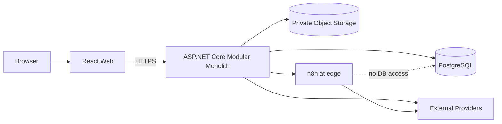
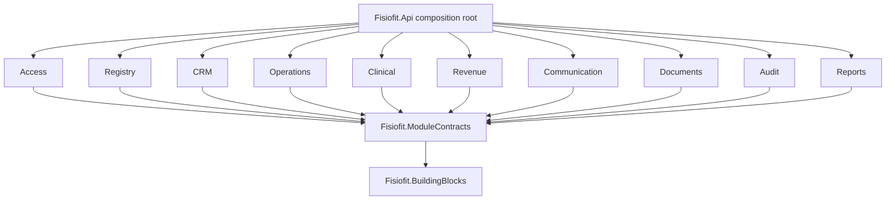
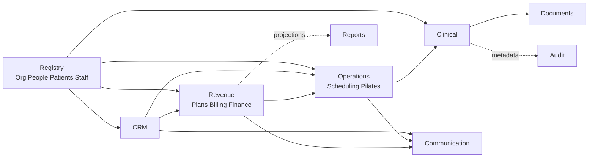
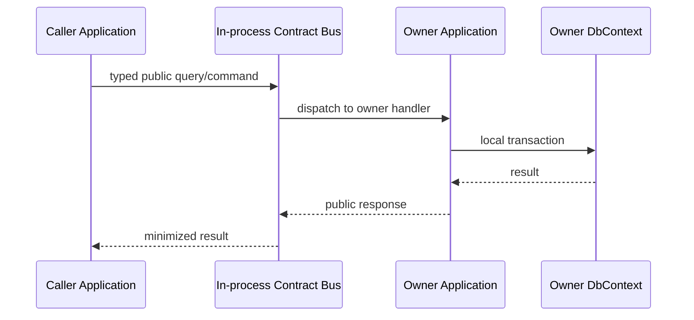
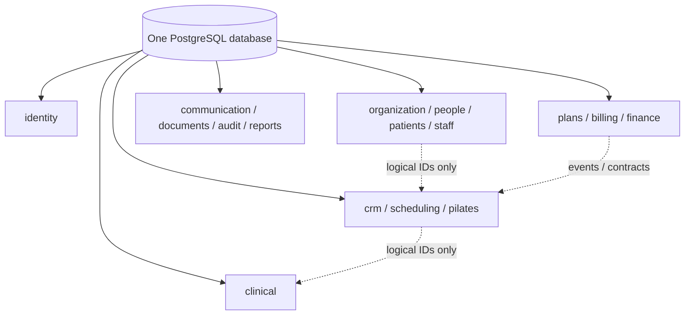
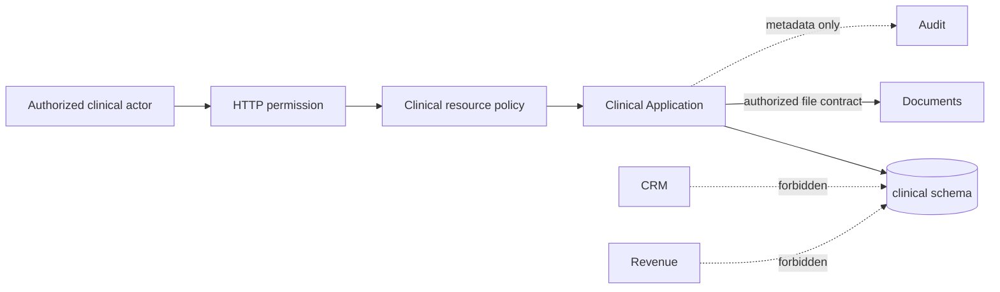
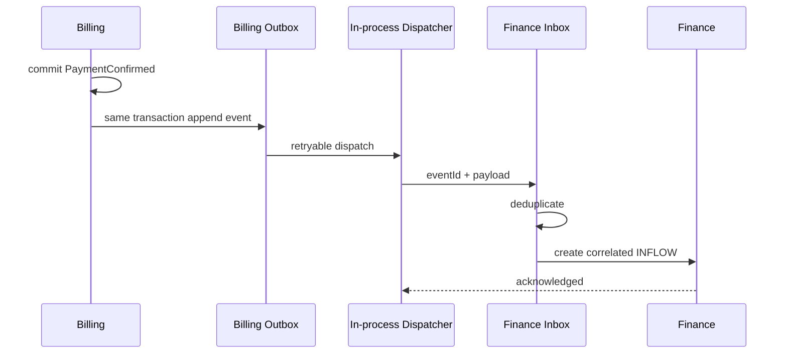
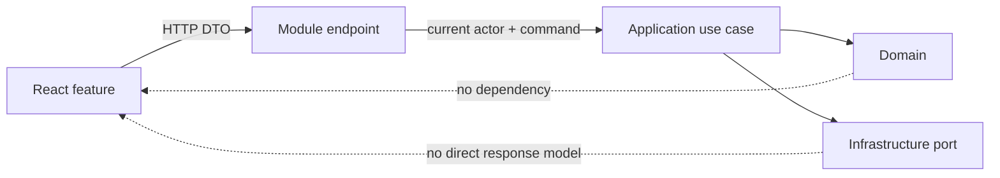
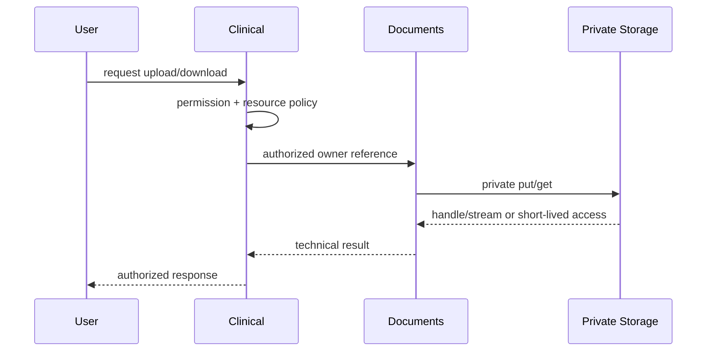
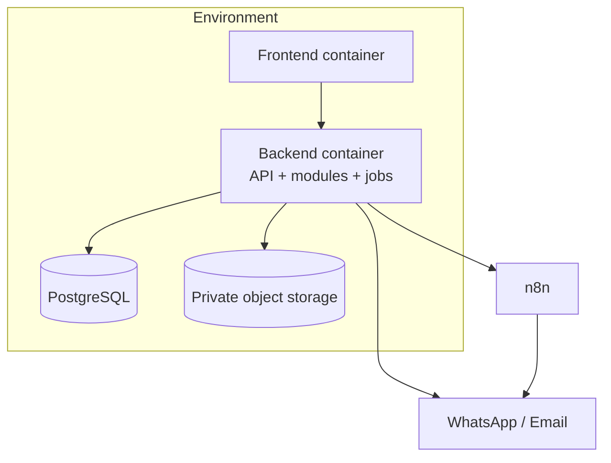

# ARC-003 — Physical Architecture / Modular Monolith

## 1. Status

- **Tarefa:** ARC-003
- **Status:** DONE — PASS
- **Data:** 2026-09-16
- **Estilo:** modular monolith
- **Backend:** ASP.NET Core / C#
- **Frontend:** React + TypeScript
- **Database:** PostgreSQL
- **Próxima tarefa:** DB-001 — Logical Data Model

Esta arquitetura define a organização física futura sem criar solution, projetos, código, banco, migrations, containers ou pipelines nesta execução.

## 2. Objetivo

Converter os 16 bounded contexts e seus owners aprovados em uma arquitetura implementável, simples para uma equipe pequena e suficientemente rígida para impedir acesso a internals, tabelas e regras de outro contexto. A baseline deve permitir DB-001, API-001, bootstrap da solução, testes, containers e CI/CD sem redesenhar ownership.

## 3. Inputs

Foram usados integralmente: `PROJECT_OS.md` e seu handoff AUTH-001; perfil de IA e uso da biblioteca de prompts; ARC-001/002; EVT-001; MODEL-001..005; STATE-001; AUTH-001; glossário; parâmetros; índices de regras e processos; e Decision Log. `.prompts` foi consultada somente como método auxiliar de descoberta, arquitetura, planejamento e validação; não alterou decisões do produto.

## 4. Architectural Drivers

1. Owner único e nenhuma escrita cross-context.
2. Segregação forte de Clinical e de Billing/Finance.
3. Equipe pequena: poucos projetos, baixo custo cognitivo e deploy único.
4. Regras no domínio; use cases na aplicação; adapters na infraestrutura.
5. Consistência local forte e cross-context explícita.
6. Autorização contextual server-side e deny-by-default.
7. Histórico, idempotência e auditabilidade de operações críticas.
8. Evolução futura sem microservices prematuros.

## 5. Constraints

- React + TypeScript, ASP.NET Core/C#, PostgreSQL, Docker e storage S3-compatible privado quando necessário.
- n8n somente na borda; sem acesso ao PostgreSQL.
- Um processo backend e um deployment unit inicial para o monólito.
- Sem broker e sem Redis no MVP inicial.
- IDs são opacos fora do owner; o formato fica para DB-001.
- Nenhuma regra central no Host, frontend, worker, adapter, provider ou n8n.

## 6. Architecture Style

Adota-se um **modular monolith com isolamento híbrido**:

- um assembly por **módulo físico coeso**, não por camada nem necessariamente por bounded context;
- 10 assemblies de módulos para os 16 contexts;
- `Domain`, `Application` e `Infrastructure` como folders/namespaces internos;
- `Fisiofit.ModuleContracts` como único assembly contract-only, particionado por namespace e owner;
- `Fisiofit.BuildingBlocks` mínimo e sem conceitos de negócio;
- `Fisiofit.Api` como composition root;
- um PostgreSQL database, schema e `DbContext` por bounded context.

### 6.1 Estratégias avaliadas

| Estratégia | Vantagens | Custos | Decisão |
|---|---|---|---|
| A — assembly por contexto e, potencialmente, por camada | enforcement de compilação máximo | 16 a 64 projetos, referências e bootstrap excessivos para a equipe | rejeitada |
| B — menos assemblies, contexts internos isolados por folders/namespaces | equilíbrio entre boundaries, simplicidade e testes arquiteturais | parte do isolamento depende de convenção + testes | **adotada** |

A estratégia B evita assembly explosion sem criar um God Project: contexts agrupados continuam com namespace, domínio, aplicação, infraestrutura, contratos, schema, `DbContext`, migrations e testes próprios.

## 7. Repository Topology

Árvore futura recomendada; **não criada nesta tarefa**:

```text
FisioCenter/
├── PROJECT_OS.md
├── docs/
│   ├── architecture/
│   ├── adr/
│   ├── database/
│   ├── api/
│   ├── security/
│   └── testing/
├── src/
│   ├── backend/
│   │   ├── Fisiofit.Api/
│   │   │   ├── Composition/
│   │   │   ├── Endpoints/
│   │   │   ├── Middleware/
│   │   │   └── Observability/
│   │   ├── Fisiofit.BuildingBlocks/
│   │   ├── Fisiofit.ModuleContracts/
│   │   │   ├── Identity/
│   │   │   ├── Organization/
│   │   │   ├── People/
│   │   │   ├── Patients/
│   │   │   ├── Staff/
│   │   │   ├── CRM/
│   │   │   ├── Scheduling/
│   │   │   ├── Pilates/
│   │   │   ├── Clinical/
│   │   │   ├── Plans/
│   │   │   ├── Billing/
│   │   │   ├── Finance/
│   │   │   ├── Communication/
│   │   │   ├── Documents/
│   │   │   ├── Audit/
│   │   │   └── Reports/
│   │   └── Modules/
│   │       ├── Fisiofit.Modules.Access/
│   │       ├── Fisiofit.Modules.Registry/
│   │       │   ├── Organization/{Domain,Application,Infrastructure}/
│   │       │   ├── People/{Domain,Application,Infrastructure}/
│   │       │   ├── Patients/{Domain,Application,Infrastructure}/
│   │       │   └── Staff/{Domain,Application,Infrastructure}/
│   │       ├── Fisiofit.Modules.Crm/
│   │       ├── Fisiofit.Modules.Operations/
│   │       │   ├── Scheduling/{Domain,Application,Infrastructure}/
│   │       │   └── Pilates/{Domain,Application,Infrastructure}/
│   │       ├── Fisiofit.Modules.Clinical/
│   │       ├── Fisiofit.Modules.Revenue/
│   │       │   ├── Plans/{Domain,Application,Infrastructure}/
│   │       │   ├── Billing/{Domain,Application,Infrastructure}/
│   │       │   └── Finance/{Domain,Application,Infrastructure}/
│   │       ├── Fisiofit.Modules.Communication/
│   │       ├── Fisiofit.Modules.Documents/
│   │       ├── Fisiofit.Modules.Audit/
│   │       └── Fisiofit.Modules.Reports/
│   └── frontend/
│       └── Fisiofit.Web/
│           └── src/
│               ├── app/
│               ├── features/
│               ├── shared/
│               └── test/
├── tests/
│   ├── backend/
│   │   ├── Unit/
│   │   ├── Integration/
│   │   ├── Architecture/
│   │   └── Api/
│   ├── frontend/
│   │   ├── Unit/
│   │   └── Component/
│   └── e2e/
├── deploy/
│   ├── containers/
│   └── environments/
└── scripts/
```

`deploy/` conterá apenas artefatos futuros de entrega; secrets nunca entram no repositório.

## 8. Backend Host

`Fisiofit.Api` é o único composition root inicial. Responsabilidades:

- bootstrap ASP.NET Core e configuração;
- autenticação e criação do current actor;
- registro e ordenação de módulos;
- pipeline HTTP, tratamento global de erros e correlation ID;
- endpoints agregados por módulo;
- observabilidade, health checks e background runtime;
- wiring de contratos, event dispatcher, storage e adapters externos.

O Host não contém regra de negócio, repository, acesso a tabelas, policy de recurso ou orchestration de domínio. Glue de DI não decide comportamento.

## 9. Physical Module Strategy

Cada assembly de módulo declara uma única registration surface conceitual, por exemplo `AddRegistryModule(...)` e `MapRegistryEndpoints(...)`. Em módulos agrupados, cada context mantém registration interna própria e o agregador apenas as compõe.

Todos os tipos são `internal` por padrão. São públicos somente:

- registration surface exigida pelo Host;
- handlers/facades ligados a contratos públicos;
- marker necessário a migrations/testes;
- tipos deliberadamente públicos em `Fisiofit.ModuleContracts`.

Nenhum module assembly referencia outro module assembly. As únicas referências comuns permitidas são `Fisiofit.BuildingBlocks` e `Fisiofit.ModuleContracts`. O Host referencia todos os módulos e realiza a composição.

Cada bounded context, inclusive quando agrupado em um assembly, possui seu domínio, casos de uso, namespace de contratos públicos, persistência, seção de configuração, catálogo/tipos de eventos e policies de autorização. O agrupamento físico não transfere nenhum desses owners ao assembly agregador.

## 10. Module Catalog

| Physical Module | Bounded Contexts | Motivo do agrupamento |
|---|---|---|
| Access | Identity & Access | segurança de identidade dedicada |
| Registry | Organization, People, Patients, Staff | cadastros de referência e papéis com alta coesão; contexts e persistências continuam separados |
| CRM | CRM | lifecycle comercial próprio |
| Operations | Scheduling, Pilates | agenda/conflito e operação de turmas são coesos, mas owners distintos |
| Clinical | Clinical | isolamento sensível dedicado |
| Revenue | Plans & Enrollment, Billing, Finance | cadeia comercial-financeira coesa; isolamento interno reforçado para impedir fusão dos owners |
| Communication | Communication | canais/adapters e tentativas isolados |
| Documents | Documents | storage privado e metadados técnicos isolados |
| Audit | Privacy & Audit | evidência e workflows de privacidade separados do logging |
| Reports | Reports | projeções reconstruíveis sem escrita transacional |

O agrupamento não permite acesso direto entre contexts internos. `Revenue.Billing` e `Revenue.Finance`, por exemplo, comunicam-se pelos mesmos contratos/eventos exigidos entre assemblies.

## 11. Layering Strategy

Não haverá quatro assemblies por módulo. Em cada context:

```text
Context/
├── Domain/
├── Application/
└── Infrastructure/
```

Contratos cross-context ficam no namespace owner de `Fisiofit.ModuleContracts`. Contratos exclusivamente internos permanecem na Application do context. A direção é:

```text
Host -> Module composition
Infrastructure -> Application -> Domain
Module -> BuildingBlocks + ModuleContracts
Domain -> BuildingBlocks primitives mínimos (quando inevitável)
```

Domain nunca referencia Application, Infrastructure, ASP.NET Core, EF Core, HTTP, PostgreSQL, provider, UI ou n8n.

## 12. Domain Boundary

Domain contém aggregates, entities, value objects, domain services/policies, invariants, state transitions e domain events internos. Regras críticas vivem no aggregate/policy apropriado; handlers não podem ser a única fonte de invariantes.

## 13. Application Boundary

Application contém use cases, commands, queries, orchestration dentro do context, ports, autorização de negócio, transaction boundary e mapeamento para contratos. Um use case:

1. recebe input validado estruturalmente;
2. revalida permission/scope/policy de recurso;
3. usa contracts/ports públicos quando necessário;
4. executa uma transação local do context;
5. persiste aggregate e, quando aplicável, evento/outbox;
6. retorna modelo de resultado/erro consistente.

## 14. Infrastructure Boundary

Infrastructure contém EF Core, `DbContext`, repositories, migrations, adapters PostgreSQL/storage/canais/APIs, implementação de relógio, publicação de eventos e jobs. Ela implementa ports da Application e não possui decisões de domínio.

## 15. Public Contracts

`Fisiofit.ModuleContracts` contém somente contratos deliberadamente compartilhados, organizados por owner:

- request/response de public application/query contracts;
- read contracts minimizados;
- integration event contracts versionados;
- IDs/reference types opacos quando o compartilhamento for necessário;
- resultado de autorização/step-up quando público.

São proibidos no assembly: aggregates, entities internas, EF models, repositories, `DbContext`, regras, services de infraestrutura e DTO genérico que replique o banco. API request/response público será definido por API-001 e não precisa ser idêntico ao contrato entre módulos.

O owner aprova evolução de seu namespace. Mudança breaking cria nova versão e janela de compatibilidade. Architecture tests impedem que `ModuleContracts` vire Shared Kernel ou modelo anêmico global.

## 16. Shared Kernel

Será criado futuramente como `Fisiofit.BuildingBlocks`, **minimalista**. Candidatos permitidos:

- `Result`/`Error` e categorias comuns;
- abstrações de clock, current actor, correlation/causation;
- interfaces básicas de domain/module events e transaction boundary;
- primitives técnicas comprovadamente universais.

`Money` permanece **deferred para DB-001**: só entra se moeda, arredondamento e semântica forem realmente globais. Não entram Person, Patient, Payment, Contract, Clinical, regras, enums de domínio ou base repository genérico.

## 17. Module Dependency Rules

Classificações físicas:

- `ALLOWED_PUBLIC_CONTRACT`: chamada in-process por contrato tipado do owner;
- `ALLOWED_EVENT`: consumo de integration event versionado;
- `ALLOWED_READ_MODEL`: leitura de projeção/read contract explicitamente publicada;
- `FORBIDDEN`: qualquer outro acoplamento.

Regras:

1. módulos não referenciam assemblies de outros módulos;
2. somente `ModuleContracts` atravessa boundaries;
3. nenhum consumer acessa `Internal.Domain.Entities`, repository, `DbContext`, migration ou tabela do owner;
4. nenhum ciclo de escrita síncrono;
5. evento não concede command authority;
6. read model não vira owner;
7. grouped contexts obedecem às mesmas regras.

## 18. Dependency Matrix

| Module | ALLOWED_PUBLIC_CONTRACT — May depend synchronously on | ALLOWED_EVENT / ALLOWED_READ_MODEL — May consume from | FORBIDDEN dependencies |
|---|---|---|---|
| Access | contracts mínimos de Registry para Person | Staff employment/leave; audit sink | recursos de negócio, Clinical/Billing/Finance internals |
| Registry | Access/current actor; contracts internos entre seus contexts | People/Organization events internos autorizados | qualquer módulo de negócio internals; Clinical content |
| CRM | Registry, Operations/Scheduling, Revenue/Plans, Communication | Appointment e Contract/Enrollment events | Clinical, Billing/Finance internals |
| Operations | Registry, Revenue/Plans/Billing, Access | calendar/staff/enrollment/restriction events; Pilates projection para Scheduling | Clinical internals; direct Billing/Plans data |
| Clinical | Registry, Operations, Documents, Access | context/audit contracts mínimos | CRM, Billing, Finance; Documents storage internals |
| Revenue | Registry, Operations, Access; Finance account contract dentro do módulo; Billing read contract | Plans, Billing e Finance events estritamente pelos contracts | cross-context entities/repositories/DbContexts mesmo no assembly |
| Communication | Registry/People, Access | approved facts/intents de CRM, Operations e Revenue | decidir pipeline, cobrança, agenda ou Clinical |
| Documents | Access + owner authorization result | retention/legal-hold commands aprovados | semântica clínica/comercial/financeira |
| Audit | Access + owner references opacas | audit facts mínimos de todos os contexts | mutação de facts e payload clínico/financeiro completo |
| Reports | Access + published read contracts | projections/events autorizados dos owners | tabelas/DbContexts internos; escrita transacional |

Qualquer célula permitida continua limitada ao contrato específico do Context Map. Ausência na matriz equivale a `FORBIDDEN`.

## 19. Synchronous Communication

Chamadas síncronas usam um module request bus/facade in-process tipado. Não há HTTP interno nem broker para query. O caller referencia o contrato público em `Fisiofit.ModuleContracts`; o provider implementa o handler na própria Application.

Exemplo normativo: Pilates envia `CheckSchedulingConflict` ao contrato público de Scheduling. Scheduling responde um `ConflictResult` minimizado. Pilates não consulta Appointment, occurrence projection ou tabelas de Scheduling.

Contratos síncronos são usados apenas quando o resultado é necessário para decidir o comando atual: existência/estado público, conflito, elegibilidade, FinancialAccount, contexto assistencial e autorização atual.

## 20. Event Communication

Há três categorias físicas:

1. **Domain event interno:** tipo interno, despachado dentro do context; não é contrato público.
2. **Module integration event:** contrato em `ModuleContracts`, entregue in-process e potencialmente persistido na outbox.
3. **External event/webhook:** exposição deliberada para n8n/provider/sistema externo; allowlist própria e autenticação.

Os 48 eventos conceituais não implicam broker, tópico ou mensagem externa. Eventos `INTERNAL_ONLY`, `DEFERRED`, `REJECTED` e `DEPRECATED` mantêm a classificação de EVT-001.

## 21. Event Reliability

Entrega inicial é in-process, at-least-once quando durável, sem broker. A classificação é:

| Tier | Uso | Persistência |
|---|---|---|
| R0 | domain events puramente locais | mesma transação/local dispatch |
| R1 | projeção reconstruível ou notificação não crítica | post-commit in-process, retry observável conforme necessidade |
| R2 | perda causaria inconsistência relevante ou evidência ausente | outbox do producer + consumer idempotente/inbox receipt |

R2 é obrigatório inicialmente para:

- `ContractAccepted` e efeitos Plans → Billing;
- eventos de Enrollment cujo efeito altera Billing/Pilates;
- `PaymentConfirmed`, `PaymentPartiallyReversed`, `PaymentReversed`, `RefundCompleted` → Finance;
- `PersonMergeCompleted/Reversed`;
- `EmploymentEnded` quando afeta revogação/elegibilidade;
- eventos de restrição financeira usados como guard operacional;
- `BreakGlassUsed`, exportação/finalização clínica e outros audit facts cuja perda comprometa evidência.

Outbox fica no schema/`DbContext` do producer e grava na mesma transação do fato. Consumers R2 registram deduplicação/inbox receipt no próprio schema. Não se escolhe tabela, biblioteca ou scheduler nesta etapa. Não há ordering global; guards usam ordem por aggregate/subject, versão, correlation e causation.

## 22. Transaction Boundaries

Uma transação pertence a exatamente um bounded context/`DbContext`. Mesmo contexts no assembly Registry, Operations ou Revenue não compartilham transaction boundary por conveniência.

- `LOCAL_STRONG`: aggregate e invariantes locais na mesma transação;
- `CROSS_CONTEXT_SYNC`: leitura/validação pública antes da transação local, com revalidação/concorrência quando necessário;
- `EVENTUAL`: commit local + integration event; consumer executa outra transação;
- `WORKFLOW`: estados locais, correlation, retry, reconciliação e compensação explícita; sem distributed transaction.

Falha parcial não desfaz silenciosamente fatos já confirmados em outro context.

## 23. PostgreSQL Topology

Escolha: **um PostgreSQL database por ambiente, com schema por bounded context**.

Isso reduz custo operacional do modular monolith, permite backup/restore e deploy coerentes, e torna ownership visível. Um schema único por convenção foi rejeitado por facilitar joins e migrations indevidos. Múltiplos databases foram rejeitados no MVP por adicionarem coordenação e operação distribuída sem benefício atual.

Schemas lógicos reservados: `identity`, `organization`, `people`, `patients`, `staff`, `crm`, `scheduling`, `pilates`, `clinical`, `plans`, `billing`, `finance`, `communication`, `documents`, `audit`, `reports`.

Nomes físicos finais e extensões ficam para DB-001.

## 24. Persistence Isolation

Cada context acessa somente seu schema por seu `DbContext` e credenciais/permissões de runtime compatíveis quando viável. Repository e EF model são internos. SQL manual, views e migrations não podem atravessar schemas sem decisão explícita.

Testes de integração devem provar que, por exemplo, `BillingDbContext` não mapeia `clinical.*` nem consulta `finance.*`.

## 25. DbContext Strategy

Escolha: **um `DbContext` por bounded context**, total conceitual de 16, mesmo quando contexts compartilham assembly. Não haverá `GlobalDbContext`.

Cada context possui model configuration, transaction boundary, migrations history e connection abstraction próprias. A connection string pode apontar ao mesmo database. Unit of Work é o próprio boundary do `DbContext`/caso de uso, não uma abstração global sobre todos os módulos.

## 26. Migration Ownership

Cada context possui suas migrations dentro de sua Infrastructure e altera apenas seu schema. No deploy:

1. validar migrations por context;
2. aplicar em ordem declarada pelo Host/deploy migrator;
3. registrar resultado por context;
4. interromper o rollout em falha;
5. iniciar a nova versão somente após compatibilidade verificada.

O mecanismo exato de migrator e estratégia expand/contract serão definidos no bootstrap/CI. Não há migration global editada por vários módulos.

## 27. Cross-Module References

Política default: referência lógica por ID opaco, **sem FK física cross-schema/cross-context**. Motivos:

- preserva independência de migrations e ownership;
- evita cascade e acoplamento estrutural;
- mantém snapshots/histórico independentes;
- prepara eventual extração sem exigir arquitetura distribuída agora.

O owner valida existência/estado pelo contrato público quando a operação exige. Consumers preservam snapshot apenas quando o modelo aprovado exige. Reconciliação detecta referências órfãs relevantes.

DB-001 deve confirmar constraints locais, índices e mecanismo de reconciliação. Qualquer exceção de FK cross-context exige ADR revisada; não é permitida por default.

## 28. Authentication Boundary

Autenticação ocorre no Host. O resultado é um current actor mínimo e atual, sem transformar claims stale em decisão de negócio. Access possui conta, sessão, roles/grants e revogação; provider, token, MFA e formato de claims ficam deferred.

Identidades de serviço são purpose-bound, com permission e scope mínimos. n8n não recebe usuário global nem acesso ao banco.

## 29. Authorization Boundary

Enforcement em profundidade:

1. **HTTP boundary:** autenticação, permission declarada, input e rate/abuse controls futuros;
2. **Application boundary:** permission, scope, state guard e regra do caso de uso;
3. **Resource owner policy:** `OWN_CLASS`, `OWN_APPOINTMENT`, `CLINICAL_CARE_RELATIONSHIP`, `FINANCIAL_SCOPE` etc.;
4. **Infrastructure:** acesso mínimo ao schema/storage; nunca substitui policy.

Use cases sensíveis revalidam decisão atual. `REQUIRES_APPROVAL` e `REQUIRES_STEP_UP` são resultados explícitos, não booleanos permissivos. Frontend só melhora UX.

## 30. Clinical Isolation

Clinical recebe assembly, namespace, schema, `ClinicalDbContext`, migrations, contracts, authorization policies, logs e read models próprios. Regras adicionais:

- public contracts mínimos; nenhuma entidade/conteúdo clínico fora do módulo;
- integration events `CLINICAL_METADATA` sem narrativa, respostas, diagnóstico ou anexos;
- CRM, Revenue e Reports não referenciam internals Clinical;
- logs e traces não capturam content/body/document keys;
- reads, writes, export e break-glass geram `CLINICAL_AUDIT` proporcional;
- Documents só atende após autorização do recurso clínico.

Owner/Manager e Developer/IT não recebem acesso implícito. Suporte usa observabilidade sanitizada.

## 31. Financial Isolation

No assembly Revenue, os contexts permanecem fisicamente separados por namespaces, folders, schemas, `DbContext`, migrations e contracts:

- Plans owns catálogo, Contract e Enrollment;
- Billing owns Receivable, Payment, allocation, reversal, Refund e restriction;
- Finance owns Account, Transaction, Expense, Transfer e Closing.

Architecture tests proíbem `Billing.Domain`/`Infrastructure` referenciar `Finance.Domain`/`Infrastructure` e vice-versa. Correlação usa IDs/event contracts; `Payment` nunca é `FinancialTransaction`. O fato de compartilhar assembly não permite transaction ou repository cross-context.

## 32. Documents Security

Documents expõe abstrações de upload, finalize, metadata e authorized access; o provider é configurável. Produção usa storage S3-compatible privado. Documents owns bytes/key/checksum/MIME/scan metadata/version; o consumidor owns significado/vínculo/autorização.

Fluxo clínico: Clinical autoriza alvo e finalidade → chama Documents contract com owner reference opaca → Documents valida estado técnico → retorna handle/stream ou acesso temporário. Nunca existe URL pública permanente. Download usa stream mediado ou signed access de curta duração, one-purpose e revalidado.

## 33. Background Processing

Jobs são application use cases disparados por uma abstração de scheduler/worker registrada no Host. Cada job chama o módulo owner e respeita a mesma autorização de service identity, transação, idempotência e audit do fluxo interativo.

Necessidades iniciais:

- materializar `ClassOccurrence` em horizonte móvel;
- detectar overdue e aplicar follow-up/restrição conforme Billing;
- expirar `MakeupCredit`;
- publicar/reprocessar outbox e projections;
- enviar mensagens de Communication;
- executar tarefas agendadas de CRM;
- reconciliar projeções e health de consumers.

Scheduler/provider (Hosted Service, Hangfire, Quartz ou equivalente) fica deferred. Job não acessa `DbContext` de outro context e não contém regra duplicada.

Cache distribuído não é requisito de correção nem de escala comprovada no MVP: decisão explícita **NO REDIS FOR INITIAL MVP**. Cache local/HTTP só poderá ser introduzido com owner, invalidação e métricas definidos; nenhum guard de negócio pode depender de dado cacheado stale.

## 34. Communication / n8n Boundary

Communication recebe fato aprovado (`FACT_DRIVEN`) ou intent explícita autorizada (`EXPLICIT_INTENT`), resolve contato permitido, renderiza template, envia e registra tentativa/status técnico. A afirmação “paciente está inadimplente” permanece em Billing.

n8n integra somente por API/webhook/evento externo autenticado e allowlisted. É proibido:

- acesso direto ao PostgreSQL ou storage interno;
- credential global;
- decisão de cobrança, conversão, cancelamento ou elegibilidade;
- conteúdo clínico genérico;
- modificar estado sem chamar o caso de uso owner.

## 35. Read Models / Reports

Tipos físicos:

1. **Owner-local query model:** no schema do owner, consultado por sua Application.
2. **Operational cross-context projection:** no schema do módulo consumidor autorizado, alimentada por eventos; exemplo `AgendaView` em `scheduling` com fatos de Pilates.
3. **Reporting projection:** no schema `reports`, alimentada por eventos/read contracts minimizados e reconstruível.
4. **Cutoff snapshot:** owned pelo domínio que precisa provar a posição; exemplo `ClosingSnapshot` em Finance.

Reports não faz joins arbitrários em schemas transacionais nem recebe um superuser de banco. Views cross-schema não são estratégia default. Freshness, source version e rebuild status fazem parte do read model. Clinical reports usam projeção específica, minimizada e autorizada; não copiam prontuário integral. Não há data warehouse no MVP.

## 36. Frontend Physical Architecture

`Fisiofit.Web` usa arquitetura feature-first:

```text
src/
├── app/                 # bootstrap, router, providers, session shell
├── features/
│   ├── people/
│   ├── patients/
│   ├── crm/
│   ├── scheduling/
│   ├── pilates/
│   ├── clinical/
│   ├── plans/
│   ├── billing/
│   ├── finance/
│   └── reports/
├── shared/
│   ├── api/
│   ├── auth/
│   ├── ui/
│   ├── validation/
│   └── observability/
└── test/
```

Features seguem jornadas e contratos HTTP, não espelham classes/domain entities do backend. `shared` não contém regra de negócio. O frontend chama somente a API, nunca PostgreSQL/storage interno. Permission set pode esconder/desabilitar ações; route guard e botão não são enforcement.

## 37. API Boundary

API-001 definirá endpoints. ARC-003 fixa:

- HTTP externo no Host; sem controllers/endpoints cross-owner;
- cada módulo registra seus endpoints e delega imediatamente a Application;
- versionamento somente em boundaries que exigirem compatibilidade pública;
- errors consistentes e correlation ID;
- autorização server-side;
- idempotency key para comandos críticos/repetíveis;
- nenhum DTO HTTP expõe entity/EF model;
- APIs internas para n8n são autenticadas, scoped e explicitamente versionadas.

## 38. Error Handling

Modelo lógico comum, sem classes ainda: `Validation`, `NotFound`, `Conflict`, `Forbidden`, `BusinessRuleViolation`, `ConcurrencyConflict`, `IdempotencyConflict`, `DependencyUnavailable` e `Unexpected`. O Host converte errors para resposta HTTP uniforme; mensagens públicas não vazam internals, SQL, storage key, payload clínico ou stack trace. Domain/Application não dependem de HTTP status.

## 39. Concurrency

Princípio: optimistic concurrency por aggregate/version onde apropriado, mais constraint/operação atômica para invariantes que não toleram check-then-act. Hotspots:

| Hotspot | Boundary | Estratégia conceitual |
|---|---|---|
| última vaga / admissão em occurrence | Pilates transaction | invariant atômico de ocupação + concurrency token |
| MakeupReservation/consume/cancel | Pilates transaction | transição atômica de crédito + vaga |
| Schedule/reschedule conflict | Scheduling transaction | versão/serialization do conjunto impeditivo e recheck no commit |
| Attendance correction/conclusion | ClassOccurrence aggregate | optimistic concurrency + append correction |
| Clinical DRAFT/finalization | Clinical record aggregate | expected version; finalize atômico; FINALIZED bloqueia save tardio |
| Payment allocation/reversal/refund | Billing aggregates | expected version + invariantes monetárias atômicas + idempotência |
| Transfer | Finance transaction | par INFLOW/OUTFLOW na mesma transaction Finance |
| Closing/reopen | Closing aggregate | versão monotônica + cutoff explícito |

DB-001 traduzirá isso em constraints, isolation e índices, sem mudar owner.

## 40. Idempotency

Idempotency existe em três níveis:

- comando HTTP crítico: key + actor + operation scope, com mesma resposta ou conflito semântico;
- integration event R2: `eventId` deduplicado por consumer/inbox receipt;
- job: chave determinística por execução/fato e operação segura para retry.

Obrigatória para GenerateReceivables, Register/ConfirmPayment quando repetível, Payment→Finance, reversal/refund, merge reactions, occurrence generation, restriction application, outbox dispatch e external callbacks. Idempotência não converte payload diferente sob a mesma key em sucesso.

## 41. Logging

Logs operacionais são estruturados e incluem timestamp, level, service/module/context, correlation/causation, trace, operation, outcome e referências opacas quando necessárias. Não incluem secrets, tokens, CPF, dados bancários completos, conteúdo clínico, anexos, justificativa livre sensível ou URL privada.

Redaction e classification são aplicadas antes do sink. Production não habilita body logging por default. Provider SaaS não é obrigatório.

## 42. Audit

Privacy & Audit owns evidência de negócio/segurança; logging operacional não substitui AuditLog. Audit registra actor/process, action, resource opaco, scope, result, time, correlation e reason/approval/step-up conforme AUTH-001.

`CLINICAL_AUDIT` e `FINANCIAL_AUDIT` usam payload mínimo e storage/acesso segregado. Audit não copia prontuário, documentos ou objetos financeiros inteiros. Falha de evidência R2 é observável e recuperável; ação de alto risco cuja policy exigir audit síncrono não conclui silenciosamente sem evidência mínima local/outbox.

## 43. Metrics / Tracing / Health

Baseline mínima:

- distributed tracing dentro do frontend/API/adapters, com spans por módulo/use case;
- métricas de request, latency, error, concurrency conflict, outbox lag/failure, inbox duplicate, job duration, projection freshness e storage/provider failure;
- health checks de processo, PostgreSQL, migrations compatibility, object storage e dependencies críticas;
- readiness separado de liveness;
- dashboards/alerts sem fornecedor obrigatório.

Nenhuma tag de alta cardinalidade usa PatientId, conteúdo clínico ou dado financeiro sensível.

## 44. Deployment Topology

Deploy inicial:

- container de frontend estático/edge;
- container do ASP.NET Core modular monolith;
- PostgreSQL gerenciado ou container conforme ambiente;
- object storage privado;
- n8n e providers externos na borda.

Backend e frontend são containers distintos. Background processing roda inicialmente no mesmo backend deployment, com single-active/locking/idempotência conforme o job; processo worker separado fica deferred até necessidade operacional. Escala horizontal exige outbox/inbox e job coordination já previstos.

## 45. Environments

Ambientes mínimos: `Development`, `Staging`, `Production`. Development usa PostgreSQL em container; backend/frontend podem rodar localmente, e storage S3-compatible local só entra quando uma slice de arquivos exigir. Staging reproduz topology e migrations de Production com dados não sensíveis. Production aplica gates, backup/restore e observabilidade.

Ambientes não compartilham database, bucket, credentials, signing keys ou service identities.

## 46. Configuration / Secrets

Configuração usa environment/config providers, tipada e validada no startup. Defaults seguros podem estar no Git; secrets, `.env`, tokens, connection strings reais e credentials não. Rotation, secret store e provider final ficam para infraestrutura, mas código não assume secrets em arquivo.

Business parameters com vigência permanecem dados do owner, não environment variables espalhadas.

## 47. Testing Architecture

Estrutura futura:

- **Unit:** Domain policies, invariants, states e Application handlers isolados;
- **Integration:** `DbContext`, migrations, repositories, outbox/inbox, storage adapters e PostgreSQL real/container;
- **Architecture:** references, namespaces, visibility e persistence boundaries;
- **API:** contracts HTTP, errors, auth negative paths e idempotency;
- **Frontend unit/component:** feature behavior, accessibility e permission-aware UX;
- **E2E:** vertical slices e rejeições críticas.

Test doubles substituem ports externos, não o domínio owner em testes de integração cross-module importantes.

## 48. Architecture Tests

Requisitos normativos da futura suite `ArchitectureTests`:

1. nenhum module assembly referencia outro module assembly;
2. Domain não referencia Application/Infrastructure/ASP.NET/EF;
3. Application não referencia Infrastructure;
4. `ModuleContracts` não contém Domain entities, EF, repositories ou business services;
5. internals não são públicos, salvo allowlist;
6. contexts agrupados não importam `.Domain`/`.Infrastructure` de siblings;
7. CRM/Revenue/Reports não importam Clinical internals;
8. Billing e Finance não importam internals mutuamente;
9. `DbContext` mapeia apenas o schema owner;
10. migrations pertencem ao context owner;
11. endpoints vivem no Host/module endpoint registration, não no Domain;
12. frontend não está referenciado por backend e não contém database client;
13. integration event publisher namespace corresponde ao owner;
14. Reports e Documents não bypassam source authorization;
15. n8n adapters não contêm domain policy.

## 49. CI/CD Consequences

Pipeline futuro deve executar: restore/format/lint; backend build; unit/integration/architecture/API tests; frontend lint/typecheck/build/tests; migrations generation drift/validation; dependency/secret/security scanning; container build; SBOM/image scan quando adotado; staging migration/deploy; smoke/health checks; gates manuais para Production e rollback/roll-forward documentado.

Falha em architecture tests, migrations validation, security scan crítico ou tests bloqueia deploy.

## 50. Module Map

| Bounded Context | Physical Module | Assembly/Folder Strategy | Data Boundary | Public Contracts |
|---|---|---|---|---|
| Identity & Access | Access | assembly dedicado; layers internas | `IdentityDbContext` / `identity` | authentication/current grants, account lifecycle mínimo |
| Organization | Registry | `Organization/*` no assembly Registry | `OrganizationDbContext` / `organization` | Unit/Room/calendar refs e queries |
| People | Registry | `People/*` | `PeopleDbContext` / `people` | Person lookup/validation, merge events |
| Patients | Registry | `Patients/*` | `PatientsDbContext` / `patients` | Patient/payer/responsible public facts |
| Staff | Registry | `Staff/*` | `StaffDbContext` / `staff` | Professional/availability/leave facts |
| CRM | CRM | assembly dedicado | `CrmDbContext` / `crm` | opportunity commands/read contracts mínimos |
| Scheduling | Operations | `Scheduling/*` | `SchedulingDbContext` / `scheduling` | ConflictCheck, Appointment facts, Agenda reads |
| Pilates | Operations | `Pilates/*` | `PilatesDbContext` / `pilates` | occurrence projections, membership events |
| Clinical | Clinical | assembly dedicado | `ClinicalDbContext` / `clinical` | metadata/context/read contracts estritos |
| Plans & Enrollment | Revenue | `Plans/*` | `PlansDbContext` / `plans` | eligibility, Contract/Enrollment events |
| Billing | Revenue | `Billing/*` | `BillingDbContext` / `billing` | account-facing commands, billing reads/events |
| Finance | Revenue | `Finance/*` | `FinanceDbContext` / `finance` | FinancialAccount catalog, closing/read contracts |
| Communication | Communication | assembly dedicado | `CommunicationDbContext` / `communication` | approved intent, delivery result técnico |
| Documents | Documents | assembly dedicado | `DocumentsDbContext` / `documents` + object storage | private file handle/access contracts |
| Privacy & Audit | Audit | assembly dedicado | `AuditDbContext` / `audit` | audit sink/read contracts e privacy workflow futuro |
| Reports | Reports | assembly dedicado | `ReportsDbContext` / `reports` | scoped projections/report queries |

## 51. Data Boundary Matrix

| Module / Context | DbContext | PostgreSQL Schema | Owns Migrations | Cross-module references |
|---|---|---|---:|---|
| Access / Identity | IdentityDbContext | identity | yes | opaque IDs; no cross-schema FK |
| Registry / Organization | OrganizationDbContext | organization | yes | local Organization IDs only |
| Registry / People | PeopleDbContext | people | yes | UnitId logical |
| Registry / Patients | PatientsDbContext | patients | yes | PersonId/UnitId logical |
| Registry / Staff | StaffDbContext | staff | yes | PersonId/UnitId logical |
| CRM | CrmDbContext | crm | yes | Person/Appointment/Contract refs logical |
| Operations / Scheduling | SchedulingDbContext | scheduling | yes | Patient/Professional/Unit refs logical |
| Operations / Pilates | PilatesDbContext | pilates | yes | Patient/Professional/Enrollment refs logical |
| Clinical | ClinicalDbContext | clinical | yes | Patient/Professional/context/Document refs logical |
| Revenue / Plans | PlansDbContext | plans | yes | Patient/payer/Unit refs + snapshots |
| Revenue / Billing | BillingDbContext | billing | yes | Contract/payer/Account refs + snapshots |
| Revenue / Finance | FinanceDbContext | finance | yes | Billing source IDs/Unit refs logical |
| Communication | CommunicationDbContext | communication | yes | Person/source correlation logical |
| Documents | DocumentsDbContext | documents | yes | opaque owner reference + storage handle |
| Audit | AuditDbContext | audit | yes | opaque actor/resource/correlation |
| Reports | ReportsDbContext | reports | yes | source IDs/versions in projections |

## 52. Communication Matrix

| Producer | Consumer | Mechanism | Consistency | Reason |
|---|---|---|---|---|
| Registry/Patients | Registry/People | PUBLIC_CONTRACT | synchronous | validar Person sem duplicar identidade |
| Operations/Pilates | Operations/Scheduling | PUBLIC_CONTRACT | synchronous | conflito antes de reservar vínculo/vaga |
| Operations/Scheduling | Operations/Scheduling | READ_MODEL | eventual | AgendaView incorpora occurrences de Pilates |
| Operations/Pilates | Revenue/Plans | PUBLIC_CONTRACT | synchronous | elegibilidade/frequência atual |
| Clinical | Operations/Registry | PUBLIC_CONTRACT | synchronous | contexto assistencial e autoria válidos |
| Clinical | Documents | PUBLIC_CONTRACT | synchronous | arquivo privado e handle técnico |
| CRM | Operations/Scheduling | PUBLIC_CONTRACT | synchronous | criar/reagendar Appointment experimental |
| Operations/Scheduling | CRM | RELIABLE_EVENT | workflow/eventual | resultado de Appointment sem mover pipeline externamente |
| Revenue/Plans | Revenue/Billing | PUBLIC_CONTRACT + RELIABLE_EVENT | workflow | gerar lote e propagar mudanças posteriores |
| Revenue/Billing | Revenue/Finance | PUBLIC_CONTRACT | synchronous | validar FinancialAccount pública |
| Revenue/Billing | Revenue/Finance | RELIABLE_EVENT | eventual | Payment/reversal/refund criam movimentos idempotentes |
| Revenue/Finance | Revenue/Billing | READ_MODEL | cutoff sync/versionado | Closing lê posição sem alterar Billing |
| Owners | Communication | IN_PROCESS_EVENT ou PUBLIC_CONTRACT | eventual/intent | entregar fato ou intent já decidido |
| Owners | Audit | RELIABLE_EVENT | eventual durável | evidência mínima de ação sensível |
| Owners | Reports | IN_PROCESS_EVENT/READ_MODEL | eventual | projeções reconstruíveis e scoped |
| Communication | n8n/providers | EXTERNAL_API | eventual | canal de borda autenticado |

Nenhuma linha autoriza HTTP interno ou acesso a banco alheio.

## 53. Security Boundary Matrix

| Area | Boundary | Enforcement | Sensitive Data |
|---|---|---|---|
| Identity | Host + Access | authentication, current grants, revocation, no self-escalation | credentials/tokens nunca fora de Access/logs |
| Clinical | Clinical module/schema/storage link | permission + active professional + care relationship + state + audit | content nunca em generic event/log/report |
| Billing | Billing context/schema | FINANCIAL_SCOPE + state/alçada + idempotency | obligation/payment fields minimizados |
| Finance | Finance context/schema | FINANCIAL_SCOPE + resource/action + audit/step-up | accounts/movements segregados |
| Documents | Documents + business owner | owner authorization revalidated on every access | private bytes/key; no permanent public URL |
| Audit | Audit module/schema | assigned audit scope and purpose | evidence minimal, append-only |
| Reports | Reports + source sensitivity | intersection of source scopes, current policy for sensitive reads | no broad clinical/financial export |
| Technical support | Host/observability | time-bound technical scope | sanitized telemetry only |

## 54. Transaction Matrix

| Operation | Owner / Transaction | External prerequisite | Post-commit effect | Consistency |
|---|---|---|---|---|
| AddPatientToClass | PilatesDbContext | Patient, Enrollment, restriction, ConflictCheck | membership event/projection | local strong + cross sync |
| ReserveMakeup | PilatesDbContext | eligibility + ConflictCheck | agenda projection | local strong |
| ScheduleAppointment | SchedulingDbContext | active refs + public occurrences | appointment event | local strong |
| RegisterPayment | BillingDbContext | FinancialAccount valid + permission | PaymentConfirmed outbox | local strong then eventual |
| ReversePayment | BillingDbContext | permission/step-up/alçada | reversal event to Finance | local strong then eventual |
| CompleteRefund | BillingDbContext | eligibility/account/alçada | RefundCompleted outbox | local strong then eventual |
| FinalizeClinicalEntry | ClinicalDbContext | patient/professional/context/auth current | audit/projection metadata event | local strong then durable audit |
| CorrectAttendance | PilatesDbContext | resource policy + expected version | internal event/read projection | local strong |
| TransferMoney | FinanceDbContext | permission/accounts | paired immutable transactions | local strong |
| CloseMonth | FinanceDbContext | versioned Billing read contract at cutoff | MonthClosed event | local strong + snapshot |
| AcceptContract | PlansDbContext | patient/payer/PlanVersion | reliable workflow to Billing | local strong then workflow |
| PersonMerge | PeopleDbContext | approval/step-up/policy | reliable reactions per ID holder | local strong then workflow |

## 55. Mermaid Diagrams

### 55.1 System / deployment overview



### 55.2 Backend modular monolith



### 55.3 Module boundary overview



### 55.4 Module communication



### 55.5 Database / schema topology



### 55.6 Clinical isolation



### 55.7 Billing to Finance reliable event



### 55.8 Frontend to API to modules



### 55.9 Documents / storage flow



### 55.10 Deployment topology



## 56. Architecture Decisions

| ADR | Status | Decision |
|---|---|---|
| ADR-001 | Accepted | modular monolith híbrido com 10 assemblies de módulo |
| ADR-002 | Accepted | um database, schema e `DbContext` por context; detalhes físicos seguem para DB-001 sem reabrir o isolamento |
| ADR-003 | Accepted | contratos tipados in-process; sem HTTP interno |
| ADR-004 | Accepted by DB-001 | outbox/inbox seletivos R2, sem broker inicial |
| ADR-005 | Accepted | Clinical dedicado e segregado em código, dados, auth e observabilidade |

## 57. Rejected Alternatives

| Alternativa | Motivo da rejeição |
|---|---|
| microservices agora | custo distribuído sem escala/equipe/independência que o justifique |
| assembly por contexto × quatro camadas | explosão de projetos e composition overhead |
| um God Project | boundaries não verificáveis e alto risco de dependência interna |
| shared database/schema sem ownership | joins, migrations e acesso indevido tornam-se caminho normal |
| acesso direto à tabela/`DbContext` de outro módulo | viola owner, policy, audit e evolução |
| HTTP interno | latência/falha artificial dentro do mesmo processo |
| business rules no frontend | backend deixaria de ser authority |
| business rules no n8n | automação periférica viraria domínio |
| God Shared Kernel | acoplamento semântico e ownership compartilhado |
| um `DbContext` global | navegação e transaction cross-context triviais |
| broker obrigatório para todo evento | operação e complexidade sem necessidade |
| Redis no MVP | não há necessidade concreta de cache/distributed coordination ainda |
| múltiplos PostgreSQL databases | complexidade de deploy/consistência prematura |
| FKs cross-context por default | acoplam migrations e ownership de lifecycle |

## 58. Deferred Decisions

- provider IAM/MFA/token/session e força do step-up;
- provider S3-compatible, antivírus/MIME e retenção;
- scheduler/job engine, worker separado e broker externo;
- Redis/provider de cache; decisão inicial é **NO REDIS FOR INITIAL MVP**;
- detalhes de HTTP/API, versioning externo e endpoint catalog;
- eventual exceção de FK cross-context;
- provider de observabilidade e secret store;
- retention/replay operacional de outbox/inbox; as estruturas lógicas e os contexts R2 foram fechados por DB-001.

## 59. Risks

| Risco | Mitigação arquitetural |
|---|---|
| contexts agrupados acessarem internals siblings | visibility internal, namespace rules e ArchitectureTests |
| `ModuleContracts` virar modelo global | types mínimos, owner namespace, versioning e test allowlist |
| outbox atrasar fluxo crítico | lag metrics, retry, reconciliation e operational runbook |
| projeção stale usada como guard | guard crítico usa contrato atual; freshness explícita |
| ausência de FK produzir referência órfã | validação síncrona, events e reconciliation |
| Clinical vazar por log/report/document | redaction, policy herdada e contracts metadata-only |
| Host virar orchestrator de negócio | endpoints finos e regra nos módulos |
| Revenue virar God Module | três contexts completos, schemas/DbContexts/contracts e tests separados |
| deploy de migrations quebrar compatibilidade | ownership, validação e expand/contract futuro |

## 60. Open Questions

### Resolvidas por DB-001

- UUID, timezone, Money/arredondamento, nomes lógicos, ownership de migrations, constraints/índices candidatos e optimistic concurrency seletiva foram fechados em `docs/database/DB_001_LOGICAL_DATA_MODEL.md`;
- estruturas e owners de Outbox/Inbox R2 foram fechados; retenção e scheduler do dispatcher continuam deferred.

### Bloqueiam implementação específica, não a arquitetura

- alçadas de desconto, negociação, reversal, refund e transferência;
- tratamento de vencidos no cancelamento e precedência financeira;
- efeito da pausa sobre MakeupCredit;
- RT, exportação clínica, step-up/session/revocation;
- privacy lifecycle, retenção/legal hold e suporte privilegiado.

Não existe open question que impeça DB-001.

## 61. Consequences for DB-001

**READY.** DB-001 recebe:

- 16 data owners e schemas;
- 16 `DbContext` boundaries;
- migrations por context;
- referências cross-context por ID opaco, sem FK por default;
- transações locais e workflows/eventos cross-context;
- Outbox nos producers e Inbox/receipt nos consumers dos fluxos R2, somente nos respectivos contexts;
- hotspots que exigem constraint/atomicidade/versionamento;
- snapshots e read models com owner definido.

DB-001 deve fechar chaves, tipos, constraints, índices, Money/timezone, concurrency tokens, nomes e estruturas lógicas de Outbox/Inbox dos fluxos R2 sem alterar boundaries. Não deve criar essas estruturas para R0/R1 por default nem adiar toda a modelagem de confiabilidade.

## 62. Consequences for API-001

**READY_IN_PARALLEL**, com estabilização final após decisões de tipos/IDs de DB-001. Já estão definidos owner dos endpoints, contracts públicos, autorização, error model, idempotência, versioning boundaries e proibição de entity exposure. API-001 pode modelar use cases/HTTP semanticamente enquanto DB-001 fecha detalhes físicos; nenhum deve implementar skeleton nesta fase.

## 63. Validation Criteria

### PASS checklist

- [x] Modular Monolith e estratégia física definidos.
- [x] Estrutura futura do repositório e Host definidos.
- [x] 16 contexts mapeados para 10 módulos.
- [x] layering e public contracts definidos.
- [x] Shared Kernel minimalista.
- [x] dependency rules, sync, events e reliability definidos.
- [x] transações locais e consistência cross-context definidas.
- [x] PostgreSQL, schemas, `DbContext` e migrations definidos.
- [x] Clinical, Billing/Finance, Documents e n8n isolados.
- [x] authorization tem enforcement no Host, Application e owner policy.
- [x] frontend/API/read models/deployment/testing/observability definidos.
- [x] nenhuma implementação, broker, Redis ou microservice introduzido.
- [x] DB-001 sem blocker.

### Validação contra AUTH-001

- [x] deny by default permanece server-side.
- [x] Owner não recebe Clinical implicitamente.
- [x] Developer não recebe business authority implicitamente.
- [x] resource policies possuem enforcement na Application do owner.
- [x] step-up possui resultado/ponto arquitetural futuro.
- [x] Documents não bypassa Clinical.
- [x] Reports não bypassa source sensitivity.

### Validação contra EVT-001

- [x] publisher continua owner.
- [x] event consumption não concede autoridade.
- [x] payload mínimo é preservado.
- [x] idempotência possui inbox/receipt no consumer crítico.
- [x] ordering não depende de ordem global.
- [x] Clinical events continuam metadata-only.
- [x] nenhum broker foi introduzido.

### Validação contra MODEL-005

- [x] nenhum aggregate cruza contexts.
- [x] ownership permanece único.
- [x] synchronous validation usa contrato público.
- [x] event-driven flows permanecem possíveis.
- [x] nenhum ciclo de escrita síncrono.
- [x] read models não viram owners.

### Architecture invariants

- `ARC-INV-001`: module assembly não referencia outro module assembly.
- `ARC-INV-002`: módulo/context não lê tabela, repository ou `DbContext` de outro.
- `ARC-INV-003`: Domain não depende de Application, Infrastructure ou frameworks.
- `ARC-INV-004`: Host não contém regra de negócio.
- `ARC-INV-005`: todo dado transacional possui um owner/context/schema.
- `ARC-INV-006`: transaction boundary não cruza `DbContext`/context.
- `ARC-INV-007`: synchronous cross-context usa contrato público in-process, nunca HTTP interno.
- `ARC-INV-008`: integration event publisher é owner do fato.
- `ARC-INV-009`: event consumption não concede command authority.
- `ARC-INV-010`: Clinical internals não são importados por CRM, Revenue ou Reports.
- `ARC-INV-011`: Clinical event/log/audit genérico não contém conteúdo clínico.
- `ARC-INV-012`: Billing não altera Finance; Finance não altera Billing.
- `ARC-INV-013`: `Payment` e `FinancialTransaction` permanecem distintos e correlacionados.
- `ARC-INV-014`: Documents não decide autorização/semântica do owner.
- `ARC-INV-015`: arquivo clínico não possui URL pública permanente.
- `ARC-INV-016`: frontend não acessa PostgreSQL/storage interno.
- `ARC-INV-017`: n8n não acessa PostgreSQL nem contém regra central.
- `ARC-INV-018`: Reports usa projeções/read contracts e não corrige fontes.
- `ARC-INV-019`: autorização é revalidada server-side no owner do recurso.
- `ARC-INV-020`: Shared Kernel não contém conceitos ou regras de negócio.
- `ARC-INV-021`: consumer R2 é idempotente e publication é recuperável.
- `ARC-INV-022`: audit de negócio/segurança é distinto de operational logging.
- `ARC-INV-023`: migrations alteram somente o schema owner.
- `ARC-INV-024`: IDs externos são opacos e não autorizam navegação.

**Resultado: ARC-003 — PASS. DB-001 — READY. API-001 — READY_IN_PARALLEL.**
