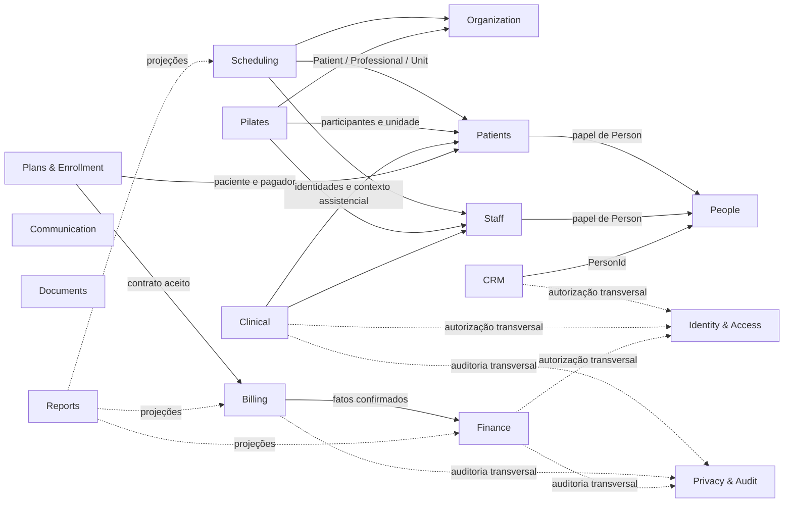
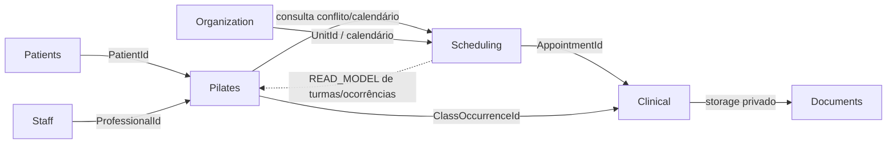
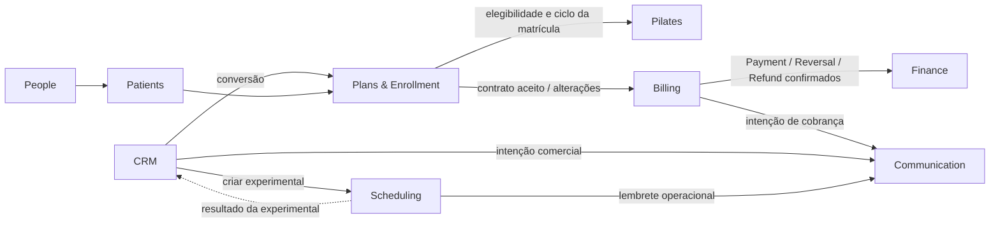
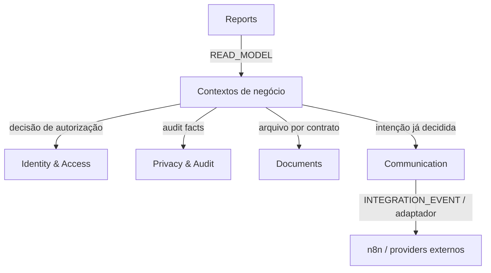

# Fisiofit CRM 2.0 — Context Map

## 1. Status

- **Tarefa:** ARC-001
- **Status:** DONE
- **Data:** 2026-09-15
- **Baseline de origem:** `discovery-v1` / Gate M1
- **Direção arquitetural:** monólito modular

Este documento define boundaries lógicos. Contexto ou módulo não significa microservice, processo separado ou banco separado. Arquitetura física, namespaces, transações e mecanismos de mensageria serão definidos em etapas posteriores.

## 2. Objetivo

Fixar o Context Map oficial do Fisiofit CRM 2.0: responsabilidade e propriedade conceitual de cada contexto, contratos permitidos, fatos que atravessam boundaries e dependências proibidas. O mapa orienta o `ARC-002 — Ownership Map`, a modelagem conceitual e, posteriormente, a arquitetura física do monólito modular.

## 3. Princípios arquiteturais

1. Cada conceito tem exatamente um contexto proprietário. Referenciar um identificador não transfere ownership.
2. Nenhum módulo acessa diretamente tabelas, repositórios ou modelos internos de outro módulo; toda interação usa contrato público, evento, projeção ou referência estável.
3. A direção nas tabelas deste documento significa:
   - em `SYNCHRONOUS_CONTRACT`, a origem chama o contrato público do destino;
   - em `DOMAIN_EVENT` ou `INTEGRATION_EVENT`, a origem publica o fato;
   - em `READ_MODEL`, a origem consome uma projeção publicada pelo destino;
   - em `REFERENCE_BY_ID`, a origem guarda somente o ID estável de conceito do destino.
4. `DOMAIN_EVENT` permanece no boundary proprietário; `INTEGRATION_EVENT` é o fato público, estável e mínimo exposto a outro contexto ou integração externa. Um fato interno pode originar um evento de integração sem compartilhar seu modelo interno.
5. Eventos propagam fatos já decididos; não transferem ao consumidor a decisão do domínio de origem. Comandos que precisam de resposta imediata usam contrato síncrono.
6. Clinical permanece segregado do administrativo, CRM, Billing e Finance. Seu acesso é deny-by-default, contextual e auditado.
7. Billing possui obrigações e liquidações de clientes. Finance possui contas, movimentos, despesas, saldo, conciliação e fechamento. `Payment` não é `FinancialTransaction`.
8. Plans & Enrollment registra oferta, acordo e vínculo operacional; não registra dinheiro recebido.
9. Communication entrega mensagens; não decide política comercial, clínica, operacional ou financeira. n8n é somente adaptador/orquestrador de borda.
10. Documents possui arquivo, storage e metadados técnicos. O contexto de negócio mantém a semântica e a autorização do conteúdo.
11. Privacy & Audit registra evidências e conduz solicitações autorizadas; não altera fatos dos demais domínios por conta própria.
12. Reports consome projeções/read models e nunca se torna fonte transacional ou proprietário dos dados originais.
13. Identity & Access autentica e aplica autorização; não absorve regras comerciais, clínicas, operacionais ou financeiras.
14. Histórico relevante é preservado. Correção, reversão, vigência e retificação substituem sobrescrita destrutiva.

### 3.1 Catálogo de tipos de relação

| Tipo | Uso neste mapa |
|---|---|
| `SYNCHRONOUS_CONTRACT` | Consulta ou comando imediato por API interna pública do módulo. |
| `DOMAIN_EVENT` | Fato interno do contexto, usado para reação desacoplada dentro do mesmo boundary. |
| `INTEGRATION_EVENT` | Fato público mínimo para outro contexto, worker, n8n ou provider externo. |
| `READ_MODEL` | Projeção somente leitura, específica para consulta/relatório. |
| `REFERENCE_BY_ID` | ID opaco e estável; não autoriza navegação até storage interno. |
| `FORBIDDEN` | Dependência ou acesso explicitamente vedado. |

## 4. Contextos

Os 16 contextos candidatos da descoberta foram mantidos. `Plans & Enrollment` permanece um único contexto porque catálogo versionado, snapshot contratado e vínculo operacional formam o mesmo fluxo e compartilham regras de pró-rata, pausa, cancelamento e renovação. `People`, `Patients` e `Staff` permanecem separados: Person é a identidade compartilhada; Patient e Professional são papéis contextuais. `Privacy & Audit` permanece combinado neste mapa, pois o baseline ainda não justificou dois owners transacionais; ARC-002 detalhará seus sub-owners sem alterar o boundary.

### Identity & Access

**Responsabilidade:** autenticar contas, manter sessões, roles/permissions e fornecer decisões de autorização deny-by-default e contextuais.

**Possui:** `UserAccount`, credenciais, sessão, Role, Permission e políticas de acesso.

**Não possui:** Person, ProfessionalProfile, regra de negócio, alçada clínica/financeira implícita ou ownership dos recursos protegidos.

**Entradas:** vínculo por `PersonId`; contexto de recurso/unidade/profissional; concessões e revogações autorizadas.

**Saídas:** identidade autenticada, claims mínimos, decisão de autorização e eventos de ciclo da conta/sessão.

**Dependências permitidas:** People por ID/contrato público; projeção local alimentada por eventos públicos de Staff quando a política exigir vínculo ativo; Privacy & Audit para trilhas.

**Dependências proibidas:** consultar tabelas de negócio; inferir permissão clínica ou financeira por `admin=true`, propriedade da clínica ou acesso técnico.

**Eventos relevantes:** conta criada/vinculada, acesso concedido/revogado e sessão revogada; nomes finais dependem de IAM-001 a IAM-007.

**Observações:** autorização é transversal, mas a regra de elegibilidade do recurso permanece no domínio proprietário.

### Organization

**Responsabilidade:** representar clínica, unidades, salas informativas e calendário institucional compartilhado.

**Possui:** Clinic, Unit, Room e definição institucional de calendário/feriados.

**Não possui:** conflito de agenda, capacidade de turma, equipamento agendável, vínculo profissional ou caixa por unidade.

**Entradas:** configuração autorizada da organização e calendário.

**Saídas:** referências estáveis de Unit/Room e calendário institucional público.

**Dependências permitidas:** Identity & Access para autorização; Privacy & Audit para mudanças sensíveis.

**Dependências proibidas:** escrever em Staff, Scheduling, Pilates ou Finance.

**Eventos relevantes:** mudanças de unidade/calendário que afetem consumidores; catálogo final será definido na modelagem.

**Observações:** sala é informativa e não bloqueia disponibilidade. `CalendarException` operacional pertence a Scheduling; a fonte final de feriados segue questão não bloqueante.

### People

**Responsabilidade:** manter identidade civil única, contatos, endereços, relações gerais entre pessoas, deduplicação e merge auditado.

**Possui:** Person, ContactPoint, Address, PersonRelationship, PersonMerge e MergeManifest.

**Não possui:** PatientProfile, ProfessionalProfile, UserAccount, Opportunity, prontuário, Contract, Receivable ou Payment.

**Entradas:** criação/atualização administrativa, sinalização de duplicidade e pedido autorizado de merge.

**Saídas:** `PersonId`, dados públicos mínimos de identificação/contato e fatos de criação, alteração, merge ou inativação.

**Dependências permitidas:** Organization para unidade principal por referência; Identity & Access e Privacy & Audit para autorização/auditoria.

**Dependências proibidas:** conhecer estados internos de Patients, Staff, CRM, Plans ou Billing; duplicar Person por papel ou unidade.

**Eventos relevantes:** `PersonCreated`, `PersonMergeCompleted` e alteração de contatos quando necessária aos consumidores.

**Observações:** CPF pode faltar e, quando informado, é único. Uma Person pode acumular vários papéis.

### Patients

**Responsabilidade:** representar o papel administrativo de paciente e seus vínculos de responsabilidade legal, administrativa, pagadora e emergência.

**Possui:** Patient, PatientProfile, GuardianLink, ResponsiblePayerLink, EmergencyContact e ciclo de ativação/inativação do papel.

**Não possui:** identidade civil, prontuário, Enrollment, ClassMembership, Appointment, Receivable ou Payment.

**Entradas:** `PersonId`, cadastro/ativação do papel e vínculos com outras Persons.

**Saídas:** `PatientId`, pagador/responsável vigente por referência e fatos de ativação/inativação ou mudança de vínculo.

**Dependências permitidas:** People por contrato público e referência; Organization por `UnitId`; Identity & Access e Privacy & Audit.

**Dependências proibidas:** copiar Person; armazenar dado clínico; alterar contrato, turma, agenda ou cobrança.

**Eventos relevantes:** `PatientProfileActivated`, `ResponsibleLinked`, `PayerChanged` e `PatientDeactivated`.

**Observações:** Patients possui o vínculo administrativo vigente entre paciente e pagador. Plans/Billing preservam seus próprios snapshots/referências históricas aceitas, sem se tornarem owners desse vínculo.

### Staff

**Responsabilidade:** representar papel profissional, perfil, vínculo de trabalho, unidades de atuação, disponibilidade e afastamentos.

**Possui:** Professional, ProfessionalProfile, EmploymentLink, unidade de atuação, Availability e Leave.

**Não possui:** Person, UserAccount, agenda, turma, autoria clínica apagável, comissão ou autoridade de negócio automática.

**Entradas:** `PersonId`, vínculo/credenciais profissionais e alterações autorizadas de atuação.

**Saídas:** `ProfessionalId`, vínculos/unidades/disponibilidade públicos e fatos de ativação, afastamento ou desligamento.

**Dependências permitidas:** People por referência/contrato; Organization por Unit; Identity & Access e Privacy & Audit.

**Dependências proibidas:** conceder acesso clínico/financeiro por perfil; possuir Appointment, Class ou ClinicalEntry.

**Eventos relevantes:** ciclo do vínculo e disponibilidade; nomes serão fechados em DOM-020/MODEL-001.

**Observações:** ProfessionalProfile e UserAccount são distintos. Desligamento remove acesso, mas não apaga autoria histórica.

### CRM

**Responsabilidade:** gerenciar Opportunity, pipeline, atividades, tarefas, proposta, owner, perda, conversão e reativação.

**Possui:** Opportunity, Pipeline/Stage, Activity, Task, Source, CampaignReference, Proposal e LossReason.

**Não possui:** Lead como pessoa duplicada, Appointment, PatientProfile, Contract, Payment, regra de envio ou dado clínico.

**Entradas:** `PersonId`, atividades comerciais, resultado público da experimental e confirmação pública de contratação/matrícula.

**Saídas:** comando de agendamento de experimental, intenção de comunicação e fatos do ciclo comercial.

**Dependências permitidas:** People; Scheduling por contrato público; Plans & Enrollment por evento/contrato de conversão; Communication para entrega.

**Dependências proibidas:** tabelas internas de Scheduling/Clinical/Billing; decidir entrega técnica; marcar conversão apenas por pagamento.

**Eventos relevantes:** `OpportunityCreated`, `OpportunityStageChanged`, `ExperimentalScheduled`, `ExperimentalCompleted`, `OpportunityConverted`, `OpportunityLost` e `OpportunityReactivated`.

**Observações:** Lead é visão operacional de Person com Opportunity, não uma entidade de identidade.

### Scheduling

**Responsabilidade:** agenda geral, Appointment ad-hoc, regras/slots não pertencentes a turmas, bloqueios, exceções e conflitos temporais de paciente/profissional.

**Possui:** ScheduleRule/FixedSchedule de agenda geral, Appointment, ScheduleBlock, CalendarException e serviço público de detecção de conflitos.

**Não possui:** Class, ClassSchedule, ClassOccurrence, capacidade, Attendance, MakeupCredit, prontuário, preço ou cobrança.

**Entradas:** referências de Unit/Patient/Professional; comando de Appointment; consulta de conflito vinda de Pilates; calendário institucional.

**Saídas:** resultado de conflito/disponibilidade, fatos de Appointment e projeção consolidada da agenda.

**Dependências permitidas:** Organization, Patients e Staff por contratos/referências; Pilates somente por read model público de turmas; Identity & Access, Communication e Privacy & Audit.

**Dependências proibidas:** escrever turma/ocorrência/presença; recalcular capacidade; ler prontuário; interpretar FinancialRestriction por tabela.

**Eventos relevantes:** `ScheduleEffectiveDated`, `AppointmentScheduled`, `AppointmentRescheduled`, `AppointmentCancelled`, `CalendarExceptionApplied` e `ProfessionalSubstituted`.

**Observações:** avaliação, experimental, reposição ad-hoc, extraordinário e encaixe são Appointment. Uma reposição reservada em turma continua pertencendo a Pilates; não vira Appointment duplicado.

### Pilates

**Responsabilidade:** turma recorrente, regra de recorrência da turma, ocorrências, membership, capacidade, presença e reposição.

**Possui:** Class, ClassSchedule, ClassMembership, ClassOccurrence, Attendance, MakeupCredit e MakeupReservation.

**Não possui:** Appointment ad-hoc, regra geral de conflito, Enrollment, Contract, FinancialRestriction, prontuário ou cobrança.

**Entradas:** referências de Patient/Professional/Unit; elegibilidade pública de Enrollment; restrição financeira pública; resultado de conflito de Scheduling.

**Saídas:** projeção de turmas/ocorrências para agenda, contexto de atendimento e fatos de membership, presença e reposição.

**Dependências permitidas:** Patients, Staff e Organization por referência; Scheduling por contrato de conflito/calendário; Plans & Enrollment por contrato/eventos; Billing por contrato/eventos públicos de restrição; Clinical apenas publica/fornece contexto assistencial sem ler o prontuário.

**Dependências proibidas:** delegar capacidade a Scheduling; alterar Enrollment por ausência/inadimplência; ler Billing ou Clinical internals.

**Eventos relevantes:** `ClassCreated`, `ClassScheduleChanged`, `ClassMembershipStarted`, `ClassMembershipEnded`, `AttendanceRecorded`, `MakeupCreditGranted`, `MakeupReserved`, `MakeupConsumed` e `MakeupExpired`.

**Observações:** mudanças permanentes de ClassSchedule usam vigência; alterações pontuais afetam ClassOccurrence. Scheduling pode exibir esses dados por projeção, sem se tornar owner.

### Clinical

**Responsabilidade:** prontuário segregado, episódios, avaliações, evoluções, templates, finalização, retificação/adendo, exportação e acesso excepcional.

**Possui:** CareEpisode, Assessment, ClinicalTemplate/Version, ClinicalEntry, Rectification/Addendum, ClinicalDocumentLink e semântica clínica dos anexos.

**Não possui:** Person, PatientProfile, Appointment, ClassOccurrence, Attendance, arquivo binário, Contract, Payment, FinancialTransaction ou observação administrativa.

**Entradas:** referências mínimas de Patient/Professional e do atendimento; conteúdo clínico autorizado; handle privado de Documents.

**Saídas:** fatos clínicos mínimos para auditoria e, quando autorizado, projeções clínicas específicas; nunca prontuário aberto para CRM/Finance/Billing.

**Dependências permitidas:** Patients, Staff, Scheduling e Pilates por ID/contrato público; Documents por storage privado; Identity & Access e Privacy & Audit.

**Dependências proibidas:** CRM, Billing ou Finance internals; autorização baseada somente em cargo administrativo/propriedade; Documents decidir semântica clínica.

**Eventos relevantes:** `CareEpisodeOpened`, `CareEpisodeClosed`, `AssessmentFinalized`, `ClinicalEntryFinalized`, `ClinicalEntryRectified`, `BreakGlassUsed` e `ClinicalRecordExported`.

**Observações:** `ClinicalEntry` finalizado é imutável. Break-glass e exportação são excepcionais, justificados e auditados.

### Plans & Enrollment

**Responsabilidade:** catálogo versionado, condições aceitas, contrato, vínculo operacional, pró-rata, ativação, pausa, retomada, cancelamento, renovação e mudança de frequência.

**Possui:** Plan, PlanVersion, Contract, Enrollment e futuro Entitlement/Benefit se confirmado.

**Não possui:** Payment, Receivable, FinancialTransaction, ClassMembership, capacidade, presença ou prontuário.

**Entradas:** referências de Patient/Person/pagador; seleção de PlanVersion; comandos autorizados do ciclo contratual.

**Saídas:** snapshot contratual/eligibilidade pública e fatos de contrato/matrícula para Billing, Pilates e CRM.

**Dependências permitidas:** People e Patients por referência/contrato; Organization por Unit; Pilates por evento/contrato de disponibilidade quando necessário; Billing como downstream de fatos contratuais; Privacy & Audit.

**Dependências proibidas:** registrar dinheiro recebido; possuir ClassMembership; consultar saldo/caixa; usar inadimplência como estado PAUSED.

**Eventos relevantes:** `ContractAccepted`, `EnrollmentActivated`, `EnrollmentPaused`, `EnrollmentResumed`, `EnrollmentCancelled`, `ContractRenewed` e `EnrollmentFrequencyChanged`.

**Observações:** pausa libera vaga, não cobra o período e não prolonga o contrato. Efeito exato sobre MakeupCredits continua não bloqueante para ARC-002, mas bloqueia implementação dessa regra.

### Billing

**Responsabilidade:** obrigações de clientes, pagamentos, alocação, reversão, reembolso, ajustes, negociação, inadimplência e restrição operacional.

**Possui:** Receivable, Payment, PaymentAllocation, PaymentReversal, Refund, BillingAdjustment, Negotiation e FinancialRestriction.

**Não possui:** Plan/Contract, FinancialAccount, FinancialTransaction, Expense, saldo, fluxo de caixa, Closing ou Enrollment.PAUSED.

**Entradas:** fatos/snapshot de Contract e Enrollment; referência de pagador; `FinancialAccountId` válido para recebimento; registro autorizado de pagamento/reversão/reembolso.

**Saídas:** posição de dívida, restrição pública e fatos confirmados de pagamento/reversão/reembolso para Finance e Communication.

**Dependências permitidas:** Plans & Enrollment, People/Patients e Organization por contratos/referências; Finance somente para validar/listar conta de recebimento pública por ID; Communication por evento; Privacy & Audit.

**Dependências proibidas:** escrever FinancialTransaction; calcular saldo; acessar tabelas de Finance; apagar Payment confirmado; alterar Enrollment para PAUSED.

**Eventos relevantes:** `ReceivablesCreated`, `PaymentConfirmed`, `PaymentAllocated`, `PaymentReversed`, `RefundIssued`, `ReceivableOverdue`, `FinancialRestrictionApplied`, `FinancialRestrictionRemoved` e `NegotiationAgreed`.

**Observações:** vencido é derivado. Tratamento de Receivables já vencidos no cancelamento não pode ser inferido como perdão.

### Finance

**Responsabilidade:** contas, movimentos, despesas/contas a pagar, transferências, conciliação, saldo derivado, fluxo de caixa e fechamento mensal versionado.

**Possui:** FinancialAccount, FinancialTransaction, Expense, ExpenseCategory, Transfer, ReconciliationAdjustment e Closing.

**Não possui:** Receivable, Payment, regra de inadimplência, Contract, prontuário, comissão ou saldo digitado como fonte.

**Entradas:** fatos públicos confirmados de Billing; despesas e transferências autorizadas; referência opcional de Unit.

**Saídas:** catálogo público de contas para recebimento, movimentos/saldos derivados e read models de fluxo/fechamento.

**Dependências permitidas:** Billing apenas por eventos públicos e read models no fechamento; Organization por Unit; Identity & Access e Privacy & Audit.

**Dependências proibidas:** alterar Payment/Receivable; ler Clinical; transformar Payment na mesma entidade que FinancialTransaction; apagar snapshot de Closing.

**Eventos relevantes:** `ExpenseRegistered`, `ExpensePaid`, `AccountTransferCompleted`, `AccountReconciled`, `MonthClosed` e `ClosingReopened`.

**Observações:** ao consumir `PaymentConfirmed`, Finance cria seu próprio movimento com idempotência e referência de correlação; reversão e reembolso geram efeitos financeiros próprios, preservando ambos os históricos.

### Communication

**Responsabilidade:** preparar e executar entrega de mensagens, templates de canal, tentativas, status e resposta técnica de providers.

**Possui:** mensagem/dispatch, template de comunicação, tentativa, canal, provider reference e delivery status; modelo interno será detalhado em DOM-019.

**Não possui:** política de cobrança, cadência comercial, regra de agenda, decisão clínica, regra de audiência ou decisão de perda/conversão.

**Entradas:** intenção/comando ou evento público com destinatário, template/dados mínimos e política já decidida pelo domínio de origem.

**Saídas:** status de aceite/entrega/falha e eventos técnicos para o originador; chamadas a providers/n8n.

**Dependências permitidas:** People para contato público autorizado; CRM, Scheduling e Billing como originadores; Documents apenas se anexo autorizado; Privacy & Audit.

**Dependências proibidas:** tabelas internas dos originadores; decidir quem está inadimplente; mover pipeline; cancelar agenda; n8n possuir regra central.

**Eventos relevantes:** intenção de comunicação e resultado de entrega; nomes finais dependem de DOM-019.

**Observações:** falha de comunicação não desfaz automaticamente o fato de negócio que originou a mensagem.

### Documents

**Responsabilidade:** storage privado, arquivo, versão, metadados técnicos, integridade, acesso técnico e ciclo de retenção quando autorizado.

**Possui:** arquivo binário, storage key, versão, MIME type, tamanho, checksum, classificação técnica e metadados de upload.

**Não possui:** significado clínico/comercial/financeiro do documento, prontuário, Payment, Expense, decisão de retenção legal ou autorização de negócio.

**Entradas:** upload/download/delete lógico autorizados com classificação e referência opaca do contexto proprietário.

**Saídas:** `DocumentId`/handle, metadados técnicos e eventos de storage/scan/disponibilidade.

**Dependências permitidas:** Identity & Access; Privacy & Audit; provider de storage como integração externa.

**Dependências proibidas:** interpretar conteúdo para alterar fatos; expor anexo clínico por permissão administrativa; tornar-se banco central de dados de negócio.

**Eventos relevantes:** upload armazenado, versão criada, arquivo indisponível ou retenção aplicada; catálogo final será definido em ARC-009.

**Observações:** Clinical mantém `ClinicalDocumentLink` e sua semântica; Documents mantém o arquivo e metadados técnicos.

### Privacy & Audit

**Responsabilidade:** trilhas imutáveis de operações sensíveis, evidência de acesso, suporte a solicitações de titulares, legal hold e políticas de privacidade.

**Possui:** AuditRecord, evidência de acesso/ação, PrivacyRequest, legal hold e registro de execução autorizada; detalhamento depende do inventário LGPD.

**Não possui:** fatos de negócio auditados, permissão primária, prontuário, identidade civil canônica ou poder de corrigir outro domínio.

**Entradas:** eventos/audit facts mínimos de todos os contextos, incluindo break-glass, exportação, merge, pagamento e fechamento.

**Saídas:** evidência consultável, alertas/revisões e comandos autorizados de workflow de privacidade aos owners.

**Dependências permitidas:** referências opacas a todos os contextos; Identity & Access para ator/autorização; Reports por read model redigido.

**Dependências proibidas:** escrever diretamente em agregados alheios; apagar histórico por iniciativa própria; expor conteúdo clínico em trilha genérica.

**Eventos relevantes:** fatos de auditoria e ciclo de PrivacyRequest; nomes finais serão definidos na fase de privacidade.

**Observações:** atender uma solicitação pode exigir comandos explícitos aos owners e respeitar retenção/legal hold; Audit registra resultado, não executa mutação clandestina.

### Reports

**Responsabilidade:** projeções, indicadores e consultas consolidadas para operação, gestão e fechamento, com minimização e escopo de acesso.

**Possui:** definição de projeção, snapshot analítico derivado e metadados de atualização.

**Não possui:** Person, Patient, prontuário, Appointment, Payment, FinancialTransaction ou qualquer fato transacional original.

**Entradas:** eventos públicos e read models autorizados dos contextos proprietários.

**Saídas:** relatórios/read models somente leitura, métricas e exportações autorizadas.

**Dependências permitidas:** contratos de leitura/projeções de múltiplos módulos; Identity & Access e Privacy & Audit.

**Dependências proibidas:** escrita transacional; consulta direta a tabelas internas; atuar como banco central; expor dado clínico sem finalidade/permissão específica.

**Eventos relevantes:** atualização/rebuild de projeção e geração/exportação auditada; catálogo final depende de DOM-021.

**Observações:** divergência em relatório é corrigida na projeção ou no domínio de origem por operação autorizada, nunca sobrescrevendo o fato original a partir de Reports.

## 5. Context Map geral

Para manter legibilidade, os diagramas mostram relações dominantes. A matriz da seção 6 é normativa e contém a classificação detalhada.

### 5.1 Visão estrutural

As setas desta visão são associações resumidas e não substituem a convenção direcional da matriz.

### 5.2 Operação, agenda e clínica

Não existe ciclo de ownership entre Scheduling e Pilates: Pilates decide turma/capacidade; Scheduling decide conflito temporal e Appointment; a agenda consolidada lê projeção de Pilates.

### 5.3 Comercial, contratação e financeiro

### 5.4 Cross-cutting e borda

## 6. Matriz de relações

As linhas incluem somente relações necessárias ou guardrails arquiteturalmente relevantes. Relações de autorização/auditoria aplicáveis a todos os módulos são consolidadas para evitar uma matriz artificialmente repetitiva.

| Origem | Destino | Tipo | Motivo | Dados/Contrato |
|---|---|---|---|---|
| Patients | People | `SYNCHRONOUS_CONTRACT` | Criar/ativar papel sem duplicar identidade. | busca/validação de `PersonId`; dados civis mínimos |
| Patients | People | `REFERENCE_BY_ID` | Ligar PatientProfile, responsável e pagador a Persons. | `PersonId` opaco |
| Staff | People | `SYNCHRONOUS_CONTRACT` | Criar/ativar papel profissional sobre Person existente. | `PersonId`; identificação mínima |
| Staff | People | `REFERENCE_BY_ID` | Preservar identidade única do profissional. | `PersonId` opaco |
| Identity & Access | People | `REFERENCE_BY_ID` | Vincular conta interna à pessoa. | `PersonId` |
| Staff | Identity & Access | `INTEGRATION_EVENT` | Atualizar projeção mínima de vínculo/unidade usada por políticas contextuais, sem Identity possuir Staff. | vínculo ativado/alterado/encerrado; `ProfessionalId`, vigência e UnitIds |
| People | Patients / Staff / CRM | `INTEGRATION_EVENT` | Propagar merge/inativação ou mudança pública relevante sem escrita cruzada. | `PersonMergeCompleted` e aliases de IDs; dados mínimos |
| People | Organization | `REFERENCE_BY_ID` | Manter unidade principal quando aplicável sem possuir Unit. | `UnitId` |
| Patients | Organization | `REFERENCE_BY_ID` | Relacionar o papel de paciente à unidade sem duplicá-lo por local. | `UnitId` |
| Staff | Organization | `REFERENCE_BY_ID` | Relacionar vínculo/unidades de atuação à organização. | `UnitId` |
| Organization | Staff / Scheduling / Pilates / Finance | `INTEGRATION_EVENT` | Propagar mudança institucional relevante. | `UnitId`, estado/vigência; calendário quando aplicável |
| Staff | Scheduling / Pilates / Clinical | `INTEGRATION_EVENT` | Propagar afastamento/desligamento preservando autoria. | `ProfessionalId`, vigência, unidade; catálogo a fechar |
| Scheduling | Patients / Staff / Organization | `REFERENCE_BY_ID` | Associar compromisso a paciente, profissional e unidade. | `PatientId`, `ProfessionalId`, `UnitId`, `RoomId` opcional |
| Scheduling | Patients / Staff | `SYNCHRONOUS_CONTRACT` | Validar referências ativas necessárias ao compromisso. | status público mínimo, sem dados clínicos |
| Scheduling | Organization | `SYNCHRONOUS_CONTRACT` | Obter calendário institucional e unidade/sala informativa. | Unit/Room e calendário público |
| Pilates | Patients / Staff / Organization | `REFERENCE_BY_ID` | Associar membership, turma e ocorrência. | `PatientId`, `ProfessionalId`, `UnitId` |
| Pilates | Scheduling | `SYNCHRONOUS_CONTRACT` | Impedir conflitos de paciente/profissional e aplicar calendário. | intervalo, IDs, unidade; resposta de conflito |
| Scheduling | Pilates | `READ_MODEL` | Exibir turmas/ocorrências na agenda consolidada sem possuí-las. | projeção de ClassSchedule/ClassOccurrence; capacidade somente informativa na visão |
| Pilates | Plans & Enrollment | `SYNCHRONOUS_CONTRACT` | Validar elegibilidade operacional antes de membership/reposição. | `EnrollmentId`, status/benefício público e vigência |
| Plans & Enrollment | Pilates | `INTEGRATION_EVENT` | Reagir a pausa/cancelamento/frequência sem possuir membership. | `EnrollmentPaused/Resumed/Cancelled/FrequencyChanged` |
| Pilates | Billing | `SYNCHRONOUS_CONTRACT` | Verificar restrição quando a operação exige decisão imediata. | `PatientId`/`EnrollmentId`; status e vigência da restrição |
| Billing | Pilates / Scheduling | `INTEGRATION_EVENT` | Atualizar projeção operacional da restrição sem transformar Enrollment em PAUSED. | `FinancialRestrictionApplied/Removed` |
| CRM | People | `REFERENCE_BY_ID` | Associar oportunidade à identidade central. | `PersonId` |
| CRM | Scheduling | `SYNCHRONOUS_CONTRACT` | Criar/reagendar/cancelar Appointment experimental. | `OpportunityId`, Person/Patient opcional, profissional/unidade/intervalo |
| Scheduling | CRM | `INTEGRATION_EVENT` | Informar resultado do Appointment sem Scheduling mover pipeline. | Appointment agendado/concluído/cancelado + `OpportunityId` |
| CRM | Plans & Enrollment | `SYNCHRONOUS_CONTRACT` | Iniciar contratação/conversão por contrato público. | Opportunity/Person/Patient, proposta aceita; sem Payment |
| Plans & Enrollment | CRM | `INTEGRATION_EVENT` | Confirmar conversão somente após contrato/matrícula aceitos. | `ContractAccepted`, `EnrollmentActivated`, IDs de correlação |
| Clinical | Patients / Staff | `REFERENCE_BY_ID` | Preservar paciente e autoria sem copiar seus cadastros. | `PatientId`, `ProfessionalId` |
| Clinical | Scheduling / Pilates | `REFERENCE_BY_ID` | Relacionar registro ao atendimento que o contextualiza. | `AppointmentId` ou `ClassOccurrenceId` |
| Clinical | Scheduling / Pilates | `SYNCHRONOUS_CONTRACT` | Validar contexto assistencial mínimo quando necessário. | existência, intervalo, paciente/profissional; sem mutação |
| Clinical | Documents | `SYNCHRONOUS_CONTRACT` | Armazenar/recuperar arquivo privado por autorização clínica. | upload/download; classificação; `DocumentId` |
| Clinical | Documents | `REFERENCE_BY_ID` | Manter semântica clínica no ClinicalDocumentLink. | `DocumentId`/versão |
| Clinical | CRM / Billing / Finance | `FORBIDDEN` | Segregar prontuário de operação comercial/financeira. | nenhum acesso a internals ou conteúdo clínico |
| Plans & Enrollment | People / Patients | `REFERENCE_BY_ID` | Identificar paciente e pagador no acordo. | `PersonId`, `PatientId`; snapshot contratual necessário |
| Plans & Enrollment | Patients | `SYNCHRONOUS_CONTRACT` | Obter vínculo de pagador/responsável vigente na contratação. | paciente, pagador e relação pública |
| Plans & Enrollment | Billing | `SYNCHRONOUS_CONTRACT` | Criar todos os Receivables no fechamento/ativação com confirmação imediata. | Contract snapshot, parcelas, vencimentos, pró-rata, pagador |
| Plans & Enrollment | Billing | `INTEGRATION_EVENT` | Ajustar efeitos posteriores de pausa/cancelamento/renovação de forma rastreável. | Enrollment paused/resumed/cancelled; Contract renewed |
| Billing | Plans & Enrollment | `REFERENCE_BY_ID` | Correlacionar obrigação à origem contratual sem possuir Contract. | `ContractId`, `EnrollmentId`, versão/snapshot recebido |
| Billing | People / Patients | `REFERENCE_BY_ID` | Identificar pagador e paciente. | `PersonId`, `PatientId`; snapshot histórico mínimo |
| Billing | Finance | `SYNCHRONOUS_CONTRACT` | Selecionar/validar conta de recebimento obrigatória. | catálogo público de FinancialAccount; `FinancialAccountId` |
| Billing | Finance | `INTEGRATION_EVENT` | Fazer Finance refletir dinheiro confirmado sem compartilhar entidade. | `PaymentConfirmed`, `PaymentReversed`, `RefundIssued`, valor, moeda, conta, correlação |
| Finance | Billing | `READ_MODEL` | Compor fechamento com devedores/pagadores sem escrever em Billing. | projeção de recebíveis, pagamentos e inadimplência |
| Finance | Billing | `REFERENCE_BY_ID` | Correlacionar movimento derivado ao fato de origem. | `PaymentId`, `PaymentReversalId` ou `RefundId` |
| Billing | Finance | `FORBIDDEN` | Proibir escrita cruzada e equivalência conceitual. | Payment não é FinancialTransaction; sem tabelas de Finance |
| Finance | Billing | `FORBIDDEN` | Proibir alteração de obrigação/liquidação pelo caixa. | sem escrita em Receivable/Payment |
| CRM / Scheduling / Billing | Communication | `INTEGRATION_EVENT` | Solicitar entrega após a decisão do domínio de origem. | destinatário/referência, template, parâmetros mínimos, correlação |
| Communication | People | `SYNCHRONOUS_CONTRACT` | Resolver contato autorizado no momento da entrega. | ContactPoint público e preferências aplicáveis |
| Communication | CRM / Scheduling / Billing | `INTEGRATION_EVENT` | Informar aceite, entrega ou falha sem alterar o fato originador. | status técnico, provider reference, correlação |
| Communication | n8n/providers | `INTEGRATION_EVENT` | Integrar canais externos por adaptador de borda. | mensagem normalizada e callback técnico |
| Contextos de negócio | Identity & Access | `SYNCHRONOUS_CONTRACT` | Aplicar autenticação/autorização contextual. | ator, permission, resource/context IDs; decisão allow/deny |
| Contextos de negócio | Privacy & Audit | `INTEGRATION_EVENT` | Registrar ações sensíveis e evidências sem acoplamento a tabelas. | ator, ação, recurso opaco, timestamp, correlação, resultado |
| Privacy & Audit | Contextos proprietários | `SYNCHRONOUS_CONTRACT` | Executar workflow de privacidade somente por comando autorizado ao owner. | solicitação, base/decisão, escopo; resposta/resultado |
| Contextos de negócio | Documents | `SYNCHRONOUS_CONTRACT` | Armazenar arquivo sem transferir semântica de negócio. | arquivo, classificação, owner reference opaca, `DocumentId` |
| Reports | Contextos proprietários | `READ_MODEL` | Consolidar indicadores e consultas sem ownership transacional. | projeções autorizadas, minimizadas e versionadas |
| Reports | Contextos proprietários | `FORBIDDEN` | Impedir escrita/reparo do dado original via relatório. | nenhum comando transacional ou tabela interna |
| Frontend | Banco/módulos internos | `FORBIDDEN` | Regra e persistência passam por casos de uso/contratos públicos. | nenhum SQL/acesso direto |
| n8n | Tabelas internas | `FORBIDDEN` | n8n não é domínio nem owner de regra. | somente APIs/eventos públicos |

## 7. Dependências proibidas

| Dependência proibida | Justificativa |
|---|---|
| Clinical → internals de CRM, Billing ou Finance | `RB-CLI-001`, DEC-024 e a segregação clínica vedam mistura administrativa/comercial/financeira. |
| CRM → internals de Clinical | CRM não necessita prontuário para qualificar, agendar experimental ou converter. |
| Finance → Clinical | Fluxo de caixa não tem finalidade para conteúdo assistencial. |
| Billing → tabelas/repositórios de Finance | DEC-026 exige ownership distinto e integração explícita. |
| Finance → escrita em Receivable/Payment | Fechamento e conciliação não corrigem a obrigação do cliente. |
| `Payment = FinancialTransaction` | DEC-026: Payment é liquidação em Billing; FinancialTransaction é movimento de conta em Finance. |
| Plans & Enrollment → registro de Payment/caixa | Contratação e vínculo operacional não comprovam dinheiro recebido. |
| Scheduling → ownership de ClassSchedule/ClassOccurrence/capacidade | AUD-009/010, DEC-005 e `RB-PIL-004` colocam esses conceitos em Pilates. |
| Pilates → mutação de Enrollment por inadimplência | DEC-022 separa FinancialRestriction de Enrollment.PAUSED. |
| Documents → ownership do conteúdo clínico/comercial/financeiro | Documents possui arquivo/metadados técnicos, não a semântica. |
| Privacy & Audit → mutação direta de fatos alheios | Auditoria registra; workflows de privacidade comandam o owner de forma explícita e autorizada. |
| Reports → escrita transacional ou tabelas internas | Reports usa read models e não é fonte de verdade. |
| Identity & Access → centralização de regras de negócio | Autenticação/permissão não decide elegibilidade, capacidade, cobrança ou finalização clínica. |
| Communication/n8n → decisão comercial ou financeira | `RB-COM-001`: canal/orquestrador executa; o domínio originador decide. |
| Frontend → banco | UI não é autoridade de regra e não contorna contratos dos módulos. |
| Qualquer módulo → tabela interna de outro módulo | DEC-002 define monólito modular com contratos públicos e sem atalhos de persistência. |

## 8. Fluxos transversais

Os fluxos abaixo expressam sequência de negócio. As dependências técnicas correspondentes seguem a convenção da seção 3 e a matriz da seção 6.

### Cadastro de paciente

1. People localiza ou cria a Person e aplica deduplicação.
2. Patients recebe `PersonId`, cria/ativa PatientProfile e registra vínculos de responsável/pagador.
3. Privacy & Audit recebe os fatos sensíveis relevantes.

`People → Patients`, sem duplicar identidade civil.

### Paciente colocado em turma

1. Pilates recebe `PatientId`, `ProfessionalId`, `UnitId` e a turma escolhida.
2. Pilates consulta Plans & Enrollment para elegibilidade e Billing para restrição operacional quando aplicável.
3. Pilates consulta Scheduling para conflitos temporais.
4. Pilates valida sua própria capacidade e cria ClassMembership com vigência.
5. Scheduling passa a exibir a mudança por read model de Pilates.

`Patients + Staff + Plans & Enrollment → Pilates → Scheduling (consulta de conflito/projeção)`.

### Atendimento clínico

1. Appointment em Scheduling ou ClassOccurrence em Pilates fornece referência de contexto assistencial.
2. Clinical valida Patient/Professional e abre/usa CareEpisode.
3. Clinical registra Assessment/ClinicalEntry; finalização e retificação preservam autoria.
4. Anexos são armazenados por Documents, enquanto Clinical mantém o significado clínico.
5. Acesso, break-glass e exportação são autorizados/auditados.

`Scheduling/Pilates → Clinical → Documents`, sem prontuário voltar aos módulos operacionais.

### Contratação

1. People/Patients fornecem paciente e pagador por referência.
2. Plans & Enrollment seleciona PlanVersion, registra Contract como snapshot e ativa Enrollment.
3. CRM só converte após contrato/matrícula aceitos, não após Payment.

`People/Patients → Plans & Enrollment → CRM (confirmação por evento)`.

### Cobrança

1. No fechamento/ativação, Plans & Enrollment chama o contrato público de Billing.
2. Billing cria todos os Receivables do Contract com snapshot, vencimentos e pró-rata recebidos/validados.
3. Mudanças posteriores de Enrollment geram fatos públicos para ajustes rastreáveis em Billing.

`Plans & Enrollment → Billing`; Plans não registra dinheiro.

### Entrada financeira

1. Billing confirma Payment e sua alocação, preservando conta de recebimento por `FinancialAccountId`.
2. Billing publica `PaymentConfirmed`.
3. Finance consome idempotentemente e cria FinancialTransaction próprio, correlacionado ao Payment.
4. `PaymentReversed` e `RefundIssued` produzem novos efeitos em Finance; nenhum histórico é apagado.

`Billing → Finance`, com entidades distintas.

### Experimental

1. CRM decide que a Opportunity deve ter uma experimental.
2. CRM chama Scheduling para criar Appointment ad-hoc correlacionado à Opportunity.
3. Scheduling publica agendamento/realização/cancelamento.
4. CRM decide a transição comercial e a próxima ação.

`CRM → Scheduling → CRM por evento`, sem Scheduling possuir pipeline.

### Comunicação de cobrança

1. Billing decide, conforme sua política (por exemplo D+2), que uma comunicação deve ocorrer.
2. Billing publica intenção com dados mínimos e correlação.
3. Communication resolve contato autorizado, renderiza/envia pelo canal ou n8n/provider e registra tentativas.
4. Communication devolve status técnico; não altera Receivable ou FinancialRestriction.

`Billing → Communication → provider`, mantendo a regra em Billing.

## 9. Eventos candidatos

Somente fatos já sustentados pelo baseline foram selecionados. A estratégia técnica, envelope, versionamento e distinção final entre evento interno/público serão definidos em ARC-007.

| Evento candidato | Owner | Consumidores/uso esperado | Exposição |
|---|---|---|---|
| `PersonMergeCompleted` | People | Atualizar referências/projeções sem perder aliases/histórico. | `INTEGRATION_EVENT` |
| `PatientProfileActivated` | Patients | Habilitar fluxos operacionais que exigem Patient. | `INTEGRATION_EVENT` quando necessário |
| `AppointmentScheduled/Rescheduled/Cancelled` | Scheduling | CRM, Communication e projeções. | `DOMAIN_EVENT` + versão pública mínima |
| `ExperimentalCompleted` | Scheduling/contrato público da experimental | CRM criar próxima ação/transição. | `INTEGRATION_EVENT` |
| `ClassScheduleChanged` | Pilates | Atualizar agenda projetada. | `INTEGRATION_EVENT` |
| `ClassMembershipStarted/Ended` | Pilates | Agenda/read models e auditoria. | `DOMAIN_EVENT` + versão pública quando necessária |
| `AttendanceRecorded` | Pilates | Contexto operacional e relatórios; não é evolução clínica. | `DOMAIN_EVENT`/projeção |
| `ClinicalEntryFinalized/Rectified` | Clinical | Auditoria clínica e projeções estritamente autorizadas. | `DOMAIN_EVENT`; exposição mínima e restrita |
| `ContractAccepted` | Plans & Enrollment | CRM/Billing correlacionarem contratação. | `INTEGRATION_EVENT` |
| `EnrollmentActivated` | Plans & Enrollment | CRM, Pilates e Billing. | `INTEGRATION_EVENT` |
| `EnrollmentPaused/Resumed/Cancelled` | Plans & Enrollment | Pilates e Billing aplicarem seus próprios efeitos. | `INTEGRATION_EVENT` |
| `PaymentConfirmed` | Billing | Finance criar movimento; Communication/Reports reagirem. | `INTEGRATION_EVENT` |
| `PaymentReversed` | Billing | Finance criar efeito inverso correlacionado. | `INTEGRATION_EVENT` |
| `RefundIssued` | Billing | Finance refletir saída; comunicação/read models. | `INTEGRATION_EVENT` |
| `FinancialRestrictionApplied/Removed` | Billing | Pilates/Scheduling atualizarem projeção operacional. | `INTEGRATION_EVENT` |
| `MonthClosed/ClosingReopened` | Finance | Auditoria e relatórios preservarem versões. | `INTEGRATION_EVENT` quando necessário |
| `BreakGlassUsed` | Clinical/controle de acesso clínico | Privacy & Audit e revisão. | `INTEGRATION_EVENT` sensível e mínimo |

`ReceivableOverdue` é fato derivado candidato dentro de Billing; se for publicado para cobrança, o contrato público deve carregar somente os dados necessários. `RefundCompleted`, `DelinquencyStarted` e `DelinquencyResolved` não são adotados como nomes canônicos neste momento porque a baseline usa, respectivamente, `RefundIssued` e `FinancialRestrictionApplied/Removed`.

## 10. Pontos que ARC-002 deverá resolver

1. Inventariar cada conceito/aggregate/value object e atribuir um único owner, incluindo conceitos auxiliares ainda não detalhados.
2. Fixar ownership granular de GuardianLink, ResponsiblePayerLink e snapshots de pagador em Contract/Receivable.
3. Delimitar Clinic/Unit/Room, calendário institucional e CalendarException entre Organization e Scheduling.
4. Fechar o conteúdo de ProfessionalProfile, EmploymentLink, Availability e Leave em Staff.
5. Distinguir definitivamente ScheduleRule/FixedSchedule de ClassSchedule e impedir representação duplicada de recorrência de turma.
6. Fixar ownership dos contratos públicos de conflito, elegibilidade, restrição e catálogo de FinancialAccount.
7. Definir quem possui schemas/envelopes de integration events sem criar dependência física circular.
8. Separar ownership do arquivo/metadados técnicos (Documents) do link/semântica em Clinical e demais domínios.
9. Detalhar sub-ownership em Privacy & Audit, inclusive PrivacyRequest, legal hold e AuditRecord.
10. Identificar owners das projeções de Reports e política de rebuild sem promover Reports a fonte transacional.
11. Confirmar se Entitlement/Benefit é necessário e, se existir, mantê-lo em Plans & Enrollment.
12. Resolver nomes residuais do roadmap (`Refund/Reversal`, `CashSession`, `CashTransaction`) contra o glossário aprovado, sem fundir Payment e FinancialTransaction.

## 11. Open Questions

### BLOCKING

Nenhum blocker conhecido para `ARC-002 — Ownership Map` ou para a modelagem conceitual. As ambiguidades abaixo estão registradas e não autorizam inferência silenciosa durante implementação.

### NON-BLOCKING

- O detalhe interno de Staff/Operation será fechado em DOM-020/MODEL-001; o boundary e as referências necessárias já estão definidos.
- A fonte final de feriados e a divisão granular entre calendário institucional (Organization) e exceção operacional (Scheduling) precisam ser confirmadas no Ownership Map.
- A semântica exata de ScheduleRule/FixedSchedule fora das turmas deve ser refinada; ClassSchedule e ClassOccurrence permanecem inequivocamente em Pilates.
- O efeito de pausa sobre disponibilidade/expiração de MakeupCredits permanece blocker antes da implementação, não do Ownership Map.
- O tratamento de Receivables já vencidos no cancelamento, alçadas de desconto/negociação e concorrência financeira permanecem blockers antes da implementação.
- O catálogo interno de Communication, Reports, Privacy & Audit e Documents ainda será detalhado; seus boundaries e proibições estão fixados aqui.
- A política de retenção clínica/documental, inventário LGPD e regras de menores continuam blockers antes do go-live.
- O mecanismo físico de eventos/outbox, consistência, retries e idempotência será decidido em ARC-007/ARC-008; este mapa define apenas intenção e direção lógica.
