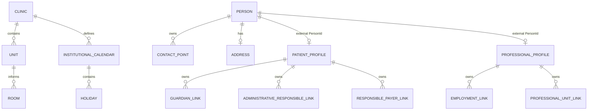
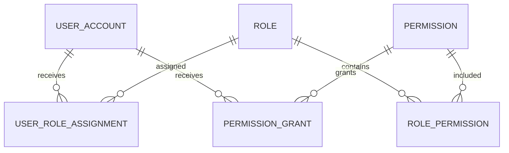
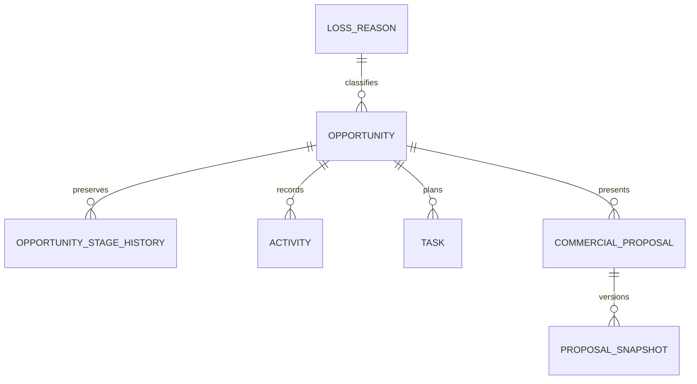
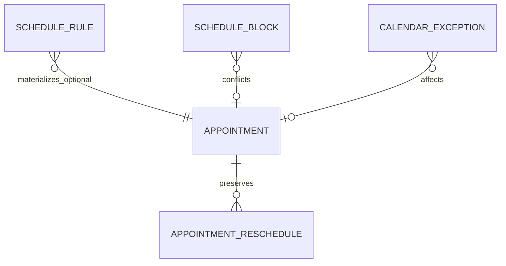
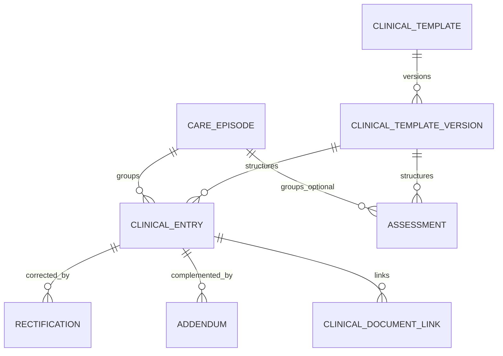
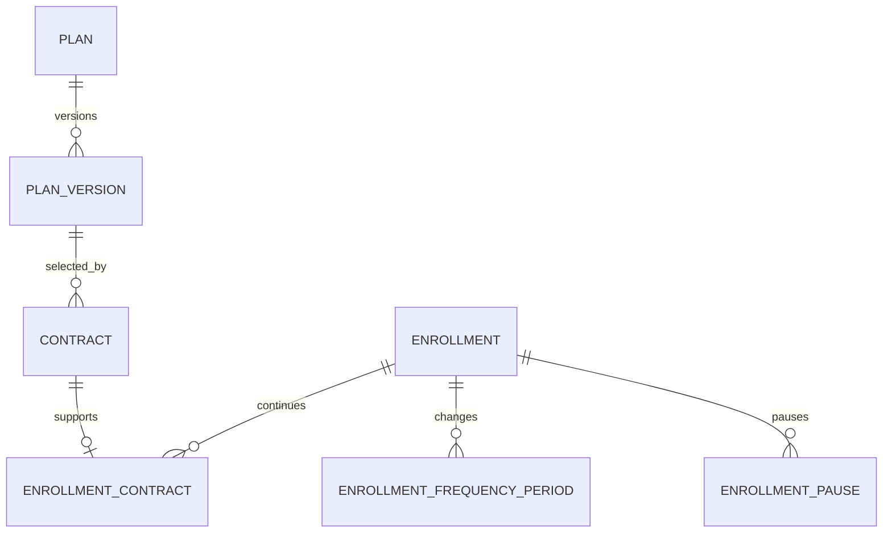
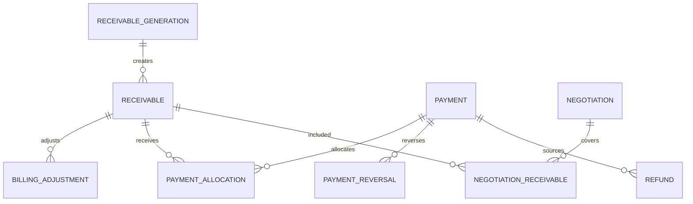
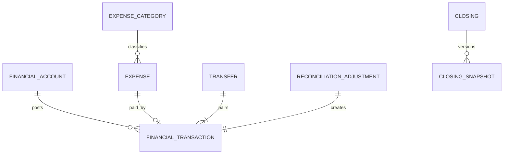
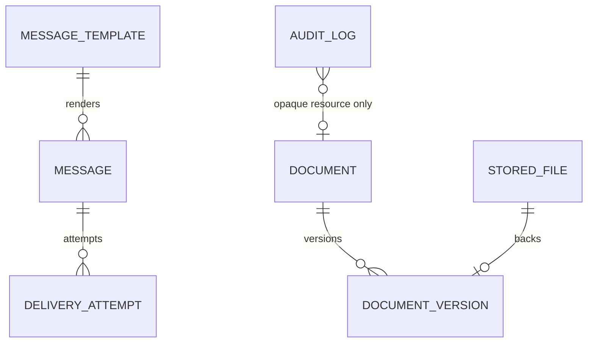
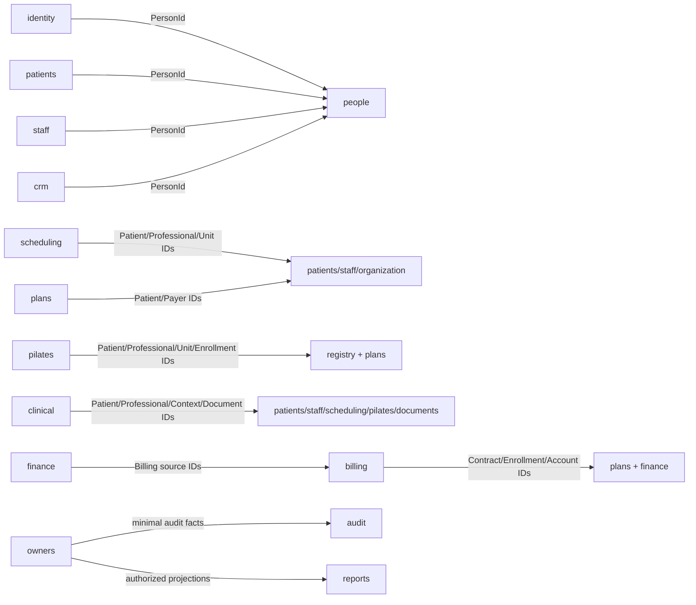

# DB-001 — Logical Data Model

## 1. Status

- **Task:** DB-001
- **Status:** DONE — PASS
- **Date:** 2026-09-16
- **Nature:** modelo lógico implementável em PostgreSQL, sem SQL ou código
- **Readiness result:** `READY` para API-001 e `READY_WITH_DEFERRED_DB_DETAILS` para implementação física

Os critérios de DB-001 foram atendidos. Detalhes explicitamente deferred impedem migrations de áreas específicas, mas não impedem a definição de contratos de aplicação/API.

## 2. Objective

Converter MODEL-001..005, STATE-001, EVT-001, AUTH-001 e ARC-003 em uma baseline lógica de persistência: 16 schemas/DbContexts, entidades, relações, identificadores, temporalidade, snapshots, constraints, concorrência, idempotência, índices, sensibilidade, migrations e Outbox/Inbox R2. Este documento não cria banco, SQL, migrations, ORM ou código.

## 3. Inputs

Foram lidos integralmente: `PROJECT_OS.md` e seu último handoff; perfil de IA; Context Map; Ownership Map; Domain Events; ARC-003; ADR-001..005; MODEL-001..005; STATE-001; AUTH-001; Glossary; Business Parameters; Rules Index; Process Index; Decisions. ADR-002 é normativa; ADR-004 usa a opção C solicitada.

## 4. Data Architecture Principles

1. Um database PostgreSQL por ambiente, 16 schemas e 16 DbContexts lógicos.
2. Toda tabela transacional tem exatamente um owner e migrations no context owner.
3. FK física é padrão dentro do próprio schema; cross-schema é `NO` por default.
4. Referência externa é UUID opaco, sem navegação ORM nem cascade cross-context.
5. Transação e Unit of Work não atravessam DbContext; fluxos cross-context usam contrato, evento ou reconciliação.
6. Estado atual não substitui histórico: versão, vigência, snapshot, correção, reversão e compensação preservam o passado.
7. Clinical, Billing e Finance mantêm isolamento próprio; Reports e Audit não se tornam cópias transacionais.
8. Constraints locais protegem invariantes locais; jobs de integridade detectam referências externas órfãs e projection drift.
9. JSONB é exceção justificada, não armazenamento padrão.
10. Delete físico limita-se a drafts descartáveis sem efeitos, staging técnico expirável e projeções reconstruíveis; nenhuma regra cria soft delete genérico.

## 5. Naming Conventions

| Item | Convention |
|---|---|
| schemas, tables, columns | `snake_case`, singular para tabelas de domínio |
| primary key | `id`; quando citado fora da tabela, nome semântico como `patient_id` |
| internal FK column | `<target>_id`; FK futura `fk_<table>__<target>` |
| external reference | `<concept>_id`; documentada como externa e sem FK física |
| timestamps/instants | sufixo `_at`; datas civis/negócio, `_date` ou `_on`; hora local, `_time` |
| effective dating | `effective_from`, `effective_to` com fim exclusivo |
| index | `ix_<table>__<columns>[_where_<predicate>]` |
| unique constraint/index | `uq_<table>__<columns>[_where_<predicate>]` |
| check constraint | `ck_<table>__<rule>` |
| FK | `fk_<table>__<target_table>` |
| event/idempotency | `event_id`, `idempotency_key`, `correlation_id`, `causation_id` |

Nomes de constraints acima são convenções para migrations futuras, não SQL. Palavras reservadas são evitadas; a tabela lógica de turma é `pilates.class`, devendo ser citada sempre com schema no desenho físico.

## 6. PostgreSQL Schemas

| Schema | DbContext | Responsibility |
|---|---|---|
| `identity` | IdentityDbContext | conta, roles, permissions e grants |
| `organization` | OrganizationDbContext | clínica, unidades, salas e calendário |
| `people` | PeopleDbContext | identidade civil, contatos, relações e merge |
| `patients` | PatientsDbContext | papel de paciente e responsáveis |
| `staff` | StaffDbContext | perfil profissional, vínculo, atuação e afastamento |
| `crm` | CrmDbContext | oportunidade, pipeline, atividades, tarefas e propostas |
| `scheduling` | SchedulingDbContext | Appointment, regras gerais, blocks e exceções |
| `pilates` | PilatesDbContext | turma, recorrência, ocorrência, chamada e reposição |
| `clinical` | ClinicalDbContext | prontuário segregado |
| `plans` | PlansDbContext | catálogo, contratos e matrículas |
| `billing` | BillingDbContext | obrigações, pagamentos, ajustes e restrições |
| `finance` | FinanceDbContext | contas, movimentos, despesas e fechamento |
| `communication` | CommunicationDbContext | mensagens, templates e tentativas de entrega |
| `documents` | DocumentsDbContext | arquivo privado, storage e versões |
| `audit` | AuditDbContext | evidência mínima de negócio/segurança |
| `reports` | ReportsDbContext | definições, checkpoints e métricas reconstruíveis |

Não existe schema de negócio `public`, `common` ou `shared`. Extensões PostgreSQL e a migration history de cada context são infraestrutura, não owners de negócio.

## 7. Identifier Strategy

Padrão: UUID conforme ADR-006. UUID vence BIGINT por opacidade e independência entre contexts, e vence ULID por suporte PostgreSQL nativo e menor complexidade de representação. UUIDv7 é preferência de geração quando suportado; UUIDv4 é fallback. Ordem de negócio nunca é inferida do ID.

Exceções permitidas sem trocar a PK: `installment_number`, `snapshot_version`, `event_version`, `correction_sequence` e números ordinais locais. CPF, external provider reference e idempotency key são alternate keys, nunca PKs.

## 8. Time Strategy

| Semantic | Logical PostgreSQL representation | Rule |
|---|---|---|
| technical/business instant | timestamp with time zone | armazenar instante UTC; converter apenas nas bordas |
| `created_at`, `updated_at`, `finalized_at`, event times | timestamp with time zone | gerados por clock confiável; `updated_at` só onde update é permitido |
| civil/service/business date | date | `service_date`, competência e feriado não são instantes |
| recurring clinic time | time without time zone | combinado com dias/recurrence e timezone institucional no cálculo |
| concrete interval | two instants | início inclusivo e fim exclusivo |
| effective period by date | two dates | `effective_from` inclusivo; `effective_to` exclusivo/nulo |
| `business_date` | date | data civil no timezone institucional aplicável; não é `created_at` truncado em UTC |
| business month | year + month or first-day date | não usar timestamp para identidade do período |

`organization.clinic.time_zone_id` guarda um identificador IANA obrigatório; não se hardcode offset e não se cria override por Unit sem requisito futuro. A zona é validada antes de materializar instantes. `service_date` e `created_at` permanecem distintos. Mudança futura de timezone não reinterpreta instantes ou occurrences históricas já materializadas.

## 9. Money Strategy

Money lógico é `amount + currency_code`. `amount` usa decimal exato e armazenamento lógico PostgreSQL `numeric(19,4)`; nunca float/double. `currency_code` usa código ISO 4217 de três letras. BRL é a moeda operacional inicial e default de criação, mas cada fato financeiro/snapshot armazena `BRL`, evitando modelo impossível de evoluir.

`numeric(19,4)` define a escala lógica de armazenamento, não uma obrigação de arredondar cada etapa do cálculo. Cálculos intermediários preservam precisão suficiente e não sofrem redução prematura de escala sem regra de negócio. Quando uma operação exigir redução de escala, aplica-se `HALF_UP`; valores monetários finais podem ser apresentados ou fechados em duas casas, salvo policy comercial/regulatória versionada que determine outra escala/regra. Persistência guarda o resultado aplicado e, quando relevante, base/fórmula/policy. Mixed-currency allocation, transfer e closing são proibidos até política futura; não há conversão cambial no MVP.

## 10. Enum / Catalog Strategy

| Strategy | Uses |
|---|---|
| logical enum + check | estados de máquinas aprovadas, directions, scope técnico e tipos estruturalmente fechados |
| check constraint | valores simples invariantes: montante positivo, intervalos, XOR de referências, moeda com 3 caracteres |
| configurable catalog/table | `loss_reason`, `expense_category`, templates e parâmetros cujo negócio altera |
| versioned entity | PlanVersion, ClinicalTemplateVersion, snapshots e policies historicamente relevantes |

Não se usa PostgreSQL enum como default: checks/tabelas permitem migrations menos acopladas. `ExpenseCategory`, LossReason e catálogo de templates não são enums rígidos. Métodos de pagamento podem iniciar como código validado pela aplicação/check, evoluindo para catálogo apenas quando atributos próprios forem necessários.

## 11. History / Temporal Strategy

- Vigências usam início inclusivo/fim exclusivo; a ausência de fim significa vigente, não “eterno”.
- Links de responsáveis, vínculos profissionais, schedules, memberships e frequência de Enrollment recebem registros por vigência.
- Transições de state machine preservam timestamps, ator/processo, razão e correlação no aggregate ou em history child quando o modelo exige todos os valores anteriores.
- Append-only: clinical corrections, payment reversals, financial transactions, reconciliation adjustments, closing snapshots e audit logs.
- Snapshots nunca seguem a fonte corrente; merge atualiza referências correntes autorizadas, não snapshots históricos.
- Overlap é impedido por constraint de exclusão/índice + transação futura quando o escopo for inteiramente local.

## 12. Delete Strategy

Não há `is_deleted` universal.

| Category | Strategy |
|---|---|
| Person/profile/catalog/root usado | status/inactivation ou merge alias |
| temporal link | encerrar `effective_to` |
| Appointment/occurrence/contract/enrollment/receivable | cancel/complete preservando registro |
| Payment/transaction/finalized clinical/closing snapshot/audit | nunca delete operacional; compensar/anexar |
| clinical draft | discard físico somente se policy confirmar ausência de evidência/anexo; até lá, status/retention deferred |
| technical projection | truncate/rebuild permitido pelo owner |
| outbox/inbox | purge somente por política de retention futura, após garantia operacional |

## 13. JSONB Strategy

| Candidate | Decision | Justification / boundary |
|---|---|---|
| clinical template structure | JSONB allowed | estrutura versionada variável; validada contra schema/version |
| assessment/clinical entry content | JSONB allowed | conteúdo estruturado dependente da TemplateVersion; criptografia/acesso Clinical |
| rectification/addendum content | JSONB allowed | mesma estrutura clínica, append-only |
| merge manifest | JSONB allowed | lista heterogênea de referências opacas/proveniência, imutável |
| event payload | JSONB allowed | envelope tabular + payload versionado/minimizado no Outbox |
| closing snapshot details | JSONB allowed only for flexible breakdown | totais, período, versão e hashes ficam tipados |
| proposal/contract/receivable snapshots | typed columns first | valores/partes/frequência/datas são consultados e constrained; metadata adicional pode ser JSONB versionado |
| arbitrary entity data | rejected | não transformar PostgreSQL em document database |

Todo JSONB possui versão lógica, tamanho/shape validável e não substitui colunas de busca, relacionamento, estado, Money ou data.

## 14. Identity

Tabelas: `user_account`, `role`, `permission`, `role_permission`, `user_role_assignment`, `permission_grant`, `command_receipt` e `inbox_message` R2. `user_account.person_id` é referência People sem FK. Uma partial unique lógica impede mais de uma conta interna ativa por Person. Assignments/grants têm scope, vigência, concedente e revogação; não armazenam Patient/Clinical/Finance. Sessão, credential provider, MFA e recovery permanecem deferred, portanto nenhuma tabela é inventada para eles.

## 15. Organization

Tabelas: `clinic`, `unit`, `room`, `institutional_calendar`, `holiday`. Clinic mantém o `time_zone_id` IANA institucional. FKs internas ligam Unit→Clinic, Room→Unit, Calendar→Clinic e Holiday→Calendar. `unit_id` opcional do calendário é interno e deve pertencer à mesma Clinic. Room não tem capacidade nem reserva. Calendários equivalentes ativos não se sobrepõem no mesmo escopo.

## 16. People

Tabelas: `person`, `contact_point`, `address`, `person_relationship`, `person_merge`, `merge_manifest`, `command_receipt`, `outbox_message`. CPF é normalizado, opcional e único quando presente; nunca recebe valor fictício. AlternativeDocument usa campos tipados `type/number/issuing_country`, com unicidade candidata por tripla quando informada. `person_merge` referencia duas Persons locais distintas; `merge_manifest` é imutável e pode guardar JSONB versionado. Source concluída vira `MERGED_ALIAS`, não é apagada.

## 17. Patients

Tabelas: `patient_profile`, `guardian_link`, `administrative_responsible_link`, `responsible_payer_link`, `emergency_contact`, `inbox_message`. `person_id` e demais PersonIds são referências externas. Uma unique lógica por `person_id` impede PatientProfiles equivalentes, incluindo reativação do mesmo registro. Links preservam vigência; no máximo um guardian/payer/admin principal por finalidade e intervalo. Um paciente menor ativo exige guardian vigente, invariante transacional/aplicacional porque idade vem de People.

## 18. Staff

Tabelas: `professional_profile`, `employment_link`, `professional_unit_link`, `availability`, `professional_leave`, `outbox_message`, `inbox_message`. Um perfil por `person_id`. UnitIds são externos. Employment/Unit/Availability usam vigência e proíbem overlaps contraditórios. Leave preserva período, estado, ator e motivo; encerramento do vínculo produz R2 para revogação/elegibilidade, sem remover autoria histórica.

## 19. CRM

Tabelas: `opportunity`, `opportunity_stage_history`, `activity`, `task`, `commercial_proposal`, `proposal_snapshot`, `loss_reason`, `inbox_message`. Lead é somente read model de Person + Opportunity. O estado atual da Opportunity é constrained; toda mudança acrescenta history. LossReason é catálogo configurável e obrigatório para LOST. ProposalSnapshot é imutável/versionado e preserva oferta apresentada; não substitui Contract. Task OVERDUE é derivado da due date.

## 20. Scheduling

Tabelas: `appointment`, `appointment_reschedule`, `schedule_rule`, `schedule_block`, `calendar_exception`, `command_receipt`, `inbox_message`. Appointment suporta `ASSESSMENT`, `EXPERIMENTAL`, `MAKEUP`, `EXTRAORDINARY`, `FIT_IN`. Reagendamento acrescenta before/after/reason/actor e atualiza o intervalo corrente atomicamente; terminal não reabre. ScheduleRule é apenas recorrência geral não-turma. RoomId é informativo. Conflitos de paciente/profissional exigem operação atômica e índice por sujeito/intervalo; projeções de Pilates/Staff participam da validação via contrato, não FK.

## 21. Pilates

Tabelas: `class`, `class_schedule`, `class_membership`, `class_occurrence`, `occurrence_participant`, `attendance`, `attendance_correction`, `makeup_credit`, `makeup_reservation`, `command_receipt`, `inbox_message`. ClassSchedule e Membership usam vigência. Occurrence guarda snapshots de unit, room, intervalo, profissional planejado/real, capacidade e origem. Participant prova a vaga/origem na data. Attendance é uma por participant; correction é append-only. Reserva de makeup e ocupação de vaga ocorrem na mesma transação, com unique de uma reserva ativa por crédito e locks/versão nos roots envolvidos. Geração usa chave determinística schedule+data para impedir duplicata.

## 22. Clinical

Tabelas: `care_episode`, `assessment`, `clinical_template`, `clinical_template_version`, `clinical_entry`, `rectification`, `addendum`, `clinical_document_link`, `break_glass_access`, `command_receipt`, `outbox_message`. Conteúdo e template structure podem usar JSONB validado. Assessment/Entry DRAFT usam optimistic concurrency. A finalização fixa conteúdo, author, `service_date`, `created_at`, template/context refs e FinalizationMetadata tipada; FINALIZED não volta a DRAFT. Rectification/Addendum são append-only e apontam exatamente um target interno. ClinicalDocumentLink guarda DocumentId/VersionId externo e semântica, nunca bytes/URL. BreakGlass guarda decisão/uso; evento público exclui justificativa livre e conteúdo.

## 23. Plans

Tabelas: `plan`, `plan_version`, `contract`, `enrollment`, `enrollment_contract`, `enrollment_frequency_period`, `enrollment_pause`, `command_receipt`, `outbox_message`, `inbox_message`. PlanVersion publicada/usada é imutável. Contract fixa snapshot tipado de partes, plano, frequência, Money, parcelas, H/A, datas, due day e condições; renovação cria novo Contract. Enrollment é contínuo e relaciona sucessivos Contracts. Frequência e pausas são children temporais; pausa não muda o término contratado. Benefit, Entitlement e ContractAmendment não são criados.

## 24. Billing

Tabelas: `receivable_generation`, `receivable`, `billing_adjustment`, `payment`, `payment_allocation`, `payment_reversal`, `refund`, `negotiation`, `negotiation_receivable`, `financial_restriction`, `command_receipt`, `outbox_message`, `inbox_message`. Generation tem unique por Contract/correlation para lote único. Receivable guarda obligation snapshot; OVERDUE não é estado persistido. Allocation é N:N explícita e suporta parcial, antecipação e múltiplos pagamentos. Payment confirmado não é editado/apagado; reversal é append-only; Refund tem lifecycle próprio. Ajustes são append/compensating. Somas de allocation, reversal e refund são verificadas transacionalmente com locks/versionamento nos roots.

## 25. Finance

Tabelas: `financial_account`, `financial_transaction`, `expense_category`, `expense`, `transfer`, `reconciliation_adjustment`, `closing`, `closing_snapshot`, `command_receipt`, `inbox_message`. Saldo é derivado. Transaction é append-only e tem unique de source event/id quando originada de R2. Expense e transaction são distintos. Transfer cria exatamente duas transactions correlacionadas numa única transação Finance e não é receita/despesa. Closing é único por mês/contexto; cada fechamento acrescenta snapshot versionado, e reabertura nunca altera snapshot anterior.

## 26. Communication

Tabelas sustentadas: `message`, `message_template`, `delivery_attempt`. Message registra intenção aprovada, destinatário/ref externa minimizada, canal, template/version e status técnico. Cada tentativa é append-only. Communication não calcula atraso, pipeline, regra clínica ou cancelamento; apenas executa a intenção/fato do owner. Preference/consent não é criado sem inventário LGPD. Eventos consumidos aqui permanecem R1 ou intenção explícita; não há Inbox R2 nesta baseline.

## 27. Documents

Tabelas: `document`, `stored_file`, `document_version`. Document é handle técnico e classificação; StoredFile guarda storage provider/key privada, checksum, tamanho, MIME e scan status; Version liga uma versão imutável ao arquivo. Não há URL pública permanente. Significado clínico/comercial/financeiro permanece no owner externo. `owner_context` + `owner_resource_id` são referências opacas para autorização/reconciliação, não FK ou autoridade. Eventos de Documents continuam deferred; não há Outbox/Inbox R2.

## 28. Audit

Tabelas: `audit_log`, `inbox_message`. AuditLog é append-only e contém actor/process, ação, classe, resource context/id opaco, scope, resultado, instante, correlation e reason/approval/step-up minimizados. BreakGlass, export, finalização e correções clínicas viram entradas classificadas sem payload clínico. Valores/contas completos e documentos não são copiados. PrivacyRequest/legal hold não são persistidos porque lifecycle está deferred.

## 29. Reports

Tabelas permitidas: `report_definition`, `projection_checkpoint`, `metric_snapshot`. São definições e projeções reconstruíveis com source context/version, cutoff, freshness e classificação. Não se copiam tabelas transacionais nem conteúdo clínico. Um futuro read model operacional/financeiro exige purpose, owner da projeção, rebuild e autorização; `clinical` não entra em metric snapshot genérico. Reports não possui Outbox/Inbox R2 e nunca corrige a fonte.

## 30. Cross-Context References

Referências externas usam UUID, nome semântico e metadata de validação; não criam navegação entre DbContexts. O catálogo completo está na seção 43. Os eixos principais são:

- `person_id`: Identity, Patients, Staff, CRM, Plans/Billing → People;
- `patient_id`: Scheduling, Pilates, Clinical, Plans/Billing → Patients;
- `professional_id`: Scheduling, Pilates, Clinical → Staff;
- `unit_id`/`room_id`: contexts operacionais/financeiros → Organization;
- `appointment_id`/`class_occurrence_id`: Clinical → Scheduling/Pilates;
- `enrollment_id`: Pilates/Billing → Plans;
- `contract_id`: Billing → Plans;
- `financial_account_id`: Billing → Finance;
- `document_id`/`document_version_id`: Clinical → Documents;
- source IDs financeiros: Finance → Billing;
- actor `user_account_id`: contexts → Identity.

`PersonMergeCompleted/Reversed` é o mecanismo durável para referências correntes a Person. Cada consumer, inclusive Scheduling quando `appointment.person_id` estiver presente, mantém receipt, aplica source→target uma vez e não altera snapshots históricos.

## 31. Referential Integrity

| Boundary | Enforcement |
|---|---|
| same schema | FK física futura, unique/check e cascade somente quando child sem história independente |
| cross schema | sem FK; validate-on-write pelo contrato público do owner |
| long-running validity | lifecycle events R2 quando críticos e reconciliação periódica |
| deletion/inactivation | owner publica fatos; consumer preserva história e impede novos usos |
| orphan detection | integrity job por context, com relatório/correção pelo owner; jamais update direto cross-schema |
| stale projection | checkpoint/source version/freshness e rebuild |

Não há exceção de FK cross-schema em DB-001. A indisponibilidade temporária do owner pode impedir uma escrita que exija validação forte; IDs não são aceitos apenas por formato. Referência histórica válida não é considerada órfã porque o alvo foi inativado.

## 32. Snapshot Strategy

| Snapshot | Owner/table | Typed core | Flexible part | Immutability |
|---|---|---|---|---|
| CommercialProposal | `crm.proposal_snapshot` | proposal, version, recipient, dates, Money, offered terms ref | optional versioned metadata JSONB | append new version |
| Contract | `plans.contract` | patient/payer/plan version, frequency, Money, installments, H/A, dates, due day, accepted terms version | bounded terms JSONB if necessary | fixed at ACTIVE |
| Receivable | `billing.receivable` | contract/enrollment/patient/payer refs, original amount/currency, competence, due date, installment, origin | bounded origin metadata | adjustments only |
| ClassOccurrence | `pilates.class_occurrence` | schedule/class, date/interval, unit/room, planned/actual professional, capacity | none by default | past snapshot fixed; point changes explicit |
| ClinicalTemplateVersion used | `clinical.clinical_template_version` + ref | version/definition/published metadata | structure JSONB | published/used immutable |
| FinalizationMetadata | columns on Assessment/ClinicalEntry | actor, professional, finalized_at, record_version, template/context refs | none | fixed at finalization |
| ClosingSnapshot | `finance.closing_snapshot` | closing, version, cutoff, totals/currency, source versions/hash | versioned breakdown JSONB | append-only |
| DocumentVersion | `documents.document_version` | document, version, file, checksum, created_at | technical metadata only | immutable |

## 33. Constraint Catalog

| ID | Schema | Concept | Invariant | Logical Enforcement |
|---|---|---|---|---|
| DB-INV-001 | people | Person | CPF único quando preenchido | normalized CPF + partial unique |
| DB-INV-002 | people | Person | CPF ausente é nulo, nunca fake | validation/check + use case |
| DB-INV-003 | people | PersonMerge | source e target distintos; manifest único após completion | check + unique/FK internas + transaction |
| DB-INV-004 | patients | PatientProfile | no máximo um profile por Person | unique `person_id` |
| DB-INV-005 | staff | ProfessionalProfile | no máximo um profile por Person | unique `person_id` |
| DB-INV-006 | identity | UserAccount | no máximo uma conta interna ativa por Person | partial unique on external `person_id` |
| DB-INV-007 | organization | Calendar | unit do calendário pertence à mesma Clinic | internal FK + transaction check |
| DB-INV-008 | temporal | Effective period | fim ausente ou maior que início | check |
| DB-INV-009 | patients | Payer/guardian/admin links | principal vigente não se sobrepõe por finalidade | exclusion/partial unique + transaction |
| DB-INV-010 | staff | employment/unit/availability | vigências equivalentes incompatíveis não se sobrepõem | exclusion constraint candidate |
| DB-INV-011 | scheduling | Appointment | exatamente patient ou person quando purpose exigir; intervalo válido | check + use case |
| DB-INV-012 | scheduling | Appointment | estado terminal não é reaberto; reschedule preserva history | state guard + transaction |
| DB-INV-013 | pilates | ClassSchedule | schedules ambíguos da mesma Class não se sobrepõem | exclusion + recurrence validation |
| DB-INV-014 | pilates | ClassMembership | vínculo equivalente não se sobrepõe | exclusion candidate |
| DB-INV-015 | pilates | ClassOccurrence | uma occurrence por schedule/data/chave de geração | unique deterministic key |
| DB-INV-016 | pilates | OccurrenceParticipant | um paciente por occurrence | unique `(occurrence_id, patient_id)` |
| DB-INV-017 | pilates | Attendance | uma Attendance por participant | unique `occurrence_participant_id` |
| DB-INV-018 | pilates | AttendanceCorrection | before/after distintos; append-only | check + no update/delete policy |
| DB-INV-019 | pilates | capacity | ocupação válida nunca excede snapshot capacity | atomic transaction + occurrence version |
| DB-INV-020 | pilates | MakeupCredit | uma origem elegível concede no máximo um crédito | unique source key |
| DB-INV-021 | pilates | MakeupReservation | crédito não tem duas reservas ativas/não é usado duas vezes | unique active reservation + atomic state transition |
| DB-INV-022 | clinical | Assessment/Entry | FINALIZED não volta a DRAFT nem muda conteúdo/contexto/template | state guard + optimistic version + restricted persistence mapping |
| DB-INV-023 | clinical | Rectification/Addendum | target FINALIZED; append-only; exatamente um target | internal FK/XOR check + transaction |
| DB-INV-024 | clinical | ClinicalTemplateVersion | publicada/usada é imutável | state guard + no update policy |
| DB-INV-025 | clinical | context reference | no máximo um Appointment ou ClassOccurrence ordinário | XOR check |
| DB-INV-026 | plans | PlanVersion | publicada/usada não é sobrescrita | state guard |
| DB-INV-027 | plans | Contract | snapshot fixo após aceite; due day permitido | state guard + check/catalog policy |
| DB-INV-028 | plans | Enrollment | frequência vigente única e pausa sem overlap | exclusion + state transaction |
| DB-INV-029 | billing | ReceivableGeneration | lote contratual/correlation não duplica | unique contract/workflow key |
| DB-INV-030 | billing | Receivable | current due amount nunca negativo; OVERDUE não é estado | transaction-local calculation + state check |
| DB-INV-031 | billing | PaymentAllocation | amount positivo e allocations válidas ≤ Payment disponível/Receivable saldo | checks + locks/version + transaction |
| DB-INV-032 | billing | PaymentReversal | soma de reversals ≤ valor reversível; Payment original preservado | transaction + append-only |
| DB-INV-033 | billing | Refund | soma reservada/concluída ≤ elegibilidade; completion única | unique/idempotency + lock/version |
| DB-INV-034 | billing | FinancialRestriction | removida não reabre; nova ocorrência cria novo registro | state guard |
| DB-INV-035 | finance | FinancialTransaction | source R2 não cria movimento duas vezes | unique `(source_context, source_event_id)` |
| DB-INV-036 | finance | Transfer | contas distintas e exatamente uma saída/uma entrada no mesmo valor/moeda | checks + transaction |
| DB-INV-037 | finance | Expense | UNIT exige UnitId; GLOBAL proíbe UnitId | check |
| DB-INV-038 | finance | Closing | um Closing por período; snapshot version único | uniques `(period)` and `(closing_id, version)` |
| DB-INV-039 | all R2 producers | OutboxMessage | event_id único; envelope/version válidos | unique + checks, same local transaction |
| DB-INV-040 | all R2 consumers | InboxMessage | consumer não processa event_id duas vezes | unique `(consumer_name, event_id)` |
| DB-INV-041 | contexts with critical HTTP ops | idempotency | mesma actor+operation+key não produz dois fatos | context-local unique; payload hash mismatch = conflict |
| DB-INV-042 | documents | DocumentVersion | checksum/version imutáveis; sem public URL | unique version/check + field prohibition |
| DB-INV-043 | audit | AuditLog | append-only e payload mínimo | no business update/delete + schema validation |
| DB-INV-044 | reports | Projection | source version/checkpoint monotônico e reconstruível | unique projection key + rebuild contract |

Constraints dependentes de data externa, idade, conflito cross-context ou autorização ficam também no use case; isso não reduz a constraint local disponível.

## 34. Index Catalog

| Schema | Concept | Purpose | Classification |
|---|---|---|---|
| people | Person.cpf_normalized | unicidade quando presente | REQUIRED_FOR_INVARIANT |
| people | Person alternative document | deduplicação por tipo/número/país | REQUIRED_FOR_LOOKUP |
| people | Merge source/target/status | aplicar alias/reconciliação | REQUIRED_FOR_LOOKUP |
| identity/patients/staff | external PersonId | unique profile/account e merge reaction | REQUIRED_FOR_INVARIANT |
| patients/staff/plans/pilates | effective links | active-by-subject/date | REQUIRED_FOR_LOOKUP |
| crm | Opportunity person/status/owner | pipeline e Lead read model | REQUIRED_FOR_LOOKUP |
| crm | Task owner/due/state | próximas ações/overdue derivado | REQUIRED_FOR_LOOKUP |
| scheduling | Appointment professional/interval | conflito profissional | REQUIRED_FOR_INVARIANT |
| scheduling | Appointment patient/person/interval | conflito paciente | REQUIRED_FOR_INVARIANT |
| scheduling | Appointment unit/start/state | agenda | REQUIRED_FOR_LOOKUP |
| pilates | ClassSchedule class/effective period | schedule aplicável | REQUIRED_FOR_INVARIANT |
| pilates | Membership class/patient/effective period | ocupação recorrente/overlap | REQUIRED_FOR_INVARIANT |
| pilates | Occurrence schedule/date | geração única | REQUIRED_FOR_INVARIANT |
| pilates | Participant occurrence/patient | assento único | REQUIRED_FOR_INVARIANT |
| pilates | MakeupCredit patient/state/expires | créditos utilizáveis | REQUIRED_FOR_LOOKUP |
| pilates | active reservation by credit | reserva única | REQUIRED_FOR_INVARIANT |
| clinical | Entry patient/service_date | timeline autorizada | REQUIRED_FOR_LOOKUP |
| clinical | Entry author/state/created_at | drafts próprios pendentes | REQUIRED_FOR_LOOKUP |
| clinical | target correction chronology | visão original + append | REQUIRED_FOR_LOOKUP |
| plans | Contract patient/state/end_date | contratos e renovação | REQUIRED_FOR_LOOKUP |
| plans | Enrollment patient/state | vínculo corrente | REQUIRED_FOR_LOOKUP |
| billing | generation contract/correlation | idempotência do lote | REQUIRED_FOR_INVARIANT |
| billing | Receivable payer/due/state | cobrança e saldos | REQUIRED_FOR_LOOKUP |
| billing | Allocation payment/receivable | cálculo dos dois lados | REQUIRED_FOR_LOOKUP |
| billing | Payment external_reference/provider | deduplicação externa quando presente | REQUIRED_FOR_INVARIANT |
| finance | Transaction account/occurred_at | saldo e extrato | REQUIRED_FOR_LOOKUP |
| finance | Transaction source event | consumo único R2 | REQUIRED_FOR_INVARIANT |
| finance | Closing period/version | fechamento único/versionado | REQUIRED_FOR_INVARIANT |
| communication | Message status/next_attempt_at | dispatcher futuro | PERFORMANCE_CANDIDATE |
| documents | Version document/version | versão única | REQUIRED_FOR_INVARIANT |
| audit | resource context/id/time | investigação autorizada | REQUIRED_FOR_LOOKUP |
| reports | metric/key/period/cutoff | leitura de relatório | PERFORMANCE_CANDIDATE |
| selected schemas | CommandReceipt actor/operation/key | HTTP/use-case idempotency | REQUIRED_FOR_INVARIANT |
| R2 schemas | Outbox status/next_attempt/occurred | dispatch | REQUIRED_FOR_LOOKUP |
| R2 schemas | Inbox consumer/event | deduplicação | REQUIRED_FOR_INVARIANT |

Índices GIST/range são candidatos naturais para overlap, mas a forma física será validada na migration. Índice clínico sobre conteúdo JSONB não é criado por default.

## 35. Concurrency Strategy

| Schema | Concept | Race Condition | Strategy |
|---|---|---|---|
| pilates | ClassMembership | dois usuários ocupam última vaga recorrente | transaction-local capacity check + lock/version on class/schedule occupancy + overlap unique |
| pilates | ClassOccurrence | materialização duplicada/duas vagas finais | deterministic unique + atomic insert; occurrence version for participant changes |
| pilates | MakeupCredit | duas reservas/consumos | compare-and-set state + active-reservation unique + transaction |
| pilates | MakeupReservation | reserva e cancel/expire simultâneos | lock credit+occurrence in deterministic order |
| pilates | Attendance | dois registros/correções concorrentes | unique participant attendance + occurrence/attendance optimistic version; corrections append-only |
| clinical | Assessment/ClinicalEntry DRAFT | lost update/finalize during edit | optimistic concurrency version; finalize checks expected version |
| billing | Payment | duplicate confirmation/reversal | idempotency unique + optimistic version + append reversal |
| billing | PaymentAllocation | duas allocations excedem Payment/Receivable | lock Payment and affected Receivables in stable ID order; one local transaction |
| billing | Receivable | adjustment/allocation/cancel collision | optimistic version + local transaction; unresolved precedence fails explicitly |
| billing | Refund | duplicate completion/excess eligibility | idempotency unique + lock refund/source eligibility |
| finance | Transfer | partial pair or duplicated transfer | one Finance transaction, deterministic account lock order, idempotency key |
| finance | Closing | two users close/reopen same month | unique period + optimistic version + snapshot append in one transaction |

Não há token de concorrência universal. Roots mutáveis de alto risco recebem `version` lógico incremental; append-only tables dependem de unique/idempotency e transaction boundaries.

## 36. Idempotency

| Use | Logical support |
|---|---|
| critical HTTP command | context-local `command_receipt` associated with actor, operation, key, request hash, result reference and replay metadata; no global table |
| external payment | unique provider/external reference within provider/account, plus request hash/correlation |
| GenerateReceivables | `receivable_generation` unique by Contract/workflow |
| occurrence generation | unique ClassSchedule + service date + generation discriminator |
| event R2 | Outbox `event_id`; Inbox unique consumer + event_id |
| repeatable jobs | deterministic job key on the owned result (expiration, overdue detection, materialization) |

Reuso da mesma key com payload semanticamente diferente resulta em conflict. Retorno/replay da resposta HTTP pode ser modelado no próprio aggregate/receipt durante API-001; DB-001 proíbe uma tabela global universal.

## 37. Outbox / Inbox

### Logical shape

`outbox_message`: `id/event_id`, event type/version, occurred_at, aggregate/subject, correlation/causation, sensitivity, minimized JSONB payload, status, attempts, available_at, processed_at, last_error_code. É gravada na mesma transação do fato. Payload clínico/financeiro segue EVT-001.

`inbox_message`: `id`, `event_id`, producer context, event type/version, consumer name, received_at, processed_at, outcome, correlation, payload hash/error code. O receipt e a reação local concluem na mesma transação do consumer quando possível.

### Option C placement

| R2 flow | Producer Outbox | Consumer Inbox(es) |
|---|---|---|
| PersonMergeCompleted/Reversed | `people` | `identity`, `patients`, `staff`, `crm`, `scheduling`, `plans`, `billing` |
| EmploymentEnded affecting revocation/eligibility | `staff` | `identity`, `scheduling`, `pilates` |
| ContractAccepted → receivables | `plans` | `billing` |
| Enrollment events with Billing/Pilates effects | `plans` | `billing`, `pilates` |
| PaymentConfirmed/reversals/RefundCompleted → movements | `billing` | `finance` |
| FinancialRestriction applied/removed as operational guard | `billing` | `pilates`, `scheduling`, `plans` |
| clinical finalization/correction/break-glass/export evidence | `clinical` | `audit` |

Portanto Outbox existe apenas em `people`, `staff`, `plans`, `billing`, `clinical`; Inbox apenas em `identity`, `patients`, `staff`, `crm`, `scheduling`, `pilates`, `plans`, `billing`, `finance`, `audit`. Alguns contexts possuem ambas porque produzem e consomem fluxos distintos. Identity lifecycle events permanecem deferred e não justificam Outbox. Communication, Documents, Organization, Reports e Finance não recebem Outbox R2 nesta baseline. Dispatcher, scheduler, retries concretos, replay UI, broker e retention permanecem deferred.

| Schema | Role | R2 Event(s) | Justification |
|---|---|---|---|
| `people` | `OUTBOX_PRODUCER` | `PersonMergeCompleted`, `PersonMergeReversed` | publica o alias durável source→target para todos os detentores de referência corrente a Person |
| `identity` | `INBOX_CONSUMER` | `PersonMergeCompleted/Reversed`; `EmploymentEnded` | atualiza `user_account.person_id` corrente e aplica revogação/elegibilidade crítica sem duplicar reação |
| `patients` | `INBOX_CONSUMER` | `PersonMergeCompleted/Reversed` | atualiza referências correntes a Person e preserva snapshots/histórico |
| `staff` | `BOTH` | produz `EmploymentEnded`; consome `PersonMergeCompleted/Reversed` | publica perda crítica de vínculo e mantém sua própria referência corrente a Person |
| `crm` | `INBOX_CONSUMER` | `PersonMergeCompleted/Reversed` | atualiza `opportunity.person_id` corrente sem reescrever snapshots de proposta |
| `scheduling` | `INBOX_CONSUMER` | `PersonMergeCompleted/Reversed`; `EmploymentEnded`; `FinancialRestrictionApplied/Removed` | atualiza `appointment.person_id` quando aplicável e mantém guards locais de elegibilidade/restrição |
| `pilates` | `INBOX_CONSUMER` | `EmploymentEnded`; eventos de Enrollment com efeito operacional; `FinancialRestrictionApplied/Removed` | mantém elegibilidade, memberships/direitos e guards operacionais próprios |
| `plans` | `BOTH` | produz `ContractAccepted` e eventos de Enrollment com efeito em Billing/Pilates; consome `PersonMergeCompleted/Reversed` e `FinancialRestrictionApplied/Removed` | coordena efeitos contratuais críticos e mantém partes/guards correntes sem alterar snapshots |
| `billing` | `BOTH` | produz `PaymentConfirmed`, `PaymentPartiallyReversed`, `PaymentReversed`, `RefundCompleted`, `FinancialRestrictionApplied/Removed`; consome `PersonMergeCompleted/Reversed`, `ContractAccepted` e eventos de Enrollment com efeito financeiro | protege criação única de obrigações/movimentos downstream e referências correntes próprias |
| `finance` | `INBOX_CONSUMER` | `PaymentConfirmed`, `PaymentPartiallyReversed`, `PaymentReversed`, `RefundCompleted` | impede criação duplicada de `FinancialTransaction` para o mesmo fato de caixa |
| `clinical` | `OUTBOX_PRODUCER` | `AssessmentFinalized`, `ClinicalEntryFinalized`, `ClinicalEntryRectified`, `ClinicalAddendumAdded`, `BreakGlassUsed`, `ClinicalRecordExported` | perda impediria evidência clínica/security mínima exigida |
| `audit` | `INBOX_CONSUMER` | eventos de finalização/correção clínica; `BreakGlassUsed`; `ClinicalRecordExported` | registra evidência mínima, idempotente e sem conteúdo clínico |

Cada schema acima possui ao menos um fluxo R2 comprovado por EVT-001/ARC-003; nenhum evento foi promovido para justificar infraestrutura. Eventos públicos restantes continuam R1 quando sua projeção/notificação é reconstruível, e R0 permanece local.

## 38. Migration Ownership

| Schema | DbContext | Migration Owner | Dependencies |
|---|---|---|---|
| identity | IdentityDbContext | Access / Identity | none physical; People contract |
| organization | OrganizationDbContext | Registry / Organization | none |
| people | PeopleDbContext | Registry / People | none physical; Organization ref optional |
| patients | PatientsDbContext | Registry / Patients | none physical; People/Organization contracts |
| staff | StaffDbContext | Registry / Staff | none physical; People/Organization contracts |
| crm | CrmDbContext | CRM | none physical; People refs |
| scheduling | SchedulingDbContext | Operations / Scheduling | none physical; Registry/Pilates projections |
| pilates | PilatesDbContext | Operations / Pilates | none physical; Registry/Scheduling/Plans refs |
| clinical | ClinicalDbContext | Clinical | none physical; Patients/Staff/Operations/Documents refs |
| plans | PlansDbContext | Revenue / Plans | none physical; People/Patients refs |
| billing | BillingDbContext | Revenue / Billing | none physical; Plans/Finance refs |
| finance | FinanceDbContext | Revenue / Finance | none physical; Organization/Billing events |
| communication | CommunicationDbContext | Communication | none physical; public intents/events |
| documents | DocumentsDbContext | Documents | object storage configuration only |
| audit | AuditDbContext | Audit | none physical; R2 event contracts |
| reports | ReportsDbContext | Reports | none physical; projection contracts |

Cada migration history table fica no schema owner com convenção própria do DbContext. Uma migration nunca altera dois schemas. A aplicação de migrations pode ser orquestrada, mas a ordem não expressa FK de negócio cross-context.

## 39. Migration Dependencies

Migrations de estrutura são independentes. Dependências listadas na seção 38 são de runtime/contrato e seed autorizado, não de DDL. Seeds de role/permission e valores operacionais pertencem aos contexts e devem usar chaves estáveis; dados de negócio e pessoas nunca são seed genérico. Uma mudança de contrato/evento segue compatibilidade expand/contract entre migrations independentes. Exceção cross-schema exigiria revisão da ADR-002; nenhuma foi aprovada.

## 40. Sensitivity Classification

| Class | Examples | Controls |
|---|---|---|
| PUBLIC_INTERNAL | IDs opacos, Unit/Room names, non-sensitive config | internal access; no assumption of public internet |
| PERSONAL | Person, contacts, Patient/Professional refs, CRM | mask search/export; no logs/events beyond purpose |
| FINANCIAL | Receivable, Payment, account, transaction, closing | Financial permission; redact account/provider data |
| CLINICAL | all Clinical content/links and inherited Documents | Clinical permission; private storage; no generic logs/reports |
| SECURITY | accounts, grants, break-glass/export evidence, event errors | restricted admin/audit; no secrets/tokens |
| AUDIT | actor/action/resource/result/reason metadata | append-only, purpose-bound reads, minimization |

CPF, contato, clinical JSONB, free-text reasons, account details, payment external data, document keys/URLs and auth material cannot enter ordinary logs. Events contain only EVT-001 fields. Clinical documents remain private; Reports/Audit inherit source classification and cannot lower it.

## 41. Retention Boundaries

No legal period is invented. Retention for Clinical, Documents, Audit, Outbox/Inbox, idempotency receipts and financial records is `DEFERRED` pending legal/RT/operational validation. The schema supports preservation via immutable versions, logical link status, append-only facts and separate technical storage. Legal hold and PrivacyRequest entities remain deferred. Purge jobs must be owner-specific and cannot precede the approved policy.

## 42. Table Ownership Catalog

| Schema | Table | Owner Context | Aggregate / Concept |
|---|---|---|---|
| identity | user_account | Identity & Access | UserAccount |
| identity | role | Identity & Access | Role |
| identity | permission | Identity & Access | Permission |
| identity | role_permission | Identity & Access | Role composition |
| identity | user_role_assignment | Identity & Access | Role assignment |
| identity | permission_grant | Identity & Access | scoped direct grant/revocation |
| identity | command_receipt | Identity & Access | critical command idempotency |
| identity | inbox_message | Identity & Access | R2 receipt |
| organization | clinic | Organization | Clinic |
| organization | unit | Organization | Unit |
| organization | room | Organization | Room |
| organization | institutional_calendar | Organization | InstitutionalCalendar |
| organization | holiday | Organization | Holiday |
| people | person | People | Person |
| people | contact_point | People | Person / ContactPoint |
| people | address | People | Person / Address |
| people | person_relationship | People | PersonRelationship |
| people | person_merge | People | PersonMerge |
| people | merge_manifest | People | PersonMerge / MergeManifest |
| people | command_receipt | People | critical command idempotency |
| people | outbox_message | People | R2 publication |
| patients | patient_profile | Patients | PatientProfile |
| patients | guardian_link | Patients | PatientProfile / GuardianLink |
| patients | administrative_responsible_link | Patients | PatientProfile / AdministrativeResponsibleLink |
| patients | responsible_payer_link | Patients | PatientProfile / ResponsiblePayerLink |
| patients | emergency_contact | Patients | PatientProfile / EmergencyContact |
| patients | inbox_message | Patients | R2 receipt |
| staff | professional_profile | Staff | ProfessionalProfile |
| staff | employment_link | Staff | ProfessionalProfile / EmploymentLink |
| staff | professional_unit_link | Staff | ProfessionalProfile / ProfessionalUnitLink |
| staff | availability | Staff | Availability |
| staff | professional_leave | Staff | ProfessionalLeave |
| staff | outbox_message | Staff | R2 publication |
| staff | inbox_message | Staff | R2 receipt |
| crm | opportunity | CRM | Opportunity |
| crm | opportunity_stage_history | CRM | Opportunity history |
| crm | activity | CRM | Activity |
| crm | task | CRM | Task |
| crm | commercial_proposal | CRM | CommercialProposal |
| crm | proposal_snapshot | CRM | ProposalSnapshot |
| crm | loss_reason | CRM | LossReason catalog |
| crm | inbox_message | CRM | R2 receipt |
| scheduling | appointment | Scheduling | Appointment |
| scheduling | appointment_reschedule | Scheduling | Appointment history |
| scheduling | schedule_rule | Scheduling | ScheduleRule |
| scheduling | schedule_block | Scheduling | ScheduleBlock |
| scheduling | calendar_exception | Scheduling | CalendarException |
| scheduling | command_receipt | Scheduling | critical command idempotency |
| scheduling | inbox_message | Scheduling | R2 receipt |
| pilates | class | Pilates | Class |
| pilates | class_schedule | Pilates | ClassSchedule |
| pilates | class_membership | Pilates | ClassMembership |
| pilates | class_occurrence | Pilates | ClassOccurrence |
| pilates | occurrence_participant | Pilates | ClassOccurrence / participant |
| pilates | attendance | Pilates | ClassOccurrence / Attendance |
| pilates | attendance_correction | Pilates | Attendance correction |
| pilates | makeup_credit | Pilates | MakeupCredit |
| pilates | makeup_reservation | Pilates | MakeupCredit / reservation |
| pilates | command_receipt | Pilates | critical command idempotency |
| pilates | inbox_message | Pilates | R2 receipt |
| clinical | care_episode | Clinical | CareEpisode |
| clinical | assessment | Clinical | Assessment |
| clinical | clinical_template | Clinical | ClinicalTemplate |
| clinical | clinical_template_version | Clinical | ClinicalTemplateVersion |
| clinical | clinical_entry | Clinical | ClinicalEntry |
| clinical | rectification | Clinical | finalized record correction |
| clinical | addendum | Clinical | finalized record complement |
| clinical | clinical_document_link | Clinical | clinical meaning/link |
| clinical | break_glass_access | Clinical | BreakGlassAccess |
| clinical | command_receipt | Clinical | critical command idempotency |
| clinical | outbox_message | Clinical | R2 publication |
| plans | plan | Plans & Enrollment | Plan |
| plans | plan_version | Plans & Enrollment | PlanVersion |
| plans | contract | Plans & Enrollment | Contract snapshot |
| plans | enrollment | Plans & Enrollment | Enrollment |
| plans | enrollment_contract | Plans & Enrollment | Enrollment–Contract relation |
| plans | enrollment_frequency_period | Plans & Enrollment | effective frequency history |
| plans | enrollment_pause | Plans & Enrollment | pause history |
| plans | command_receipt | Plans & Enrollment | critical command idempotency |
| plans | outbox_message | Plans & Enrollment | R2 publication |
| plans | inbox_message | Plans & Enrollment | R2 receipt |
| billing | receivable_generation | Billing | generation workflow receipt |
| billing | receivable | Billing | Receivable |
| billing | billing_adjustment | Billing | Receivable / adjustment |
| billing | payment | Billing | Payment |
| billing | payment_allocation | Billing | Payment / allocation |
| billing | payment_reversal | Billing | Payment / reversal |
| billing | refund | Billing | Refund |
| billing | negotiation | Billing | Negotiation |
| billing | negotiation_receivable | Billing | Negotiation scope |
| billing | financial_restriction | Billing | FinancialRestriction |
| billing | command_receipt | Billing | critical command idempotency |
| billing | outbox_message | Billing | R2 publication |
| billing | inbox_message | Billing | R2 receipt |
| finance | financial_account | Finance | FinancialAccount |
| finance | financial_transaction | Finance | FinancialTransaction |
| finance | expense_category | Finance | ExpenseCategory |
| finance | expense | Finance | Expense |
| finance | transfer | Finance | Transfer |
| finance | reconciliation_adjustment | Finance | ReconciliationAdjustment |
| finance | closing | Finance | Closing |
| finance | closing_snapshot | Finance | Closing / snapshot |
| finance | command_receipt | Finance | critical command idempotency |
| finance | inbox_message | Finance | R2 receipt |
| communication | message | Communication | Message |
| communication | message_template | Communication | MessageTemplate |
| communication | delivery_attempt | Communication | DeliveryAttempt |
| documents | document | Documents | Document |
| documents | stored_file | Documents | StoredFile |
| documents | document_version | Documents | DocumentVersion |
| audit | audit_log | Privacy & Audit | AuditLog/evidence |
| audit | inbox_message | Privacy & Audit | R2 receipt |
| reports | report_definition | Reports | ReportDefinition |
| reports | projection_checkpoint | Reports | projection lifecycle |
| reports | metric_snapshot | Reports | authorized aggregate metric snapshot |

## 43. External Reference Catalog

| Source Schema | Concept | Reference | Target Context | FK? | Validation |
|---|---|---|---|---|---|
| identity | UserAccount | person_id | People | NO | create/link contract; merge R2 |
| people | Person | primary_unit_id | Organization | NO | optional lookup at write |
| patients | PatientProfile | person_id, primary_unit_id | People, Organization | NO | validate create/activate; merge receipt |
| patients | responsibility links | related person IDs | People | NO | validate link; effective history |
| staff | ProfessionalProfile | person_id | People | NO | validate create/activate; merge receipt |
| staff | unit/availability links | unit_id | Organization | NO | validate effective Unit |
| crm | Opportunity | person_id | People | NO | validate create; merge receipt |
| crm | Proposal | plan_version_id? | Plans | NO | authorized public offer lookup; snapshot result |
| scheduling | Appointment | patient_id/person_id, professional_id, unit_id, room_id | Patients/People, Staff, Organization | NO | synchronous active refs + conflict policy |
| scheduling | Appointment | opportunity_id? | CRM | NO | correlation supplied by CRM |
| scheduling | CalendarException | calendar_id/holiday_id? | Organization | NO | calendar contract |
| pilates | Schedule/Occurrence | professional_id, unit_id, room_id | Staff, Organization | NO | validate when materializing; snapshot |
| pilates | Membership/Participant/Credit | patient_id | Patients | NO | active patient contract |
| pilates | Membership | enrollment_id? | Plans | NO | eligibility/frequency contract |
| clinical | clinical records | patient_id, professional_id, user_account_id | Patients, Staff, Identity | NO | current policy/refs at operation; preserve history |
| clinical | context | appointment_id or occurrence_id | Scheduling/Pilates | NO | exactly one optional context, synchronous validation |
| clinical | document link | document_id, document_version_id? | Documents | NO | private document/version contract |
| plans | Contract/Enrollment | patient_id, payer_person_id | Patients, People | NO | validate parties; snapshot at acceptance |
| plans | Contract | primary_unit_id? | Organization | NO | validate if contracted scope uses Unit |
| billing | Receivable | contract_id, enrollment_id | Plans | NO | R2/workflow payload + reconciliation |
| billing | Receivable/Restriction | patient_id, payer_person_id | Patients/People | NO | refs/snapshot; merge rules preserve historical payer |
| billing | Payment/Refund | financial_account_id | Finance | NO | synchronous active account validation |
| billing | actor | user_account_id | Identity | NO | current actor from use case |
| finance | Transaction | payment/reversal/refund source IDs | Billing | NO | R2 payload + unique event receipt |
| finance | Expense | unit_id? | Organization | NO | required for UNIT, forbidden for GLOBAL |
| communication | Message | source resource/contact refs | owner context/People | NO | approved intent + contact resolution at send time |
| documents | Document | owner_resource_id | business owner | NO | opaque; authorization revalidated by owner |
| audit | AuditLog | actor/resource IDs | Identity/business owner | NO | event/use-case evidence; no navigation |
| reports | projection source | opaque source IDs/version | source owners | NO | authorized feed/read contract + checkpoint |

## 44. Data Dictionary

Campos triviais de auditoria técnica são omitidos abaixo. Todas as PKs principais são UUID e todas as relações externas usam o catálogo da seção 43.

### Identity / Organization / People / Patients / Staff

| Schema.Table | Purpose / important fields | Internal relationships | Lifecycle / constraints | Sensitivity |
|---|---|---|---|---|
| identity.user_account | conta ligada a `person_id`; status, account type, activated/disabled timestamps | assignments/grants | uma ativa por Person; auth provider deferred | SECURITY, PERSONAL |
| identity.role / permission | vocabulário de capability | role_permission | nomes estáveis únicos | SECURITY |
| identity.user_role_assignment | role, scope type/ref, effective period, grantor/revoker | UserAccount/Role | vigência; no self-escalation no use case | SECURITY, AUDIT |
| identity.permission_grant | permission direta, scope, vigência e resultado de revogação | UserAccount/Permission | deny/deferred never allow | SECURITY, AUDIT |
| organization.clinic | instituição, name, status, IANA `time_zone_id` | Units/calendars | ACTIVE/INACTIVE, sem delete | PUBLIC_INTERNAL |
| organization.unit | unidade da Clinic, name/status | Clinic, Rooms | exatamente uma Clinic | PUBLIC_INTERNAL |
| organization.room | sala informativa, name/status/description | Unit | sem capacidade/reserva | PUBLIC_INTERNAL |
| organization.institutional_calendar / holiday | calendário por clinic/unit e vigência; holiday date/name | Calendar owns Holidays | mesmo scope sem ambiguidade | PUBLIC_INTERNAL |
| people.person | identidade civil: name, birth_date, CPF?, alternative document?, state/merge alias | contacts/address; merge refs | CPF partial unique; CURRENT/INACTIVE/MERGED_ALIAS | PERSONAL |
| people.contact_point | phone/email, purpose, primary, status | Person | principalidade por tipo/finalidade | PERSONAL |
| people.address | endereço corrente estruturado | Person 0..1 | sem histórico adotado | PERSONAL |
| people.person_relationship | from/to Person, kind, period | two local Persons | from != to; vigência quando aplicável | PERSONAL |
| people.person_merge / merge_manifest | workflow source→target, approval/reversal metadata; immutable manifest | local Persons; one manifest | não delete; source/target distinct | PERSONAL, AUDIT |
| patients.patient_profile | papel administrativo, person/unit refs, status/start/end reason | responsibility children | unique Person; ACTIVE/INACTIVE | PERSONAL |
| patients.guardian_link | guardian Person, relationship, period, primary | PatientProfile | effective history; minor rule in transaction | PERSONAL |
| patients.administrative_responsible_link | Person, permitted action codes, period, primary communication | PatientProfile | authority only through this link | PERSONAL, SECURITY |
| patients.responsible_payer_link | payer Person, period, primary | PatientProfile | one primary current; snapshots unaffected | PERSONAL, FINANCIAL |
| patients.emergency_contact | Person ref optional, priority/status | PatientProfile | simplified external form deferred | PERSONAL |
| staff.professional_profile | role profissional, Person ref, state/dates | employment/unit links | unique Person; authorship survives inactivation | PERSONAL |
| staff.employment_link | kind?, effective period/end reason | ProfessionalProfile | incompatible overlaps blocked | PERSONAL |
| staff.professional_unit_link | Unit ref, period, primary | ProfessionalProfile | temporal N:N | PERSONAL |
| staff.availability | professional/unit, period, definition | independent root | exact recurrence representation deferred | PERSONAL |
| staff.professional_leave | professional, period, reason code, state/actor | independent root | preserved cancellation/end | PERSONAL, AUDIT |

### CRM / Scheduling / Pilates

| Schema.Table | Purpose / important fields | Internal relationships | Lifecycle / constraints | Sensitivity |
|---|---|---|---|---|
| crm.opportunity | commercial cycle by Person, owner, source, state, next action | stage history, activities/tasks/proposals | state guards; loss requires LossReason | PERSONAL |
| crm.opportunity_stage_history | from/to, actor, reason, occurred_at | Opportunity | append-only | PERSONAL, AUDIT |
| crm.activity | commercial interaction metadata | Opportunity | historical, no destructive erase | PERSONAL |
| crm.task | action, owner, due_at, status/result | Opportunity optional | OPEN/IN_PROGRESS/DONE/CANCELLED; overdue derived | PERSONAL |
| crm.commercial_proposal / proposal_snapshot | proposal identity and immutable presented versions | Opportunity; proposal owns snapshots | new presentation/version appends | PERSONAL, FINANCIAL |
| crm.loss_reason | configurable code/name/status/effective dates | Opportunities reference it | inactive prevents future use | PUBLIC_INTERNAL |
| scheduling.appointment | purpose, subject, professional/unit/room, interval, state, origin | reschedule history | terminal protected; conflict transaction | PERSONAL |
| scheduling.appointment_reschedule | previous/new interval, actor/reason/time | Appointment | append-only | PERSONAL, AUDIT |
| scheduling.schedule_rule | non-class recurrence, subjects, local time/duration, period | independent root | temporal, never ClassSchedule | PERSONAL |
| scheduling.schedule_block | scope, interval/recurrence, reason/state | independent root | cancel/end preserved | PERSONAL |
| scheduling.calendar_exception | scope, interval/effect/source refs/reason/state | independent root | operational, not Holiday | PUBLIC_INTERNAL, AUDIT |
| pilates.class | durable class identity, name/status | schedules/memberships by FK | ACTIVE/INACTIVE | PUBLIC_INTERNAL |
| pilates.class_schedule | recurrence, local time/duration, Unit/Professional/Room, capacity, period | Class; occurrences | no ambiguous overlap; capacity > 0 | PERSONAL |
| pilates.class_membership | Class/Patient/Enrollment, period/end reason | Class | temporal; transfer creates new row | PERSONAL |
| pilates.class_occurrence | concrete snapshot date/instants/location/professionals/capacity/state/generation key | Schedule, participants | unique generation; terminal protected | PERSONAL |
| pilates.occurrence_participant | patient, origin type/ref, seat status | Occurrence; Attendance | patient unique per occurrence | PERSONAL |
| pilates.attendance | current resolved result, recorded/arrival/actor | Participant; corrections | one per participant; change only through correction | PERSONAL, AUDIT |
| pilates.attendance_correction | before/after/reason/actor/time | Attendance | immutable append | PERSONAL, AUDIT |
| pilates.makeup_credit | patient, source, reason, grant/validity/policy/state | reservations | unique eligible source; terminal not reusable | PERSONAL |
| pilates.makeup_reservation | credit, occurrence, patient, reserve/cancel metadata | Credit and Occurrence | at most one active per credit; seat atomic | PERSONAL, AUDIT |

### Clinical

| Schema.Table | Purpose / important fields | Internal relationships | Lifecycle / constraints | Sensitivity |
|---|---|---|---|---|
| clinical.care_episode | patient, service context, dates/state/responsible professional | records reference episode | OPEN/PAUSED/CLOSED; closed not reopened | CLINICAL |
| clinical.assessment | patient/episode?, author, service_date, created_at, context/template, JSONB content, finalization fields/version | corrections/addenda/links | DRAFT→FINALIZED only | CLINICAL |
| clinical.clinical_template | name/purpose/status | versions | ACTIVE/INACTIVE | CLINICAL |
| clinical.clinical_template_version | ordinal, versioned JSONB structure, publication metadata | Template; used by records | immutable after publish/use | CLINICAL |
| clinical.clinical_entry | patient/episode/author, service_date vs created_at, context/template, content, finalization/version | corrections/addenda/links | DRAFT→FINALIZED; episode mandatory | CLINICAL |
| clinical.rectification | exact target, structured correction, author/user, reason, created_at | finalized Assessment/Entry | append-only; no original overwrite | CLINICAL, AUDIT |
| clinical.addendum | exact target, structured complement, author/user, reason/context, created_at | finalized Assessment/Entry | append-only | CLINICAL, AUDIT |
| clinical.clinical_document_link | exact clinical target, Document/Version, meaning, link actor/time/status | clinical target | finalized link not silently removed | CLINICAL |
| clinical.break_glass_access | patient/actor/professional, reason code, private justification, scope, confirmation/use/result | independent root | exceptional and auditable; no permanent grant | CLINICAL, SECURITY |

### Plans / Billing / Finance

| Schema.Table | Purpose / important fields | Internal relationships | Lifecycle / constraints | Sensitivity |
|---|---|---|---|---|
| plans.plan | commercial catalog identity/status | versions | ACTIVE/INACTIVE | PUBLIC_INTERNAL |
| plans.plan_version | frequency, amounts/currency, installments, H/A, commercial period, publication | Plan; Contracts reference | immutable after publish/use | FINANCIAL |
| plans.contract | accepted typed snapshot, parties, PlanVersion, Money, dates/due day/state/acceptance | enrollment relation | DRAFT→ACTIVE→COMPLETED/CANCELLED; renewal new row | PERSONAL, FINANCIAL |
| plans.enrollment | patient, service scope, operational period/state | contracts/frequency/pauses | continuous across Contracts; terminal protected | PERSONAL |
| plans.enrollment_contract | effective association/sequence | Enrollment + Contract | one Contract relation cannot be duplicated | PERSONAL, FINANCIAL |
| plans.enrollment_frequency_period | frequency and effective period | Enrollment | one frequency per instant | PERSONAL |
| plans.enrollment_pause | period/reason/policy/actor | Enrollment | no overlap; max policy; no end-date extension | PERSONAL, AUDIT |
| billing.receivable_generation | Contract/correlation, generated_at/status | Receivables | one successful generation per Contract/workflow | FINANCIAL |
| billing.receivable | obligation snapshot, original Money, competence/due date/installment, state | adjustments/allocations | overdue/saldo derived; cancel preserves history | FINANCIAL, PERSONAL |
| billing.billing_adjustment | type/source/reason/Money/policy/actor/time | Receivable | append/compensating; result nonnegative | FINANCIAL, AUDIT |
| billing.payment | payer, Money, confirmation/method/account/actor/external ref/state/version | allocations/reversals | PENDING/CONFIRMED/FAILED/PARTIALLY_REVERSED/REVERSED | FINANCIAL |
| billing.payment_allocation | Payment↔Receivable, Money/time/actor/status | internal FKs both sides | positive; both balances consistent | FINANCIAL, AUDIT |
| billing.payment_reversal | Payment, Money/reason/actor/time | Payment | immutable; sum bounded | FINANCIAL, AUDIT |
| billing.refund | sources, Money/account/reason/state/times/actor/idempotency | independent root | ISSUED→COMPLETED/CANCELLED; bounded eligibility | FINANCIAL, AUDIT |
| billing.negotiation / negotiation_receivable | terms/status/approval evidence and N:N obligations | Receivables | lifecycle details deferred; effects only via adjustments | FINANCIAL, AUDIT |
| billing.financial_restriction | patient/enrollment, basis/reason, period/state | independent root | ACTIVE→REMOVED; new episode new row | FINANCIAL, PERSONAL |
| finance.financial_account | type/name/status/currency/opening basis | transactions | balance derived; initial BANK/CASH are data | FINANCIAL |
| finance.financial_transaction | account, direction, Money, cash instant, source/correlation | Account; transfer/expense refs | immutable; correction by counter-entry | FINANCIAL, AUDIT |
| finance.expense_category | configurable name/status/effective period | Expenses | catalog, not enum | FINANCIAL |
| finance.expense | Money, competence/due date, scope/unit, category/state/payment refs | Category; optional transaction | OPEN→PAID/CANCELLED; overdue derived | FINANCIAL |
| finance.transfer | source/destination accounts, Money, occurred_at, actor/reason/idempotency | exactly two transactions | atomic immutable completed fact | FINANCIAL, AUDIT |
| finance.reconciliation_adjustment | account, expected/actual/difference, reason/actor/time | one transaction | append-only | FINANCIAL, AUDIT |
| finance.closing / closing_snapshot | monthly period/state/version; immutable totals/cutoff/source versions | Closing owns snapshots | unique period/version; reopen appends later snapshot | FINANCIAL, AUDIT |

### Communication / Documents / Audit / Reports / Reliability

| Schema.Table | Purpose / important fields | Internal relationships | Lifecycle / constraints | Sensitivity |
|---|---|---|---|---|
| communication.message_template | purpose/channel/version/content/status | Message references applied version | configured by Communication, no business rule | PERSONAL |
| communication.message | approved source intent, contact ref, template/version, channel/status/correlation | delivery attempts | status técnico only | PERSONAL |
| communication.delivery_attempt | provider ref, attempt/status/times/error code | Message | append attempts | PERSONAL, AUDIT |
| documents.document | opaque handle, classification, owner context/resource, status | versions | authorization belongs to owner | inherited; often CLINICAL |
| documents.stored_file | private provider/key, checksum, size, MIME, scan state | versions | never public URL | SECURITY, inherited |
| documents.document_version | Document/version/StoredFile/checksum/time | internal FKs | immutable version | inherited |
| audit.audit_log | actor/process/action/resource/scope/result/time/correlation/reason class | none to source schemas | append-only/minimized | AUDIT + inherited |
| reports.report_definition | report purpose/source contracts/field sensitivity/version/status | projections use definition | no source authority | inherited |
| reports.projection_checkpoint | projection/source/version/cutoff/freshness | local projection | monotonic/rebuildable | AUDIT |
| reports.metric_snapshot | definition/key/period/cutoff/value/source version | ReportDefinition | aggregate-only, rebuildable | PUBLIC_INTERNAL/FINANCIAL |
| *.outbox_message | durable minimized R2 publication | local aggregate only by opaque id | unique event; same transaction as fact | inherited event class |
| *.inbox_message | per-consumer processing receipt | local reaction | unique consumer+event | inherited event class/AUDIT |
| selected schemas.command_receipt | HTTP/use-case idempotency receipt: actor, operation, key, request hash, result ref/status/times | local owner only | unique actor+operation+key; payload mismatch conflicts | AUDIT + inherited |

## 45. Logical ERDs

### 45.1 Organization + People + Patients + Staff



Cross-schema lines above denote logical IDs, not physical FKs.

### 45.2 Identity



### 45.3 CRM



### 45.4 Scheduling



### 45.5 Pilates

```mermaid
erDiagram
  CLASS ||--o{ CLASS_SCHEDULE : versions
  CLASS ||--o{ CLASS_MEMBERSHIP : members
  CLASS_SCHEDULE ||--o{ CLASS_OCCURRENCE : generates
  CLASS_OCCURRENCE ||--o{ OCCURRENCE_PARTICIPANT : seats
  OCCURRENCE_PARTICIPANT ||--o| ATTENDANCE : resolves
  ATTENDANCE ||--o{ ATTENDANCE_CORRECTION : corrects
  MAKEUP_CREDIT ||--o{ MAKEUP_RESERVATION : reservations
  CLASS_OCCURRENCE ||--o{ MAKEUP_RESERVATION : receives
```

### 45.6 Clinical



Rectification/Addendum/DocumentLink may target Assessment through the same exclusive-target rule.

### 45.7 Plans



### 45.8 Billing



### 45.9 Finance



### 45.10 Communication / Documents / Audit



### 45.11 Cross-context reference overview



Every arrow is a public contract/event/opaque ID; none is a cross-schema navigation.

## 46. Risks

| Risk | Impact | Mitigation |
|---|---|---|
| overhead of 16 DbContexts/migrations | operational complexity | common tooling only, owner-specific migration history and architecture tests |
| orphan cross-context refs | invalid future operations | validate-on-write, R2 lifecycle/merge events and reconciliation jobs |
| PersonMerge partial application | duplicate/current alias drift | People Outbox + per-consumer Inbox, manifest and reconciliation |
| temporal overlap | contradictory current truth | range/exclusion candidates and transaction tests |
| clinical JSONB growth/schema drift | performance and interpretability | immutable template version, validation, size monitoring; no generic GIN |
| Outbox/Inbox growth | storage/dispatch degradation | indexes, metrics and future approved retention/archival |
| projection drift | wrong agenda/report | checkpoints, freshness, rebuild and source reconciliation |
| money precision/rounding divergence | financial inconsistency | numeric(19,4), BRL code, boundary rounding and stored applied result |
| concurrent capacity | overbooking | locked/versioned occurrence/schedule occupancy + unique participants |
| PaymentAllocation races | over-allocation/negative balance | stable lock order and single Billing transaction |
| Closing inconsistent cutoff | irreproducible close | immutable source versions/cutoff/hash and optimistic closing version |
| Clinical leakage | severe privacy/regulatory impact | separate schema/DbContext, minimal events, inherited document auth, no content in logs/audit |
| Reports/Audit data leakage | bypass authorization | minimized projections/evidence and source-derived permissions |
| UUID index size | storage/cache overhead | deliberate indexes; UUIDv7 generation preference |
| deferred precedence rules | unsafe financial edge cases | explicit conflict/fail until policies approved; no permissive default |

## 47. Deferred Decisions

- dispatcher/scheduler/provider, retry policy, dead-letter, replay UI, broker and Outbox/Inbox retention;
- concrete IAM provider, credentials, sessions, MFA/step-up, revocation mechanism and recovery;
- financial approval bands, discount/negotiation limits, reversal/refund/transfer thresholds;
- treatment of already-overdue Receivables on cancellation and detailed operation precedence;
- reallocation semantics and affected allocations on reversal;
- MakeupCredit behavior during Enrollment pause and ad-hoc consumption;
- concrete Availability representation and professional license model;
- clinical required fields, signature level, export lifecycle, RT/minors/consent and retention/legal hold;
- DocumentVersion requirement by category, scan/allowlist limits and retention;
- PrivacyRequest/LGPD entities and lifecycle;
- final report/KPI definitions and Holiday source/precedence.

## 48. Open Questions

No open question blocks API-001. Before implementation of the affected slice, owners must answer the deferred items above. Safe defaults are: deny unknown permission/alçada, reject ambiguous concurrent financial operation, do not alter terminal history, do not expose Clinical, and do not infer debt forgiveness.

## 49. Consequences for API-001

**READY.** API-001 now has stable owners, UUID identifiers, Money/time semantics, entity/state boundaries, cross-context references, transaction boundaries, idempotency keys and critical conflict outcomes. Contracts must expose IDs as opaque strings, Money with currency, instants with offsets/UTC semantics, dates separately, expected version on optimistic writes and conflict/idempotency errors. APIs must not expose persistence entities, JSONB internals, storage keys or cross-schema navigation.

## 50. Consequences for Implementation

Implementation remains gated by API-001 and the explicit security/business details for each slice. BOOT-001 may later create 16 DbContexts/schemas and per-owner migrations, but DB-001 itself creates none. Physical migrations must prove DB-INV constraints, local FKs, partial/exclusion indexes, immutable mappings, concurrency behavior and R2 receipts through integration tests. No global repository, shared business entity or DbContext is allowed.

## 51. Validation Criteria

- [x] 16 schemas and 16 DbContexts defined.
- [x] UUID identifier strategy and ADR-006 defined.
- [x] time and Money strategies defined.
- [x] persisted entities mapped and every table has one owner.
- [x] internal relations/FKs and external references cataloged.
- [x] snapshots, temporal/history/delete and JSONB strategies defined.
- [x] critical constraints and indexes cataloged/classified.
- [x] concurrency and idempotency hotspots have strategies.
- [x] Clinical isolated; Billing and Finance remain separate.
- [x] no cross-schema FK or direct access approved.
- [x] selective R2 Outbox/Inbox option C mapped exactly.
- [x] migration ownership/dependencies defined.
- [x] sensitivity and retention boundaries explicit.
- [x] 11 logical ERDs included.
- [x] MODEL-005 owners/aggregates/snapshots preserved.
- [x] STATE-001 terminal/derived/compensating semantics preserved.
- [x] AUTH-001 isolation and source-derived authorization preserved.
- [x] ARC-003 topology/migrations/R2 rules preserved.
- [x] API-001 readiness is READY; implementation readiness is conditional on deferred details.

**Result: DB-001 — PASS. Next task: API-001 — Application / API Contracts.**
