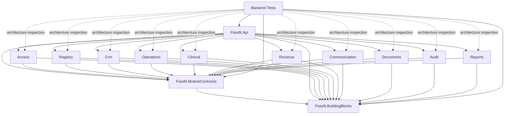

# BOOT-001 — Solution Skeleton

## Status

DONE — PASS em 2026-09-16.

## Objective

Materializar a fundação compilável e testável do Fisiofit CRM 2.0 sem implementar comportamento de negócio, persistência ou decisões deferred.

## Inputs

Foram consideradas as fontes obrigatórias: `PROJECT_OS.md` e seu último handoff; perfil de IA; ARC-003; Context Map; Ownership Map; Domain Events; DB-001; API-001; AUTH-001; STATE-001; e ADR-001 a ADR-007. ARC-003 permanece authority para topologia e dependências; API-001 permanece catálogo futuro, não escopo de implementação.

## Runtime / Toolchain

- .NET SDK `10.0.400`, runtime `10.0.11`, target `net10.0` (LTS disponível no ambiente).
- Node.js `v26.0.0` e npm `11.12.1`, disponíveis no ambiente e validados com o frontend.
- React 19, TypeScript 5.9 e Vite 7.
- Nenhum `global.json`, `.nvmrc` ou `.node-version` existia.

As versões observadas de Node/npm são registro desta execução, não regra de domínio nem atualização global do ambiente.

## Repository Structure

```text
src/backend/
  Fisiofit.Api/
  Fisiofit.BuildingBlocks/
  Fisiofit.ModuleContracts/
  Modules/Fisiofit.Modules.{Access,Registry,Crm,Operations,Clinical,Revenue,Communication,Documents,Audit,Reports}/
src/frontend/Fisiofit.Web/
tests/backend/
  Fisiofit.ArchitectureTests/
  Fisiofit.UnitTests/
  Fisiofit.IntegrationTests/
  Fisiofit.ApiTests/
```

## Backend Solution

`Fisiofit.slnx` agrega apenas os 13 projetos de produção e os quatro projetos de teste da baseline. `Directory.Build.props` centraliza `net10.0`, nullable, implicit usings e warnings como erros.

## Host

`Fisiofit.Api` é o único composition root. Ele registra health checks, a baseline nativa de Problem Details, os 10 módulos, cria o route group `/api/v1` e chama as 10 superfícies de endpoint. Não contém regra de negócio nem persistência.

## BuildingBlocks

Contém somente um marker público de assembly. Nenhum conceito de domínio ou framework interno foi criado.

## ModuleContracts

Contém apenas o marker público do assembly e namespaces/folders para os 16 owners: Identity, Organization, People, Patients, Staff, CRM, Scheduling, Pilates, Clinical, Plans, Billing, Finance, Communication, Documents, Audit e Reports. Não contém entities, handlers ou os 214 contratos catalogados em API-001.

## Physical Modules

Foram criados exatamente os 10 assemblies aprovados: Access, Registry, Crm, Operations, Clinical, Revenue, Communication, Documents, Audit e Reports. A grafia `Crm` segue ARC-003 e a convenção .NET definida pela arquitetura física.

## Internal Module Structure

Módulos dedicados possuem `Domain`, `Application` e `Infrastructure`. Os agrupados preservam boundaries internos:

- Registry: Organization, People, Patients e Staff;
- Operations: Scheduling e Pilates;
- Revenue: Plans, Billing e Finance.

Cada layer contém somente um marker `internal`. Não há entities, commands, queries, handlers, adapters ou persistence.

## Project Reference Graph



Não existe seta de um module assembly para outro module assembly.

## Frontend Skeleton

`Fisiofit.Web` usa React + TypeScript + Vite, com `src/app`, `src/features` e `src/shared`. A única página é um shell técnico. A configuração de API usa `VITE_API_BASE_URL`, com fallback local de desenvolvimento; nenhuma URL de produção foi hardcoded.

## Test Structure

- ArchitectureTests: três verificações executáveis de assemblies/referências.
- UnitTests, IntegrationTests e ApiTests: um smoke test estrutural por projeto, sem comportamento de negócio artificial.

Os únicos pacotes NuGet adicionados são o runner/test SDK e xUnit, necessários para testes executáveis. Nenhuma biblioteca externa de architecture testing foi adicionada.

## Architecture Validation

Os testes carregam exatamente os 10 nomes aprovados, rejeitam referência module-to-module e rejeitam referências de BuildingBlocks/ModuleContracts para módulos. A inspeção adicional confirmou ausência de EF Core, `DbContext`, migrations, entities, commands e queries funcionais.

## Configuration Baseline

O Host usa `appsettings.json`, override de logging em Development e logging nativo. Não há connection string, token, senha, API key ou provider SaaS. Auth e observability permanecem pontos futuros no composition root, sem implementação permissiva.

## Commands

```bash
dotnet restore Fisiofit.slnx
dotnet build Fisiofit.slnx --no-restore --disable-build-servers
dotnet test Fisiofit.slnx --no-build --no-restore --disable-build-servers
dotnet run --project src/backend/Fisiofit.Api/Fisiofit.Api.csproj --no-build --no-restore
curl http://127.0.0.1:5080/health

cd src/frontend/Fisiofit.Web
npm install
npm run build
npm run lint
npm run typecheck
npm run dev -- --host 127.0.0.1 --port 5173
```

## Validation Results

- restore: PASS;
- backend build: PASS, zero warnings/errors;
- backend tests: PASS, 3 architecture tests e 3 smoke tests estruturais;
- backend run: PASS; `/health` retornou `Healthy`, HTTP 200;
- frontend install: PASS, 0 vulnerabilities reportadas pelo npm;
- frontend build/lint/typecheck: PASS;
- frontend dev smoke: PASS, HTTP 200;
- processos temporários de backend/frontend encerrados.

## Deferred Implementation

Ficam fora: todos os commands/queries/endpoints funcionais de API-001; entities; state machines; authorization/IAM; EF Core, PostgreSQL, schemas, `DbContext` e migrations; outbox/inbox; scheduler; storage; Docker; CI/CD; observability completa e qualquer item `GATED`/`DEFERRED`.

## Risks

- Boundaries dentro de Registry, Operations e Revenue dependem também de convenção/namespace; testes mais profundos devem acompanhar código real futuro.
- Unit/Integration/API ainda possuem somente smoke tests estruturais, pois não há comportamento legítimo implementado.
- Node 26 foi compatível nesta execução, mas não foi fixado como política permanente do produto.

## Consequences for IMP-001

IMP-001 não foi iniciado. A próxima tarefa deve selecionar e preparar uma slice pequena, verificável e autorizada pelo `PROJECT_OS.md`, fechando antes seus gates de IAM, persistência, API/UI e critérios de aceitação. Não se deve implementar simultaneamente todos os módulos nem materializar o catálogo completo de API-001.
