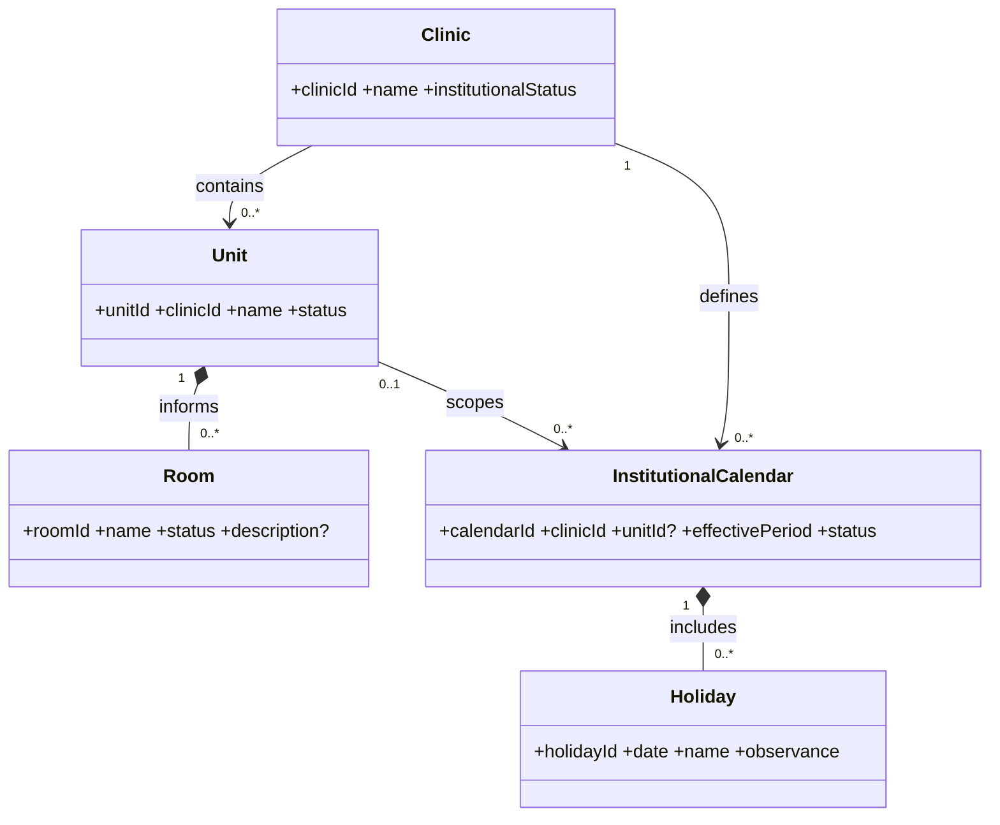
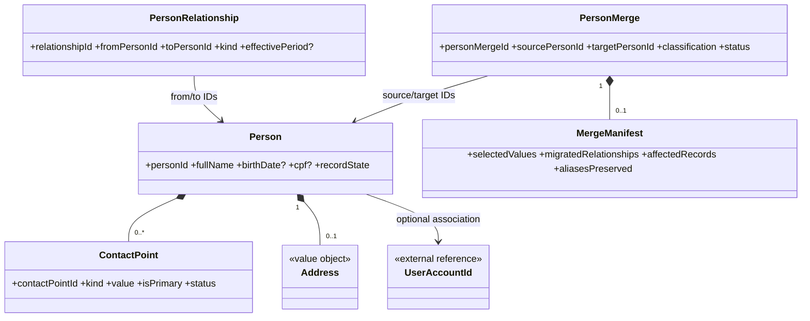
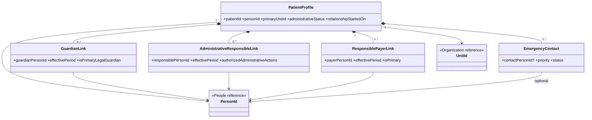
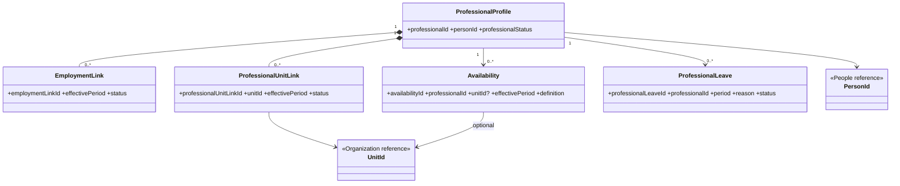
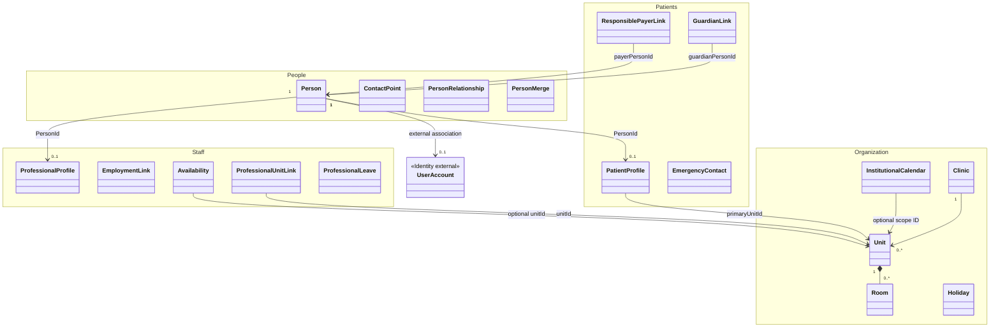

# MODEL-001 — People / Patients / Staff / Organization

## 1. Status

- **Tarefa:** MODEL-001
- **Status:** DONE
- **Data:** 2026-09-15
- **Natureza:** modelo conceitual de domínio
- **Boundaries normativos:** `docs/architecture/CONTEXT_MAP.md` e `docs/architecture/OWNERSHIP_MAP.md`
- **Próxima tarefa:** MODEL-002 — Scheduling / Pilates

O modelo atende aos critérios de validação desta etapa e não possui blocker conhecido para MODEL-002. Aggregate roots, entidades e value objects aqui são candidatos conceituais; não definem tabelas, chaves físicas, transações, APIs ou classes.

## 2. Objetivo

Definir os conceitos, responsabilidades, relações, cardinalidades, invariantes, ciclos de vida, operações, eventos e referências dos contextos Organization, People, Patients e Staff, preservando owner único e histórico. Este documento prepara MODEL-002, MODEL-003 e MODEL-004 sem antecipar o modelo lógico.

## 3. Escopo

- Organization: Clinic, Unit, Room, InstitutionalCalendar e Holiday.
- People: Person, ContactPoint, Address, PersonRelationship, PersonMerge e MergeManifest.
- Patients: PatientProfile, GuardianLink, AdministrativeResponsibleLink, ResponsiblePayerLink e EmergencyContact.
- Staff: ProfessionalProfile, EmploymentLink, ProfessionalUnitLink, Availability e ProfessionalLeave.
- Relação conceitual de Person com UserAccount, sem modelar internals de Identity & Access.
- Deduplicação, merge, vigência, ciclos de vida mínimos, operações e eventos candidatos.

## 4. Fora de escopo

- banco, tabelas, SQL, migrations, PK/FK, formato de IDs, índices, cascade delete e ORM;
- C#, DTOs, endpoints, repositories, frontend, React, Docker e CI/CD;
- máquinas de estado completas e estratégia física de eventos;
- credenciais, sessões, roles e permissions de Identity & Access;
- agenda, turmas, capacidade, prontuário, contratos, recebíveis, pagamentos e snapshots financeiros;
- Entitlement, ContractAmendment, ClosingSnapshot, CommunicationPreference, ConsentRecord, legal hold e modelos internos de Reports;
- política detalhada de MakeupCredits durante pausa.

## 5. Princípios herdados

1. Person é a identidade única de uma pessoa real e pode acumular papéis.
2. CPF é opcional; quando informado, é válido e único. Ausência legítima não invalida a Person nem autoriza CPF fictício.
3. PatientProfile e ProfessionalProfile referenciam Person e não copiam nome, documentos, contatos ou endereço.
4. UserAccount é separado de Person e ProfessionalProfile e pertence a Identity & Access.
5. Pessoa, paciente e profissional não são recriados por unidade.
6. Mudanças relevantes encerram vínculos ou criam nova vigência; não reescrevem o passado.
7. Room é informativa: não define capacidade e não bloqueia disponibilidade.
8. Patients possui os vínculos vigentes de responsabilidade e pagador; Contract e Receivable preservam snapshots próprios em outros contextos.
9. Merge é revisado, auditável e preserva aliases, referências e histórico; não equivale a DELETE.
10. Nenhum aggregate atravessa contextos e nenhuma referência por ID concede escrita no owner externo.

## 6. Organization

### 6.1 Clinic

**Classificação:** entidade e aggregate root candidato.

Representa a organização clínica institucional. Mesmo existindo uma clínica hoje, a quantidade não é codificada como constante.

**Atributos conceituais:**

- `clinicId`;
- `name`;
- `institutionalStatus` — ativa ou inativa para novas operações, sem apagar histórico.

**Lifecycle mínimo:** ACTIVE ↔ INACTIVE. Inativação impede novos vínculos operacionais conforme regras futuras, mas não invalida Unit ou fatos históricos.

### 6.2 Unit

**Classificação:** entidade e aggregate root candidato separado de Clinic.

**Atributos conceituais:**

- `unitId`;
- `clinicId` — referência local à Clinic proprietária;
- `name`;
- `status` — ACTIVE ou INACTIVE.

Unit é root separado porque possui identidade pública, lifecycle e alta reutilização por outros contextos. A separação reduz contenção no aggregate Clinic e evita carregar todas as unidades/salas para alterações locais.

### 6.3 Room

**Classificação:** child entity do aggregate Unit.

**Atributos conceituais:**

- `roomId`;
- `name`;
- `status` — ACTIVE ou INACTIVE;
- `description?`.

Room existe para orientação operacional. Não possui capacidade de turma, exclusividade temporal ou regra de reserva.

### 6.4 InstitutionalCalendar e Holiday

**InstitutionalCalendar:** entidade e aggregate root candidato.

**Atributos conceituais:**

- `calendarId`;
- `clinicId`;
- `unitId?` — ausente para calendário global da clínica;
- `name`;
- `effectivePeriod`;
- `status` — ACTIVE ou INACTIVE.

**Holiday:** child entity do InstitutionalCalendar.

**Atributos conceituais:**

- `holidayId`;
- `date`;
- `name`;
- `observance` — informação institucional aplicável à clínica ou à unidade do calendário.

O calendário informa dias institucionais. A decisão operacional de gerar, cancelar ou excepcionalmente manter ocorrências pertence a Scheduling por CalendarException. A fonte externa de feriados e a precedência detalhada permanecem abertas.

### 6.5 Operações e invariantes locais

Operações: `CreateClinic`, `UpdateClinic`, `CreateUnit`, `UpdateUnit`, `DeactivateUnit`, `RegisterRoom`, `UpdateRoom`, `DeactivateRoom`, `CreateInstitutionalCalendar`, `RegisterHoliday`, `CancelFutureHolidayObservance` e `ChangeCalendarEffectivePeriod`.

Invariantes principais: toda Unit pertence a exatamente uma Clinic; toda Room pertence a exatamente uma Unit; Calendar de unidade referencia Unit da mesma Clinic; períodos de calendários equivalentes não podem produzir duas fontes institucionais ativas ambíguas para o mesmo escopo; Room nunca participa de capacidade ou conflito.

## 7. People

### 7.1 Person

**Classificação:** entidade e aggregate root candidato.

**Atributos conceituais:**

- `personId`;
- `fullName`;
- `birthDate?`;
- `cpf?`;
- `alternativeDocument?` — tipo, número e país emissor quando aplicável;
- `primaryUnitId?` — referência informativa a Organization, sem criar identidade por unidade;
- `recordState` — CURRENT, INACTIVE ou MERGED_ALIAS;
- `mergedIntoPersonId?` — somente quando a origem passou a alias após merge concluído.

`recordState` não representa exclusão. CURRENT identifica a identidade canônica corrente; INACTIVE preserva a pessoa sem novos usos operacionais ordinários; MERGED_ALIAS preserva a origem e aponta para a identidade canônica.

### 7.2 ContactPoint

**Classificação:** child entity de Person.

**Atributos conceituais:**

- `contactPointId`;
- `kind` — PHONE ou EMAIL neste modelo;
- `value` — PhoneNumber ou Email;
- `purpose?` — uso administrativo conhecido, sem antecipar CommunicationPreference;
- `isPrimary`;
- `status` — ACTIVE ou INACTIVE.

É entidade, e não apenas VO, porque precisa de identidade para atualização, indicação de principal e eventual referência autorizada por Communication. O valor validado é VO.

### 7.3 Address

**Classificação:** value object pertencente a Person; não é aggregate root.

**Atributos conceituais:** linhas de endereço, localidade, região, código postal e país, apenas quando informados.

O baseline não exige histórico de endereço agora. Se contratos, documentos ou requisitos de auditoria exigirem histórico, o snapshot pertence ao contexto que prova o fato ou Address poderá ser promovido a child entity em revisão futura.

### 7.4 PersonRelationship

**Classificação:** entidade e aggregate root candidato.

**Atributos conceituais:**

- `relationshipId`;
- `fromPersonId`;
- `toPersonId`;
- `relationshipKind` — parentesco ou relação geral não específica de um papel de Patients;
- `effectivePeriod?`;
- `status` — ACTIVE ou ENDED quando a relação possuir vigência.

É root separado porque conecta duas Persons e pode mudar sem tornar uma delas dona da outra. Não concede responsabilidade legal, administrativa, financeira ou clínica por si só; essas autoridades pertencem aos links de Patients.

### 7.5 PersonMerge e MergeManifest

**PersonMerge:** entidade e aggregate root candidato do processo de merge.

**Atributos conceituais:**

- `personMergeId`;
- `sourcePersonId`;
- `targetPersonId`;
- `classification` — SIMPLE ou SENSITIVE;
- `status` — PROPOSED, UNDER_REVIEW, APPROVED, COMPLETED, REJECTED ou REVERSED; detalhamento formal fica para máquina de estados;
- `requestedByUserAccountId`;
- `approvedByUserAccountId?`;
- `reason`;
- `requestedAt`;
- `executedAt?`;
- `reversalWindowEndsAt?`;
- `reversalBlockedReason?`.

**MergeManifest:** child entity imutável criado na conclusão.

**Atributos conceituais:**

- `mergeManifestId`;
- `selectedValues` — valor escolhido e proveniência;
- `migratedRelationships` — relações afetadas e owner responsável pela reação;
- `affectedRecords` — referências opacas, sem absorver dados de outros contextos;
- `aliasesPreserved`;
- `executedByUserAccountId`;
- `executedAt`;
- `reason`.

PersonMerge governa decisão e lifecycle; MergeManifest prova o resultado executado. O merge não incorpora aggregates de Patients, Staff ou outros contextos: publica o alias origem→destino para cada owner atualizar suas próprias referências.

### 7.6 UserAccount

**Classificação:** referência externa, não conceito interno de People.

Uma Person pode estar associada a zero ou uma conta interna ativa na política atual. People conhece, quando necessário, apenas `UserAccountId`/associação pública; credencial, sessão, role, permission e ciclo da conta pertencem a Identity & Access.

## 8. Patients

`Patient` é o nome do papel exercido por uma Person; não é uma segunda entidade paralela. Neste modelo, a identidade local e o lifecycle desse papel são representados por PatientProfile.

### 8.1 PatientProfile

**Classificação:** entidade e aggregate root candidato.

**Atributos conceituais:**

- `patientId`;
- `personId` — referência obrigatória a People;
- `primaryUnitId` — referência vigente a Organization, sem limitar atendimento a uma unidade;
- `administrativeStatus` — ACTIVE ou INACTIVE;
- `relationshipStartedOn`;
- `deactivatedOn?`;
- `deactivationReason?`.

Não contém nome, CPF, nascimento, telefone, email, endereço ou conteúdo clínico. Uma Person possui no máximo um PatientProfile conceitual na clínica, reativável, independentemente da quantidade de unidades.

Para ativação, o fluxo valida por contrato público de People: nome completo, nascimento e ao menos um telefone válido; exige unidade principal, início do relacionamento, responsável legal quando menor e pagador explícito quando diferente. Email, endereço completo, CPF e informação clínica não são requisitos gerais de ativação.

### 8.2 GuardianLink

**Classificação:** child entity do aggregate PatientProfile.

**Atributos conceituais:**

- `guardianLinkId`;
- `guardianPersonId`;
- `relationshipToPatient?`;
- `effectivePeriod`;
- `isPrimaryLegalGuardian`;
- `status` — ACTIVE ou ENDED.

GuardianLink representa responsabilidade legal. Não se presume consentimento clínico específico nem requisito jurídico ainda não validado. Um menor ativo deve ter ao menos um GuardianLink vigente; vários são permitidos e, quando a operação exigir prioridade, no máximo um é principal para a finalidade legal.

### 8.3 AdministrativeResponsibleLink

**Classificação:** child entity do aggregate PatientProfile, com ownership em Patients.

**Atributos conceituais:**

- `administrativeResponsibleLinkId`;
- `responsiblePersonId`;
- `effectivePeriod`;
- `authorizedAdministrativeActions` — agenda, comunicação, documentos ou contrato conforme alçada validada;
- `isPrimaryForCommunication`;
- `status` — ACTIVE ou ENDED.

Esse link não torna a pessoa responsável legal nem pagadora. A mesma Person pode acumular os papéis por links distintos. O catálogo final de autorizações é posterior; o modelo apenas preserva a separação aprovada.

### 8.4 ResponsiblePayerLink

**Classificação:** child entity do aggregate PatientProfile.

**Atributos conceituais:**

- `responsiblePayerLinkId`;
- `payerPersonId` — pode ser a própria Person do paciente ou outra Person;
- `relationshipToPatient?`;
- `effectivePeriod`;
- `isPrimary`;
- `status` — ACTIVE ou ENDED.

O vínculo expressa a fonte vigente de Patients. Deve existir no máximo um pagador principal vigente por paciente. Mudança encerra a vigência anterior e cria nova; Contract e Receivable não são reescritos.

### 8.5 EmergencyContact

**Classificação:** child entity do aggregate PatientProfile.

**Atributos conceituais confirmados:**

- `emergencyContactId`;
- `contactPersonId?`;
- `priority`;
- `relationshipToPatient?`;
- `status` — ACTIVE ou INACTIVE.

O ARC-002 admite `PersonId` opcional, enquanto o Caderno descreve contato de emergência como pessoa vinculada. Não há decisão suficiente sobre contato externo simplificado. Portanto, o modelo não define seus campos livres nem obriga referência a Person; a forma alternativa permanece `NON_BLOCKING`.

### 8.6 Lifecycle e consistência

PatientProfile usa ACTIVE/INACTIVE e pode ser reativado. Links usam vigência e encerramento, não exclusão. Alterar unidade, responsável ou pagador não recria PatientProfile nem Person. Responsabilidades distintas são validadas separadamente, mesmo quando exercidas pela mesma Person.

## 9. Staff

`Professional` é o nome do papel ocupacional exercido por uma Person; não é uma entidade adicional. ProfessionalProfile representa esse papel dentro de Staff.

### 9.1 ProfessionalProfile

**Classificação:** entidade e aggregate root candidato.

**Atributos conceituais:**

- `professionalId`;
- `personId` — referência obrigatória a People;
- `professionalStatus` — ACTIVE ou INACTIVE;
- `startedOn?`;
- `inactivatedOn?`;
- `inactivationReason?`.

Não duplica identidade civil e não contém credenciais de acesso. Uma Person possui no máximo um ProfessionalProfile conceitual. Inativação ou desligamento não apaga autoria clínica histórica.

### 9.2 EmploymentLink

**Classificação:** child entity de ProfessionalProfile.

**Atributos conceituais:**

- `employmentLinkId`;
- `employmentKind?` — somente quando o catálogo operacional for validado;
- `effectivePeriod`;
- `status` — ACTIVE ou ENDED;
- `endReason?`.

Representa o vínculo de trabalho/atuação com a clínica, não uma conta de acesso. Pode haver vários vínculos ao longo do tempo; sobreposições incompatíveis para a mesma relação são proibidas.

### 9.3 ProfessionalUnitLink

**Classificação:** child entity de ProfessionalProfile.

**Atributos conceituais:**

- `professionalUnitLinkId`;
- `unitId` — referência a Organization;
- `effectivePeriod`;
- `isPrimary?`;
- `status` — ACTIVE ou ENDED.

Materializa a relação N↔N entre ProfessionalProfile e Unit ao longo do tempo. Unit não é copiada em Staff. Mudança de unidade encerra/cria vigência e não recria profissional.

### 9.4 Availability

**Classificação:** entidade e aggregate root candidato separado.

**Atributos conceituais confirmados:**

- `availabilityId`;
- `professionalId`;
- `unitId?`;
- `effectivePeriod`;
- `availabilityDefinition` — forma conceitual ainda a refinar;
- `status` — ACTIVE ou ENDED.

Availability fica fora do aggregate ProfessionalProfile porque tende a crescer, sofrer alterações concorrentes e ser consultada isoladamente por Scheduling/Pilates. A baseline não decide se será recorrência, intervalos ou ambos; o owner e a necessidade de vigência estão fechados, a representação interna permanece `NON_BLOCKING` para MODEL-002.

### 9.5 ProfessionalLeave

**Classificação:** entidade e aggregate root candidato separado.

**Atributos conceituais:**

- `professionalLeaveId`;
- `professionalId`;
- `period`;
- `reason`;
- `status` — PLANNED, ACTIVE, ENDED ou CANCELLED como estados conceituais candidatos;
- `registeredByUserAccountId`;
- `cancelledReason?`.

Leave possui lifecycle, auditoria e impacto operacional próprios e pode afetar múltiplas unidades. Por isso não exige carregar ou bloquear o aggregate ProfessionalProfile. Scheduling/Pilates decidem os efeitos em ocorrências próprias; Staff apenas publica o afastamento.

### 9.6 Credenciais profissionais

O Caderno antigo cita `Credential`, mas ARC-002 e o escopo oficial de MODEL-001 não o adotam como conceito. Credencial de acesso pertence a Identity & Access; registro/licença profissional e seus campos obrigatórios continuam sem definição operacional. Nenhum conceito `Credential` é adotado nesta etapa.

## 10. Value Objects

| Value Object | Uso | Regra e decisão |
|---|---|---|
| CPF | Person | Opcional; normaliza/valida semântica e participa da unicidade quando presente. Justifica VO próprio. |
| Email | ContactPoint | Normalização e validação próprias; reutilizável em comunicação. |
| PhoneNumber | ContactPoint | Código de país/área e número válido formam um valor sem identidade própria. |
| Address | Person | Valor composto; não possui lifecycle independente nesta etapa. |
| DateRange | vínculos, calendário, disponibilidade e afastamento | Garante início/fim coerentes e permite intervalo aberto quando o vínculo estiver vigente. |
| AlternativeDocument | Person | Valor composto opcional por tipo, número e país; evita CPF fictício sem criar entidade artificial. |

`FullName`, `Reason`, `UnitName` e enums de status permanecem atributos sem VO dedicado: não há regra suficiente para aumentar o modelo. IDs são referências conceituais, sem escolha de formato.

## 11. Aggregate Candidates

| Contexto | Aggregate root candidato | Conteúdo local | Justificativa |
|---|---|---|---|
| Organization | Clinic | estado institucional da clínica | identidade e lifecycle próprios; não carrega todas as unidades |
| Organization | Unit | Room | Unit é referência pública e muda independentemente; Room é pequeno e só existe na Unit |
| Organization | InstitutionalCalendar | Holiday | consistência de escopo/vigência e publicação conjunta do calendário |
| People | Person | ContactPoint e Address | identidade, CPF e contatos exigem consistência local |
| People | PersonRelationship | relação entre duas Person por IDs | evita aggregate envolvendo duas raízes Person e reduz contenção |
| People | PersonMerge | MergeManifest | governa revisão/execução e prova imutável do merge |
| Patients | PatientProfile | GuardianLink, AdministrativeResponsibleLink, ResponsiblePayerLink e EmergencyContact | invariantes de menor, principalidade e vigência pertencem ao papel de paciente |
| Staff | ProfessionalProfile | EmploymentLink e ProfessionalUnitLink | unicidade do papel e coerência dos vínculos profissionais |
| Staff | Availability | definição de disponibilidade do profissional | volume/consulta/concorrência independentes do perfil |
| Staff | ProfessionalLeave | afastamento do profissional | lifecycle e efeitos públicos próprios, possivelmente multiunidade |

Nenhum aggregate contém entidades de outro contexto. Referências entre roots são IDs conceituais validados por contrato público quando a operação exigir.

## 12. Relações e Cardinalidades

1. Clinic `1 → 0..N` Unit; toda Unit pertence a exatamente uma Clinic.
2. Unit `1 → 0..N` Room; toda Room pertence a exatamente uma Unit.
3. Clinic `1 → 0..N` InstitutionalCalendar; um calendário pode ser global ou de exatamente uma Unit da Clinic.
4. InstitutionalCalendar `1 → 0..N` Holiday.
5. Person `1 → 0..N` ContactPoint e `1 → 0..1` Address corrente neste modelo.
6. Person `N ↔ N` Person por PersonRelationship; a relação tem identidade própria.
7. Person `1 → 0..1` PatientProfile conceitual.
8. Person `1 → 0..1` ProfessionalProfile conceitual.
9. Person `1 → 0..1` UserAccount ativo na política atual; Identity & Access é o owner.
10. PatientProfile `1 → 0..N` GuardianLink; se o paciente ativo for menor, deve haver `1..N` vigentes.
11. PatientProfile `1 → 0..N` AdministrativeResponsibleLink.
12. PatientProfile `1 → 0..N` ResponsiblePayerLink ao longo do tempo e `0..1` principal vigente.
13. PatientProfile `1 → 0..N` EmergencyContact.
14. Cada Guardian/administrative/payer link referencia exatamente uma Person; EmergencyContact pode referenciar zero ou uma Person enquanto a open question existir.
15. ProfessionalProfile `1 → 0..N` EmploymentLink.
16. ProfessionalProfile `N ↔ N` Unit por ProfessionalUnitLink ao longo do tempo.
17. ProfessionalProfile `1 → 0..N` Availability.
18. ProfessionalProfile `1 → 0..N` ProfessionalLeave.
19. PersonMerge referencia exatamente uma source Person e uma target Person distintas; ao concluir, possui exatamente um MergeManifest.

## 13. Temporalidade

| Conceito | Temporalidade | Motivo |
|---|---|---|
| InstitutionalCalendar | effectivePeriod | calendários futuros podem mudar sem reescrever o calendário aplicado no passado |
| PersonRelationship | opcional | apenas relações cuja validade muda precisam de vigência |
| GuardianLink | effectivePeriod | responsabilidade pode começar/terminar e o histórico deve permanecer |
| AdministrativeResponsibleLink | effectivePeriod | autorizações administrativas mudam sem apagar concessões anteriores |
| ResponsiblePayerLink | effectivePeriod obrigatório | mudança de pagador preserva a fonte vigente e snapshots downstream |
| EmploymentLink | effectivePeriod obrigatório | admissão/desligamento não apagam autoria ou atuação anterior |
| ProfessionalUnitLink | effectivePeriod obrigatório | atuação por unidade muda ao longo do tempo |
| Availability | effectivePeriod obrigatório | mudanças futuras não devem alterar a disponibilidade anterior |
| ProfessionalLeave | DateRange obrigatório | afastamento é um intervalo concreto e auditável |

PatientProfile e ProfessionalProfile usam lifecycle de ativação/inativação, não uma sequência artificial de intervalos. ContactPoint e Room usam ativação/inativação; effective dating completo só será introduzido se consumidores demonstrarem necessidade histórica. Holiday representa uma data institucional no calendário vigente.

## 14. Invariantes

### Organization

- `INV-ORG-001`: toda Unit pertence a exatamente uma Clinic.
- `INV-ORG-002`: toda Room pertence a exatamente uma Unit.
- `INV-ORG-003`: Room é informativa e não define capacidade, conflito ou reserva.
- `INV-ORG-004`: calendário de Unit só pode referenciar Unit da mesma Clinic.
- `INV-ORG-005`: CalendarException operacional não pertence a Organization.

### People

- `INV-PPL-001`: CPF é opcional; quando informado, deve ser válido e único entre identidades canônicas.
- `INV-PPL-002`: ausência de CPF não invalida Person e nunca é preenchida com valor fictício.
- `INV-PPL-003`: uma pessoa real mantém uma Person, ainda que tenha múltiplos papéis ou unidades.
- `INV-PPL-004`: no máximo um ContactPoint ativo é principal por tipo/finalidade definida.
- `INV-PPL-005`: PersonRelationship não concede automaticamente autoridade legal, administrativa, financeira ou clínica.
- `INV-PPL-006`: source e target de PersonMerge são Persons distintas e não podem ter conflito de CPF ignorado.
- `INV-PPL-007`: merge concluído preserva alias, manifest, autoria, motivo e referências afetadas; não executa hard delete.
- `INV-PPL-008`: People não altera internals de Patients, Staff ou Identity durante merge; cada owner reage por contrato/evento.

### Patients

- `INV-PAC-001`: PatientProfile referencia Person e não duplica identidade civil, contatos ou endereço.
- `INV-PAC-002`: uma Person possui no máximo um PatientProfile conceitual na clínica.
- `INV-PAC-003`: unidade adicional ou mudança de unidade não cria outro PatientProfile.
- `INV-PAC-004`: paciente menor ativo possui ao menos um GuardianLink vigente para outra Person responsável.
- `INV-PAC-005`: pode haver vários responsáveis, mas no máximo um principal vigente por finalidade.
- `INV-PAC-006`: responsabilidade legal, administrativa, financeira e contato de emergência permanecem papéis distintos, mesmo na mesma Person.
- `INV-PAC-007`: no máximo um ResponsiblePayerLink principal está vigente; o pagador pode ser a própria Person do paciente.
- `INV-PAC-008`: mudança de pagador encerra/cria vínculo e não reescreve Contract ou Receivable.
- `INV-PAC-009`: inativar PatientProfile não apaga Person nem históricos clínico, contratual, financeiro ou operacional.

### Staff

- `INV-STF-001`: ProfessionalProfile referencia Person e não duplica identidade civil.
- `INV-STF-002`: uma Person possui no máximo um ProfessionalProfile conceitual.
- `INV-STF-003`: ProfessionalProfile e UserAccount são conceitos distintos; vínculo profissional não concede permissão automaticamente.
- `INV-STF-004`: Unit é apenas referenciada por ProfessionalUnitLink e nunca duplicada em Staff.
- `INV-STF-005`: vínculos equivalentes vigentes do mesmo profissional/unidade não podem se sobrepor de modo contraditório.
- `INV-STF-006`: desligamento/inativação não apaga autoria histórica.
- `INV-STF-007`: Staff publica disponibilidade/afastamento, mas não altera Appointment, Class ou ClinicalEntry.
- `INV-STF-008`: período de ProfessionalLeave deve ser coerente e seu cancelamento preserva o registro original.

### 14.1 Validação contra RULES_INDEX

| Regras | Representação no modelo | Resultado |
|---|---|---|
| RB-PPL-001 | Person central; PatientProfile, ProfessionalProfile e UserAccount separados | suportada |
| RB-PPL-002 | CPF opcional, validado e único quando informado | suportada |
| RB-PPL-003 | ProfessionalProfile separado de UserAccount | suportada |
| RB-PPL-004 | PersonMerge, revisão humana, MergeManifest, auditoria e undo condicionado | suportada |
| RB-PAC-001 | PatientProfile contém somente dados do papel e referências | suportada |
| RB-PAC-002 | menor, paciente e responsável usam Persons distintas e links explícitos | suportada |
| RB-PAC-003 | ResponsiblePayerLink admite a própria Person ou outra Person; snapshots ficam downstream | suportada |
| RB-PAC-004 | inativação e encerramento substituem hard delete | suportada |
| RB-SEC-001/002 | UserAccountId é referência; autoridade técnica ou vínculo não concedem permissão | suportadas no boundary; matriz detalhada é posterior |
| RB-AUD-001 | merge, CPF, vínculo, leave e mudanças sensíveis identificam ator/motivo quando aplicável | suportada conceitualmente |

O RULES_INDEX atual não contém IDs `RB-STF-*` ou `RB-ORG-*`. As invariantes `INV-STF-*` e `INV-ORG-*` registram as proteções sustentadas pela documentação sem criar silenciosamente novas regras canônicas. Nenhuma regra crítica PPL/PAC ou transversal relevante ficou sem representação.

## 15. Operações Conceituais

| Operação | Contexto | Resultado conceitual / guardrail |
|---|---|---|
| CreateClinic / UpdateClinic | Organization | cria ou altera identidade institucional sem tocar outros contextos |
| CreateUnit / UpdateUnit / DeactivateUnit | Organization | mantém Unit sob Clinic e preserva referências históricas |
| RegisterRoom / UpdateRoom / DeactivateRoom | Organization | mantém informação local sem regra de reserva |
| ManageInstitutionalCalendar / RegisterHoliday | Organization | altera apenas calendário institucional; não cria CalendarException |
| CreatePerson | People | verifica duplicidade, permite CPF ausente e cria identidade única |
| UpdatePersonIdentity | People | audita CPF sensível e bloqueia conflito para revisão/merge |
| AddContactPoint / UpdateContactPoint / DeactivateContactPoint | People | valida Email/Phone e principalidade |
| LinkPersonRelationship / EndPersonRelationship | People | mantém relação geral sem conceder papéis de Patients |
| ProposePersonMerge / ReviewPersonMerge / MergePerson / ReversePersonMerge | People | aplica alçada, manifest e segurança de reversão |
| CreatePatientProfile | Patients | recebe PersonId validado; não escreve People |
| ActivatePatient / DeactivatePatient / ReactivatePatient | Patients | protege requisitos mínimos e preserva histórico |
| LinkGuardian / EndGuardianLink | Patients | mantém responsabilidade legal com vigência |
| LinkAdministrativeResponsible / ChangeAdministrativeAuthorizations | Patients | separa autorização administrativa de responsabilidade legal |
| ChangeResponsiblePayer | Patients | encerra vínculo vigente e cria o novo sem tocar snapshots downstream |
| RegisterEmergencyContact / DeactivateEmergencyContact | Patients | mantém contato conforme modelo permitido |
| CreateProfessionalProfile | Staff | recebe PersonId validado; não cria UserAccount |
| StartEmployment / EndEmployment | Staff | mantém vigência e preserva autoria histórica |
| AssignProfessionalToUnit / EndProfessionalUnitAssignment | Staff | referencia Unit validada e preserva histórico |
| DefineAvailability / EndAvailability | Staff | mantém disponibilidade pública de Staff |
| RegisterLeave / CancelLeave / EndLeave | Staff | registra afastamento sem alterar agenda/turmas |

### 15.1 Processos mínimos

**PROC-PPL-001 — Criar pessoa:** People recebe dados mínimos, busca sinais de duplicidade, bloqueia CPF repetido e cria Person mesmo sem CPF quando não houver impedimento.

**PROC-PAC-001 — Cadastrar paciente:** o fluxo de aplicação de Patients solicita busca/criação a People por contrato público; recebe `PersonId`; valida requisitos de ativação; cria PatientProfile e links próprios. Patients nunca escreve Person.

Criar profissional segue a mesma fronteira: Staff busca/cria Person por contrato público de People e cria ProfessionalProfile com `PersonId`. Criar unidade pertence a Organization. Registrar vínculo, unidade de atuação e afastamento pertence a Staff.

### 15.2 Validação contra PROCESS_INDEX e processos requeridos

| Processo/capacidade | Conceitos e operações que o suportam | Resultado |
|---|---|---|
| PROC-PPL-001 — criar pessoa | Person, CPF/contatos, `CreatePerson` e deduplicação | suportado |
| PROC-PAC-001 — cadastrar paciente | fluxo People→PersonId→Patients, PatientProfile e links | suportado sem escrita cross-context |
| vincular responsável legal/administrativo | GuardianLink e AdministrativeResponsibleLink | suportado; catálogo de autorizações é non-blocking |
| mudar pagador | ResponsiblePayerLink com vigência e `ChangeResponsiblePayer` | suportado |
| criar profissional | PersonId + ProfessionalProfile | suportado |
| iniciar/encerrar vínculo profissional | EmploymentLink e operações de emprego | suportado |
| atribuir unidade de atuação | ProfessionalUnitLink por UnitId | suportado |
| criar/alterar unidade e sala | Unit root e Room child | suportado |
| registrar afastamento | ProfessionalLeave e eventos públicos de Staff | suportado |

O PROCESS_INDEX cataloga formalmente apenas PROC-PPL-001 e PROC-PAC-001 dentro destes quatro contexts. As demais capacidades foram validadas porque são exigidas por MODEL-001, sem inventar telas ou novos IDs de processo.

## 16. Eventos Candidatos

| Evento | Owner | Motivo | Consumidores potenciais |
|---|---|---|---|
| PersonCreated | People | disponibilizar identidade estável | Patients, Staff, CRM, Identity quando necessário |
| PersonIdentityUpdated | People | propagar mudança pública mínima de identificação | consumidores autorizados; Privacy & Audit |
| ContactPointChanged | People | atualizar projeções que dependem de contato atual | Communication, CRM, Patients quando necessário |
| PersonMergeCompleted | People | informar alias source→target e manifest de referências | Patients, Staff, CRM e demais detentores de PersonId |
| PersonMergeReversed | People | informar reversão autorizada quando segura | mesmos consumidores do merge |
| PatientProfileCreated | Patients | informar existência do papel | CRM, Scheduling, Pilates, Plans |
| PatientActivated | Patients | tornar papel elegível a fluxos que exigem ativo | Scheduling, Pilates, Plans |
| PatientDeactivated | Patients | impedir novos usos sem apagar histórico | Scheduling, Pilates, Plans, CRM |
| GuardianLinked | Patients | disponibilizar responsabilidade legal vigente | Clinical autorizado, Plans quando necessário |
| AdministrativeResponsibleLinked | Patients | disponibilizar autoridade administrativa mínima | Scheduling/Communication por contrato autorizado |
| ResponsiblePayerChanged | Patients | publicar novo vínculo vigente | Plans e Billing para fatos futuros, nunca para reescrever snapshots |
| ProfessionalProfileCreated | Staff | informar existência do papel profissional | Identity, Scheduling, Pilates, Clinical |
| EmploymentStarted | Staff | informar vínculo vigente | Identity, Scheduling, Pilates |
| EmploymentEnded | Staff | remover elegibilidade futura preservando autoria | Identity, Scheduling, Pilates, Clinical |
| ProfessionalAssignedToUnit | Staff | atualizar atuação por unidade | Identity, Scheduling, Pilates |
| ProfessionalAvailabilityChanged | Staff | atualizar disponibilidade publicada | Scheduling, Pilates |
| ProfessionalLeaveRegistered | Staff | permitir reação operacional do owner da agenda/turma | Scheduling, Pilates, Identity quando aplicável |
| UnitCreated | Organization | disponibilizar nova referência institucional | People, Patients, Staff, Scheduling, Pilates, Finance |
| UnitUpdated | Organization | atualizar projeções institucionais | mesmos consumidores autorizados |
| InstitutionalCalendarChanged | Organization | informar calendário institucional vigente | Scheduling, Pilates, Billing |

Eventos são candidatos sem decisão de envelope, outbox ou transporte. Não há evento para cada setter.

## 17. Person Merge

### 17.1 Detecção e decisão

- sinal forte: CPF idêntico, sujeito à restrição de unicidade;
- sinais médios: telefone, email, ou nome completo + nascimento iguais;
- sinais fracos: nome/endereço semelhantes;
- sinais não executam merge automático; geram revisão humana.

Conflito entre CPFs não pode ser ignorado. CPF diferente ou dados civis conflitantes classificam o caso como sensível, sem decidir automaticamente qual valor é correto.

### 17.2 Casos simples e sensíveis

Merge simples pode ser concluído pela Secretária quando não há conflito de CPF, um cadastro é claramente incompleto e não existem conflitos clínicos, contratuais, financeiros ou operacionais. Merge sensível exige aprovação da Proprietária quando ambas as Persons possuem histórico clínico, contratos, recebíveis, pagamentos, matrículas, turmas, UserAccount, CPF diferente ou dados civis conflitantes.

`requestedByUserAccountId` é sempre registrado. `approvedByUserAccountId` é obrigatório quando a classificação/alçada exigir aprovador distinto. Acesso técnico não concede autoridade de merge.

### 17.3 Execução e preservação

Na conclusão:

1. targetPerson torna-se a identidade canônica;
2. sourcePerson permanece como `MERGED_ALIAS`, sem hard delete;
3. valores escolhidos e sua proveniência são gravados no MergeManifest;
4. relações/referências afetadas são inventariadas como referências opacas;
5. People publica `PersonMergeCompleted`;
6. cada contexto atualiza suas próprias referências, idempotentemente, sem People escrever seus dados;
7. fatos históricos e snapshots permanecem inalterados quando sua finalidade exige o contexto original.

### 17.4 Undo

A política inicial documentada é janela de reversão direta de sete dias, configurável e ainda sujeita à validação do processo. Mesmo dentro da janela, reversão automática é bloqueada se novos fatos tornarem a separação clinicamente, contratualmente, financeiramente ou operacionalmente inconsistente. Depois da janela, não há undo automático: a correção exige procedimento específico, justificativa e auditoria. O MergeManifest é preservado inclusive após reversão.

## 18. Cross-Context References

| Contexto/conceito | Referência externa | Owner externo | Regra |
|---|---|---|---|
| Person | `primaryUnitId?` | Organization | referência informativa; não duplica Unit |
| PatientProfile | `personId`, `primaryUnitId` | People, Organization | valida na criação/ativação; não navega storage interno |
| GuardianLink | `guardianPersonId` | People | Person distinta quando representa outro responsável |
| AdministrativeResponsibleLink | `responsiblePersonId` | People | autoridade existe apenas no link de Patients |
| ResponsiblePayerLink | `payerPersonId` | People | pode coincidir com a Person do paciente |
| EmergencyContact | `contactPersonId?` | People | opcional até decisão sobre contato externo |
| ProfessionalProfile | `personId` | People | valida na criação/ativação |
| ProfessionalUnitLink / Availability | `unitId` | Organization | Staff não copia Unit |
| PersonMerge / Leave e operações sensíveis | `UserAccountId` | Identity & Access | ator/aprovador por referência; sem credenciais locais |
| Person | associação `UserAccountId?` | Identity & Access | no máximo uma conta interna ativa na política atual; Identity é owner |

Contratos síncronos servem para validar existência/estado público necessário. Eventos propagam fatos concluídos. Nenhuma associação autoriza escrita cross-context.

## 19. Diagramas

### 19.1 Organization

### 19.2 People

### 19.3 Patients

### 19.4 Staff

### 19.5 Modelo integrado

Setas entre namespaces representam referências por ID/contratos públicos, nunca composição ou escrita cruzada.

## 20. Matriz de Conceitos

| Conceito | Contexto | Tipo | Aggregate Root | Lifecycle | Histórico/Vigência | Referências externas |
|---|---|---|---:|---|---|---|
| Clinic | Organization | entidade | sim | ACTIVE/INACTIVE | inativação preservada | UserAccountId para auditoria quando necessário |
| Unit | Organization | entidade | sim | ACTIVE/INACTIVE | inativação preservada | nenhuma fora de Organization |
| Room | Organization | child entity | não, pertence a Unit | ACTIVE/INACTIVE | preserva uso histórico por ID | nenhuma |
| InstitutionalCalendar | Organization | entidade | sim | ACTIVE/INACTIVE | DateRange | UnitId opcional local |
| Holiday | Organization | child entity | não | registrado/retirado para futuro | data + calendário vigente | nenhuma |
| Person | People | entidade | sim | CURRENT/INACTIVE/MERGED_ALIAS | alias e merge preservados | UnitId?, UserAccountId? |
| ContactPoint | People | child entity | não | ACTIVE/INACTIVE | sem effective dating completo nesta etapa | nenhuma |
| Address | People | value object | não | substituição corrente | histórico não adotado | nenhuma |
| PersonRelationship | People | entidade | sim | ACTIVE/ENDED quando aplicável | DateRange opcional | PersonIds locais |
| PersonMerge | People | entidade | sim | proposta até conclusão/reversão | histórico obrigatório | UserAccountIds |
| MergeManifest | People | child entity imutável | não | criado na conclusão | permanente | referências opacas afetadas |
| Patient | Patients | papel sem entidade separada | não | acompanha PatientProfile | histórico no perfil/vínculos | PersonId por PatientProfile |
| PatientProfile | Patients | entidade | sim | ACTIVE/INACTIVE | reativável; sem hard delete | PersonId, UnitId |
| GuardianLink | Patients | child entity | não | ACTIVE/ENDED | DateRange | guardianPersonId |
| AdministrativeResponsibleLink | Patients | child entity | não | ACTIVE/ENDED | DateRange | responsiblePersonId |
| ResponsiblePayerLink | Patients | child entity | não | ACTIVE/ENDED | DateRange obrigatório | payerPersonId |
| EmergencyContact | Patients | child entity | não | ACTIVE/INACTIVE | vigência detalhada não exigida | PersonId opcional |
| Professional | Staff | papel sem entidade separada | não | acompanha ProfessionalProfile | autoria preservada pelo ID do perfil | PersonId por ProfessionalProfile |
| ProfessionalProfile | Staff | entidade | sim | ACTIVE/INACTIVE | autoria histórica preservada | PersonId |
| EmploymentLink | Staff | child entity | não | ACTIVE/ENDED | DateRange obrigatório | nenhuma |
| ProfessionalUnitLink | Staff | child entity | não | ACTIVE/ENDED | DateRange obrigatório | UnitId |
| Availability | Staff | entidade | sim, candidata | ACTIVE/ENDED | DateRange obrigatório | ProfessionalId, UnitId? |
| ProfessionalLeave | Staff | entidade | sim, candidata | PLANNED/ACTIVE/ENDED/CANCELLED | DateRange obrigatório | ProfessionalId, UserAccountId |
| UserAccountId | Identity & Access | referência externa | não se aplica | governado por Identity | People não mantém credenciais | PersonId no contrato público inverso |
| Credential | não adotado | conceito ambíguo | não | — | — | separar acesso de licença profissional antes de adotar |

## 21. Matriz de Relações

| Origem | Relação | Destino | Cardinalidade | Owner da relação | Observação |
|---|---|---|---|---|---|
| Clinic | possui | Unit | 1 → 0..N | Organization | Unit é root separado |
| Unit | contém | Room | 1 → 0..N | Organization | Room informativa |
| Clinic/Unit | define escopo de | InstitutionalCalendar | 1 → 0..N | Organization | Unit é opcional no calendário global |
| InstitutionalCalendar | inclui | Holiday | 1 → 0..N | Organization | não é CalendarException |
| Person | possui | ContactPoint | 1 → 0..N | People | principalidade local |
| Person | possui valor corrente | Address | 1 → 0..1 | People | VO |
| Person | relaciona-se com | Person | N ↔ N | People, via PersonRelationship | sem autoridade contextual automática |
| Person | exerce papel de | PatientProfile | 1 → 0..1 | Patients | referência por PersonId |
| Person | exerce papel de | ProfessionalProfile | 1 → 0..1 | Staff | referência por PersonId |
| Person | associa-se a | UserAccount | 1 → 0..1 ativo | Identity & Access | somente referência/contrato |
| PatientProfile | possui | GuardianLink | 1 → 0..N | Patients | menor ativo exige 1..N vigentes |
| PatientProfile | possui | AdministrativeResponsibleLink | 1 → 0..N | Patients | responsabilidade administrativa separada da legal |
| PatientProfile | possui ao longo do tempo | ResponsiblePayerLink | 1 → 0..N | Patients | 0..1 principal vigente |
| PatientProfile | possui | EmergencyContact | 1 → 0..N | Patients | forma externa simplificada aberta |
| ProfessionalProfile | possui | EmploymentLink | 1 → 0..N | Staff | histórico de vínculo |
| ProfessionalProfile | atua em | Unit | N ↔ N | Staff, via ProfessionalUnitLink | Unit permanece em Organization |
| ProfessionalProfile | define | Availability | 1 → 0..N | Staff | root separado candidato |
| ProfessionalProfile | possui | ProfessionalLeave | 1 → 0..N | Staff | root separado candidato |
| PersonMerge | une alias de | Person | 2 referências distintas | People | source→target, sem delete |

## 22. Matriz de Invariantes

| ID | Contexto | Invariante | Onde deve ser protegida |
|---|---|---|---|
| INV-ORG-001 | Organization | Unit pertence a uma Clinic | domínio Organization + caso de uso |
| INV-ORG-002 | Organization | Room pertence a uma Unit | aggregate Unit |
| INV-ORG-003 | Organization | Room não define capacidade/conflito | domínio Organization e contratos públicos |
| INV-ORG-004 | Organization | calendário de Unit usa Unit da mesma Clinic | aggregate InstitutionalCalendar + caso de uso |
| INV-ORG-005 | Organization | CalendarException não pertence a Organization | boundary + revisão arquitetural |
| INV-PPL-001 | People | CPF opcional e único quando presente | domínio People + coordenação de unicidade conceitual |
| INV-PPL-002 | People | ausência de CPF não invalida Person | aggregate Person |
| INV-PPL-003 | People | uma pessoa real não é duplicada por papel/unidade | caso de uso + deduplicação |
| INV-PPL-004 | People | um contato principal por tipo/finalidade | aggregate Person |
| INV-PPL-005 | People | relação geral não concede autoridade contextual | domínio People/contratos públicos |
| INV-PPL-006 | People | merge usa source/target distintos e não ignora CPF conflitante | aggregate PersonMerge + caso de uso |
| INV-PPL-007 | People | merge preserva alias/manifest/referências | aggregate PersonMerge + integração entre owners |
| INV-PPL-008 | People | merge não escreve aggregates externos | application flow + boundaries |
| INV-PAC-001 | Patients | PatientProfile não duplica Person | aggregate PatientProfile + contrato People |
| INV-PAC-002 | Patients | no máximo um PatientProfile por Person | domínio Patients + caso de uso |
| INV-PAC-003 | Patients | mudança de unidade não recria paciente | domínio Patients |
| INV-PAC-004 | Patients | menor ativo possui guardian vigente | aggregate PatientProfile + caso de ativação |
| INV-PAC-005 | Patients | um principal vigente por finalidade | aggregate PatientProfile |
| INV-PAC-006 | Patients | papéis de responsabilidade são separados | aggregate PatientProfile |
| INV-PAC-007 | Patients | no máximo um pagador principal vigente | aggregate PatientProfile |
| INV-PAC-008 | Patients | mudança de pagador não reescreve snapshots | domínio Patients + contratos de integração |
| INV-PAC-009 | Patients | inativação não apaga histórico | domínio Patients |
| INV-STF-001 | Staff | ProfessionalProfile não duplica Person | aggregate ProfessionalProfile + contrato People |
| INV-STF-002 | Staff | no máximo um ProfessionalProfile por Person | domínio Staff + caso de uso |
| INV-STF-003 | Staff | perfil profissional não é conta/permissão | boundary Staff/Identity |
| INV-STF-004 | Staff | Unit não é copiada em Staff | contratos públicos + boundary |
| INV-STF-005 | Staff | vínculos vigentes equivalentes não se contradizem | aggregate ProfessionalProfile |
| INV-STF-006 | Staff | desligamento preserva autoria | domínio Staff + consumidores históricos |
| INV-STF-007 | Staff | Staff não altera agenda/turma/prontuário | application flow + boundaries |
| INV-STF-008 | Staff | leave tem período coerente e cancelamento preservado | aggregate ProfessionalLeave |

## 23. Ambiguidades Resolvidas

1. Clinic, Unit e InstitutionalCalendar são roots separados; Room e Holiday são children dos respectivos roots.
2. Address é VO de Person nesta etapa; histórico de endereço não foi inventado.
3. PersonRelationship é root separado e não substitui links contextuais de Patients.
4. GuardianLink representa responsabilidade legal. A responsabilidade administrativa exige conceito distinto para não conceder autoridade por inferência.
5. PatientProfile e ProfessionalProfile são roots em seus próprios contextos e referenciam Person por ID.
6. EmploymentLink e ProfessionalUnitLink ficam sob ProfessionalProfile; Availability e ProfessionalLeave são roots candidatos separados.
7. ProfessionalLeave é o nome canônico desta modelagem para `Leave` de Staff.
8. InstitutionalCalendar/Holiday pertencem a Organization; CalendarException pertence a Scheduling.
9. UserAccount não foi absorvido por People ou Staff.
10. `Credential` não foi adotado: credencial de acesso já pertence a Identity; licença profissional carece de definição.

## 24. Open Questions

### BLOCKING

Nenhuma para MODEL-002.

### NON_BLOCKING

- `OQ-M001-001`: EmergencyContact sempre referencia Person ou aceita contato externo simplificado? Se aceitar, quais dados mínimos e regras evitam duplicação desnecessária?
- `OQ-M001-002`: Availability será regra recorrente, intervalos concretos ou ambos? MODEL-002 pode consumir contrato conceitual de disponibilidade sem resolver storage.
- `OQ-M001-003`: qual fonte alimenta InstitutionalCalendar/Holiday e qual precedência exata existe frente a CalendarException de Scheduling?
- `OQ-M001-004`: quais registros/licenças profissionais são obrigatórios e seu lifecycle? Não confundir com credencial de acesso.
- `OQ-M001-005`: catálogo final e alçadas das autorizações administrativas de responsáveis.
- `OQ-M001-006`: critérios operacionais completos para reversão segura de merge; janela inicial de sete dias permanece configurável.

### MODEL_GAP

- `MODEL_GAP-M001-002`: Staff cita credenciais profissionais no Caderno, mas não define se são licenças/registros profissionais, qualificações ou credenciais de acesso. O conceito não foi adotado para evitar conflito com Identity & Access.

## 25. Consequências para MODEL-002

1. Scheduling e Pilates recebem `PatientId`, `ProfessionalId`, `UnitId` e `RoomId?` por referência; não copiam Person, Unit ou Room.
2. Room continua informativa e não participa de conflito ou capacidade.
3. Scheduling pode consultar InstitutionalCalendar, Availability e ProfessionalLeave por contrato/projeção; cada owner mantém seu estado.
4. Feriado institucional não altera recorrência por si só; CalendarException operacional decide o efeito na agenda.
5. Afastamento não apaga grade/turma. Scheduling/Pilates decidem substituição, cancelamento ou reorganização nos próprios aggregates.
6. PatientProfile e ProfessionalProfile são únicos por Person e não variam por unidade.
7. MODEL-002 deve preservar a distinção entre Availability de Staff e conflito/Appointment de Scheduling.

## 26. Critérios de Validação

- [x] documento conceitual criado no diretório canônico de modelagem;
- [x] todos os conceitos principais classificados;
- [x] atributos conceituais definidos sem tipos físicos;
- [x] relações e cardinalidades principais definidas;
- [x] temporalidade aplicada somente onde o histórico exige;
- [x] invariantes com IDs ORG/PPL/PAC/STF documentadas;
- [x] aggregate roots candidatos justificados por consistência, tamanho, concorrência e lifecycle;
- [x] nenhum aggregate atravessa contextos;
- [x] ownership do ARC-002 preservado;
- [x] Person pertence somente a People;
- [x] PatientProfile pertence somente a Patients;
- [x] ProfessionalProfile pertence somente a Staff;
- [x] Clinic/Unit/Room pertencem somente a Organization;
- [x] PatientProfile e ProfessionalProfile não duplicam Person;
- [x] Unit não é duplicada em Staff;
- [x] UserAccount permanece em Identity & Access;
- [x] PROC-PPL-001 e PROC-PAC-001 suportados sem escrita cross-context;
- [x] responsável, pagador, profissional, vínculo, unidade e afastamento suportados;
- [x] regras PPL/PAC e regras transversais de histórico, segurança e auditoria representadas;
- [x] nenhum schema físico, código ou decisão de banco introduzido;
- [x] nenhum blocker conhecido impede MODEL-002.
