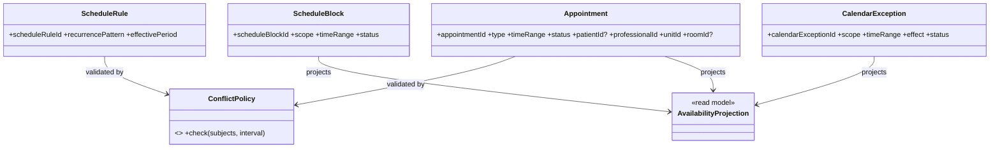
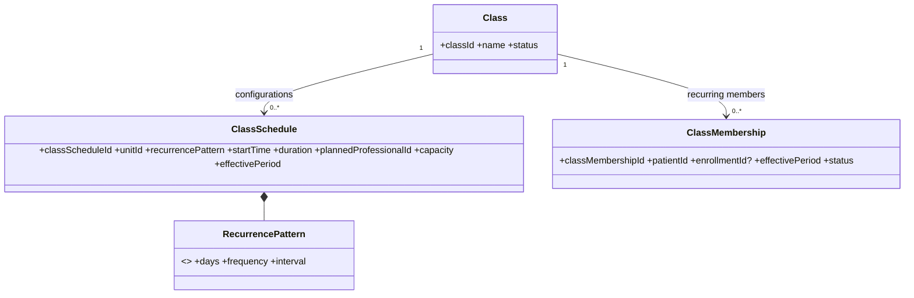
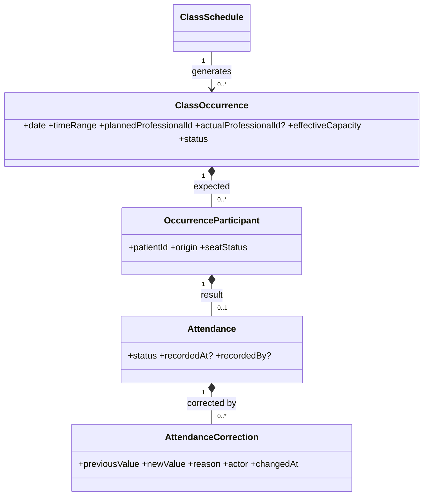
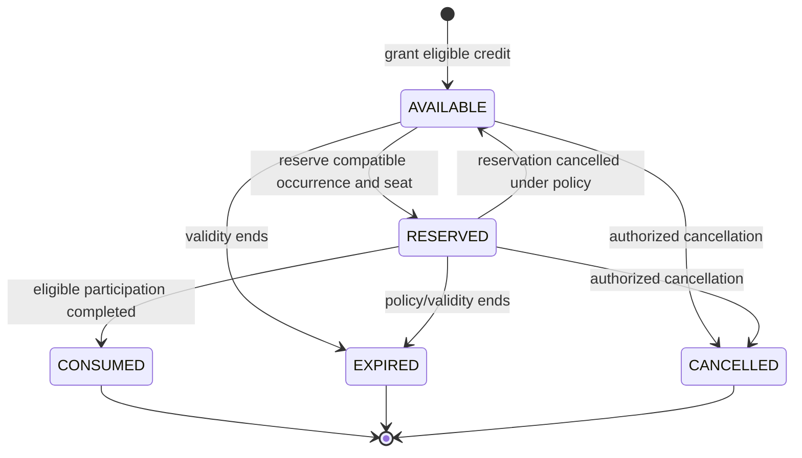
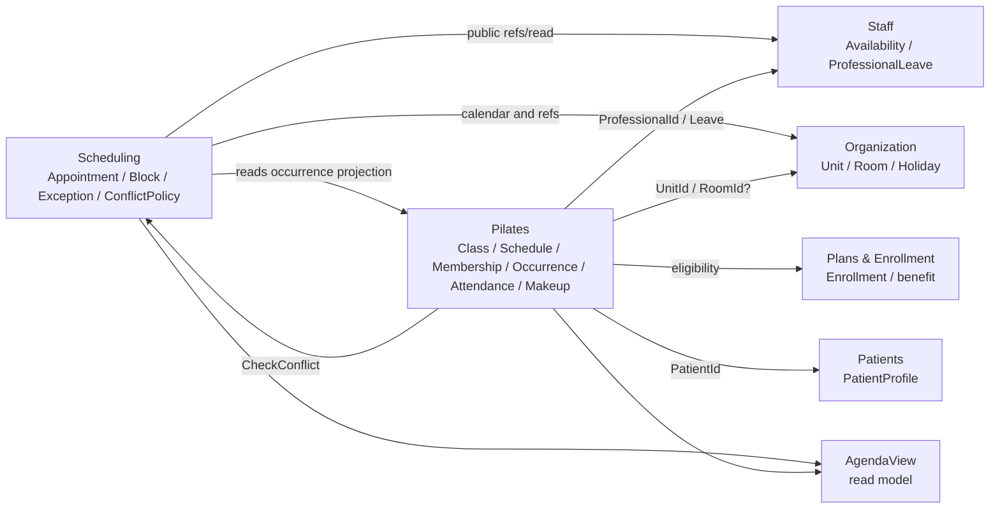
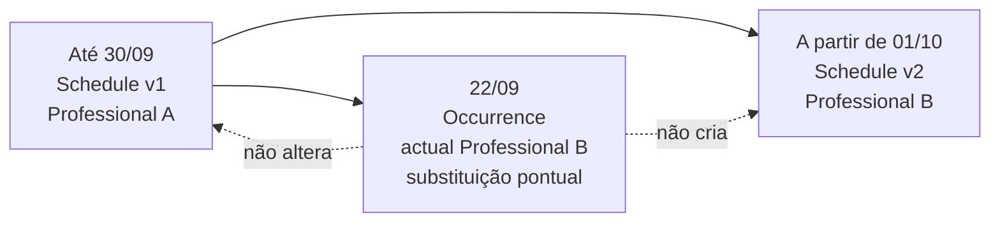

# MODEL-002 — Scheduling / Pilates

## 1. Status

- **Tarefa:** MODEL-002
- **Status:** DONE
- **Data:** 2026-09-15
- **Natureza:** modelo conceitual de domínio
- **Boundaries normativos:** `docs/architecture/CONTEXT_MAP.md` e `docs/architecture/OWNERSHIP_MAP.md`
- **Modelo anterior:** `docs/modeling/MODEL_001_PEOPLE_PATIENTS_STAFF_ORGANIZATION.md`
- **Próxima tarefa:** MODEL-003 — Clinical

O modelo atende aos critérios de validação desta etapa e não possui blocker conhecido para MODEL-003. Aggregate roots, entidades, value objects, policies e operações aqui são candidatos conceituais; não definem tabelas, formatos de ID, transações, APIs, DTOs, locks ou algoritmos.

## 2. Objetivo

Definir os conceitos, relações, cardinalidades, invariantes, temporalidade, operações e eventos de Scheduling e Pilates, preservando a separação entre agenda ad-hoc e operação recorrente de turmas. O modelo suporta grade geral não-turma, compromissos, bloqueios, conflitos, turma recorrente, ocorrências, chamada, capacidade e reposição sem compartilhar ownership.

## 3. Escopo

- Scheduling: `ScheduleRule`, `Appointment`, `ScheduleBlock`, `CalendarException`, política geral de conflito, disponibilidade necessária a compromissos ad-hoc e agenda consolidada como projeção.
- Pilates: `Class`, `ClassSchedule`, `ClassMembership`, `ClassOccurrence`, participantes esperados, `Attendance`, correções de presença, `MakeupCredit`, `MakeupReservation`, capacidade e recorrência de turma.
- Referências conceituais a PatientProfile, ProfessionalProfile, Unit, Room, Availability, ProfessionalLeave, Enrollment, FinancialRestriction e UserAccount.
- Recorrência versus ocorrência, vigência, histórico, conflitos, concorrência e processos `PROC-AGD-001/002` e `PROC-PIL-001` a `005`.

## 4. Fora de Escopo

- ClinicalEntry, Assessment, prontuário ou conteúdo clínico;
- Plan, Contract, Enrollment internals, Receivable, Payment, Billing e Finance;
- CRM pipeline, internals de Communication e regras de entrega;
- banco, SQL, PK/FK, constraints, índices, migrations, ORM e locks;
- endpoints, DTOs, C#, React, telas ou componentes de UI;
- algoritmo físico de conflito e estratégia física de geração de ocorrências;
- máquina de estados formal, arquitetura física de eventos e transações distribuídas;
- política definitiva de MakeupCredit durante pausa.

## 5. Princípios Herdados

1. Scheduling possui Appointment, ScheduleBlock, CalendarException e a política temporal geral; Pilates possui turma, recorrência, ocorrência, presença, capacidade e reposição.
2. Recorrência e ocorrência são conceitos distintos. Uma mudança pontual nunca reescreve a regra recorrente.
3. Mudança permanente cria nova vigência; o presente não reescreve o passado.
4. PatientProfile, ProfessionalProfile, Unit e Room são referências externas e não são copiados.
5. Room é informação opcional: não bloqueia conflito, não define disponibilidade e não define capacidade.
6. Equipamento não participa do Scheduling ou Pilates e não é recurso reservável.
7. Availability e ProfessionalLeave permanecem em Staff. Scheduling os consome sem alterá-los.
8. Enrollment permanece em Plans & Enrollment. Pilates valida o direito operacional por contrato público, sem editar Enrollment.
9. A política geral de conflito pertence a Scheduling; Pilates a consulta e continua responsável por sua própria capacidade.
10. As condições atuais de duas unidades, segunda a sexta e 06:00–21:00 são configuração operacional, não limites estruturais.

## 6. Scheduling

### 6.1 Appointment

**Classificação:** entidade e aggregate root candidato.

Representa compromisso ad-hoc individual ou excepcional. Tipos operacionais iniciais: `ASSESSMENT`, `EXPERIMENTAL`, `MAKEUP`, `EXTRAORDINARY` e `FIT_IN`. O tipo não muda o owner nem cria vínculo recorrente.

**Atributos conceituais:**

- `appointmentId`;
- `appointmentType`;
- `patientId` ou `personId` quando ainda não houver PatientProfile, conforme o fluxo autorizado;
- `professionalId`;
- `unitId`;
- `roomId?` informativo;
- `timeRange`;
- `status` — `SCHEDULED`, `CONFIRMED`, `COMPLETED`, `CANCELLED` ou `NO_SHOW`;
- `originReference?` — por exemplo OpportunityId, sem absorver CRM;
- `relatedClassOccurrenceId?` — somente para correlação autorizada de encaixe em contexto de turma;
- `reason?`, `notes?` administrativas e autoria relevante;
- histórico de reagendamento/cancelamento.

Os estados conhecidos são suficientes para o modelo conceitual. `Rescheduled` não é estado: é operação/fato que altera o intervalo vigente e preserva valores anteriores, ator, motivo e data/hora. `NO_SHOW` é resultado do compromisso; atraso pode ser registrado com base em `LateTolerance`, sem bloquear automaticamente o atendimento.

### 6.2 ScheduleBlock

**Classificação:** entidade e aggregate root candidato.

Representa indisponibilidade operacional deliberada em Scheduling, sem substituir Availability ou ProfessionalLeave de Staff.

**Atributos conceituais:**

- `scheduleBlockId`;
- `scope` — profissional, unidade ou agenda geral conforme autorização;
- `professionalId?`, `unitId?`;
- `timeRange` ou regra recorrente geral quando aplicável;
- `reason`;
- `status` — `ACTIVE`, `CANCELLED` ou `ENDED`;
- autoria e timestamps de criação/cancelamento.

Um block impede novos compromissos compatíveis com seu escopo. Cancelá-lo preserva o registro; não altera ProfessionalLeave.

### 6.3 ScheduleRule e FixedSchedule

**ScheduleRule:** entidade e aggregate root candidato de Scheduling somente para recorrência geral não vinculada a turma. Representa uma regra fixa operacional que materializa disponibilidade ocupada ou compromissos gerais recorrentes, com `recurrencePattern`, `timeOfDay/duration`, referências aplicáveis e `effectivePeriod`.

**FixedSchedule:** termo operacional/alias de uma ScheduleRule estável. **Conceito rejeitado como entidade paralela**, pois criaria duas representações para a mesma regra. Quando “horário fixo” significar turma, o conceito correto é `ClassSchedule` em Pilates.

ScheduleRule não possui Class, capacidade, membership, ocorrência de turma ou Attendance. Se sua materialização concreta exigir ocorrências próprias no futuro, isso será refinado sem reutilizar `ClassOccurrence`.

### 6.4 CalendarException operacional

**Classificação:** entidade e aggregate root candidato.

Representa decisão operacional de agenda para um período/data concreta, possivelmente motivada por Holiday, recesso, evento local ou decisão excepcional.

**Atributos conceituais:**

- `calendarExceptionId`;
- `scope` — clínica, unidade, profissional ou conjunto operacional permitido;
- `timeRange`;
- `effect` — bloqueio, funcionamento excepcional ou ajuste operacional;
- `sourceHolidayId?` ou `institutionalCalendarId?` como referência a Organization;
- `reason`;
- `status` — `PLANNED`, `APPLIED` ou `CANCELLED`;
- autoria.

Holiday informa a decisão, mas continua em Organization. CalendarException não duplica o calendário institucional e não edita Holiday.

### 6.5 ConflictPolicy e AvailabilityProjection

**ConflictPolicy:** policy de domínio de Scheduling. Recebe sujeitos, intervalo, natureza do compromisso e exclusões/correlação da operação; consulta compromissos impeditivos de Scheduling e projeções públicas de Pilates e Staff. Retorna resultado explicável, não grava ownership externo.

**AvailabilityProjection:** read model reconstruível de Scheduling. Consolida Availability/Leave de Staff, ScheduleBlocks, CalendarExceptions, Appointments e slots ocupados de ClassOccurrences. Não é entidade transacional nem fonte de capacidade.

## 7. Pilates

### 7.1 Class

**Classificação:** entidade e aggregate root candidato.

Representa a identidade operacional duradoura de uma turma de Pilates, independentemente das versões de horário.

**Atributos conceituais:**

- `classId`;
- `name` ou identificação operacional;
- `serviceOrModality?` — referência/código público apenas quando necessário;
- `status` — `ACTIVE` ou `INACTIVE` neste modelo;
- `createdAt`, `inactivatedAt?`, `inactivationReason?`.

Class possui, por relação entre roots, zero ou mais ClassSchedules e ClassMemberships ao longo do tempo. Sua capacidade efetiva vem do ClassSchedule vigente e é preservada na ClassOccurrence; nunca vem de Room. Inativar Class impede novas vigências/ocorrências ordinárias, mas preserva schedules, memberships, ocorrências e chamadas passadas.

### 7.2 ClassSchedule

**Classificação:** entidade e aggregate root candidato separado de Class.

Representa uma configuração recorrente vigente da turma.

**Atributos conceituais:**

- `classScheduleId`;
- `classId`;
- `unitId`;
- `recurrencePattern`;
- `startTime` e `duration`, conceitualmente compondo o intervalo recorrente;
- `plannedProfessionalId`;
- `effectiveCapacity`;
- `roomId?` informativo;
- `effectivePeriod` (`effectiveFrom`, `effectiveTo?`);
- `status` derivável/operacional — futura, vigente ou encerrada.

Combinações de dias como seg/qua, ter/qui e seg/qua/sex são expressas pelo RecurrencePattern. Mudança permanente encerra a vigência anterior e cria nova configuração. ClassSchedule gera ClassOccurrences dentro de horizonte configurável; não é uma ocorrência histórica.

### 7.3 ClassMembership

**Classificação:** entidade e aggregate root candidato separado.

Representa o vínculo recorrente de um PatientProfile com uma Class.

**Atributos conceituais:**

- `classMembershipId`;
- `classId`;
- `patientId`;
- `enrollmentId?` ou referência pública equivalente quando exigida;
- `effectivePeriod`;
- `status` mínimo `ACTIVE`/`ENDED` quando não for derivável da vigência;
- `endReason?`;
- autoria da inclusão/encerramento.

Remover paciente encerra o vínculo. Transferir encerra o membership antigo e cria outro; nunca altera `classId` do registro antigo. O vínculo não é Enrollment e não é Attendance.

### 7.4 ClassOccurrence

**Classificação:** entidade e aggregate root candidato.

Representa a execução de uma turma em data e horário concretos.

**Atributos conceituais:**

- `classOccurrenceId`;
- `classId` e `classScheduleId` de origem;
- `occurrenceDate` e `timeRange` resultante;
- `unitId`;
- `roomId?` informativo;
- `plannedProfessionalId`;
- `actualProfessionalId?` — igual ao planejado ou substituto;
- `effectiveCapacity` — snapshot da configuração aplicável à data;
- `status` — `PLANNED`, `IN_PROGRESS`, `COMPLETED` ou `CANCELLED`;
- exceções pontuais, motivo e autoria.

Os quatro estados são suficientes conceitualmente. Cancelamento preserva a ocorrência. Mudança pontual de horário, unidade ou profissional fica na ocorrência com motivo/autoria; não cria ClassSchedule. Mudança permanente cria nova vigência de ClassSchedule.

### 7.5 OccurrenceParticipant

**Classificação:** child entity candidata de ClassOccurrence e snapshot operacional derivado.

Representa uma vaga/participação esperada naquela ocorrência específica, com origem `MEMBERSHIP`, `MAKEUP_RESERVATION` ou `AD_HOC_ADMISSION`. Contém `patientId`, referência de origem, estado de elegibilidade para a ocorrência e eventual liberação/cancelamento da vaga.

Não substitui ClassMembership nem MakeupReservation: prova quem era esperado naquela data e permite que ausência anunciada libere apenas a vaga concreta. Para um encaixe geral, Scheduling cria Appointment. Se o encaixe ocorrer dentro de uma turma, Pilates precisa autorizar atomicamente `AD_HOC_ADMISSION` na ocorrência; o Appointment pode manter correlação, mas a vaga e a capacidade permanecem em Pilates.

### 7.6 Attendance e AttendanceCorrection

`Attendance` é child entity candidata de ClassOccurrence. Representa o resultado individual de um OccurrenceParticipant.

**Estados canônicos validados:** `PENDING`, `PRESENT`, `LATE`, `ABSENT_JUSTIFIED`, `ABSENT_UNJUSTIFIED`, `CANCELLED_IN_ADVANCE` e `CANCELLED_LATE`.

**Atributos conceituais:** `attendanceId`, `classOccurrenceId`, `patientId`, `occurrenceParticipantId`, `status`, `recordedAt?`, `arrivalAt?`, `recordedByUserAccountId?` e observação/motivo quando exigido.

`AttendanceCorrection` é child entity imutável da Attendance, necessária quando um estado já registrado muda. Preserva valor anterior, valor novo, usuário, motivo e data/hora. Não se usa delete + insert silencioso. `LateTolerance` é parâmetro externo; o valor inicial documentado não é hardcoded.

### 7.7 MakeupCredit e MakeupReservation

`MakeupCredit` é entidade e aggregate root candidato. Representa direito individual, rastreável e não reutilizável a uma reposição elegível.

**Atributos conceituais:** `makeupCreditId`, `patientId`, `sourceAttendanceId?` ou `sourceClassOccurrenceId`, `reason`, `grantedAt`, `validityPeriod`, `status`, `policyVersion/reference`, autoria e eventual exceção.

Estados validados: `AVAILABLE`, `RESERVED`, `CONSUMED`, `EXPIRED` e `CANCELLED`.

`MakeupReservation` é entidade/child entity candidata do aggregate MakeupCredit. Representa a reserva do crédito em uma ClassOccurrence compatível e contém `makeupReservationId`, `makeupCreditId`, `classOccurrenceId`, `patientId`, `reservedAt`, status operacional, cancelamento/motivo e autoria. Ela ocupa vaga real, pode apontar para outra Class e outra Unit e não altera ClassMembership.

Uma reposição avulsa fora de turma é `Appointment(MAKEUP)` em Scheduling. Uma reposição dentro de turma é `MakeupReservation` em Pilates. Não se criam as duas entidades para o mesmo assento. Se uma política futura permitir usar MakeupCredit de Pilates em atendimento ad-hoc, será necessário um contrato público de autorização/consumo correlacionado, sem transformar a reserva de turma em Appointment.

## 8. Recorrência

Existem duas recorrências semanticamente distintas:

- `ScheduleRule`: regra recorrente geral não-turma de Scheduling;
- `ClassSchedule`: recorrência de uma Class, exclusivamente em Pilates.

`RecurrencePattern` descreve dias da semana, frequência/intervalo aplicável e limites calendáricos necessários. Horário inicial e duração podem compor a expressão de agenda, mas Unit e Professional ficam em ClassSchedule/ScheduleRule porque são referências com lifecycle próprio e não fazem parte da identidade matemática do padrão.

ClassSchedule materializa ClassOccurrences dentro do horizonte operacional configurável. O valor inicial de 90 dias (`PAR-PIL-005`) não é invariante nem implica geração infinita.

## 9. Vigência

- ClassSchedule usa `effectivePeriod`; versões equivalentes da mesma Class não podem produzir ambiguidade recorrente no mesmo intervalo.
- ClassMembership usa `effectivePeriod`; encerramento não apaga o vínculo.
- ScheduleRule geral usa vigência para mudanças permanentes.
- parâmetros/policies que afetam elegibilidade histórica devem ser identificáveis pela versão ou vigência aplicada.
- Appointment preserva histórico de reagendamento em vez de versionar toda a entidade como regra recorrente.

Exemplo: Professional A conduz até 30/09. A partir de 01/10, nova vigência de ClassSchedule planeja Professional B. Uma substituição somente em 22/09 altera `actualProfessionalId` da ClassOccurrence de 22/09 e não toca as duas vigências.

## 10. Ocorrências

Uma ClassOccurrence nasce de exatamente um ClassSchedule válido para sua data. Ao materializar, recebe o intervalo, Unit, Professional planejado, capacidade e Room informativa aplicáveis; esses valores formam contexto histórico da ocorrência.

Participantes esperados resultam de:

1. ClassMemberships efetivos na data;
2. MakeupReservations válidas para a ocorrência;
3. admissões ad-hoc autorizadas dentro da turma.

Ausência anunciada altera/libera a participação daquela ocorrência e não encerra membership. Cancelamento da ocorrência mantém seu ID e contexto, cancela participações conforme política e pode originar MakeupCredits elegíveis.

## 11. Membership

Ao criar ClassMembership, Pilates:

1. valida PatientProfile por contrato público;
2. valida Enrollment/benefício público quando aplicável;
3. consulta Scheduling para conflito temporal;
4. calcula ocupação recorrente contra a capacidade efetiva;
5. cria o vínculo com vigência e publica o fato.

Quantidade de memberships recorrentes deve ser compatível com a frequência pública contratada, mas Plans & Enrollment continua owner dessa regra contratual. Duas alterações concorrentes do mesmo membership não podem gerar duas vigências contraditórias.

Pausa/cancelamento de Enrollment não é aplicado por escrita externa. Pilates reage ao fato público e encerra/suspende efeitos próprios conforme regra aprovada. A pausa libera vaga; o comportamento de MakeupCredits durante a pausa permanece aberto.

## 12. Attendance

Attendance só existe para paciente legitimamente esperado na ocorrência via OccurrenceParticipant. Há no máximo uma Attendance corrente por participante/ocorrência; correções são anexadas como fatos imutáveis.

`PENDING` significa chamada ainda não concluída para aquela pessoa. `PRESENT` e `LATE` indicam participação; os dois estados de ausência distinguem justificativa; os dois cancelamentos distinguem antecedência conforme a policy vigente. A mudança para estado terminal pode disparar avaliação de elegibilidade de crédito, mas não cria ClinicalEntry.

Uma ocorrência `COMPLETED` deve ter todos os participantes esperados resolvidos, salvo exceção explicitamente auditada. Correção posterior é permitida sem reabrir/apagar o histórico da chamada.

## 13. Makeup

Regras conceituais:

- ausência elegível gera no máximo um MakeupCredit;
- falta sem aviso e falta em reposição não geram novo crédito automaticamente;
- cancelamento da clínica pode gerar crédito conforme policy vigente e não consome limite do paciente;
- reserva exige crédito AVAILABLE, dentro da validade, vaga real e ausência de conflito;
- reservar muda o crédito para RESERVED; realizar a reposição o torna CONSUMED;
- cancelamento da reserva aplica política configurável para retornar a AVAILABLE ou cancelar/expirar, preservando histórico;
- crédito CONSUMED, EXPIRED ou CANCELLED não pode ser reutilizado;
- outra turma/unidade é permitida quando compatível;
- antecedência, validade, limite por período e demais valores vêm de parâmetros com vigência.

A política de créditos durante pausa é `NON_BLOCKING` para este modelo e blocker antes da implementação correspondente. `validityPeriod` e estados existentes permitem adotar posteriormente congelamento, indisponibilidade temporária ou expiração normal sem remodelar a identidade do crédito; nenhuma opção é escolhida aqui.

## 14. Appointment

`ScheduleAppointment` exige referências ativas, intervalo coerente e aprovação da ConflictPolicy. Room opcional não entra no cálculo. `ConfirmAppointment`, `CompleteAppointment`, `MarkNoShow` e `CancelAppointment` preservam autoria e fatos anteriores.

`RescheduleAppointment` registra intervalo anterior, novo intervalo, ator, motivo e data/hora, valida novamente conflitos e publica `AppointmentRescheduled`. O registro não é apagado nem substituído por outro Appointment sem correlação.

Encaixe não cria ClassMembership. Fora de turma, é Appointment `FIT_IN`. Dentro de ocorrência de turma, Scheduling mantém o compromisso/correlação ad-hoc e Pilates autoriza o participante na ocorrência sob capacidade; não há ownership compartilhado.

## 15. Conflicts

Scheduling oferece `CheckConflict` como contrato público. A consulta considera conceitualmente:

- Appointments ativos incompatíveis;
- ScheduleBlocks e CalendarExceptions impeditivos;
- ClassOccurrences e, para planejamento futuro, projeções recorrentes relevantes de Pilates;
- Availability e ProfessionalLeave públicos de Staff;
- identidade do profissional e do paciente, intervalo, Unit e natureza do compromisso.

Conflito de profissional cobre turma×turma, turma×Appointment e Appointment×Appointment, inclusive entre unidades. Conflito de paciente cobre as mesmas combinações quando o paciente participa. Room e equipamento são ignorados. A policy pode reconhecer exceções explicitamente autorizadas, mas não presume que dois compromissos simultâneos sejam compatíveis.

Pilates consulta Scheduling antes de criar/alterar ClassSchedule, ClassMembership, ocorrência pontual, substituição ou MakeupReservation quando a operação altera ocupação temporal. Scheduling usa somente projeções públicas de Pilates e não edita seus aggregates. Não existe ciclo de escrita.

## 16. Capacity

`Capacity` é value object/parâmetro positivo em Pilates, aplicado ao ClassSchedule e snapshotado na ClassOccurrence. O padrão inicial de quatro é configurável (`PAR-PIL-001`) e não é invariante universal; sua adequação operacional deve continuar sendo validada.

As duas invariantes são:

- ocupação recorrente ativa da configuração ≤ capacidade efetiva da configuração;
- ocupação confirmada da ocorrência ≤ capacidade efetiva da ocorrência.

Na ocorrência, ocupação inclui participantes derivados de membership que não liberaram a vaga, MakeupReservations e admissões ad-hoc. Uma ausência anunciada pode liberar somente aquela vaga. Overbooking não é permitido no comportamento inicial. Room nunca fornece a capacidade.

## 17. Calendar Exceptions

Organization publica InstitutionalCalendar/Holiday. Scheduling interpreta o impacto operacional por CalendarException. Uma exceção pode bloquear ou excepcionalmente abrir agenda em escopo/data, mas não altera o Holiday original.

Pilates consome o resultado público de calendário/conflito. Se a exceção afetar uma turma já materializada, Pilates decide cancelar ou ajustar a ClassOccurrence. Se afetar geração futura, ela não reescreve ClassSchedule; a materialização aplica a exceção vigente e registra a origem quando relevante.

## 18. Professional Substitution

- substituição de um dia: alterar `actualProfessionalId` da ClassOccurrence, com profissional válido, conflito verificado, motivo, ator e evento `SubstituteAssigned`;
- mudança permanente: encerrar ClassSchedule e criar nova vigência com outro `plannedProfessionalId`;
- afastamento: ProfessionalLeave continua em Staff; Pilates escolhe substituição, cancelamento ou reorganização da ocorrência, e Scheduling bloqueia novos conflitos.

`ProfessionalSubstituted` genérico de Scheduling não deve ser publicado como se Scheduling fosse owner da troca de turma. Para turma, o fato canônico é `SubstituteAssigned`, publicado por Pilates.

## 19. Value Objects

| Value Object | Uso | Semântica/validação |
|---|---|---|
| TimeRange | Appointment, block, exception e occurrence | início < fim; base comum para sobreposição; timezone físico fica para etapa posterior |
| DateRange / EffectivePeriod | schedules, memberships, policies e créditos | início ≤ fim quando houver fim; admite vigência aberta; define inclusão de bordas conceitualmente |
| RecurrencePattern | ScheduleRule e ClassSchedule | conjunto não vazio de dias/frequência e intervalo aplicável; não inclui Unit/Professional |
| Capacity | ClassSchedule/ClassOccurrence | inteiro positivo; não deriva de Room; valor configurável |
| LateTolerance | policy de Attendance/Appointment | duração não negativa obtida de parâmetro vigente; sem valor hardcoded |

Status, tipos e motivos permanecem atributos/enums conceituais. `ConflictResult` pode ser valor de retorno contendo `hasConflict`, razões e referências opacas, sem lifecycle próprio.

## 20. Aggregate Candidates

| Contexto | Aggregate root candidato | Conteúdo local | Justificativa |
|---|---|---|---|
| Scheduling | Appointment | histórico de reagendamento/cancelamento | identidade e lifecycle próprios; conflito é policy externa ao aggregate |
| Scheduling | ScheduleBlock | escopo, intervalo, cancelamento | muda independentemente e participa da agenda geral |
| Scheduling | CalendarException | decisão operacional e origem institucional | lifecycle/auditoria próprios; não agrega Holiday |
| Scheduling | ScheduleRule | recorrência geral não-turma com vigência | evita confundir regra com Appointment ou ClassSchedule |
| Pilates | Class | identidade e lifecycle da turma | root leve; não carrega listas crescentes |
| Pilates | ClassSchedule | uma versão recorrente efetiva | mudanças de vigência e geração de ocorrências sem bloquear Class inteira |
| Pilates | ClassMembership | um vínculo paciente–turma | alto volume, transferências e concorrência independentes da Class |
| Pilates | ClassOccurrence | OccurrenceParticipant, Attendance e AttendanceCorrection | consistência local da chamada, status e snapshot dos esperados |
| Pilates | MakeupCredit | MakeupReservation | impede reutilização do direito e preserva seu lifecycle |

`Class + ClassSchedule + ClassMembership` não formam aggregate único: schedules e memberships são coleções crescentes, alteradas concorrentemente; carregar tudo aumentaria contenção e não garantiria sozinho capacidade entre múltiplos roots. Capacidade exige coordenação atômica futura no serviço/caso de uso de Pilates.

ClassOccurrence possui Attendances conceitualmente porque status da ocorrência, participante esperado e correção precisam de consistência. A capacidade atual pequena favorece essa fronteira, mas não é pressuposto estrutural. Se volume/concorrência real exigir split físico, a unicidade participante–occurrence e a conclusão da chamada continuam sendo invariantes do boundary de Pilates.

## 21. Relations and Cardinalities

1. Class `1 → 0..N` ClassSchedule ao longo do tempo; um ClassSchedule pertence a exatamente uma Class.
2. Class `1 → 0..N` ClassMembership; um membership liga exatamente uma Class e um PatientProfile.
3. ClassSchedule `1 → 0..N` ClassOccurrence; uma ocorrência deriva de exatamente um schedule válido.
4. ClassOccurrence `1 → 0..N` OccurrenceParticipant.
5. OccurrenceParticipant `1 → 1` PatientProfile por referência e `1 → 0..1` Attendance corrente.
6. Attendance `1 → 0..N` AttendanceCorrection.
7. MakeupCredit `1 → 0..N` MakeupReservation ao longo do histórico e no máximo uma reserva ativa.
8. MakeupReservation `N → 1` ClassOccurrence e `1 → 1` PatientProfile por referência.
9. Appointment referencia exatamente um ProfessionalProfile e uma Unit; referencia paciente/pessoa conforme o tipo e pode referenciar uma ClassOccurrence apenas como correlação.
10. ScheduleBlock pode referenciar zero ou um profissional e zero ou uma Unit conforme o scope.
11. CalendarException pode referenciar zero ou um Holiday/InstitutionalCalendar como origem; não o contém.
12. AgendaView consolida `0..N` Appointments, ClassOccurrences, ScheduleBlocks e CalendarExceptions como itens projetados.

## 22. Invariants

### Scheduling

- `INV-AGD-001`: Appointment não pode conflitar com compromisso impeditivo do profissional.
- `INV-AGD-002`: paciente não pode possuir conflito temporal impeditivo entre Appointments e/ou turmas.
- `INV-AGD-003`: reagendamento/cancelamento preserva valores anteriores, ator, motivo e data/hora aplicáveis.
- `INV-AGD-004`: Appointment ad-hoc não cria ClassMembership nem recorrência.
- `INV-AGD-005`: ScheduleRule geral não representa recorrência de turma.
- `INV-AGD-006`: ScheduleBlock e CalendarException cancelados/encerrados são preservados.
- `INV-AGD-007`: Holiday permanece em Organization; CalendarException apenas referencia sua origem.
- `INV-AGD-008`: Room é informativa e equipamento não participa de disponibilidade ou conflito.
- `INV-AGD-009`: ConflictPolicy considera fatos públicos de Pilates e Staff sem escrever nesses contextos.
- `INV-AGD-010`: Appointment possui intervalo coerente, Unit e Professional válidos para novos agendamentos.

### Pilates

- `INV-PIL-001`: ClassSchedule é recorrência e ClassOccurrence é execução concreta; nenhuma entidade representa ambas.
- `INV-PIL-002`: mudança permanente de ClassSchedule usa nova vigência; exceção pontual altera somente ocorrência.
- `INV-PIL-003`: ClassMembership ativo possui vigência coerente e remoção/transferência preserva o vínculo anterior.
- `INV-PIL-004`: ocupação recorrente ativa não excede a capacidade efetiva.
- `INV-PIL-005`: ocupação da ClassOccurrence, incluindo reposições e encaixes, não excede sua capacidade efetiva.
- `INV-PIL-006`: capacidade pertence a Pilates e nunca deriva de Room.
- `INV-PIL-007`: ClassOccurrence pertence a exatamente um ClassSchedule válido para a data de origem.
- `INV-PIL-008`: participante esperado deriva de membership efetivo, reserva válida ou admissão ad-hoc autorizada.
- `INV-PIL-009`: existe no máximo uma Attendance corrente por participante/ocorrência.
- `INV-PIL-010`: correção de Attendance preserva valor anterior, novo, usuário, motivo e data/hora.
- `INV-PIL-011`: MakeupReservation exige crédito AVAILABLE/válido, compatibilidade, vaga e ausência de conflito.
- `INV-PIL-012`: crédito CONSUMED, EXPIRED ou CANCELLED não pode ser reservado/consumido novamente.
- `INV-PIL-013`: ausência elegível origina no máximo um crédito; falta sem aviso/reposição não gera cadeia automática.
- `INV-PIL-014`: reposição não altera ClassMembership recorrente.
- `INV-PIL-015`: substituição pontual altera actualProfessional da ocorrência, não ClassSchedule.
- `INV-PIL-016`: Enrollment é referência externa; Pilates não edita seus internals.
- `INV-PIL-017`: cancelar ClassOccurrence preserva ocorrência, participantes e efeitos históricos.
- `INV-PIL-018`: valores de capacidade, antecedência, validade, limite e horizonte vêm de parâmetros/policies, não de constantes estruturais.
- `INV-PIL-019`: ClassMemberships recorrentes devem ser compatíveis com o benefício público de Enrollment quando exigido.
- `INV-PIL-020`: concluir ocorrência exige chamada resolvida ou exceção explicitamente auditada.

## 23. Conceptual Operations

| Operação | Contexto | Resultado/guardrail |
|---|---|---|
| Create/Change/EndScheduleRule | Scheduling | mantém recorrência geral não-turma por vigência |
| ScheduleAppointment | Scheduling | valida referências e conflito; cria ad-hoc |
| Confirm/Complete/MarkNoShowAppointment | Scheduling | transiciona status preservando autoria |
| RescheduleAppointment | Scheduling | valida novo intervalo e registra previous values |
| CancelAppointment | Scheduling | cancela sem apagar |
| Register/CancelScheduleBlock | Scheduling | cria/encerra indisponibilidade operacional |
| Register/CancelCalendarException | Scheduling | aplica decisão operacional sem editar Holiday |
| CheckConflict | Scheduling | retorna resultado explicável por contrato público |
| CreateClass / InactivateClass | Pilates | governa identidade da turma sem apagar histórico |
| ChangeClassSchedule | Pilates | encerra configuração anterior e cria nova vigência |
| AddPatientToClass | Pilates | valida Patient, Enrollment, conflito e capacidade; cria membership |
| EndClassMembership | Pilates | encerra vínculo com motivo |
| TransferPatient | Pilates | encerra antigo e cria novo vínculo efetivo |
| GenerateOccurrence | Pilates | materializa ocorrência do schedule e seu snapshot |
| AdmitOccurrenceParticipant | Pilates | adiciona reposição/encaixe sob capacidade |
| ReleaseOccurrenceSeat | Pilates | libera vaga concreta sem encerrar membership |
| AssignSubstitute | Pilates | altera actualProfessional após validação de conflito |
| CancelOccurrence | Pilates | preserva ocorrência e aplica efeitos elegíveis |
| RecordAttendance | Pilates | resolve Attendance de participante esperado |
| CorrectAttendance | Pilates | anexa correção auditável |
| Grant/Expire/CancelMakeupCredit | Pilates | governa lifecycle do direito |
| ReserveMakeup | Pilates | reserva crédito e vaga na ocorrência compatível |
| CancelMakeupReservation | Pilates | preserva reserva e aplica policy ao crédito/vaga |
| ConsumeMakeupCredit | Pilates | consome crédito uma única vez após uso elegível |

## 24. Candidate Events

| Evento | Owner | Fato | Consumidores potenciais |
|---|---|---|---|
| AppointmentScheduled | Scheduling | Appointment ad-hoc foi criado | CRM, Communication, Reports, Clinical por contexto |
| AppointmentConfirmed | Scheduling | compromisso foi confirmado | Communication, Reports |
| AppointmentRescheduled | Scheduling | intervalo mudou com histórico | CRM, Communication, Reports |
| AppointmentCancelled | Scheduling | compromisso foi cancelado | CRM, Communication, Reports |
| AppointmentCompleted | Scheduling | compromisso foi realizado | CRM, Clinical por contexto, Reports |
| ScheduleBlockCreated | Scheduling | novo bloqueio passou a impedir agenda | Pilates/read models, Reports |
| ScheduleBlockCancelled | Scheduling | bloqueio deixou de impedir futuro | Pilates/read models, Reports |
| CalendarExceptionApplied | Scheduling | decisão operacional foi aplicada | Pilates, Communication, Reports |
| ClassCreated | Pilates | identidade de turma foi criada | Scheduling, Plans, Reports |
| ClassScheduleChanged | Pilates | nova vigência recorrente passou a existir | Scheduling, Reports |
| ClassMembershipStarted | Pilates | paciente iniciou vínculo recorrente | Scheduling, Plans, Reports |
| ClassMembershipEnded | Pilates | vínculo recorrente foi encerrado | Scheduling, Plans, Reports |
| PatientTransferredClass | Pilates | transferência preservou origem e destino | Plans, Scheduling, Reports |
| ClassOccurrenceCreated | Pilates | ocorrência concreta foi materializada | Scheduling, Communication, Clinical, Reports |
| ClassOccurrenceCancelled | Pilates | ocorrência foi cancelada | Scheduling, Communication, Reports |
| SubstituteAssigned | Pilates | profissional real da ocorrência mudou | Scheduling, Communication, Reports |
| AttendanceRecorded | Pilates | situação de presença foi registrada | Reports; Clinical apenas contexto autorizado |
| AttendanceCorrected | Pilates | presença anterior foi corrigida com trilha | Reports, Privacy & Audit |
| MakeupCreditGranted | Pilates | direito elegível foi concedido | Reports, Communication quando solicitado |
| MakeupReserved | Pilates | crédito e vaga foram reservados | Scheduling por projeção/conflito, Reports |
| MakeupReservationCancelled | Pilates | reserva deixou de ocupar vaga | Scheduling por projeção, Reports |
| MakeupConsumed | Pilates | direito foi utilizado | Reports |
| MakeupExpired | Pilates | validade terminou | Reports, Communication quando solicitado |

Não há evento para cada alteração trivial. Estratégia pública/interna, envelope e transporte ficam para ARC-007.

## 25. Cross-Context References

| Conceito local | Referência externa | Owner | Uso permitido |
|---|---|---|---|
| Appointment/ClassMembership/OccurrenceParticipant | PatientId/PersonId | Patients/People | validar identidade/papel público; nunca copiar cadastro |
| Appointment/ClassSchedule/ClassOccurrence | ProfessionalId | Staff | validar atuação/disponibilidade pública e preservar referência histórica |
| Schedule/Class/Occurrence | UnitId/RoomId? | Organization | Unit participa do contexto; Room apenas informa |
| ConflictPolicy | Availability/ProfessionalLeave | Staff | consumir contrato/read model; não alterar leave |
| CalendarException | Holiday/InstitutionalCalendar IDs | Organization | registrar origem da decisão operacional |
| ClassMembership | EnrollmentId/benefício público | Plans & Enrollment | validar elegibilidade/frequência sem editar Enrollment |
| Appointment | OpportunityId? | CRM | correlação de experimental; Scheduling não move pipeline |
| operações sensíveis | UserAccountId | Identity & Access | autoria/auditoria, sem inferir permissão |
| operação Pilates | ConflictCheck | Scheduling | consulta síncrona pública, sem escrita cross-context |
| agenda consolidada | ClassOccurrenceProjection | Pilates | leitura reconstruível; capacidade apenas informativa |

FinancialRestriction pode ser consumida por projeção/contrato público conforme a operação aprovada, mas nunca é transformada em estado de Enrollment nem em dado próprio de Scheduling/Pilates.

## 26. Read Models

`AgendaView` ou `ScheduleReadModel` é projeção/composição conceitual mantida sob responsabilidade de leitura de Scheduling para a agenda operacional. Consolida:

- Appointments e ScheduleBlocks de Scheduling;
- ClassOccurrences projetadas por Pilates;
- CalendarExceptions;
- Professional/Unit labels públicos;
- estado de disponibilidade necessário à visualização.

Scheduling não ganha ownership de ClassOccurrence ou capacidade por projetá-las. Reports pode consumir projeções para analytics, mas não é owner da agenda operacional. Correções são feitas nos contextos proprietários e a visão é reconstruída.

Views derivadas adicionais: agenda por Unit, por Professional e por Patient; lista da turma do dia; ocupação da ocorrência; créditos disponíveis do paciente. Nenhuma é entidade transacional.

## 27. Concurrency Hotspots

| Operação | Risco | Invariante afetada | Proteção futura necessária |
|---|---|---|---|
| AddPatientToClass na última vaga | duas inclusões excedem capacidade recorrente | INV-PIL-004 | decisão atômica sobre ocupação efetiva |
| ReserveMakeup na última vaga | duas reservas ocupam o mesmo assento | INV-PIL-005/011 | reserva atômica de crédito + vaga |
| AdmitOccurrenceParticipant | encaixe e reposição concorrentes excedem ocorrência | INV-PIL-005 | proteção atômica da ocupação concreta |
| Schedule/RescheduleAppointment | dois compromissos simultâneos passam em checks isolados | INV-AGD-001/002 | decisão atômica entre check e gravação |
| ChangeClassSchedule/GenerateOccurrence | versão muda enquanto ocorrência é materializada | INV-PIL-001/002/007 | consistência de versão/vigência aplicada |
| Transfer/EndClassMembership | duas alterações criam vigências contraditórias | INV-PIL-003 | controle de concorrência no vínculo |
| Record/CorrectAttendance | dois usuários sobrescrevem chamada/correção | INV-PIL-009/010/020 | serialização/versionamento conceitual da chamada |
| Reserve/Consume/Cancel credit | crédito é usado ou liberado duas vezes | INV-PIL-011/012 | transição atômica do MakeupCredit |
| AssignSubstitute | substituto recebe conflito entre validação e atribuição | INV-AGD-001/INV-PIL-015 | coordenação atômica com política de conflito |

O modelo identifica necessidade de atomicidade, mas não escolhe lock, constraint, isolamento, versão ou banco.

## 28. Main Process Flows

### PROC-AGD-001 — Gerenciar horário fixo

Actor autorizado cria/altera/encerra ScheduleRule geral não-turma → define RecurrencePattern e vigência → valida conflito → publica mudança. Se o horário é de turma, o fluxo é redirecionado a `ChangeClassSchedule` em Pilates.

### PROC-AGD-002 — Criar compromisso ad-hoc

Secretária seleciona pessoa/paciente, Professional e Unit → informa tipo e TimeRange → Scheduling valida referências, disponibilidade e conflitos → cria Appointment → publica `AppointmentScheduled`. Reagendamento repete a validação e registra previous values.

### PROC-PIL-001 — Criar turma

Secretária cria Class → define ClassSchedule com Unit, recurrence, Professional, capacidade e vigência → consulta conflito em Scheduling → ativa a configuração → publica `ClassCreated` e `ClassScheduleChanged` quando aplicável.

### PROC-PIL-002 — Adicionar paciente à turma

Actor autorizado → seleciona PatientProfile → seleciona Class → valida Enrollment/benefício público quando aplicável → consulta conflito → verifica capacidade recorrente → cria ClassMembership efetivo → publica `ClassMembershipStarted`.

### PROC-PIL-003 — Transferir paciente

Seleciona membership vigente e turma destino → valida benefício, conflito e capacidade destino → encerra vínculo antigo com `effectiveTo` → cria novo membership com `effectiveFrom` → publica fim, início e `PatientTransferredClass`. O `classId` antigo não é alterado.

### PROC-PIL-004 — Turma do dia e chamada

ClassSchedule → ClassOccurrence → reúne memberships efetivos na data + MakeupReservations válidas + admissões ad-hoc → cria/estabelece OccurrenceParticipants → abre chamada → registra Attendances → conclui ocorrência quando todos estiverem resolvidos ou houver exceção auditada. Correção posterior cria AttendanceCorrection.

### PROC-PIL-005 — Solicitar/usar reposição

Evento elegível → aplica policy vigente → concede MakeupCredit → seleciona ocorrência compatível, inclusive outra Class/Unit → consulta conflito → reserva crédito e vaga → participante esperado é incluído → após realização, registra Attendance e consome crédito. Cancelamento preserva reserva e aplica policy vigente.

### Substituição

Para um dia: selecionar ClassOccurrence → validar Professional substituto e conflito → definir actualProfessional → publicar `SubstituteAssigned`. Permanente: encerrar ClassSchedule e criar nova vigência.

## 29. Diagrams

### 29.1 Scheduling conceptual diagram

### 29.2 Pilates recurring structure

### 29.3 Occurrence and attendance

### 29.4 Makeup

### 29.5 Scheduling/Pilates integrated context diagram

As setas expressam contratos/referências; não há escrita cross-context.

### 29.6 Permanent change versus point exception timeline

## 30. Concept Matrix

| Conceito | Contexto | Tipo | Aggregate Root | Lifecycle | Temporalidade | Referências externas |
|---|---|---|---:|---|---|---|
| Appointment | Scheduling | entity | sim | SCHEDULED/CONFIRMED/COMPLETED/CANCELLED/NO_SHOW | intervalo + histórico de reschedule | Patient/Person, Professional, Unit, Room?, Opportunity?, Occurrence? |
| ScheduleBlock | Scheduling | entity | sim | ACTIVE/CANCELLED/ENDED | TimeRange/vigência | Professional?, Unit? |
| CalendarException | Scheduling | entity | sim | PLANNED/APPLIED/CANCELLED | TimeRange | Holiday/Calendar?, Unit?, Professional? |
| ScheduleRule | Scheduling | entity | sim, candidata | futura/vigente/encerrada | EffectivePeriod + RecurrencePattern | Professional?, Patient?, Unit, Room? |
| FixedSchedule | Scheduling | rejected as separate concept | não | alias operacional | segue ScheduleRule | — |
| ConflictPolicy | Scheduling | policy | não | sem lifecycle | usa estado vigente e data consultada | projeções de Pilates/Staff |
| AvailabilityProjection | Scheduling | read model | não | reconstruível | por intervalo | Staff, Pilates, Organization |
| AgendaView | Scheduling | read model | não | reconstruível | por intervalo/filtros | Pilates e cadastros públicos |
| Class | Pilates | entity | sim | ACTIVE/INACTIVE | histórico preservado | service/modality? |
| ClassSchedule | Pilates | entity | sim, candidata | futura/vigente/encerrada | EffectivePeriod | ClassId, UnitId, ProfessionalId, RoomId? |
| ClassMembership | Pilates | entity | sim, candidata | ACTIVE/ENDED | EffectivePeriod | ClassId, PatientId, EnrollmentId? |
| ClassOccurrence | Pilates | entity | sim | PLANNED/IN_PROGRESS/COMPLETED/CANCELLED | data/TimeRange concretos | ScheduleId, ProfessionalIds, UnitId, RoomId? |
| OccurrenceParticipant | Pilates | child entity/snapshot | não | EXPECTED/RELEASED/CANCELLED | por ocorrência | PatientId + source reference |
| Attendance | Pilates | child entity | não | estados canônicos de chamada | por ocorrência | PatientId, UserAccountId |
| AttendanceCorrection | Pilates | child entity imutável | não | append-only | changedAt | UserAccountId |
| MakeupCredit | Pilates | entity | sim | AVAILABLE/RESERVED/CONSUMED/EXPIRED/CANCELLED | ValidityPeriod | PatientId, source refs |
| MakeupReservation | Pilates | child/entity | não, candidata dentro do crédito | ativa/cancelada/consumida | reserva concreta | OccurrenceId, PatientId |
| Capacity | Pilates | value object/parameter | não | valor vigente por schedule | snapshot na occurrence | nenhuma |
| RecurrencePattern | ambos, sem owner transacional | value object | não | imutável como valor | intervalo aplicável | nenhuma |
| TimeRange | ambos | value object | não | imutável como valor | início/fim | nenhuma |
| DateRange/EffectivePeriod | ambos | value object | não | imutável como valor | início/fim aberto | nenhuma |
| PatientProfile | Patients | external reference | N/A | owner externo | conforme Patients | PatientId |
| ProfessionalProfile/Leave/Availability | Staff | external reference/read | N/A | owner externo | conforme Staff | ProfessionalId |
| Unit/Room/Holiday | Organization | external reference/read | N/A | owner externo | conforme Organization | UnitId/RoomId/HolidayId |
| Enrollment | Plans & Enrollment | external reference/contract | N/A | owner externo | vigência pública | EnrollmentId |
| EquipmentReservation/RoomReservation | rejeitado | rejected concept | não | — | — | — |

## 31. Relation Matrix

| Origem | Relação | Destino | Cardinalidade | Owner | Observação |
|---|---|---|---|---|---|
| Class | possui configurações ao longo do tempo | ClassSchedule | 1 → 0..N | Pilates | roots separados; vigência |
| Class | possui vínculos ao longo do tempo | ClassMembership | 1 → 0..N | Pilates | não contém lista no aggregate Class |
| ClassSchedule | gera | ClassOccurrence | 1 → 0..N | Pilates | ocorrência referencia uma versão válida |
| ClassOccurrence | possui esperados | OccurrenceParticipant | 1 → 0..N | Pilates | snapshot da data |
| OccurrenceParticipant | possui resultado | Attendance | 1 → 0..1 | Pilates | unicidade por participante |
| Attendance | possui correções | AttendanceCorrection | 1 → 0..N | Pilates | append-only |
| MakeupCredit | possui histórico de reserva | MakeupReservation | 1 → 0..N | Pilates | máximo uma ativa |
| MakeupReservation | reserva vaga em | ClassOccurrence | N → 1 | Pilates | pode ser outra turma/unidade |
| Appointment | agenda | Patient/Person + Professional + Unit | N → 1 cada | Scheduling | referências externas |
| Appointment | correlaciona-se opcionalmente | ClassOccurrence | 0..1 | Scheduling (correlação), Pilates (occurrence) | encaixe; sem escrita cruzada |
| ScheduleBlock | impede agenda no escopo | Professional/Unit | N → 0..1 cada | Scheduling | não é Leave |
| CalendarException | deriva/informa-se de | Holiday/Calendar | N → 0..1 | Scheduling para exceção; Organization para origem | não duplica calendário |
| ConflictPolicy | consulta | Appointment/ClassOccurrence/Block/Leave | N | Scheduling | contratos/projeções públicas |
| AgendaView | projeta | Appointment/ClassOccurrence/Block/Exception | N | Scheduling para composição | fontes mantêm ownership |

## 32. Invariant Matrix

| ID | Contexto | Invariante | Consistência necessária | Observação |
|---|---|---|---|---|
| INV-AGD-001 | Scheduling | profissional sem compromisso impeditivo simultâneo | atômica na criação/alteração | inclui projeções de Pilates/Leave |
| INV-AGD-002 | Scheduling | paciente sem compromisso impeditivo simultâneo | atômica na criação/alteração | turma e Appointment |
| INV-AGD-003 | Scheduling | reschedule/cancel preserva histórico | aggregate + auditoria | não apagar previous values |
| INV-AGD-004 | Scheduling | ad-hoc não cria membership | boundary | inclusive encaixe |
| INV-AGD-005 | Scheduling | ScheduleRule não representa turma | boundary | ClassSchedule é Pilates |
| INV-AGD-006 | Scheduling | blocks/exceptions são preservados | aggregate | cancelamento não é delete |
| INV-AGD-007 | Scheduling | Holiday continua em Organization | boundary/contrato | referência opcional |
| INV-AGD-008 | Scheduling | Room/equipment não bloqueiam | policy | sem reservas |
| INV-AGD-009 | Scheduling | conflict check não escreve externos | boundary | read/contract only |
| INV-AGD-010 | Scheduling | Appointment tem intervalo/refs válidos | aggregate + caso de uso | para novos fatos |
| INV-PIL-001 | Pilates | recorrência ≠ ocorrência | boundary/aggregate | DEC-005 |
| INV-PIL-002 | Pilates | permanente usa vigência; pontual usa occurrence | aggregate + caso de uso | preserva passado |
| INV-PIL-003 | Pilates | membership preserva vigência/transferência | atômica no vínculo | não muda ClassId antigo |
| INV-PIL-004 | Pilates | ocupação recorrente ≤ capacidade | atômica | última vaga |
| INV-PIL-005 | Pilates | ocupação da ocorrência ≤ capacidade | atômica | inclui makeup/fit-in |
| INV-PIL-006 | Pilates | capacidade não deriva de Room | boundary | owner único Pilates |
| INV-PIL-007 | Pilates | occurrence referencia schedule válido | geração consistente | snapshot aplicado |
| INV-PIL-008 | Pilates | esperado possui origem legítima | aggregate occurrence | membership/makeup/ad-hoc |
| INV-PIL-009 | Pilates | uma Attendance por participante | aggregate occurrence | correção não duplica corrente |
| INV-PIL-010 | Pilates | correção é auditável | atômica/append | before/after/actor/reason/time |
| INV-PIL-011 | Pilates | reserva exige crédito/vaga/conflito válidos | atômica cross-roots | owner continua Pilates |
| INV-PIL-012 | Pilates | crédito terminal não é reutilizado | aggregate credit | consumo único |
| INV-PIL-013 | Pilates | no máximo um crédito elegível e sem cadeia | policy + idempotência futura | parâmetros vigentes |
| INV-PIL-014 | Pilates | reposição não altera membership | boundary | RB-PIL-006 |
| INV-PIL-015 | Pilates | substituição pontual não muda schedule | aggregate occurrence | actualProfessional |
| INV-PIL-016 | Pilates | Enrollment não é editado | boundary | contrato público |
| INV-PIL-017 | Pilates | ocorrência cancelada é preservada | aggregate | sem delete |
| INV-PIL-018 | Pilates | valores operacionais são configuráveis | policy/parameter | DEC-023 |
| INV-PIL-019 | Pilates | memberships compatíveis com benefício | contrato cross-context | implementação posterior |
| INV-PIL-020 | Pilates | conclusão resolve chamada ou registra exceção | aggregate occurrence | auditável |

## 33. Ambiguities Resolved

1. `FixedSchedule` não é entidade distinta: é alias operacional de ScheduleRule geral não-turma.
2. `ScheduleRule` residual pertence a Scheduling; `ClassSchedule` pertence exclusivamente a Pilates.
3. Recorrência de turma nunca é duplicada em Scheduling; somente sua projeção aparece na agenda.
4. Reposição em ocorrência de turma usa MakeupCredit/MakeupReservation; reposição ad-hoc fora de turma usa Appointment. O mesmo assento não gera ambas.
5. Scheduling compõe AgendaView operacional; Reports pode consumir analytics, mas não possui a agenda nem fatos transacionais.
6. Capacidade efetiva fica no ClassSchedule e é snapshotada na ClassOccurrence; Room não participa.
7. Class, ClassSchedule e ClassMembership são roots separados candidatos; não há aggregate gigante.
8. ClassOccurrence possui participantes, Attendances e correções como fronteira conceitual de chamada.
9. ProfessionalLeave permanece em Staff; substituição/cancelamento da ocorrência permanece em Pilates.
10. Os estados documentados de Appointment, ClassOccurrence, Attendance e MakeupCredit são suficientes nesta etapa.

## 34. Remaining Ambiguities

### NON_BLOCKING

- `OQ-M002-001`: qual efeito exato de Enrollment pausado sobre disponibilidade e expiração de MakeupCredits, sem prolongar Contract?
- `OQ-M002-002`: qual fonte final e precedência detalhada de Holiday frente a CalendarException?
- `OQ-M002-003`: Availability de Staff será publicada como recorrência, intervalos concretos ou ambos?
- `OQ-M002-004`: quais durações adicionais por tipo de Appointment serão adotadas além do padrão?
- `OQ-M002-005`: qual catálogo/alçada autoriza exceções de crédito, conflito e admissão ad-hoc em turma?
- `OQ-M002-006`: quais casos de reposição ad-hoc fora de turma consomem um MakeupCredit de Pilates, exigindo contrato público de correlação?

Nenhuma dessas questões muda owner ou impede MODEL-003. As questões 001, 005 e 006 precisam ser fechadas antes da implementação dos comportamentos correspondentes.

## 35. Model Gaps

- `MODEL_GAP-M002-001`: representação interna de Availability em Staff continua aberta; ConflictPolicy consome contrato público abstrato.
- `MODEL_GAP-M002-002`: modelo formal de policy/benefício de Enrollment será detalhado em MODEL-004; MODEL-002 usa apenas resposta pública de elegibilidade/frequência.
- `MODEL_GAP-M002-003`: máquina de estados, autorização detalhada, transações, idempotência e algoritmo de conflito pertencem a etapas posteriores.
- `MODEL_GAP-M002-004`: a forma final da admissão ad-hoc sem crédito dentro de turma deve ser confirmada com a operação; OccurrenceParticipant suporta o caso sem criar membership.

## 36. Open Questions

### BLOCKING

Nenhuma para MODEL-003.

### NON_BLOCKING

As questões `OQ-M002-001` a `006` da seção 34 permanecem registradas. Valores 4, 4h, 30 dias, 2/mês, 90 dias, 60 minutos e 10 minutos são parâmetros vigentes documentados, não limitações estruturais. O valor de capacidade padrão deve continuar sob validação operacional contínua, ainda que esteja aprovado como valor inicial configurável.

## 37. Consequences for MODEL-003

1. Clinical pode referenciar `AppointmentId` ou `ClassOccurrenceId` como contexto assistencial, sem possuir agenda ou turma.
2. Attendance continua em Pilates e não substitui ClinicalEntry.
3. Professional planejado/real e Patient esperado são referências operacionais; autoria clínica será validada por Clinical.
4. Cancelamento, no-show, atraso ou correção de Attendance não criam nem alteram prontuário automaticamente.
5. Clinical deve preservar segregação, autorização e histórico ao validar o contexto público de atendimento.

## 38. Validation Criteria

- [x] Scheduling owns Appointment, ScheduleBlock, CalendarException e política geral de conflito.
- [x] Pilates owns Class, ClassSchedule, ClassMembership, ClassOccurrence, Attendance, MakeupCredit/Reservation e capacidade.
- [x] Scheduling não edita internals de Pilates; Pilates não edita internals de Scheduling.
- [x] cross-context operations usam referência, contrato público, evento ou projeção.
- [x] Room permanece informativa; Equipment permanece fora.
- [x] Staff continua owner de ProfessionalProfile, Availability e ProfessionalLeave.
- [x] Patients continua owner de PatientProfile; Enrollment permanece externo.
- [x] recorrência e ocorrência estão separadas.
- [x] ClassSchedule e ClassMembership usam vigência; transferência preserva o vínculo anterior.
- [x] reschedule de Appointment e correção de Attendance preservam histórico.
- [x] alteração pontual não reescreve recorrência; ocorrência cancelada não é apagada.
- [x] conflitos de profissional/paciente entre turma, Appointment e Leave são representáveis.
- [x] última vaga e reposição na última vaga exigem proteção atômica futura.
- [x] capacidade possui owner único em Pilates e não fixa valor universal.
- [x] processos `PROC-AGD-001/002` e `PROC-PIL-001` a `005` são suportados sem violar ownership.
- [x] criar/alterar turma, substituir, adicionar/remover/transferir paciente, criar ocorrência, realizar/corrigir chamada, conceder/reservar reposição, criar/reagendar/cancelar/encaixar são suportados.
- [x] aggregates candidatos estão justificados por consistência, volume, lifecycle e concorrência.
- [x] invariantes e concurrency hotspots estão documentados.
- [x] nenhum detalhe físico, API, UI, banco ou algoritmo foi escolhido.
- [x] nenhum blocker conhecido impede MODEL-003.
