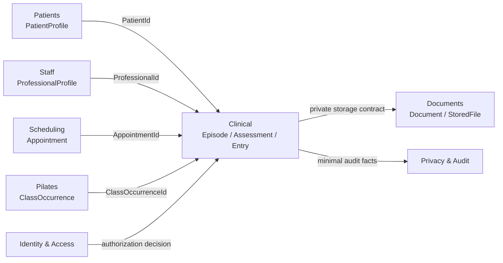
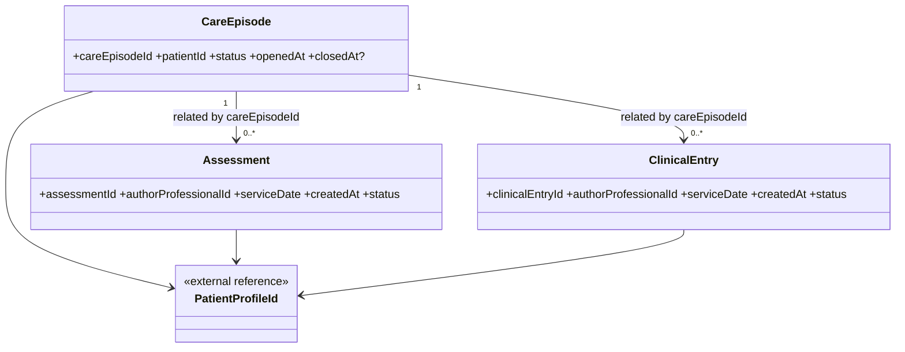
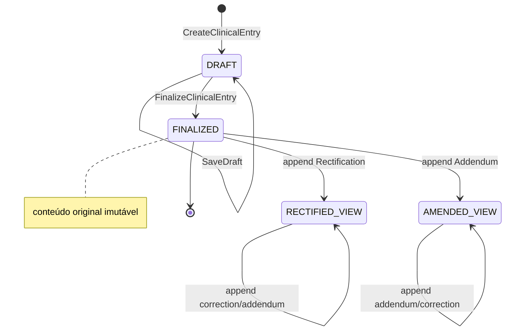
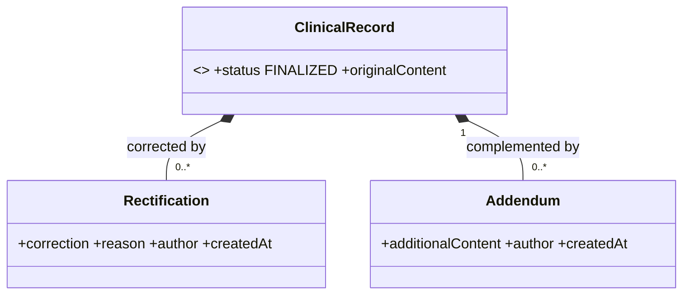
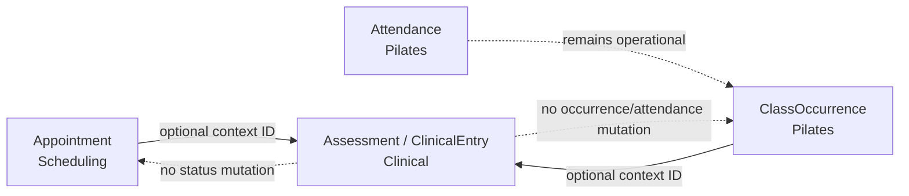
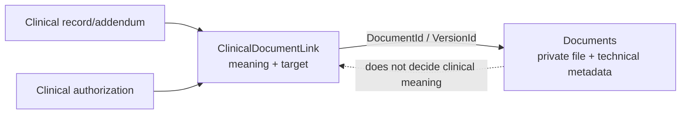
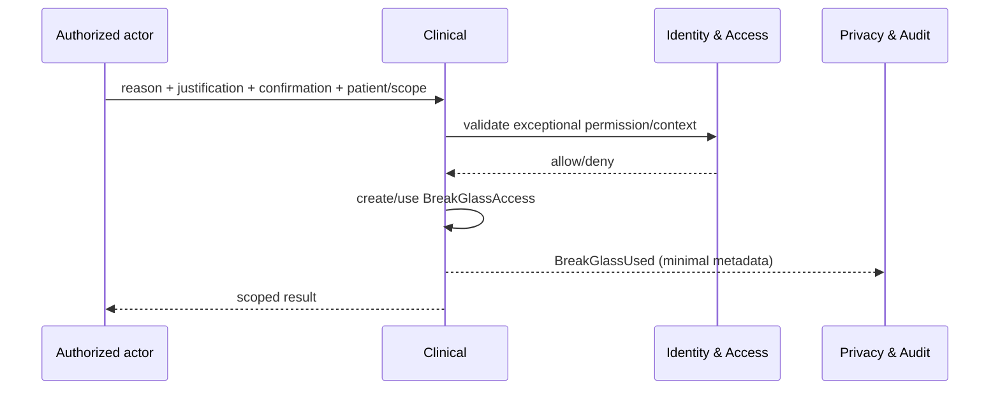
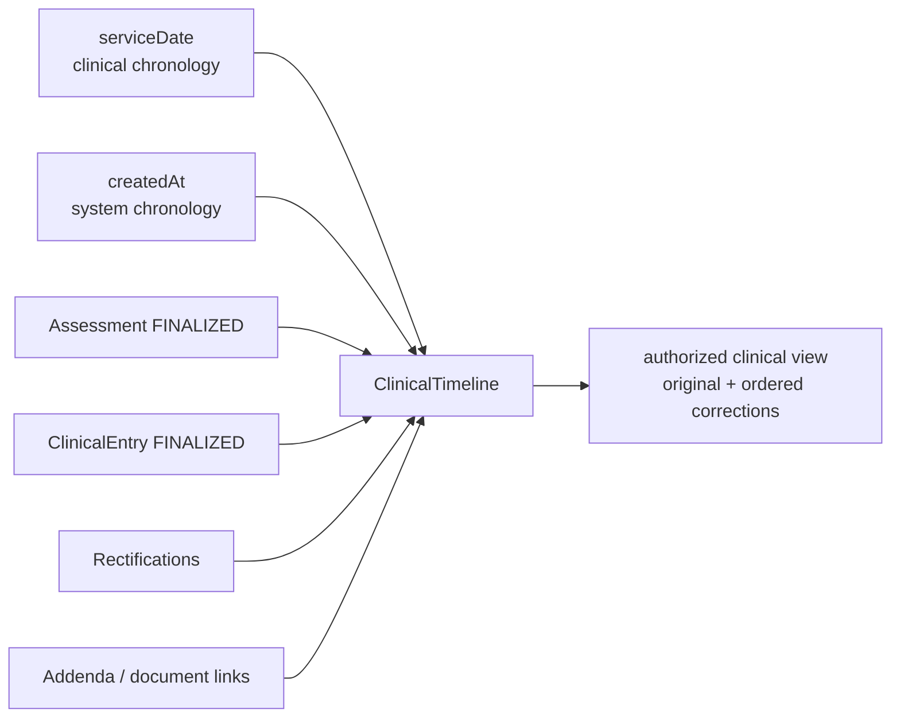

# MODEL-003 — Clinical

## 1. Status

- **Tarefa:** MODEL-003
- **Status:** DONE
- **Data:** 2026-09-15
- **Natureza:** modelo conceitual de domínio
- **Boundaries normativos:** `docs/architecture/CONTEXT_MAP.md` e `docs/architecture/OWNERSHIP_MAP.md`
- **Modelos anteriores:** `docs/modeling/MODEL_001_PEOPLE_PATIENTS_STAFF_ORGANIZATION.md` e `docs/modeling/MODEL_002_SCHEDULING_PILATES.md`
- **Próxima tarefa:** MODEL-004 — Plans / Billing / Finance

O modelo atende aos critérios de validação desta etapa e não possui blocker conhecido para MODEL-004. Entidades, aggregate roots, value objects, policies, operações e eventos são candidatos conceituais; não definem tabelas, IDs físicos, transações, APIs, DTOs, autorização técnica, locks, arquivos físicos ou telas.

## 2. Objetivo

Definir o modelo conceitual detalhado de Clinical para representar episódios assistenciais, avaliações, evoluções, templates versionados, autoria, rascunho, finalização, correção histórica, documentos, acesso excepcional e exportação. O modelo deve manter conteúdo clínico segregado, preservar o passado e integrar-se a Patients, Staff, Scheduling, Pilates, Documents, Identity & Access e Privacy & Audit sem transferir ownership.

## 3. Escopo

- `CareEpisode`, `Assessment`, `ClinicalTemplate`, `ClinicalTemplateVersion` e `ClinicalEntry`;
- `DRAFT → FINALIZED`, autoria, data do atendimento e data real de criação;
- `Rectification` e `Addendum` append-only;
- `ClinicalDocumentLink` e storage privado por contrato de Documents;
- acesso assistencial contextual e `BreakGlassAccess`;
- exportação clínica como operação sensível;
- `ClinicalFinalizationPolicy`, registros retroativos e justificativas;
- relações com PatientProfile, ProfessionalProfile, Appointment e ClassOccurrence;
- eventos mínimos, read models, privacidade, concorrência e processos `PROC-CLI-001` a `005`.

## 4. Fora de Escopo

- banco, SQL, migrations, PK/FK, índices, ORM, C#, API, React e telas finais;
- matriz completa de autorização, roles, permissions, MFA/step-up e sessões;
- conteúdo clínico formal obrigatório ainda não validado;
- assinatura digital certificada, qualificada ou equivalência jurídica da assinatura lógica;
- prazo jurídico de retenção, descarte físico e legal hold detalhado;
- formato final de exportação, PDF e UX de disclosure;
- internals de PatientProfile, ProfessionalProfile, Appointment, ClassOccurrence, Attendance, UserAccount, AuditLog e StoredFile;
- regras específicas de conselho profissional ou responsável técnico não documentadas;
- provider de storage, MIME allowlist definitiva, antivírus e limite técnico definitivo de upload.

## 5. Princípios Herdados

1. Clinical é segregado do administrativo, comercial e financeiro.
2. Secretária não possui acesso padrão ao prontuário integral; propriedade da clínica ou acesso técnico também não concedem acesso clínico.
3. PatientProfile pertence a Patients; ProfessionalProfile pertence a Staff; UserAccount pertence a Identity & Access.
4. Registro FINALIZED preserva conteúdo, autoria, timestamps e versão de template; não retorna a DRAFT nem é sobrescrito.
5. Correção e complementação posteriores preservam o original por Rectification ou Addendum.
6. Desligamento profissional remove elegibilidade de acesso futuro, não autoria histórica.
7. `serviceDate` representa o atendimento e `createdAt` representa a criação real no sistema; um não substitui o outro.
8. Appointment, ClassOccurrence e Attendance apenas contextualizam o atendimento e permanecem nos seus owners.
9. Documents possui arquivo e metadata técnica; Clinical possui o significado e o vínculo clínico.
10. Break-glass e exportação são operações excepcionais, sensíveis, justificadas e auditáveis.
11. Eventos e AuditLog carregam metadados mínimos e não duplicam conteúdo clínico indiscriminadamente.
12. Retenção, assinatura regulatória e disclosure exato dependem de validação antes do go-live.

## 6. CareEpisode

**Classificação:** entidade e aggregate root candidato.

CareEpisode agrupa um período ou objetivo assistencial de um PatientProfile. É um eixo de correlação longitudinal, não um container que carrega todas as avaliações, evoluções e documentos do paciente.

**Atributos conceituais:**

- `careEpisodeId`;
- `patientId` — referência obrigatória a PatientProfile;
- `serviceContext` — serviço/modalidade/contexto assistencial sustentado pela operação, sem catálogo inventado;
- `openedAt`;
- `closedAt?`;
- `status` — `OPEN`, `PAUSED` ou `CLOSED`;
- `responsibleProfessionalId?` — referência a ProfessionalProfile quando houver responsabilidade formalmente atribuída;
- `reasonOrObjective?` — motivo/objetivo assistencial quando informado;
- autoria e timestamps das transições relevantes.

**Lifecycle conceitual:** `OPEN ↔ PAUSED → CLOSED`. Reabertura de CLOSED não é assumida; se a operação precisar de novo período assistencial, cria-se outro episódio até que a futura máquina de estados aprove transição diferente. Pausar ou fechar não altera os registros já finalizados nem encerra Appointment, ClassOccurrence, Enrollment ou Contract.

CareEpisode não contém coleções de Assessment/ClinicalEntry dentro de sua fronteira de consistência. Esses registros referenciam `careEpisodeId`, crescem independentemente, são finalizados concorrentemente e mantêm lifecycle/autoria próprios.

## 7. Assessment

**Classificação:** entidade e aggregate root candidato.

Assessment representa avaliação ou reavaliação clínica estruturada, distinta da evolução longitudinal cotidiana.

**Atributos conceituais:**

- `assessmentId`;
- `patientId`;
- `careEpisodeId?` — obrigatório quando a avaliação já integra episódio; abertura conjunta é permitida pelo fluxo;
- `authorProfessionalId`;
- `serviceDate`;
- `createdAt`;
- `appointmentId?`;
- `classOccurrenceId?` apenas quando esse contexto for clinicamente aplicável;
- `clinicalTemplateVersionId?` quando template for utilizado;
- `content` — ClinicalRecordContent estruturado conforme a versão aplicada;
- `status` — `DRAFT` ou `FINALIZED`;
- `finalizationMetadata?`;
- justificativa retroativa quando exigida pela policy vigente.

A documentação canônica sustenta `DRAFT → FINALIZED` também para Assessment. Isso alinha proteção histórica e autoria, mas não afirma que Assessment e ClinicalEntry terão todos os mesmos comandos, prazos ou permissões. Assessment é root próprio porque pode existir, ser editada e finalizada independentemente das evoluções e do episódio.

Depois de FINALIZED, a Assessment não é sobrescrita. A baseline clínica menciona retificações/adendos relacionados a Assessment; por isso, correções e complementações usam os mesmos conceitos históricos, sempre associados ao registro-alvo e sem editar o original.

Não são definidos campos clínicos obrigatórios universais. A estrutura válida decorre da ClinicalTemplateVersion utilizada e das futuras exigências clínicas/regulatórias.

## 8. ClinicalTemplate / Version

### 8.1 ClinicalTemplate

**Classificação:** entidade e aggregate root candidato.

Representa o conceito lógico e duradouro de um template clínico.

**Atributos conceituais:**

- `clinicalTemplateId`;
- `name`;
- `purpose` — avaliação, evolução ou outro uso clínico aprovado;
- `status` — `ACTIVE` ou `INACTIVE` para novos usos;
- metadados de autoria/criação e inativação.

Alterar nome, disponibilidade ou criar uma nova estrutura não modifica versões publicadas nem registros históricos.

### 8.2 ClinicalTemplateVersion

**Classificação:** entidade imutável e aggregate root candidato separado, pertencente ao mesmo contexto Clinical.

**Atributos conceituais:**

- `clinicalTemplateVersionId`;
- `clinicalTemplateId`;
- identificador ordinal/semântico de versão sem formato físico definido;
- `structureDefinition` — campos, seções, tipos e regras estruturais documentadas;
- `publishedAt`;
- `publishedByUserAccountId` e/ou `publishedByProfessionalId?` conforme alçada futura;
- `status` de disponibilidade para novos registros, sem apagar a versão.

Embora seja versão do template lógico, é root candidato porque Assessment e ClinicalEntry precisam referenciá-la diretamente; ela tem identidade pública, pode ser lida sem carregar o template inteiro e, depois de publicada/usada, é imutável. Nova estrutura cria nova versão. Inativar uma versão impede seleção futura conforme policy, mas não quebra registros existentes.

Um DRAFT fixa a versão escolhida na criação. Alteração/publicação concorrente do template não migra automaticamente seu conteúdo. Troca de versão em DRAFT, se autorizada, deve ser operação explícita com validação/mapeamento; FINALIZED nunca troca de versão.

## 9. ClinicalEntry

**Classificação:** entidade e aggregate root candidato.

ClinicalEntry é o registro clínico/evolução longitudinal de um paciente.

**Atributos conceituais:**

- `clinicalEntryId`;
- `patientId`;
- `careEpisodeId` — relação assistencial obrigatória, sem composição;
- `authorProfessionalId`;
- `serviceDate`;
- `createdAt`;
- `appointmentId?`;
- `classOccurrenceId?`;
- `clinicalTemplateVersionId?` quando template for usado;
- `content` — ClinicalRecordContent compatível com a versão aplicada;
- `status` — `DRAFT` ou `FINALIZED`;
- `finalizationMetadata?`;
- justificativa retroativa quando exigida pela policy vigente.

Appointment e ClassOccurrence são referências contextuais opcionais e mutuamente exclusivas para um mesmo atendimento ordinário, salvo caso operacional futuro explicitamente validado. Attendance não é ClinicalEntry, não prova conteúdo clínico e não é criada/alterada por Clinical.

ClinicalEntry é root próprio porque cada evolução é criada, editada e finalizada independentemente; a coleção histórica pode crescer indefinidamente; vários profissionais podem trabalhar em registros distintos; e a consistência de autoria/finalização pertence a um registro, não ao prontuário inteiro.

## 10. Draft / Finalization

### DRAFT

- ainda não é registro clínico definitivo;
- pode ser editado pelo autor enquanto autorizado e não finalizado;
- preserva `createdAt`, autor e versão de template desde a criação;
- pode ter anexos em preparação removidos logicamente conforme policy;
- edição simultânea não pode sobrescrever silenciosamente trabalho concorrente.

### FINALIZED

- torna conteúdo, autoria, `serviceDate`, `createdAt`, template version e contexto histórico imutáveis;
- não retorna a DRAFT;
- registra FinalizationMetadata com ator autenticado, profissional autor, instante e versão do registro;
- alterações posteriores são novos fatos: Rectification ou Addendum.

`ClinicalFinalizationPolicy` é policy do domínio Clinical. Ela avalia prazo entre atendimento e finalização, exigência de justificativa e exceções autorizadas. `PAR-CLI-001` define preferência pelo mesmo dia e valor inicial de até 24 horas sem justificativa adicional; esse valor é configurável e não impede regularização tardia.

A assinatura inicial é lógica: identidade autenticada + ProfessionalProfile + timestamp + versão do registro. Isso forma evidência conceitual de autoria/finalização, mas não é declarado certificado digital, assinatura avançada ou qualificada.

## 11. Rectification / Addendum

### Rectification

**Classificação:** child entity imutável do aggregate do registro clínico finalizado alvo.

Representa correção de informação anterior. Preserva:

- `rectificationId`;
- referência ao ClinicalEntry ou Assessment original;
- conteúdo da correção e indicação do trecho/campo afetado quando estruturado;
- autor profissional e usuário autenticado;
- motivo obrigatório;
- `createdAt` real;
- versão da correção/finalização quando necessária.

O conteúdo original permanece disponível e a visão atual aplica/apresenta as correções de forma rastreável. Uma retificação não modifica `createdAt`, `serviceDate`, autor ou payload original.

### Addendum

**Classificação:** child entity imutável do aggregate do registro clínico finalizado alvo.

Representa complementação posterior que acrescenta informação sem declarar erro no original. Preserva `addendumId`, alvo, conteúdo complementar, autor, motivo/contexto, `createdAt` e evidência de finalização.

A documentação canônica sustenta expressamente “Rectification/Addendum corrige ou complementa”; portanto a distinção formal é adotada:

- Rectification = corrige informação anterior;
- Addendum = complementa informação anterior.

Ambos são append-only, exigem autorização específica e podem receber novos fatos subsequentes sem apagar os anteriores. Retificações concorrentes não se sobrescrevem; a visão clínica deve tornar a ordem e eventual conflito explícitos.

## 12. Clinical Documents

`ClinicalDocumentLink` pertence a Clinical e responde pelo significado do arquivo no prontuário. `Document`, `StoredFile`, `DocumentMetadata` e `DocumentVersion` pertencem a Documents.

**ClinicalDocumentLink — classificação:** entidade associada ao aggregate clínico alvo; pode ser tratada como child entity do DRAFT/registro/adendo ao qual se vincula.

**Atributos conceituais:**

- `clinicalDocumentLinkId`;
- `patientId`;
- alvo clínico exatamente identificado — CareEpisode, Assessment, ClinicalEntry, Rectification ou Addendum, conforme caso aprovado;
- `documentId` e `documentVersionId?`;
- `clinicalMeaning`/categoria clínica sem catálogo inventado;
- `linkedByUserAccountId` e `linkedByProfessionalId?`;
- `linkedAt`;
- `linkStatus` e motivo/data de remoção lógica quando aplicável.

O vínculo exige confirmação contratual de que o Document existe e é privado. Clinical não altera bytes, storage key, MIME, tamanho, checksum ou scan. Documents não concede acesso por papel administrativo nem decide significado clínico.

Em DRAFT, `RemoveDraftAttachment` pode encerrar o link conforme policy. Após finalização, um link já consolidado não é apagado silenciosamente; correção, remoção lógica ou novo documento deve preservar o fato anterior e respeitar retenção. Documento acrescentado depois deve ser associado a Addendum ou outro fato clínico explícito, não injetado retroativamente no registro original.

PDF/JPG/PNG não são fixados como allowlist estrutural. O limite inicial de 10 MB (`PAR-CLI-002`) permanece parâmetro `VALIDAR OPERAÇÃO`.

## 13. Authorship

Todo Assessment, ClinicalEntry, Rectification e Addendum possui `authorProfessionalId` obrigatório. A operação também preserva o `UserAccountId` autenticado quando aplicável, mas UserAccount não substitui ProfessionalProfile como fonte da autoria clínica.

Autoria histórica continua válida quando:

- ProfessionalProfile é inativado;
- EmploymentLink termina;
- UserAccount é desativado ou sessão é revogada;
- o profissional deixa de ter acesso atual ao paciente.

Nome textual não é fonte de verdade da autoria. Um snapshot textual complementar para legibilidade documental pode ser adotado depois, desde que justificado e nunca substitua `ProfessionalProfileId`. `FinalizationMetadata` fornece a prova lógica inicial; requisitos de assinatura regulatória permanecem abertos.

## 14. Retroactive Records

Registro retroativo legítimo é permitido:

- `serviceDate` recebe a data real do atendimento;
- `createdAt` é gerado como o instante real de criação no sistema e não pode ser fornecido retroativamente;
- autor profissional é preservado;
- justificativa é exigida quando ClinicalFinalizationPolicy determinar;
- finalização tardia não é bloqueada apenas pelo decurso de 24 horas, mas fica explicável e auditável.

Nem retificação nem registro retroativo alteram timestamps históricos para simular criação no passado.

## 15. Clinical Access

A futura matriz de autorização deve combinar permissão explícita e contexto do recurso, em deny-by-default. Deve suportar:

- paciente de turma/ocorrência legitimamente conduzida pelo profissional;
- Appointment atribuído;
- continuidade assistencial e responsabilidade pelo CareEpisode;
- substituição profissional legítima;
- acesso a rascunhos próprios e regras específicas para rascunhos alheios;
- retificação/adendo por autor ou clínico com alçada;
- papel/alçada do responsável técnico quando aplicável;
- revogação de acesso após desligamento sem remoção de autoria;
- escopo separado para exportação e break-glass.

Secretária, Proprietária e Desenvolvedor não recebem acesso integral pelo cargo, propriedade ou capacidade técnica. “Owner da clínica” não equivale a “Clinical admin”. O modelo não escolhe roles ou mecanismo de policy enforcement.

## 16. Break Glass

**Classificação:** entidade e aggregate root candidato.

BreakGlassAccess registra a decisão/uso operacional de acesso clínico excepcional fora do escopo normal. Clinical é owner desse fato; Privacy & Audit é owner do `BreakGlassAudit`/evidência correspondente.

**Atributos conceituais:**

- `breakGlassAccessId`;
- `patientId`;
- `requestingUserAccountId`;
- `requestingProfessionalId?` conforme elegibilidade;
- `selectedReason`;
- `justification` obrigatória;
- `confirmedAt`;
- escopo clínico mínimo e duração/encerramento quando a policy futura exigir;
- `usedAt?`, resultado e correlação de auditoria.

O uso exige usuário/profissional previamente elegível para break-glass, motivo selecionado, justificativa, confirmação e timestamp. Não é acesso administrativo genérico, não contorna retenção e não é concedido à Secretária por padrão. Cada uso relevante gera `BreakGlassUsed` mínimo para Privacy & Audit e revisão reforçada.

## 17. Export

`ClinicalExportOperation` é **operação de domínio**, não entidade/aggregate nesta etapa. A baseline sustenta a necessidade de exportar e auditar, mas não define lifecycle de solicitação, fila, aprovação ou entrega suficiente para adotar `ClinicalExportRequest` persistente.

A operação `ExportClinicalRecord` recebe conceitualmente:

- `patientId`;
- escopo clínico e intervalo solicitados;
- solicitante (`UserAccountId` e ProfessionalProfile/autoridade quando aplicável);
- motivo/finalidade;
- data/hora real;
- destinatário/disclosure apenas quando a futura policy exigir;
- resultado — concluído, negado ou falho, sem catálogo técnico definitivo.

Exportação exige permissão própria, minimização, registro do resultado e evento/audit fact. Não se implementa PDF aqui. Se a fase de processos confirmar aprovação assíncrona, múltiplas tentativas ou entrega com lifecycle, `ClinicalExportRequest` poderá ser promovido a entidade sem mudar o ownership de Clinical.

## 18. Retention Boundaries

`RetentionPolicy = BLOCKER BEFORE GO-LIVE`.

- saída do paciente, fechamento do episódio ou desligamento profissional não apagam prontuário;
- solicitação de privacidade não executa DELETE SQL direto nem autoriza Clinical a ignorar retenção/legal hold;
- Privacy & Audit conduz o workflow e solicita operação explícita ao owner;
- Documents aplica retenção física autorizada, mas não decide sozinho a retenção jurídica do vínculo clínico;
- o prazo e os requisitos exatos serão validados com responsável técnico e orientação jurídica/regulatória.

## 19. Value Objects

| Value Object | Uso | Decisão |
|---|---|---|
| ClinicalRecordContent | Assessment, ClinicalEntry, Rectification e Addendum | adotado: estrutura validável contra TemplateVersion, sem reduzir prontuário a texto único nem inventar schema clínico universal |
| ClinicalContextReference | Assessment/ClinicalEntry | adotado: zero ou uma referência assistencial ordinária entre AppointmentId e ClassOccurrenceId, com tipo explícito |
| FinalizationMetadata | registros finalizados | adotado: instante, UserAccountId, ProfessionalId e versão do registro; prova lógica, não certificado digital |
| CorrectionReason | Rectification | adotado: motivo obrigatório e semanticamente validável; catálogo final posterior |
| ClinicalReason | CareEpisode/Addendum/BreakGlass | não adotado como VO genérico: os motivos têm semânticas e obrigatoriedades diferentes |
| ServiceDate | registros clínicos | atributo sem VO dedicado nesta etapa; sua distinção de createdAt é invariante suficiente |

ClinicalRecordContent pode combinar seções/campos estruturados e narrativa quando a TemplateVersion permitir. Não é um único blob textual e também não impõe hiperestrutura sem evidência.

## 20. Aggregate Candidates

| Aggregate root candidato | Conteúdo local | Justificativa |
|---|---|---|
| CareEpisode | status, responsabilidade e objetivo | lifecycle próprio; relaciona registros por ID sem carregar histórico crescente |
| Assessment | conteúdo, finalização, Rectifications/Addenda e links do registro | avaliação finaliza independentemente e preserva autoria/template |
| ClinicalEntry | conteúdo, finalização, Rectifications/Addenda e links do registro | alta cardinalidade, concorrência e finalização independente; evita PatientMedicalRecord gigante |
| ClinicalTemplate | identidade lógica e disponibilidade | governa conceito do template sem reescrever versões |
| ClinicalTemplateVersion | estrutura publicada imutável | diretamente referenciada por registros; leitura/lifecycle de publicação independente |
| BreakGlassAccess | decisão, confirmação, uso e encerramento | fato sensível de lifecycle próprio e alto requisito de auditoria |

Respostas às perguntas obrigatórias:

1. **ClinicalEntry é root próprio:** sim, por crescimento histórico, edição/finalização independente e contenção.
2. **Assessment é root próprio:** sim, por lifecycle e conteúdo distintos de evolução.
3. **CareEpisode contém registros:** não; apenas os relaciona por referência inversa `careEpisodeId`.
4. **Rectification pertence ao aggregate de ClinicalEntry:** sim quando corrige ClinicalEntry; equivalentemente pertence ao aggregate Assessment quando esse for o alvo. Não é root independente.
5. **ClinicalTemplateVersion é child ou root:** root imutável separado, ligado ao ClinicalTemplate, porque outros aggregates a referenciam diretamente e seu histórico não pode depender de carregar/alterar o template lógico.

`PatientMedicalRecord` não é adotado como aggregate. “Prontuário do paciente” é uma visão clínica longitudinal/read model sobre roots independentes.

## 21. Relationships / Cardinalities

1. PatientProfile `1 → 0..N` CareEpisode; cada CareEpisode referencia exatamente um PatientProfile.
2. CareEpisode `1 → 0..N` Assessment e `1 → 0..N` ClinicalEntry por referência; os registros são roots separados.
3. PatientProfile `1 → 0..N` Assessment e `1 → 0..N` ClinicalEntry; Assessment pode iniciar antes da associação ao episódio, mas ClinicalEntry referencia exatamente um CareEpisode.
4. ProfessionalProfile `1 → 0..N` registros como autor; cada registro clínico possui exatamente um autor profissional.
5. ClinicalTemplate `1 → 0..N` ClinicalTemplateVersion ao longo do tempo; cada versão pertence a exatamente um template lógico e o template só pode ser usado após existir versão publicada.
6. ClinicalTemplateVersion `1 → 0..N` Assessment/ClinicalEntry; cada registro usa zero ou uma versão conforme uso de template.
7. Assessment/ClinicalEntry `1 → 0..N` Rectification e `1 → 0..N` Addendum, sempre após finalização.
8. Registro/adendo/retificação clínico `1 → 0..N` ClinicalDocumentLink; cada link aponta a exatamente um Document/DocumentVersion por referência.
9. Assessment/ClinicalEntry `N → 0..1` Appointment ou `N → 0..1` ClassOccurrence conforme ClinicalContextReference.
10. PatientProfile `1 → 0..N` BreakGlassAccess; cada fato possui um solicitante autenticado e um escopo clínico.

## 22. Invariants

- `INV-CLI-001`: todo Assessment, ClinicalEntry, Rectification e Addendum possui autor ProfessionalProfile preservado.
- `INV-CLI-002`: ClinicalEntry FINALIZED não é sobrescrito nem retorna a DRAFT.
- `INV-CLI-003`: Assessment FINALIZED não é sobrescrita nem retorna a DRAFT.
- `INV-CLI-004`: Rectification preserva o registro e conteúdo originais, identifica autor, motivo e createdAt reais.
- `INV-CLI-005`: Addendum complementa sem substituir o registro original e preserva autoria/timestamp próprios.
- `INV-CLI-006`: `serviceDate` e `createdAt` são conceitos distintos; `createdAt` nunca é retroativamente falsificado.
- `INV-CLI-007`: registro que usa template preserva `clinicalTemplateVersionId`; mudança futura não altera conteúdo histórico.
- `INV-CLI-008`: ClinicalTemplateVersion publicada/usada é imutável; nova estrutura cria nova versão.
- `INV-CLI-009`: ClinicalDocumentLink referencia Document existente e privado por contrato público de Documents.
- `INV-CLI-010`: link/documento consolidado em registro finalizado não desaparece silenciosamente; remoção/correção preserva o fato histórico e a retenção.
- `INV-CLI-011`: BreakGlassAccess exige ator elegível, PatientProfile, motivo selecionado, justificativa, confirmação e timestamp.
- `INV-CLI-012`: exportação clínica exige paciente, escopo, solicitante, motivo, timestamp, resultado e auditoria.
- `INV-CLI-013`: desligamento/inativação profissional remove acesso atual, não autoria histórica.
- `INV-CLI-014`: Clinical referencia PatientProfile e ProfessionalProfile, mas não os altera.
- `INV-CLI-015`: Clinical pode referenciar ClassOccurrence/Attendance contextualmente, mas não os altera nem cria Attendance.
- `INV-CLI-016`: Clinical pode referenciar Appointment, mas não altera seu status diretamente.
- `INV-CLI-017`: eventos/audit facts clínicos não transportam ou duplicam conteúdo clínico integral sem finalidade estrita.
- `INV-CLI-018`: CareEpisode não contém nem bloqueia a coleção histórica de registros; fechamento não apaga/finaliza registros por efeito implícito.
- `INV-CLI-019`: DRAFT só pode ser alterado enquanto não finalizado e por ator autorizado; concorrência não pode causar sobrescrita silenciosa.
- `INV-CLI-020`: Rectification/Addendum só se associa a registro FINALIZED e é append-only após sua própria finalização/criação efetiva.
- `INV-CLI-021`: um registro ordinário não referencia simultaneamente Appointment e ClassOccurrence sem caso explicitamente autorizado.
- `INV-CLI-022`: o valor de 24h e o limite de upload não são invariantes estruturais; são policies/parâmetros vigentes.
- `INV-CLI-023`: ClinicalExportOperation e BreakGlassAccess não concedem acesso futuro genérico ao prontuário.

## 23. Conceptual Operations

| Operação | Resultado/guardrail |
|---|---|
| OpenCareEpisode | cria episódio OPEN para PatientProfile válido, com contexto/autoria |
| PauseCareEpisode / ResumeCareEpisode | altera lifecycle sem tocar registros, agenda ou contrato |
| CloseCareEpisode | fecha episódio com timestamp/motivo aplicável, sem apagar histórico |
| CreateAssessment | cria Assessment DRAFT com autor, serviceDate, createdAt e versão escolhida |
| SaveAssessmentDraft | atualiza somente DRAFT autorizado e preserva createdAt |
| FinalizeAssessment | valida conteúdo/policy e fixa FinalizationMetadata |
| CreateClinicalEntry | cria evolução DRAFT própria, opcionalmente a partir de Appointment/ClassOccurrence |
| SaveClinicalEntryDraft | edita DRAFT autorizado sob proteção de concorrência futura |
| FinalizeClinicalEntry | torna conteúdo/autoria/contexto/template imutáveis e publica fato mínimo |
| RectifyClinicalRecord | anexa Rectification a ClinicalEntry/Assessment FINALIZED com motivo |
| AddClinicalAddendum | anexa complementação imutável ao registro FINALIZED |
| AttachClinicalDocument | valida handle privado e cria ClinicalDocumentLink com significado clínico |
| RemoveDraftAttachment | encerra link de DRAFT quando permitido, sem ordenar hard delete indevido |
| RequestBreakGlassAccess | valida elegibilidade, motivo, justificativa, confirmação e escopo |
| UseBreakGlassAccess | registra uso efetivo e emite evidência mínima reforçada |
| ExportClinicalRecord | autoriza, minimiza, produz resultado e registra operação sensível |

Nenhuma operação é endpoint. `ResumeCareEpisode` é coerente com `OPEN ↔ PAUSED`; sua nomenclatura final será fechada na máquina de estados.

## 24. Candidate Events

| Evento | Owner | Fato | Consumidores potenciais |
|---|---|---|---|
| CareEpisodeOpened | Clinical | episódio foi aberto | projeções clínicas autorizadas; Privacy & Audit mínimo |
| CareEpisodePaused | Clinical | episódio foi pausado | projeções clínicas autorizadas |
| CareEpisodeClosed | Clinical | episódio foi fechado | projeções clínicas autorizadas |
| AssessmentCreated | Clinical | Assessment DRAFT foi criada | projeções clínicas restritas |
| AssessmentFinalized | Clinical | avaliação tornou-se definitiva | Privacy & Audit; timeline clínica autorizada |
| ClinicalEntryCreated | Clinical | evolução DRAFT foi criada | PendingClinicalEntries autorizado |
| ClinicalEntryFinalized | Clinical | evolução tornou-se definitiva | Privacy & Audit; timeline clínica autorizada |
| ClinicalEntryRectified | Clinical | correção foi anexada | Privacy & Audit; timeline clínica autorizada |
| ClinicalAddendumAdded | Clinical | complemento foi anexado | Privacy & Audit; timeline clínica autorizada |
| ClinicalDocumentLinked | Clinical | documento privado ganhou significado/vínculo clínico | Privacy & Audit mínimo; Documents apenas correlação técnica quando necessário |
| BreakGlassUsed | Clinical | acesso excepcional foi efetivamente usado | Privacy & Audit/revisores autorizados |
| ClinicalRecordExported | Clinical | exportação terminou com resultado | Privacy & Audit; workflow autorizado de privacidade quando aplicável |

Eventos preferem IDs, classificação necessária, ator/correlação e timestamp. `ClinicalEntryFinalized`, por exemplo, pode carregar `ClinicalEntryId`, `PatientId`, `ProfessionalId` quando necessários e `finalizedAt`; não leva o texto integral da evolução. Criação de DRAFT não precisa ser evento público fora de projeções estritamente clínicas.

## 25. Cross-Context References

| Conceito/operação local | Referência externa | Owner | Uso permitido |
|---|---|---|---|
| todos os registros | PatientId | Patients | validar papel/identidade pública; não copiar PatientProfile |
| autoria/responsabilidade | ProfessionalId | Staff | validar contexto atual e preservar referência histórica |
| operação/autoria técnica | UserAccountId | Identity & Access | autenticação, autorização e prova de ação; não substitui autor profissional |
| Assessment/ClinicalEntry | AppointmentId? | Scheduling | validar contexto mínimo; nunca alterar status |
| Assessment/ClinicalEntry | ClassOccurrenceId? | Pilates | validar ocorrência/paciente/profissional; nunca alterar ocorrência/Attendance |
| ClinicalDocumentLink | DocumentId/VersionId | Documents | storage privado e metadata técnica por contrato |
| BreakGlass/export/finalização | Audit correlation | Privacy & Audit | emitir fato mínimo; Audit não recebe prontuário integral |
| Unit/contexto exibido | UnitId/labels públicos quando necessários | Organization/Scheduling/Pilates | contexto histórico/read; Clinical não altera Unit |

CRM, Billing e Finance não recebem acesso ao conteúdo clínico nem são dependências internas de Clinical.

## 26. Read Models

- **ClinicalTimeline:** ordena CareEpisodes, Assessments, ClinicalEntries, Rectifications, Addenda e documentos autorizados por `serviceDate` e timestamps reais, deixando visível a diferença entre atendimento e criação.
- **PendingClinicalEntries:** lista DRAFTs/pendências do profissional autorizado e pode alimentar a Home do fisioterapeuta; não concede acesso além da policy.
- **PatientClinicalSummary:** visão clínica minimizada para continuidade assistencial autorizada; conteúdo e campos dependem de validação clínica posterior.

Read models são reconstruíveis e não são owners. “PatientMedicalRecord” pode ser nome de uma composição de leitura, nunca aggregate gigante. Reports só recebe projeção clínica específica, minimizada e autorizada.

## 27. Concurrency Hotspots

| Operação | Risco | Invariante afetada | Proteção futura necessária |
|---|---|---|---|
| SaveAssessment/ClinicalEntryDraft | duas edições sobrescrevem conteúdo | INV-CLI-019 | controle de versão/concorrência do DRAFT |
| Finalize enquanto editor está aberto | save tardio altera registro já finalizado | INV-CLI-002/003/019 | decisão atômica de versão + status |
| duas finalizações | metadados/eventos duplicados | INV-CLI-002/003 | transição idempotente e atômica |
| duas Rectifications concorrentes | ordem/conflito clínico fica ambíguo | INV-CLI-004/020 | append atômico, ordenação e detecção de base/version |
| Addendum e Rectification simultâneos | visão atual inconsistente | INV-CLI-004/005 | sequência causal/versionamento conceitual |
| publicar template durante criação | registro usa estrutura diferente da selecionada | INV-CLI-007/008 | fixar VersionId na criação e validar compatibilidade |
| trocar versão em DRAFT | perda/mapeamento incorreto de conteúdo | INV-CLI-007/019 | operação explícita com validação de versão |
| anexar/finalizar simultaneamente | documento fica fora/dentro sem definição | INV-CLI-009/010 | coordenação atômica entre versão do DRAFT e link |
| exportar durante alterações | conjunto exportado mistura instantes | INV-CLI-012 | snapshot/cutoff conceitual e versão dos registros exportados |
| usar break-glass simultaneamente à revogação | acesso ocorre após perda de elegibilidade | INV-CLI-011/023 | revalidação atômica no uso |

O modelo identifica a consistência necessária, mas não escolhe lock pessimista/otimista, isolamento, constraint, banco ou algoritmo.

## 28. Privacy Considerations

- conteúdo clínico é dado sensível e usa minimização, propósito e deny-by-default;
- logs técnicos não registram payloads, campos livres, respostas de avaliação ou anexos por padrão;
- AuditLog registra ator, ação, recurso opaco, timestamp, resultado e correlação, não uma cópia indiscriminada do prontuário;
- eventos clínicos omitem narrativa e conteúdo estruturado salvo finalidade específica formalmente aprovada;
- anexos usam storage privado e acesso mediado por autorização clínica;
- exportação e break-glass recebem trilha reforçada e revisão possível;
- ambientes, suporte privilegiado e migração precisarão de controles próprios antes do go-live;
- solicitações LGPD respeitam retenção e legal hold; não implicam hard delete automático.

## 29. Main Process Flows

### PROC-CLI-001 — Abrir episódio

Fisioterapeuta autorizado seleciona PatientProfile → informa contexto/motivo sustentado → Clinical valida referências → cria CareEpisode OPEN → publica `CareEpisodeOpened`. Pausa/retomada/fechamento afetam somente o episódio.

### PROC-CLI-002 — Realizar avaliação

Appointment quando aplicável → PatientProfile → ProfessionalProfile → obter/criar CareEpisode → selecionar ClinicalTemplateVersion aplicável → criar Assessment DRAFT com serviceDate/createdAt → preencher conteúdo estruturado → finalizar → publicar `AssessmentFinalized`.

### PROC-CLI-003/004 — Evolução a partir de turma

ClassOccurrence → paciente esperado/contexto público → ProfessionalProfile real/autorizado → Clinical valida referências → obtém/seleciona CareEpisode → cria ClinicalEntry DRAFT próprio, preenche PatientId, ProfessionalId, data, Unit/contexto e ClassOccurrenceId → autor preenche → finaliza → publica `ClinicalEntryFinalized` mínimo. Pilates não cria ClinicalEntry e Clinical não altera Attendance ou ocorrência.

### Evolução a partir de Appointment

Appointment → PatientProfile → ProfessionalProfile → Clinical valida contexto → obtém/seleciona CareEpisode → cria ClinicalEntry ou Assessment DRAFT com AppointmentId → finaliza. Clinical não marca Appointment como COMPLETED; eventual mudança pertence a Scheduling por contrato/evento próprio.

### PROC-CLI-005 — Retificação

ClinicalEntry/Assessment FINALIZED → ator autorizado solicita correção → informa CorrectionReason → Clinical cria Rectification append-only com autor/timestamp → original permanece → visão atual apresenta original + correções ordenadas/rastreáveis → publica fato mínimo.

### Adendo, documento, exportação e break-glass

- complementação posterior cria Addendum, não edita original;
- anexo é armazenado em Documents e recebe ClinicalDocumentLink em Clinical;
- exportação valida scope/finalidade, produz resultado e audita;
- break-glass valida elegibilidade, motivo/justificativa/confirmação e audita cada uso.

## 30. Diagrams

### 30.1 Visão geral Clinical

### 30.2 CareEpisode + Assessment + ClinicalEntry

### 30.3 Lifecycle de ClinicalEntry

### 30.4 Rectification / Addendum

### 30.5 Scheduling / Pilates

### 30.6 Documents

### 30.7 Break-glass

### 30.8 Timeline clínica

## 31. Concept Matrix

| Conceito | Tipo | Aggregate Root | Lifecycle | Owner | Referências externas |
|---|---|---:|---|---|---|
| CareEpisode | entity | sim | OPEN/PAUSED/CLOSED | Clinical | PatientId, ProfessionalId? |
| Assessment | entity | sim | DRAFT/FINALIZED | Clinical | PatientId, ProfessionalId, AppointmentId?/OccurrenceId?, TemplateVersionId? |
| ClinicalTemplate | entity | sim | ACTIVE/INACTIVE | Clinical | UserAccountId/ProfessionalId de autoria quando aplicável |
| ClinicalTemplateVersion | immutable entity | sim | publicada/disponível/inativa para novos usos | Clinical | ClinicalTemplateId, autor de publicação |
| ClinicalEntry | entity | sim | DRAFT/FINALIZED | Clinical | PatientId, ProfessionalId, AppointmentId?/OccurrenceId?, TemplateVersionId? |
| Rectification | immutable child entity | não | append-only sobre FINALIZED | Clinical | UserAccountId/ProfessionalId |
| Addendum | immutable child entity | não | append-only sobre FINALIZED | Clinical | UserAccountId/ProfessionalId |
| ClinicalDocumentLink | child entity/association | não | linked/logically removed conforme estado/retenção | Clinical | DocumentId/VersionId, atores |
| BreakGlassAccess | entity | sim, candidato | requested/confirmed/used/ended conforme policy futura | Clinical | PatientId, UserAccountId, ProfessionalId? |
| ClinicalExportOperation | operation | não | execução + resultado auditável | Clinical | PatientId, solicitante; audit correlation |
| ClinicalFinalizationPolicy | policy | não | versionada/vigente conceitualmente | Clinical | parâmetros vigentes |
| ClinicalRecordContent | value object | não | valor versionado com o registro | Clinical | TemplateVersion structure quando usada |
| ClinicalContextReference | value object | não | imutável após finalização | Clinical | AppointmentId ou ClassOccurrenceId |
| FinalizationMetadata | value object | não | criado na finalização | Clinical | UserAccountId, ProfessionalId |
| CorrectionReason | value object | não | imutável | Clinical | nenhuma |
| ClinicalTimeline | read model | não | reconstruível | projeção Clinical | roots clínicos autorizados |
| PendingClinicalEntries | read model | não | reconstruível | projeção Clinical | ProfessionalId/UserAccountId |
| PatientClinicalSummary | read model | não | reconstruível | projeção Clinical | PatientId |
| PatientProfile | external reference | N/A | owner externo | Patients | PatientId |
| ProfessionalProfile | external reference | N/A | owner externo | Staff | ProfessionalId |
| Appointment | external reference | N/A | owner externo | Scheduling | AppointmentId |
| ClassOccurrence/Attendance | external reference/context | N/A | owner externo | Pilates | ClassOccurrenceId/AttendanceId |
| Document/StoredFile | external reference | N/A | owner externo | Documents | DocumentId/VersionId |
| AuditLog/BreakGlassAudit | external evidence | N/A | owner externo | Privacy & Audit | correlation/resource IDs |
| ClinicalAlert | rejected concept | não | — | não adotado | sem sustentação canônica suficiente |
| PatientMedicalRecord | rejected as aggregate | não | visão longitudinal | Clinical read model | composição de roots clínicos |

## 32. Relation Matrix

| Origem | Relação | Destino | Cardinalidade | Owner | Observação |
|---|---|---|---|---|---|
| PatientProfile | possui episódios por referência | CareEpisode | 1 → 0..N | Clinical para episódios | PatientProfile permanece externo |
| CareEpisode | relaciona | Assessment | 1 → 0..N | Clinical | roots separados; sem coleção transacional |
| CareEpisode | relaciona | ClinicalEntry | 1 → 0..N | Clinical | roots separados; sem aggregate gigante |
| PatientProfile | possui registros clínicos | Assessment/ClinicalEntry | 1 → 0..N | Clinical para registros | referência PatientId |
| ProfessionalProfile | é autor de | registros/retificações/adendos | 1 → 0..N | Clinical para autoria registrada | Staff mantém perfil/vínculo |
| ClinicalTemplate | possui versões | ClinicalTemplateVersion | 1 → 0..N | Clinical | roots separados; versão imutável; uso exige versão publicada |
| ClinicalTemplateVersion | estrutura | Assessment/ClinicalEntry | 1 → 0..N | Clinical | registro usa 0..1 versão |
| ClinicalEntry/Assessment | possui correções | Rectification | 1 → 0..N | Clinical | somente FINALIZED |
| ClinicalEntry/Assessment | possui complementos | Addendum | 1 → 0..N | Clinical | somente FINALIZED |
| alvo clínico | possui vínculo | ClinicalDocumentLink | 1 → 0..N | Clinical | link preserva significado |
| ClinicalDocumentLink | referencia | Document/Version | N → 1 | Documents para arquivo; Clinical para relação | storage privado |
| Assessment/ClinicalEntry | contextualiza-se por | Appointment ou ClassOccurrence | N → 0..1 | owner externo do contexto | sem mutação cross-context |
| PatientProfile | recebe acessos excepcionais | BreakGlassAccess | 1 → 0..N | Clinical | audit evidence separado |

## 33. Invariant Matrix

| ID | Invariante | Consistência necessária | Observação |
|---|---|---|---|
| INV-CLI-001 | autor profissional obrigatório/preservado | aggregate + validação de referência | inclui correção/adendo |
| INV-CLI-002/003 | FINALIZED não é sobrescrito | atômica no registro | Entry e Assessment |
| INV-CLI-004/005 | correção/complemento preservam original | append-only no aggregate | motivo obrigatório para Rectification |
| INV-CLI-006 | serviceDate ≠ createdAt; createdAt real | aggregate + relógio confiável futuro | suporta retroatividade legítima |
| INV-CLI-007/008 | versão usada é preservada e imutável | validação/versionamento | nova estrutura = nova versão |
| INV-CLI-009/010 | documento existe/é privado e link histórico é preservado | contrato Documents + aggregate clínico | remoção física depende de retenção |
| INV-CLI-011 | break-glass completo e excepcional | atômica na autorização/uso | audit reforçado |
| INV-CLI-012 | exportação possui contexto e resultado auditável | operação + auditoria | sem formato definido |
| INV-CLI-013 | desligamento não remove autoria | boundary Staff/Clinical | acesso e autoria separados |
| INV-CLI-014/015/016 | sem escrita em Patients/Staff/Pilates/Scheduling | boundary/contratos | referências apenas |
| INV-CLI-017 | eventos/logs minimizam conteúdo | contratos públicos + observabilidade | sem prontuário em AuditLog |
| INV-CLI-018 | CareEpisode não contém histórico crescente | boundary de aggregate | registros por referência |
| INV-CLI-019/020 | DRAFT concorrente protegido; correções append-only | atômica/versionada futuramente | mecanismo técnico posterior |
| INV-CLI-021 | contexto assistencial não é ambíguo | aggregate/caso de uso | exceção exige regra explícita |
| INV-CLI-022 | parâmetros não viram constantes estruturais | policy/configuração | 24h e upload |
| INV-CLI-023 | exceção/exportação não criam permissão permanente | autorização contextual | deny-by-default |

## 34. Ambiguities Resolved

1. CareEpisode é root leve e correlacional; não contém todas as avaliações/evoluções.
2. Assessment e ClinicalEntry são roots distintos e ambos suportam DRAFT → FINALIZED conforme a baseline.
3. Rectification e Addendum são conceitos distintos: correção versus complementação.
4. Correções pertencem ao aggregate do registro finalizado alvo e não são roots independentes.
5. ClinicalTemplateVersion é root imutável diretamente referenciável; mudança de template nunca migra histórico automaticamente.
6. `serviceDate` e `createdAt` são preservados separadamente; registro retroativo não falsifica criação.
7. FinalizationMetadata é prova lógica inicial; não se afirma assinatura certificada/qualificada.
8. ClinicalDocumentLink possui a semântica clínica; Documents possui arquivo e metadata técnica.
9. ClinicalExportOperation permanece operação, pois não há lifecycle suficiente para entidade Request.
10. `PatientMedicalRecord` é composição/read model, não aggregate gigante.
11. `ClinicalAlert` não é adotado: nenhum documento canônico define fato, lifecycle ou regra que o sustente.
12. 24h e 10 MB são parâmetros/policies, não invariantes estruturais.

## 35. Remaining Ambiguities

### BLOCKING FOR MODEL-004

Nenhuma. Clinical não transfere pendências regulatórias ou de autorização para a modelagem de Plans/Billing/Finance.

### BLOCKING BEFORE IMPLEMENTATION

- `OQ-M003-001`: matriz detalhada de permissões/alçadas clínicas, inclusive continuidade, substituição, RT, retificação, exportação e break-glass;
- `OQ-M003-002`: MFA/step-up, sessão, revogação e suporte privilegiado para operações clínicas sensíveis;
- `OQ-M003-003`: schema mínimo de ClinicalRecordContent por tipo de Assessment/ClinicalEntry e regras de migração explícita de DRAFT entre versões;
- `OQ-M003-004`: política operacional de documentos adicionados/removidos, versionamento técnico exigido e status de scan;
- `OQ-M003-005`: escopo/cutoff consistente da exportação e se o fluxo exige ClinicalExportRequest persistente;
- `OQ-M003-006`: catálogo/alçada de motivos e tratamento de retificações concorrentes clinicamente conflitantes.

### BLOCKING BEFORE GO-LIVE

- `OQ-M003-007`: campos clínicos formalmente obrigatórios;
- `OQ-M003-008`: prazo/regras de retenção clínica e documental, legal hold e descarte;
- `OQ-M003-009`: requisitos regulatórios/conselho profissional e exigências do responsável técnico;
- `OQ-M003-010`: nível de assinatura exigido e validade do mecanismo lógico inicial;
- `OQ-M003-011`: regras de exportação, disclosure, destinatários, cópias e comprovação de entrega;
- `OQ-M003-012`: menores, representantes, consentimentos e acesso ao prontuário;
- `OQ-M003-013`: inventário LGPD, finalidades, bases, compartilhamentos e solicitações de titulares;
- `OQ-M003-014`: validação operacional do limite de 10 MB e allowlist/controles de upload.

### NON-BLOCKING

- `OQ-M003-015`: catálogo final de serviceContext, categorias de documento e motivos sem transformar texto livre em taxonomia prematura;
- `OQ-M003-016`: quando responsibleProfessionalId é obrigatório no CareEpisode;
- `OQ-M003-017`: se algum fluxo legítimo pode correlacionar simultaneamente Appointment e ClassOccurrence;
- `OQ-M003-018`: necessidade futura de snapshot textual do nome/registro profissional apenas para apresentação histórica.

## 36. Model Gaps

- `MODEL_GAP-M003-001`: conteúdo/formulários clínicos concretos não estão definidos; o modelo oferece estrutura versionada sem inventar campos.
- `MODEL_GAP-M003-002`: máquinas de estado formais de CareEpisode, Assessment, ClinicalEntry e BreakGlassAccess ficam para a fase STATE.
- `MODEL_GAP-M003-003`: autorização detalhada, step-up, auditoria, retenção e storage físico dependem das fases Security/Privacy/Architecture.
- `MODEL_GAP-M003-004`: ClinicalExportRequest não foi adotado até existir lifecycle operacional sustentado.
- `MODEL_GAP-M003-005`: política jurídica de assinatura e retenção permanece deliberadamente ausente.
- `MODEL_GAP-M003-006`: detalhes de `DocumentVersion` e remoção física pertencem a Documents/ARC-009.

## 37. Open Questions

As questões `OQ-M003-001` a `018` estão classificadas na seção 35. Não há blocker para MODEL-004. As pendências de implementação não autorizam acesso permissivo, edição de FINALIZED, log de payload clínico ou exportação sem auditoria. As pendências de go-live devem ser resolvidas por validação operacional, técnica, jurídica/regulatória e do responsável técnico, sem inferência genérica.

## 38. Consequences for MODEL-004

1. Plans, Billing e Finance referenciam PatientProfile conforme seus próprios fatos, mas não leem ClinicalEntry, Assessment ou ClinicalTimeline.
2. Contract, Enrollment, Receivable, Payment e FinancialTransaction não fazem parte de CareEpisode e não concedem acesso clínico.
3. FinancialRestriction ou estado financeiro não altera, apaga ou reclassifica registro clínico.
4. Exportação clínica não é relatório financeiro nem operação de Billing/Finance.
5. Documentos eventualmente usados por contratos/pagamentos terão links semânticos nos respectivos contexts; não reutilizam ClinicalDocumentLink.
6. Eventos financeiros não carregam dados clínicos, e eventos clínicos não carregam valores/condições financeiras.
7. MODEL-004 pode avançar sem resolver retenção, assinatura ou campos clínicos de go-live.

## 39. Validation Criteria

- [x] Clinical owns CareEpisode, Assessment, ClinicalEntry, ClinicalTemplate/Version, Rectification, Addendum, ClinicalDocumentLink e BreakGlassAccess operacional.
- [x] People/Patients/Staff não escrevem Clinical; Clinical não escreve PatientProfile ou ProfessionalProfile.
- [x] Clinical não escreve ClassOccurrence, Attendance ou Appointment.
- [x] Documents continua owner do arquivo/metadados; Clinical possui o link/semântica.
- [x] Privacy & Audit continua owner da evidência; AuditLog não duplica prontuário.
- [x] nenhum aggregate atravessa contextos ou agrega o prontuário inteiro.
- [x] CareEpisode, Assessment e ClinicalEntry estão modelados com lifecycle e atributos sustentados.
- [x] DRAFT é distinto de registro definitivo e FINALIZED é imutável.
- [x] Rectification/Addendum preservam original, autoria e timestamps.
- [x] ClinicalTemplateVersion usada permanece imutável e referenciada historicamente.
- [x] `serviceDate` e `createdAt` são conceitos distintos; retroatividade legítima é suportada.
- [x] desligamento profissional preserva autoria histórica.
- [x] anexos privados, remoção lógica e boundary de retenção estão documentados.
- [x] break-glass é excepcional, contextual, justificado, confirmado e auditado.
- [x] exportação sensível possui paciente, escopo, solicitante, motivo, timestamp e resultado.
- [x] aggregates candidatos são justificados por volume, lifecycle, consistência e concorrência.
- [x] invariantes `INV-CLI-*`, operações, eventos, read models e hotspots estão documentados.
- [x] processos `PROC-CLI-001` a `005` e fluxos por turma/Appointment são suportados sem escrita cross-context.
- [x] oito diagramas Mermaid e três matrizes obrigatórias foram incluídos.
- [x] valores de 24h e 10 MB permanecem parâmetros; nenhuma obrigação regulatória foi inventada.
- [x] não há blocker para MODEL-004.
- [x] nenhum detalhe de banco, API, UI, lock ou implementação foi escolhido.
