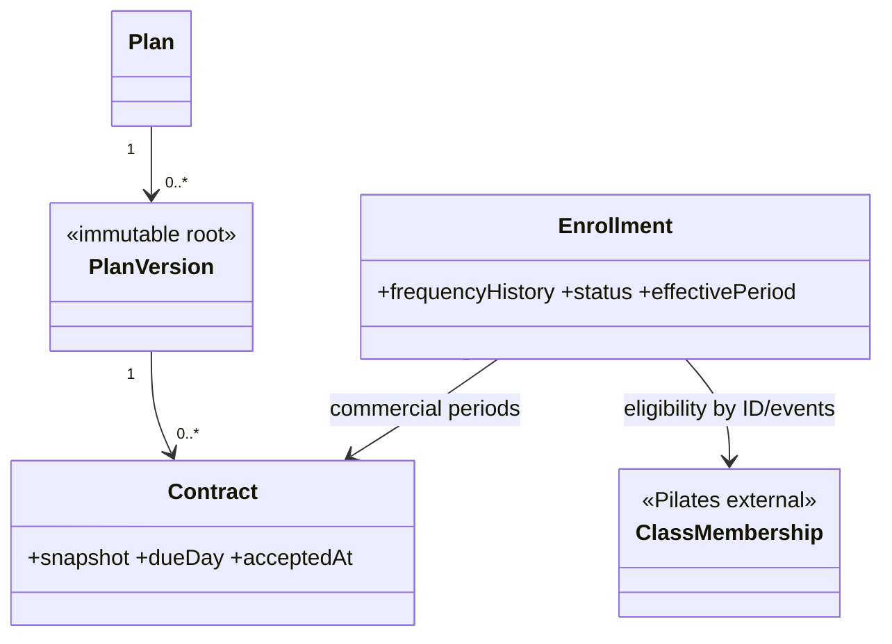
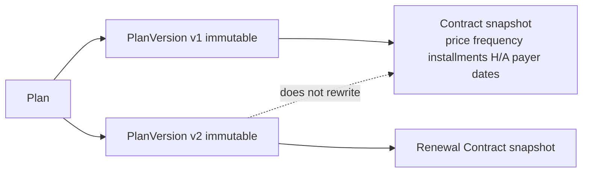
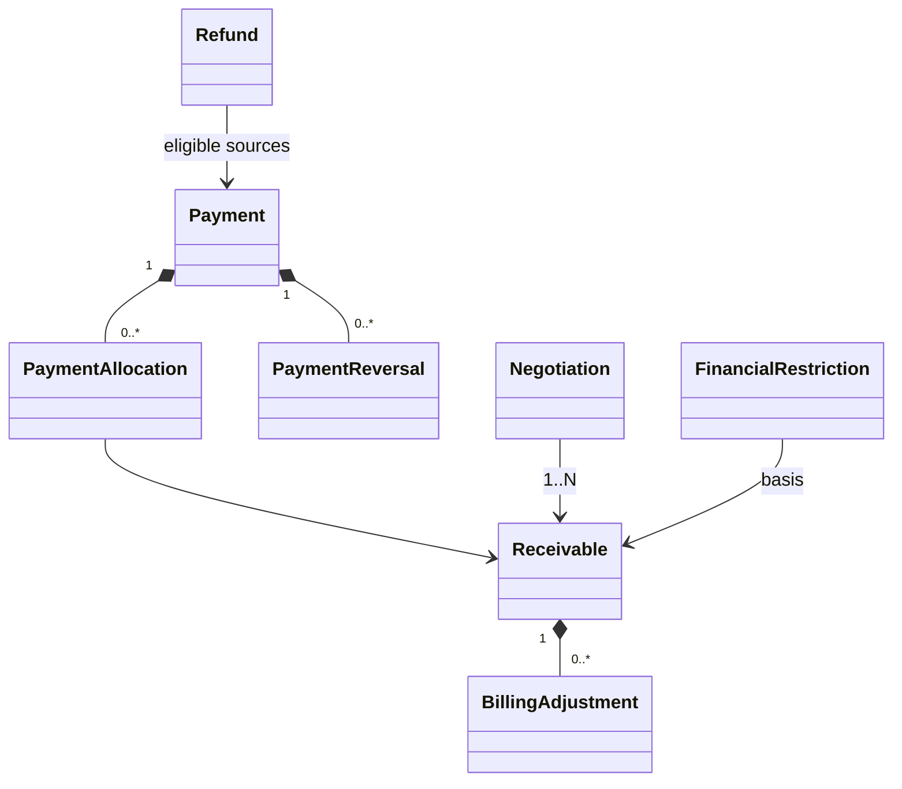
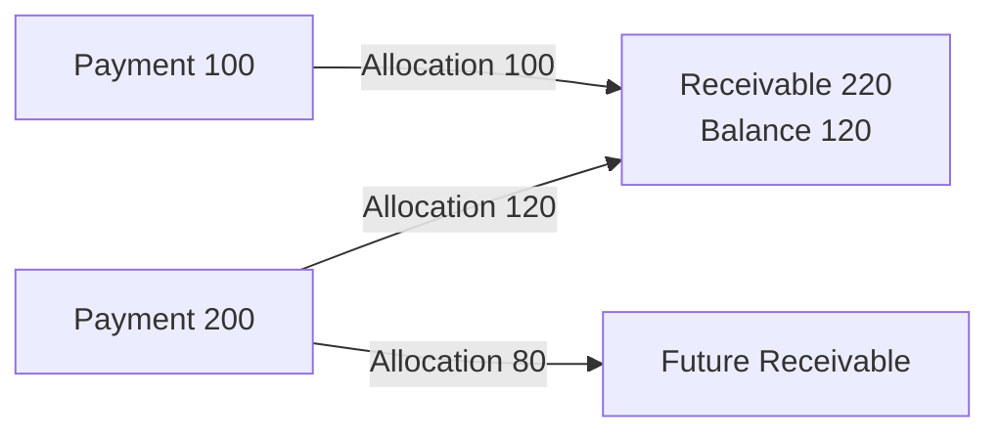
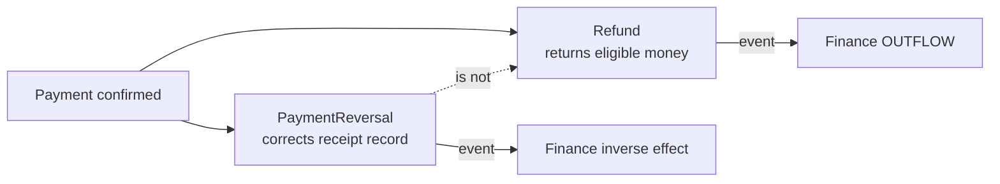
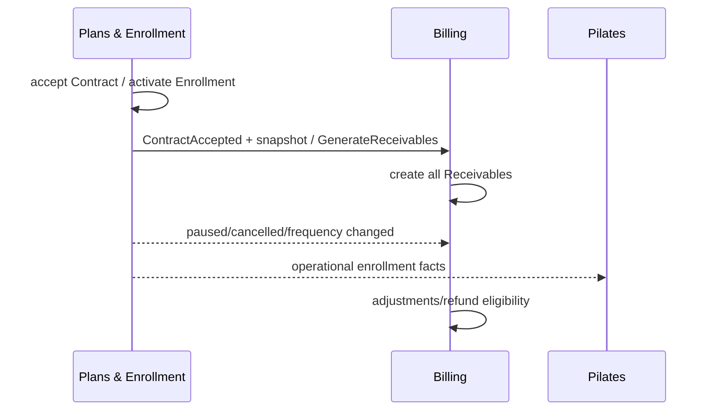
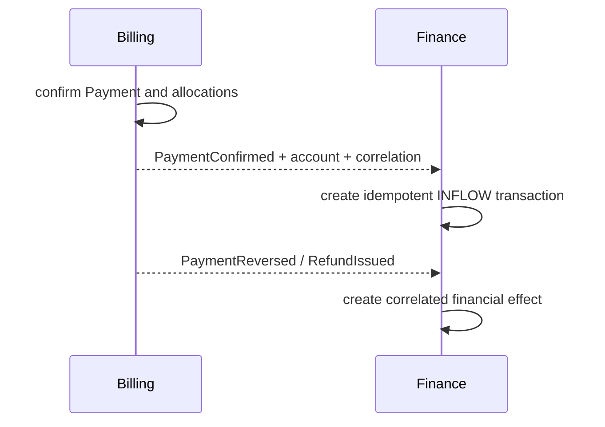
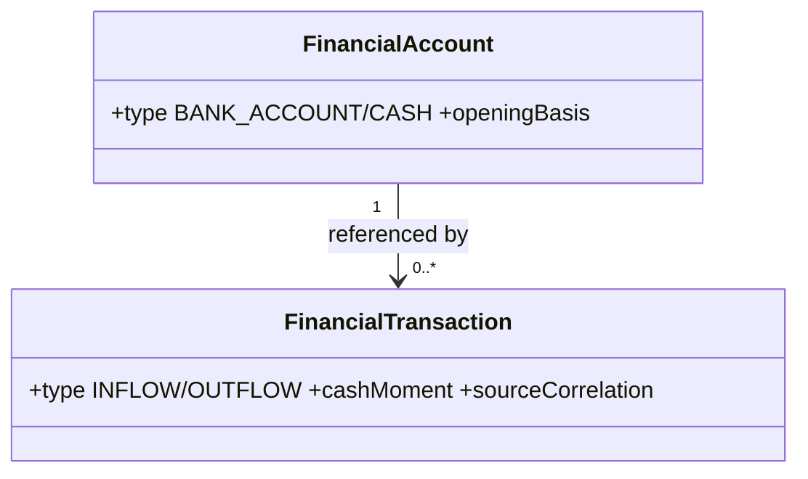
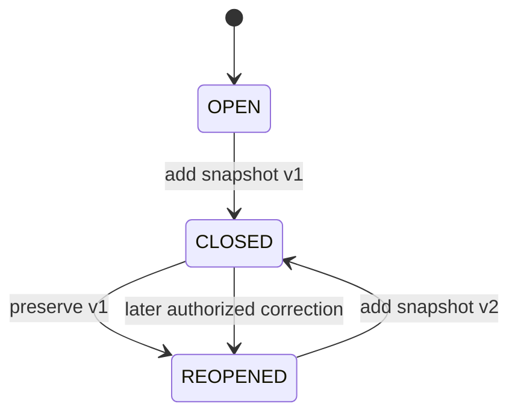
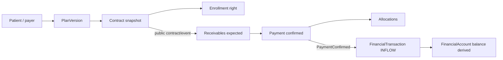

# MODEL-004 — Plans / Billing / Finance

## 1. Status

- **Tarefa:** MODEL-004
- **Status:** DONE
- **Data:** 2026-09-15
- **Natureza:** modelo conceitual de domínio
- **Boundaries normativos:** `docs/architecture/CONTEXT_MAP.md` e `docs/architecture/OWNERSHIP_MAP.md`
- **Modelos anteriores:** MODEL-001, MODEL-002 e MODEL-003
- **Próxima tarefa:** MODEL-005 — Modelo Conceitual Integrado

O modelo atende aos critérios desta etapa e não possui blocker conhecido para MODEL-005. Entidades, aggregate roots, value objects, policies, operações e eventos são candidatos conceituais; não definem tabelas, IDs físicos, transações, APIs, DTOs, locks, algoritmos de conciliação ou integrações.

## 2. Objetivo

Definir o modelo conceitual de Plans & Enrollment, Billing e Finance de modo que seja possível distinguir e auditar: o acordo contratado; o direito operacional; a obrigação a receber; o dinheiro confirmado e sua alocação; reversões e reembolsos; restrições financeiras; contas, entradas, saídas, despesas, transferências, conciliações e fechamentos mensais versionados.

## 3. Escopo

- Plans & Enrollment: Plan, PlanVersion, Contract, Enrollment, contratação, renovação, pausa, retomada, cancelamento e mudança de frequência.
- Billing: Receivable, Payment, PaymentAllocation, PaymentReversal, Refund, BillingAdjustment, Negotiation e FinancialRestriction.
- Finance: FinancialAccount, FinancialTransaction, Expense, ExpenseCategory, Transfer, ReconciliationAdjustment, Closing e ClosingSnapshot.
- Snapshots, vigência, competência versus caixa, previsto versus realizado, operações, eventos, processos, invariantes e concorrência.
- Referências a PatientProfile, pagador, Unit, ClassMembership, InstitutionalCalendar, UserAccount e fatos públicos entre os três contexts.

## 4. Fora de Escopo

- banco, tabelas, SQL, migrations, chaves, precisão física monetária, índices, ORM e estratégia de lock;
- C#, endpoints, DTOs, repositories, React, telas, Docker ou relatórios físicos;
- gateway/provider de pagamento, integração bancária e algoritmo técnico de conciliação;
- máquina de estados formal, matriz final de permissões, alçadas finais de desconto/negociação e estratégia física de eventos/idempotência;
- política detalhada dos Receivables vencidos no cancelamento e pagamento parcial de Expense;
- Commission, que não existe atualmente e está fora do MVP;
- MODEL-005 e qualquer modelo lógico ou implementação.

## 5. Princípios Herdados

1. Cada fato transacional possui um owner único; referência, evento, snapshot ou read model não transfere ownership.
2. Plans & Enrollment não registra dinheiro; Billing não escreve internals de Finance; Finance não altera Payment, Allocation ou Receivable.
3. `Payment != FinancialTransaction`: o primeiro liquida obrigação em Billing; o segundo movimenta conta em Finance.
4. Oferta, acordo, obrigação, liquidação e movimento de caixa são conceitos distintos.
5. Histórico relevante é preservado por versão, vigência, ajuste, reversão e snapshot, não por sobrescrita destrutiva.
6. Competência pertence ao período econômico da obrigação; caixa pertence ao instante real da movimentação.
7. Receivable/Expense representam previsto; FinancialTransaction representa realizado em conta. Payment representa realizado da obrigação, ainda distinto do movimento de conta.
8. Valores operacionais configuráveis não viram constantes estruturais.
9. Operações financeiras sensíveis registram ator ou processo, instante, motivo, origem e correlação aplicáveis.
10. Autoridade técnica não implica autoridade comercial ou financeira.

## 6. Plans

### 6.1 Plan

**Classificação:** entity e aggregate root candidate.

Plan é a identidade duradoura de um produto comercial do catálogo. Os planos atuais são mensal, trimestral e semestral, mas duração/natureza não formam enum estrutural fechado.

**Atributos conceituais:** `planId`, nome, descrição comercial, status `ACTIVE/INACTIVE` e metadados de criação/inativação. Plan não carrega preço corrente mutável nem dinheiro recebido.

Inativar Plan impede novas versões/contratações ordinárias, sem afetar PlanVersions ou Contracts históricos.

### 6.2 Benefit / Entitlement / ContractAmendment

- **Benefit:** deferred concept; a documentação não define benefício independente com identidade/lifecycle.
- **Entitlement:** deferred concept; o direito operacional confirmado é suficientemente representado por Enrollment e sua frequência/vigência pública nesta etapa.
- **ContractAmendment:** deferred concept; mudança de frequência é preservada no histórico efetivo de Enrollment e renovação cria novo Contract. Nenhuma regra exige aditivo contratual genérico agora.

Se adotados depois, pertencem exclusivamente a Plans & Enrollment. Não são aliases para ClassMembership, BillingAdjustment ou FinancialRestriction.

## 7. PlanVersion

**Classificação:** immutable entity e aggregate root candidate separado, ligado a Plan.

PlanVersion representa condições comerciais publicadas em determinada vigência. É root diretamente referenciável porque Contract fixa uma versão, versões podem ser consultadas/publicadas sem carregar o catálogo inteiro e imutabilidade histórica não deve depender de editar Plan.

**Atributos conceituais:** `planVersionId`, `planId`, frequência semanal, valor de parcela, quantidade de parcelas, valor total, H/A, vigência comercial, condições/parâmetros aplicáveis, instante/ator da publicação e disponibilidade para novas contratações.

Depois de publicada ou usada, não é alterada. Mudança de preço, frequência oferecida, parcelas, H/A ou condição cria nova PlanVersion. Encerrar disponibilidade comercial não invalida uso histórico.

## 8. Contract

**Classificação:** entity e aggregate root candidate.

Contract é o acordo efetivamente aceito. Preserva, sem consulta futura ao catálogo, snapshot de paciente, pagador, PlanVersion, nome/condição do plano, frequência, valores, quantidade de parcelas, valor total, H/A aplicável, data inicial, data final prevista, dueDay e condições aceitas, além de aceite, ator/processo e timestamps.

Estados conceituais mínimos podem distinguir `DRAFT`, `ACCEPTED`, `CANCELLED` e `COMPLETED`; a máquina formal fica para STATE-001. Aceite fixa o snapshot. Cancelamento registra efeito imediato e motivo, não apaga o acordo.

Renovação cria novo Contract, associado ao mesmo Enrollment contínuo quando o vínculo operacional continua. Usa a PlanVersion vigente, salvo exceção comercial explicitamente registrada. Não sobrescreve o contrato anterior.

## 9. Enrollment

**Classificação:** entity e aggregate root candidate separado de Contract.

Enrollment representa o vínculo/direito operacional do paciente. Contém `enrollmentId`, `patientId`, vínculo ao Contract inicial e Contracts sucessivos por relação, serviço/escopo sustentado, frequência vigente e seu histórico efetivo, período operacional e status conceitual `DRAFT`, `ACTIVE`, `PAUSED`, `CANCELLED` ou `COMPLETED`.

Contract e Enrollment são separados porque o acordo comercial é um snapshot renovável, enquanto o vínculo operacional pode permanecer contínuo por vários Contracts. Um Contract aceito pode aguardar ativação; um Enrollment pode sobreviver à renovação sem perder seu histórico operacional.

### 9.1 Pausa

PauseEnrollment registra período, motivo, ator e limite/configuração aplicada. A pausa é no máximo o parâmetro vigente de 15 dias, libera vaga, não cobra o período correspondente, não prolonga a data final do Contract e exige disponibilidade no retorno. Plans publica o fato; Billing calcula ajustes/refund próprios; Pilates encerra/libera ou recria efeitos próprios. Plans não edita Receivable nem ClassMembership.

### 9.2 Cancelamento

CancelEnrollment tem efeito operacional imediato, sem multa, preserva histórico e elimina direito futuro. Billing cancela/ajusta somente obrigações futuras elegíveis e calcula Refund quando aplicável. Débitos anteriores legitimamente vencidos não desaparecem automaticamente; seu tratamento detalhado permanece aberto.

### 9.3 Mudança de frequência e unidade/turma

ChangeFrequency cria nova vigência dentro do histórico do Enrollment; não sobrescreve a frequência passada. Billing pode reagir com ajuste proporcional próprio. Mudança de unidade/turma não recria Person, PatientProfile, Contract ou Enrollment e é efetivada por Pilates nos ClassMemberships que possui.

## 10. Billing

Billing possui obrigações e liquidações do cliente. Recebe fatos/snapshots de Plans, referências de Patients e catálogo público de FinancialAccount. Não possui saldo, conta, Expense, Closing ou movimento financeiro.

## 11. Receivable

**Classificação:** entity e aggregate root candidate.

Receivable é uma obrigação financeira, nunca dinheiro recebido. Todos os Receivables do Contract são criados quando a contratação é aceita/ativada conforme o fluxo coordenado.

**Atributos conceituais:** `receivableId`, `contractId`, `enrollmentId?`, `patientId`, payer snapshot, competência, valor original, total de ajustes válidos, valor devido atual derivável, valor pago derivável, saldo derivável, DueDate concreta, InstallmentNumber, origem e status conceitual `OPEN`, `PARTIALLY_PAID`, `PAID`, `OVERDUE` ou `CANCELLED`.

`OVERDUE` é uma classificação derivada de saldo positivo + vencimento + tolerância vigente; pode ser materializada para operação, mas não duplica uma verdade independente. Inadimplência não precisa de outro status: a ação operacional é FinancialRestriction.

DueDay contratado é 5, 10, 15, 20 ou 25 conforme parâmetro. Receivable preserva a data concreta calculada; sábado, domingo ou Holiday aplicável deslocam ao próximo dia útil.

No primeiro período parcial, o valor devido usa aulas restantes × H/A da PlanVersion. Fórmula, quantidades, H/A, origem e policy aplicada ficam rastreáveis por BillingAdjustment de pró-rata; não há substituição silenciosa do valor.

## 12. Payment

**Classificação:** entity e aggregate root candidate.

Payment é dinheiro recebido/confirmado sob a ótica da obrigação. Preserva pagador, valor, momento, método (`PIX`, `CASH`, `CREDIT`, `DEBIT`, `BOLETO`, `TRANSFER`), `financialAccountId` de destino declarado, `userAccountId`/origem, referência externa opcional e status conceitual `CONFIRMED`, `PARTIALLY_REVERSED` ou `REVERSED`.

Pagamento confirmado não é apagado ou editado para simular correção. A soma alocada válida e o valor reversível são derivados de seus children/fatos associados. Método não muda preço automaticamente. Quando a operação usar parcelamento no cartão, a quantidade não pode exceder a quantidade correspondente ao plano/Contract. Pagador pode ser terceiro; o Payment preserva quem pagou sem reescrever ResponsiblePayerLink ou snapshots anteriores.

## 13. PaymentAllocation

**Classificação:** child entity do Payment aggregate.

PaymentAllocation liga um Payment a exatamente um Receivable e preserva valor, instante, ator/processo, ordem/origem e estado histórico necessário. Um Payment pode ter `0..N` allocations; um Receivable recebe `0..N` allocations de Payments distintos.

Essa fronteira concentra no Payment a invariante de valor disponível e impede duas alocações concorrentes consumirem o mesmo saldo. A operação também coordena o Receivable referenciado para impedir saldo negativo; isso não transforma os dois roots em aggregate único.

Pagamento parcial, vários pagamentos por Receivable, um Payment para vários Receivables e antecipação são naturais. Exemplo: obrigação 220 + allocation válida de 100 = saldo 120 e estado PARTIALLY_PAID. Antecipação pode alocar a Receivables futuros. Discount de antecipação é opcional: `NONE`, `PERCENTAGE` ou `FIXED_AMOUNT`.

Reallocation, se necessária, invalida/substitui relações por operação auditável; nunca reescreve silenciosamente a allocation passada. Sua política detalhada fica para implementação.

## 14. PaymentReversal

**Classificação:** immutable child entity do Payment aggregate.

PaymentReversal corrige total ou parcialmente um Payment confirmado, preservando `paymentId`, valor revertido, motivo, ator e momento. A soma de reversões válidas não excede o valor reversível. A operação precisa coordenar allocations afetadas sem apagá-las; a precedência detalhada entre reallocation e reversal será fechada antes da implementação.

Payment parcialmente revertido permanece `PARTIALLY_REVERSED`; totalmente revertido, `REVERSED`. O fato público permite a Finance criar efeito próprio, sem alterar o Payment original.

## 15. Refund

**Classificação:** entity e aggregate root candidate próprio.

Refund representa devolução real de dinheiro e possui lifecycle/auditoria próprios; não é Payment negativo nem PaymentReversal. Referencia pagador, Payment/allocations/Receivables elegíveis, motivo/origem, valor, conta financeira de saída, ator/processo, timestamps e status conceitual suficiente para distinguir emissão e conclusão; a máquina formal é posterior.

No cancelamento já pago: valor elegível = aulas não utilizadas × H/A, limitado ao valor pago elegível. Na pausa já paga: devolve a parte não utilizada. A soma de Refunds válidos concorrentes não excede o valor elegível restante.

Estados conceituais mínimos são `ISSUED`, `COMPLETED` e `CANCELLED`, sem antecipar provider. Se emissão e conclusão forem fatos operacionais distintos, exatamente um deles representa a saída real para Finance; correlação/idempotência impede dupla movimentação.

## 16. BillingAdjustment

**Classificação:** immutable child entity do Receivable aggregate.

Registra mudança legítima da obrigação, positiva ou negativa, com tipo (`PRORATA`, `PAUSE`, `FREQUENCY_CHANGE`, `CANCELLATION`, `DISCOUNT`, `AUTHORIZED_CORRECTION`), origem, motivo, valor, regra/policy aplicada, data e ator/processo. Correção de ajuste usa novo fato compensatório; não apaga o anterior.

`currentAmount = originalAmount + soma dos ajustes válidos`. O resultado não pode ser negativo. Pausa/cancelamento/frequência chegam como fatos de Plans; Billing decide e registra somente seu efeito monetário.

Durante pausa, o valor final devido corresponde a aulas efetivamente disponíveis × H/A. O Receivable mantém valor original, ajustes e valor final; se a parcela já foi paga, a diferença elegível segue para Refund, não para edição do Payment.

## 17. Negotiation

**Classificação:** entity e aggregate root candidate.

Negotiation possui lifecycle próprio porque pode abranger um ou mais Receivables, proposta, contraproposta/termos aceitos, ator, competência temporal, motivo, status e evidência de aprovação. É root por auditoria, alçada futura e possibilidade de múltiplas obrigações; não é simples setter do Receivable.

Uma negociação aceita só altera obrigações por BillingAdjustments/efeitos explícitos em Billing. Não apaga dívida nem inventa limite de desconto. Alçadas de Secretária e Proprietária permanecem pendentes antes da implementação.

## 18. FinancialRestriction

**Classificação:** entity e aggregate root candidate.

FinancialRestriction registra a restrição operacional decidida por Billing, com paciente/Enrollment quando aplicável, razão, base em obrigações vencidas, vigência, ator/processo, aplicação e remoção. Seu lifecycle é independente do Enrollment.

Billing deriva inadimplência de saldo, vencimento e tolerância configurável (inicialmente 5 dias), podendo publicar aplicação/remoção. A primeira ação de cobrança ocorre em D+2; multa e juros são NONE. FinancialRestriction nunca equivale a `Enrollment.PAUSED` nem cancela Enrollment automaticamente.

## 19. Finance

Finance possui contas, movimentos reais, despesas, transferências, conciliação e fechamento. Consome fatos confirmados de Billing de forma idempotente e lê projeções autorizadas para Closing; não corrige Billing.

### 19.1 Requisitos de autorização

- Proprietária possui acesso financeiro amplo, sujeito a permissões e auditoria.
- Secretária opera Billing/Finance somente dentro das permissões e alçadas concedidas.
- Desenvolvedor só possui permissões financeiras quando explicitamente concedidas; papel técnico nunca implica finance admin.
- Fisioterapeuta não possui acesso financeiro padrão.

A matriz final e as alçadas permanecem fora desta etapa.

## 20. FinancialAccount

**Classificação:** entity e aggregate root candidate.

Representa local onde a clínica mantém dinheiro. Tipos iniciais: `BANK_ACCOUNT` e `CASH`. A operação atual tem duas contas bancárias e um caixa compartilhado, mas o modelo aceita qualquer quantidade autorizada e não exige conta por Unit.

Preserva identidade, tipo, nome/descrição, status, moeda aplicável e base de saldo inicial quando necessária, com instante/proveniência auditáveis. Saldo não é campo manual primário: `opening balance + inflows - outflows`. Divergência gera ReconciliationAdjustment explícito.

## 21. FinancialTransaction

**Classificação:** entity e aggregate root candidate independente, referenciando uma FinancialAccount.

Representa entrada/saída real em uma conta, com tipo `INFLOW` ou `OUTFLOW`, Money, `financialAccountId`, instante de caixa, origem/correlação, ator/processo e descrição mínima. É root separado da conta por volume, concorrência, append histórico e consultas por período; FinancialAccount não contém coleção crescente de movimentos.

PaymentConfirmed gera FinancialTransaction própria em Finance. A correlação conceitual/idempotência garante que um Payment ou outro fato de origem não gere duas transações equivalentes. PaymentReversed e RefundIssued/Completed produzem movimentos correlacionados próprios conforme o fato confirmado; Finance não altera Billing.

## 22. Expense

**Classificação:** entity e aggregate root candidate.

Expense é obrigação/gasto da clínica e pode existir antes da saída. Contém descrição, ExpenseCategory, valor, competência, vencimento, scope `UNIT/GLOBAL`, `unitId` obrigatório apenas em UNIT, beneficiário/fornecedor quando aplicável, status conceitual `OPEN`, `PAID`, `OVERDUE` ou `CANCELLED`, e conta/movimento quando paga.

Expense é previsto de saída; FinancialTransaction OUTFLOW é realizado. Pagamento cria/correlaciona movimento e marca PAID sem fundir entidades. Pagamento parcial de Expense não está adotado; nenhuma condição `PARTIALLY_PAID` é criada.

**ExpenseCategory:** entity e aggregate root candidate de catálogo configurável, com nome, status e vigência quando necessário. Exemplos atuais (aluguel, água, energia, internet, telefone, materiais, limpeza, manutenção, equipamentos, pessoal, impostos/taxas, terceirizados, software, marketing, tarifas bancárias e outros) não são enum imutável.

## 23. Transfer

**Classificação:** entity e aggregate root candidate.

Transfer registra origem, destino distintos, valor, instante, ator, motivo/referência e correlação de exatamente um OUTFLOW na conta origem com exatamente um INFLOW na conta destino. Não é receita, despesa ou dois fatos sem relação. Seu efeito no saldo consolidado da clínica é zero.

## 24. Reconciliation

**ReconciliationAdjustment — classificação:** entity e aggregate root candidate/registro imutável da operação de conciliação.

Quando o saldo real difere do esperado, registra conta, esperado, real, diferença, motivo, ator e timestamp. A diferença origina FinancialTransaction explícita correlacionada; nunca altera saldo diretamente. O modelo não escolhe algoritmo, importação bancária ou matching automático.

## 25. Closing

**Closing — classificação:** entity e aggregate root candidate por período mensal.

Preserva período, status conceitual `OPEN`, `CLOSED`, `REOPENED`, ator/motivo/timestamps e sequência de versões. O fechamento pode ocorrer com pendências e analisa receitas previstas/realizadas, pendentes/inadimplentes, despesas previstas/realizadas/pendentes/vencidas, saldos, resultado e previsto versus realizado.

As projeções do fechamento podem identificar devedores/pagadores no escopo autorizado, sem Finance se tornar owner de Patient, payer, Receivable ou Payment.

**ClosingSnapshot — classificação:** immutable child entity de Closing. Cada confirmação CLOSED acrescenta uma versão com cutoff/as-of, fontes/correlações e posição consolidada. Reabrir não apaga nem edita snapshots; registra REOPENED, permite correções nos owners e novo fechamento acrescenta outro snapshot.

ClosingSnapshot é child porque sua identidade e interpretação dependem de um único período/Closing, e a consistência exigida é sequência monotônica de versões. Não é root separado nem cópia mutável de read models.

## 26. Snapshots

| Snapshot | Owner | Conteúdo mínimo | Regra histórica |
|---|---|---|---|
| Contract snapshot | Plans & Enrollment | PlanVersion, plano/condições, paciente, pagador, frequência, H/A, parcelas, valores, datas e dueDay | fixado no aceite; catálogo/pagador futuros não o alteram |
| Receivable snapshot | Billing | Contract/origem, paciente, payer, competência, valor original, parcela e DueDate concreta | ajustes são fatos próprios; mudança de pagador/contrato não reescreve obrigação |
| ClosingSnapshot | Finance | versão/cutoff, saldos, movimentos, previsto/realizado, pendências, inadimplência, despesas e resultado | imutável; reabertura produz nova versão |

Snapshots existem para responder “o que se sabia/aceitou/calculou naquele momento”. Referências atuais podem enriquecer exibição, mas nunca substituem a evidência histórica.

## 27. Value Objects

| Value Object | Uso | Decisão |
|---|---|---|
| Money | todos os valores | adotado; valor + moeda e operações coerentes, sem escolher tipo decimal físico |
| BillingPeriod / CompetencePeriod | Receivable, Expense, Closing | adotado; identifica período econômico separado do caixa |
| DueDate | Receivable/Expense | adotado; data concreta e regra/calendário que a originou quando relevante |
| InstallmentNumber | Receivable/Contract | adotado; posição e total coerentes sem semântica física |
| Discount | antecipação/negociação | adotado; NONE, PERCENTAGE ou FIXED_AMOUNT, valor/alçada externos |
| Percentage | Discount | adotado quando percentual; faixa semântica válida, sem precisão física definida |
| DateRange | vigências/pausa | adotado; início/fim coerentes e bordas explicitáveis |
| FinancialAccountReference | Billing/Finance | adotado; ID + contexto mínimo validado, sem copiar conta/saldo |

Status, métodos, tipos de movimento e motivos permanecem atributos/catálogos conceituais; não há benefício em criar VO para cada um.

## 28. Aggregate Candidates

| Contexto | Root candidato | Conteúdo local | Justificativa |
|---|---|---|---|
| Plans | Plan | identidade/status do produto | lifecycle do catálogo sem carregar versões |
| Plans | PlanVersion | condição publicada imutável | referência direta, histórico e publicação independente |
| Plans | Contract | snapshot/aceite/cancelamento | acordo consistente e renovável sem alterar Enrollment |
| Plans | Enrollment | direito, status e histórico efetivo | lifecycle operacional contínuo e independente de contratos sucessivos |
| Billing | Receivable | BillingAdjustments | obrigação e saldo devido consistentes |
| Billing | Payment | PaymentAllocations e PaymentReversals | protege valor disponível/reversível sob concorrência |
| Billing | Refund | elegibilidade e execução | devolução real, auditável e concorrente |
| Billing | Negotiation | escopo/termos/aprovação | lifecycle e alçada próprios, possivelmente multi-receivable |
| Billing | FinancialRestriction | aplicação/remoção/vigência | lifecycle operacional e publicação independentes |
| Finance | FinancialAccount | identidade/base inicial | conta pública sem coleção crescente de movimentos |
| Finance | FinancialTransaction | movimento/correlação | alto volume, append e idempotência independente |
| Finance | ExpenseCategory | catálogo configurável | lifecycle e reutilização por muitas despesas |
| Finance | Expense | obrigação/pagamento | previsto separado do movimento realizado |
| Finance | Transfer | par correlacionado | atomicidade conceitual e resultado consolidado zero |
| Finance | ReconciliationAdjustment | diferença/evidência | auditabilidade e movimento próprio |
| Finance | Closing | ClosingSnapshots | sequência mensal/versionada consistente |

Não existe aggregate financeiro gigante. Consistência entre roots é coordenada por operações do contexto; entre contexts, por contratos/eventos e idempotência futura.

## 29. Relationships / Cardinalities

1. Plan `1 → 0..N` PlanVersion; cada versão pertence a exatamente um Plan.
2. PlanVersion `1 → 0..N` Contract; cada Contract referencia exatamente uma versão e preserva snapshot.
3. PatientProfile `1 → 0..N` Contract e `1 → 0..N` Enrollment por referência.
4. Enrollment `1 → 1..N` Contract ao longo do vínculo após ativação; Contract aceito referencia `0..1` Enrollment até a coordenação de ativação e exatamente um quando sustenta o vínculo.
5. Enrollment `1 → 0..N` ClassMembership por referência externa; Pilates é owner.
6. Contract `1 → 1..N` Receivable conforme parcelas/primeiro período; Billing é owner.
7. Receivable `1 → 0..N` BillingAdjustment.
8. Payment `1 → 0..N` PaymentAllocation e `1 → 0..N` PaymentReversal.
9. Payment e Receivable possuem relação `N ↔ N` por PaymentAllocation.
10. Refund referencia `1..N` fontes elegíveis de Payment/Allocation/Receivable conforme o caso, sem composição destrutiva.
11. Negotiation referencia `1..N` Receivable; seus efeitos usam ajustes explícitos.
12. FinancialRestriction referencia um Patient e opcionalmente Enrollment/Receivables causadores.
13. FinancialAccount `1 → 0..N` FinancialTransaction por referência, sem coleção no aggregate.
14. ExpenseCategory `1 → 0..N` Expense; cada Expense usa uma categoria vigente.
15. Expense `1 → 0..1` FinancialTransaction de pagamento nesta necessidade atual.
16. Transfer referencia duas FinancialAccounts distintas e exatamente dois FinancialTransactions correlacionados.
17. ReconciliationAdjustment referencia uma conta e uma FinancialTransaction de ajuste.
18. Closing `1 → 1..N` ClosingSnapshot após o primeiro fechamento; cada snapshot pertence a um Closing mensal.

## 30. Invariants

### Plans / Enrollment

- `INV-PLN-001`: PlanVersion publicada/usada é imutável; mudança cria nova versão.
- `INV-PLN-002`: Contract aceito preserva integralmente condições e partes contratadas.
- `INV-PLN-003`: renovação cria Contract novo e não sobrescreve o anterior.
- `INV-PLN-004`: Plans não cria/edita Receivable, Payment, ClassMembership ou FinancialTransaction.
- `INV-ENR-001`: Enrollment e Contract são roots distintos; renovação pode manter Enrollment contínuo.
- `INV-ENR-002`: pausa não excede limite vigente, não mantém vaga e não prolonga Contract.
- `INV-ENR-003`: cancelamento tem efeito operacional imediato, sem multa, e preserva histórico.
- `INV-ENR-004`: mudança de frequência possui vigência e não reescreve frequência passada.
- `INV-ENR-005`: FinancialRestriction não é Enrollment.PAUSED.

### Billing

- `INV-BIL-001`: Receivable é obrigação; Payment é liquidação; nenhum representa FinancialTransaction.
- `INV-BIL-002`: todos os Receivables do Contract são gerados uma única vez conceitualmente na contratação/ativação.
- `INV-BIL-003`: dueDay permitido gera DueDate concreta no próximo dia útil aplicável.
- `INV-BIL-004`: pró-rata usa aulas restantes × H/A e mantém origem/regra rastreáveis.
- `INV-BIL-005`: soma de allocations válidas não excede valor disponível do Payment.
- `INV-BIL-006`: valor pago/saldo do Receivable são deriváveis; saldo nunca fica negativo.
- `INV-BIL-007`: Payment confirmado não é apagado.
- `INV-BIL-008`: soma de reversals não excede valor reversível e cada reversal preserva motivo/ator/momento.
- `INV-BIL-009`: Refund não excede valor pago elegível restante.
- `INV-BIL-010`: Refund e PaymentReversal são fatos distintos.
- `INV-BIL-011`: BillingAdjustment preserva valor original e não produz obrigação negativa.
- `INV-BIL-012`: payer snapshot não é reescrito por mudança de ResponsiblePayerLink.
- `INV-BIL-013`: atraso deriva de saldo + vencimento + tolerância; multa/juros não são aplicados.
- `INV-BIL-014`: Billing não escreve FinancialAccount ou FinancialTransaction.
- `INV-BIL-015`: parcelamento em cartão, quando usado, não excede a quantidade correspondente ao plano/Contract.

### Finance

- `INV-FIN-001`: toda FinancialTransaction pertence a exatamente uma FinancialAccount.
- `INV-FIN-002`: saldo é derivado de base inicial auditável + FinancialTransactions; não é editado diretamente.
- `INV-FIN-003`: um fato de origem não gera duas FinancialTransactions equivalentes.
- `INV-FIN-004`: Expense não é FinancialTransaction; previsto e realizado permanecem separados.
- `INV-FIN-005`: Expense UNIT possui UnitId; Expense GLOBAL não recebe Unit artificial.
- `INV-FIN-006`: Transfer gera saída + entrada correlacionadas, contas distintas e efeito consolidado zero.
- `INV-FIN-007`: ReconciliationAdjustment explicita esperado, real, diferença, motivo, ator e momento.
- `INV-FIN-008`: Closing mensal pode conter pendências e cada CLOSED acrescenta snapshot imutável.
- `INV-FIN-009`: reabertura preserva todos os snapshots anteriores.
- `INV-FIN-010`: Finance não altera Payment, Allocation, Reversal, Refund ou Receivable.
- `INV-FIN-011`: competência e caixa são preservados separadamente.
- `INV-FIN-012`: Commission não é criada no MVP.

## 31. Conceptual Operations

| Contexto | Operações | Resultado/guardrail |
|---|---|---|
| Plans | CreatePlan / CreatePlanVersion | cria catálogo e versão imutável |
| Plans | CreateContract / AcceptContract | fixa snapshot e aceite, sem gerar dinheiro |
| Plans | ActivateEnrollment | ativa direito separado do Contract |
| Plans | PauseEnrollment / ResumeEnrollment | registra fato operacional; retorno depende de disponibilidade |
| Plans | CancelEnrollment | encerra direito imediatamente e publica fato |
| Plans | RenewContract | cria novo Contract e mantém histórico |
| Plans | ChangeFrequency | cria nova vigência e publica fato |
| Billing | GenerateReceivables | cria lote completo uma vez a partir do snapshot contratual |
| Billing | AdjustReceivable | anexa BillingAdjustment rastreável |
| Billing | RegisterPayment | confirma Payment com conta/registrador |
| Billing | AllocatePayment / ReallocatePayment | aplica valor disponível; reallocation somente se sustentada e auditável |
| Billing | ReversePayment | anexa reversal total/parcial sem apagar original |
| Billing | IssueRefund | cria devolução real dentro da elegibilidade |
| Billing | CreateNegotiation | registra termos/lifecycle sem perdão arbitrário |
| Billing | ApplyFinancialRestriction / RemoveFinancialRestriction | altera restrição própria, nunca Enrollment |
| Finance | CreateFinancialAccount | cria conta BANK_ACCOUNT/CASH |
| Finance | RecordFinancialTransaction | registra movimento real e correlacionado |
| Finance | RegisterExpense / PayExpense | separa obrigação prevista de saída realizada |
| Finance | TransferMoney | produz par correlacionado sem resultado |
| Finance | ReconcileAccount | explicita diferença e movimento de ajuste |
| Finance | CloseMonth / ReopenClosing | acrescenta/preserva versões mensais |

## 32. Candidate Events

| Evento | Owner | Fato | Consumidores potenciais |
|---|---|---|---|
| ContractCreated | Plans | draft contratual foi criado | projeções autorizadas |
| ContractAccepted | Plans | snapshot foi aceito | Billing, CRM, Reports |
| ContractRenewed | Plans | novo Contract renovou vínculo | Billing, CRM, Reports |
| ContractCancelled | Plans | acordo foi cancelado sem apagar histórico | Billing, Reports |
| EnrollmentActivated | Plans | direito operacional iniciou | Pilates, Billing, CRM |
| EnrollmentPaused | Plans | direito entrou em pausa efetiva | Billing, Pilates, Communication |
| EnrollmentResumed | Plans | direito retomou | Pilates, Billing |
| EnrollmentCancelled | Plans | direito terminou imediatamente | Billing, Pilates, Reports |
| EnrollmentCompleted | Plans | vínculo concluiu regularmente | Billing, Pilates, Reports |
| PlanFrequencyChanged | Plans | nova frequência entrou em vigência | Billing, Pilates |
| ReceivablesGenerated | Billing | obrigações do Contract foram criadas | Plans (resultado), Reports |
| ReceivableAdjusted | Billing | obrigação recebeu ajuste rastreável | Reports, Communication |
| ReceivableOverdue | Billing | condição derivada de atraso ocorreu | Communication, Reports |
| PaymentRegistered | Billing | recebimento foi registrado | projeções Billing |
| PaymentConfirmed | Billing | dinheiro foi confirmado na obrigação | Finance, Communication, Reports |
| PaymentAllocated | Billing | valor foi aplicado a obrigação | Reports, Communication |
| PaymentReversed | Billing | valor confirmado foi revertido | Finance, Communication, Reports |
| RefundIssued | Billing | devolução foi autorizada/emitida | Finance, Communication, Reports |
| RefundCompleted | Billing | devolução real foi concluída | Finance/Reports quando o fato for distinto |
| NegotiationCreated | Billing | negociação ganhou lifecycle | Communication, Reports |
| FinancialRestrictionApplied | Billing | restrição passou a vigorar | Pilates, Scheduling, Plans, Communication |
| FinancialRestrictionRemoved | Billing | restrição deixou de vigorar | mesmos consumidores |
| FinancialTransactionCreated | Finance | movimento real foi registrado | Closing, Reports |
| ExpenseCreated | Finance | obrigação da clínica foi criada | Closing, Reports |
| ExpensePaid | Finance | Expense foi liquidada com saída real | Closing, Reports, Audit |
| MoneyTransferred | Finance | par entre contas foi concluído | Closing, Reports |
| ReconciliationAdjusted | Finance | divergência foi explicitamente ajustada | Closing, Audit, Reports |
| MonthClosed | Finance | nova versão mensal foi confirmada | Reports, Privacy & Audit |
| ClosingReopened | Finance | período foi reaberto preservando versões | Reports, Privacy & Audit |

Eventos públicos carregam IDs, valores estritamente necessários, conta/correlação, timestamps e versão contratual quando indispensável. Não carregam condições, dados pessoais ou detalhes financeiros desnecessários. O publisher continua owner do fato.

## 33. Cross-Context References

| Conceito local | Referência externa | Owner externo | Uso permitido |
|---|---|---|---|
| Contract/Enrollment | PatientId, payer PersonId, PayerLinkId? | Patients/People | validar partes e criar snapshot próprio |
| Enrollment | ClassMembershipId? | Pilates | correlação/read; Plans não cria membership |
| Contract/Expense | UnitId? | Organization | contexto, nunca cópia de Unit |
| Receivable | ContractId/EnrollmentId | Plans | origem/snapshot; Billing não altera contrato |
| Payment/Refund | FinancialAccountId | Finance | validar catálogo público; Billing não lê saldo |
| FinancialTransaction | Payment/Reversal/RefundId | Billing | correlação/idempotência; Finance não altera origem |
| Closing | Billing read models | Billing | previsto, realizado da obrigação e inadimplência somente leitura |
| operações sensíveis | UserAccountId | Identity & Access | ator/permissão; não implica alçada automática |
| vencimentos | Holiday/calendar público | Organization | calcular DueDate concreta sem editar calendário |

## 34. Read Models

- **ContractOverview:** Contract snapshot, Enrollment vigente e renovações, sem ownership transacional.
- **PatientBillingSummary:** obrigações, pagamentos, allocations, ajustes, refunds e restrição do paciente.
- **OpenReceivables:** saldos OPEN/PARTIALLY_PAID/OVERDUE derivados.
- **DelinquencyQueue:** saldo, vencimento, tolerância, ação D+2 e restrição aplicável.
- **CashFlowProjection:** saldos iniciais, realizado e entradas/saídas previstas por período.
- **FinancialPosition:** saldos por conta e posição consolidada em cutoff.
- **MonthlyClosingSummary:** conteúdo de uma versão de ClosingSnapshot.
- **AccountBalanceView:** base inicial + transactions de uma conta.
- **ExpectedVsActual:** Receivable/Expense previstos versus FinancialTransactions realizados, preservando competência e caixa.

Read models são reconstruíveis, não corrigem as fontes e não se tornam owners.

## 35. Concurrency Hotspots

| Operação | Risco | Invariante | Proteção futura necessária |
|---|---|---|---|
| RegisterPayment | registro duplicado da mesma entrada | INV-BIL-007 / INV-FIN-003 | correlação/idempotência e decisão atômica |
| AllocatePayment | duas allocations usam o mesmo disponível | INV-BIL-005 | consistência atômica no Payment |
| Allocate ao mesmo Receivable | saldo fica negativo | INV-BIL-006 | coordenação atômica do saldo derivado |
| ReversePayment vs allocation | reversão excede parte livre/alocada | INV-BIL-005/008 | precedência e validação conjunta futuras |
| IssueRefund concorrente | refunds excedem elegibilidade | INV-BIL-009 | reserva/consumo atômico da elegibilidade |
| AdjustReceivable | ajustes concorrentes geram valor inválido | INV-BIL-006/011 | versão e decisão atômica do Receivable |
| Pause/Cancel vs Payment | obrigação/refund usa estado inconsistente | INV-ENR-002/003, INV-BIL-009 | correlação temporal e precedência a definir |
| ChangeFrequency vs ajuste | duas bases monetárias são aplicadas | INV-ENR-004, INV-BIL-011 | idempotência por fato/vigência |
| PaymentConfirmed consumer | duas transactions equivalentes | INV-FIN-003 | consumo idempotente por correlação |
| Transfer/saldo | saída e entrada se separam ou saldo é lido no meio | INV-FIN-002/006 | conclusão coerente do par e cutoff |
| CloseMonth vs novas transactions | snapshot mistura cutoffs | INV-FIN-008/011 | cutoff/versionamento consistente |
| Reopen vs Close | versões simultâneas ou ordem ambígua | INV-FIN-008/009 | sequência monotônica/controle concorrente |

Nenhuma linha escolhe lock, isolamento, constraint ou mecanismo de mensageria.

## 36. Main Process Flows

### Contratação — PROC-PLN-001 / PROC-ENR-001 / PROC-BIL-001

Patient → selecionar PlanVersion vigente → definir pagador/snapshot → escolher dueDay → criar/aceitar Contract → ativar Enrollment → Plans publica fato/solicita contrato público → Billing gera todos os Receivables uma única vez. Plans não cria Receivable.

### Pausa — PROC-ENR-002/003

PauseEnrollment valida limite e término original → `EnrollmentPaused` → Billing calcula BillingAdjustments nos Receivables afetados e Refund se já pago → Pilates reage liberando vaga nos próprios fatos → ResumeEnrollment depende de disponibilidade. Não há chamada circular síncrona obrigatória.

### Cancelamento — PROC-ENR-004

Enrollment/Contract cancelado imediatamente → Billing cancela/ajusta obrigações futuras elegíveis → calcula Refund proporcional quando aplicável → débitos anteriores permanecem conforme regra existente → histórico de todos os contexts permanece.

### Renovação/frequência/unidade — PROC-ENR-005/006/007

Renovação cria Contract novo com PlanVersion vigente/exceção registrada e associa ao Enrollment contínuo. Frequência cria nova vigência e fatos para Billing/Pilates. Unidade/turma é alterada pelo owner do ClassMembership.

### Pagamento — PROC-BIL-002/003/004

Receivable → registrar Payment confirmado → alocar parcial/totalmente a um ou vários Receivables, inclusive futuros → derivar estado/saldo → publicar PaymentConfirmed → Finance cria FinancialTransaction INFLOW própria e idempotente.

### Negociação/restrição — PROC-BIL-005/008/009

Negociação autorizada registra termos e efeitos explícitos. Saldo vencido após tolerância pode aplicar FinancialRestriction → consumidores operacionais reagem. Regularização/regra autorizada remove a restrição; Enrollment não é pausado automaticamente.

### Reversal/refund — PROC-BIL-006/007

Reversal anexa correção total/parcial ao Payment e publica fato para efeito financeiro próprio. Refund calcula elegibilidade, registra devolução real separada e publica fato para OUTFLOW em Finance. Nenhum Payment é apagado.

### Expense — PROC-FIN-001/002

Expense criada OPEN com competência/vencimento/scope → vencimento pode derivar OVERDUE → pagamento autorizado cria OUTFLOW correlacionado → Expense PAID. Expense e transaction permanecem distintos.

### Transfer/reconciliation — PROC-FIN-003/004

Transfer cria par OUTFLOW/INFLOW correlacionado entre contas distintas. Conciliação compara esperado/real e, havendo divergência autorizada, registra ReconciliationAdjustment e transaction explícita.

### Closing — PROC-FIN-005/006

Período → consolidar posição em cutoff → apresentar pendências → usuário autorizado confirma → acrescentar ClosingSnapshot e marcar CLOSED. Reabrir registra REOPENED sem apagar versão; correções ocorrem nos owners; novo fechamento acrescenta snapshot.

### 36.1 Validação contra PROCESS_INDEX

| Processos | Conceitos/operações que suportam | Resultado |
|---|---|---|
| PROC-PLN-001 | PlanVersion, Contract snapshot, Create/AcceptContract | suportado sem Plans criar Receivable |
| PROC-ENR-001 | Enrollment e ActivateEnrollment | suportado |
| PROC-ENR-002/003 | pausa com DateRange, Pause/ResumeEnrollment, eventos downstream | suportados |
| PROC-ENR-004 | CancelEnrollment, ajustes/refund downstream e vencidos preservados | suportado sem inventar perdão |
| PROC-ENR-005 | novo Contract + Enrollment contínuo | suportado |
| PROC-ENR-006 | histórico efetivo de frequência + ajuste downstream | suportado |
| PROC-ENR-007 | Enrollment preservado + ClassMembership alterado por Pilates | suportado sem escrita cross-context |
| PROC-BIL-001 | lote completo de Receivables e idempotência conceitual | suportado |
| PROC-BIL-002/003 | Payment + Allocation total/parcial | suportados |
| PROC-BIL-004 | allocation em Receivable futuro + Discount opcional | suportado |
| PROC-BIL-005 | Negotiation root + BillingAdjustment explícito | suportado; alçadas abertas |
| PROC-BIL-006 | PaymentReversal total/parcial append-only | suportado |
| PROC-BIL-007 | Refund root, elegibilidade e evento para Finance | suportado |
| PROC-BIL-008/009 | FinancialRestriction independente com aplicação/remoção | suportados |
| PROC-FIN-001/002 | Expense OPEN → transaction OUTFLOW → PAID | suportados; parcial não adotado |
| PROC-FIN-003 | Transfer + par correlacionado | suportado |
| PROC-FIN-004 | ReconciliationAdjustment + transaction explícita | suportado sem algoritmo técnico |
| PROC-FIN-005/006 | Closing + snapshots imutáveis + reabertura | suportados |

## 37. Diagrams

### 37.1 Plans / Contract / Enrollment

### 37.2 PlanVersion + Contract snapshot

### 37.3 Billing

### 37.4 Payment Allocation

### 37.5 Reversal versus Refund

### 37.6 Plans to Billing

### 37.7 Billing to Finance

### 37.8 Finance accounts/transactions

### 37.9 Expenses

### 37.10 Closing/reopening

### 37.11 Integrated flow

## 38. Concept Matrix

| Conceito | Contexto | Tipo | Aggregate Root | Lifecycle | Histórico/Snapshot | Referências externas |
|---|---|---|---:|---|---|---|
| Plan | Plans | entity | sim | ACTIVE/INACTIVE | identidade preservada | — |
| PlanVersion | Plans | immutable entity | sim | publicada/disponível/encerrada | imutável | PlanId |
| Contract | Plans | entity | sim | DRAFT/ACCEPTED/CANCELLED/COMPLETED | snapshot no aceite | PatientId, payer PersonId, PlanVersionId |
| Enrollment | Plans | entity | sim | DRAFT/ACTIVE/PAUSED/CANCELLED/COMPLETED | vigência/frequência histórica | PatientId, Contracts; memberships por ID |
| Benefit | Plans | deferred concept | não | — | sem evidência suficiente | — |
| Entitlement | Plans | deferred concept | não | — | Enrollment cobre direito atual | — |
| ContractAmendment | Plans | deferred concept | não | — | sem lifecycle sustentado | — |
| Receivable | Billing | entity | sim | OPEN/PARTIALLY_PAID/PAID/OVERDUE/CANCELLED | payer/original/due/origin snapshot | ContractId, EnrollmentId, Patient/Person IDs |
| Payment | Billing | entity | sim | CONFIRMED/PARTIALLY_REVERSED/REVERSED | confirmado preservado | payer, FinancialAccountId, UserAccountId |
| PaymentAllocation | Billing | child entity | não | válida/substituída conforme operação futura | relação histórica preservada | ReceivableId |
| PaymentReversal | Billing | immutable child entity | não | append-only | Payment original preservado | UserAccountId |
| Refund | Billing | entity | sim | emissão/conclusão auditáveis | elegibilidade/origem preservadas | Payment/Allocation/Receivable, AccountId |
| BillingAdjustment | Billing | immutable child entity | não | append/compensação | original preservado | fato de origem/ator |
| Negotiation | Billing | entity | sim | proposta/aceite/encerramento a formalizar | termos/alçada preservados | ReceivableIds, UserAccountId |
| FinancialRestriction | Billing | entity | sim | aplicada/removida | razão/vigência preservadas | PatientId, EnrollmentId? |
| FinancialAccount | Finance | entity | sim | ACTIVE/INACTIVE | base inicial auditável | — |
| FinancialTransaction | Finance | entity | sim | registrado/contrapartida por novo fato | append/correlação | AccountId, Billing source IDs? |
| Expense | Finance | entity | sim | OPEN/PAID/OVERDUE/CANCELLED | previsto/realizado preservados | CategoryId, UnitId?, AccountId? |
| ExpenseCategory | Finance | catalog entity | sim | ACTIVE/INACTIVE | catálogo configurável | — |
| Transfer | Finance | entity | sim | iniciado/concluído/cancelado a formalizar | par correlacionado | source/destination AccountIds |
| ReconciliationAdjustment | Finance | immutable entity | sim | registrado | esperado/real/diferença | AccountId, UserAccountId |
| Closing | Finance | entity | sim | OPEN/CLOSED/REOPENED | sequência versionada | Billing read models |
| ClosingSnapshot | Finance | immutable child entity | não | append a cada fechamento | snapshot integral/cutoff | source versions/correlations |
| Money | compartilhado por semântica, sem owner transacional | value object | não | imutável | acompanha fato | — |
| ContractOverview etc. | projeções | read models | não | reconstruíveis | não são fonte | múltiplos owners |
| Commission | fora do MVP | rejected concept | não | — | não criar | — |

## 39. Relation Matrix

| Origem | Relação | Destino | Cardinalidade | Owner | Observação |
|---|---|---|---|---|---|
| Plan | possui versões | PlanVersion | 1 → 0..N | Plans | roots separados; versões imutáveis |
| PlanVersion | origina acordos | Contract | 1 → 0..N | Plans | Contract snapshot não acompanha versão futura |
| Enrollment | é sustentado por contratos sucessivos | Contract | 1 → 1..N após ativação | Plans | vínculo pode ser contínuo |
| Enrollment | habilita | ClassMembership | 1 → 0..N | Pilates para membership | validação pública, sem escrita Plans |
| Contract | origina | Receivable | 1 → 1..N | Billing | geração coordenada uma vez |
| Receivable | possui | BillingAdjustment | 1 → 0..N | Billing | append-only |
| Payment | possui | PaymentAllocation | 1 → 0..N | Billing | protege valor disponível |
| PaymentAllocation | aplica valor a | Receivable | N → 1 | Billing | produz N↔N Payment/Receivable |
| Payment | possui correções | PaymentReversal | 1 → 0..N | Billing | não apaga Payment |
| Refund | devolve valor elegível de | Payment/Allocation/Receivable | N → 1..N | Billing | distinto de reversal |
| Negotiation | abrange | Receivable | N ↔ N | Billing | efeito explícito por ajuste |
| FinancialRestriction | restringe operação de | Patient/Enrollment | N → 1/0..1 | Billing | não é PAUSED |
| FinancialAccount | recebe movimentos | FinancialTransaction | 1 → 0..N | Finance | transaction root independente |
| ExpenseCategory | classifica | Expense | 1 → 0..N | Finance | catálogo configurável |
| Expense | liquida por | FinancialTransaction | 1 → 0..1 | Finance | sem parcial adotado |
| Transfer | correlaciona | FinancialTransaction | 1 → 2 | Finance | uma saída + uma entrada |
| ReconciliationAdjustment | origina | FinancialTransaction | 1 → 1 | Finance | ajuste explícito |
| Closing | possui versões | ClosingSnapshot | 1 → 1..N após fechar | Finance | child imutável |

## 40. Invariant Matrix

| ID | Contexto | Invariante | Consistência necessária | Observação |
|---|---|---|---|---|
| INV-PLN-001 | Plans | PlanVersion histórica não é sobrescrita | root/versionamento | nova condição = nova versão |
| INV-PLN-002 | Plans | Contract preserva snapshot | atômica no aceite | independente do catálogo futuro |
| INV-PLN-003 | Plans | renovação cria Contract novo | caso de uso + root | mantém anterior |
| INV-PLN-004 | Plans | sem escrita em Billing/Pilates/Finance | boundary | eventos/contratos públicos |
| INV-ENR-001 | Plans | Contract e Enrollment separados | boundary | lifecycles diferentes |
| INV-ENR-002 | Plans | pausa respeita limite e término | root + policy vigente | 15 dias configurável |
| INV-ENR-003 | Plans | cancelamento imediato preserva história | root | vencidos não perdoados por inferência |
| INV-ENR-004 | Plans | frequência usa vigência | root | Billing/Pilates reagem |
| INV-ENR-005 | Plans/Billing | restrição não é pausa | boundary | DEC-022 |
| INV-BIL-001 | Billing | obrigação/liquidação/movimento distintos | boundary | DEC-026 |
| INV-BIL-002 | Billing | lote contratual não duplica | idempotência futura | todos nascem na contratação |
| INV-BIL-003/004 | Billing | vencimento/pró-rata rastreáveis | policy + snapshot | calendário/H-A aplicados |
| INV-BIL-005 | Billing | allocations ≤ Payment disponível | atômica no Payment | inclui concorrência |
| INV-BIL-006 | Billing | saldo do Receivable ≥ 0 | coordenação entre roots | derivado |
| INV-BIL-007/008 | Billing | Payment não some; reversal ≤ reversível | aggregate Payment | parcial permitido |
| INV-BIL-009/010 | Billing | refund ≤ elegível e ≠ reversal | root Refund + coordenação | dinheiro devolvido |
| INV-BIL-011/012 | Billing | ajustes/snapshots preservam origem | aggregate Receivable | sem overwrite |
| INV-BIL-013 | Billing | atraso derivado sem encargos | policy | tolerância configurável |
| INV-BIL-014 | Billing | sem escrita em Finance | boundary | account é referência |
| INV-BIL-015 | Billing | parcelas no cartão respeitam limite contratual | operação + snapshot Contract | sem modelar provider |
| INV-FIN-001/002 | Finance | transaction tem conta; saldo derivado | roots Finance | sem saldo digitado |
| INV-FIN-003 | Finance | correlação não duplica movimento | idempotência futura | mecanismo posterior |
| INV-FIN-004/005 | Finance | Expense separada e scope coerente | root Expense | GLOBAL sem Unit |
| INV-FIN-006 | Finance | Transfer não altera consolidado | coordenação atômica | não receita/despesa |
| INV-FIN-007 | Finance | ajuste de conciliação explícito | root + audit | sem editar saldo |
| INV-FIN-008/009 | Finance | fechamento versionado preserva anterior | aggregate Closing | pendência permitida |
| INV-FIN-010 | Finance | sem escrita em Billing | boundary | eventos/read models |
| INV-FIN-011 | Finance | competência ≠ caixa | modelo/projeções | outubro pago em novembro |
| INV-FIN-012 | Finance | Commission ausente | revisão de escopo | fora do MVP |

## 41. Ambiguities Resolved

1. PlanVersion é root imutável separado de Plan, diretamente referenciável por Contract.
2. Contract e Enrollment são roots separados; Enrollment pode continuar por contratos sucessivos.
3. PaymentAllocation é child de Payment e relação explícita com Receivable, não root compartilhado.
4. PaymentReversal é child append-only de Payment.
5. Refund é root próprio porque representa devolução real com elegibilidade/lifecycle concorrente.
6. BillingAdjustment é child imutável de Receivable.
7. Negotiation é root por lifecycle, auditoria, alçada e possível escopo multi-receivable.
8. FinancialTransaction é root independente de FinancialAccount por volume, concorrência e append histórico.
9. Expense e ExpenseCategory são roots separados; categoria é catálogo configurável.
10. ClosingSnapshot é child imutável/versionado de Closing.
11. OVERDUE é derivado; não se criou estado redundante de “inadimplente”.
12. Benefit, Entitlement e ContractAmendment não foram adotados sem evidência suficiente.
13. Commission foi rejeitada no MVP.

## 42. Remaining Ambiguities

### BLOCKING BEFORE IMPLEMENTATION

- `OQ-M004-001`: alçadas e limites finais de desconto/negociação e motivos autorizados;
- `OQ-M004-002`: tratamento detalhado de Receivables já vencidos no cancelamento;
- `OQ-M004-003`: precedência entre pausa/cancelamento/frequência, Payment, allocation, reversal e refund na mesma data;
- `OQ-M004-004`: regras completas de reallocation e allocations afetadas por reversal;
- `OQ-M004-005`: matriz de permissões financeiras, inclusive fechamento/reabertura;
- `OQ-M004-006`: precisão/arredondamento de Money, timezone, IDs e baseline técnico de auditoria/idempotência.

### NON-BLOCKING / FUTURE

- detalhe futuro de Benefit/Entitlement e ContractAmendment;
- granularidade final/campos físicos de ClosingSnapshot;
- necessidade e semântica de pagamento parcial de Expense;
- integração bancária, provider/gateway de pagamentos e comprovantes opcionais;
- catálogo inicial final de ExpenseCategory e motivos de ajustes;
- efeito da pausa sobre MakeupCredits, que permanece em Pilates;
- fonte final de Holiday para vencimentos.

## 43. Model Gaps

- `MODEL_GAP-M004-001`: máquinas de estado formais de Contract, Enrollment, Receivable, Payment, Refund, Restriction, Expense e Closing ficam para STATE-001.
- `MODEL_GAP-M004-002`: estratégia física de eventos, outbox, retries e idempotência fica para ARC-007/008.
- `MODEL_GAP-M004-003`: modelo lógico de Money, competência, datas, concorrência e constraints fica para fase de banco.
- `MODEL_GAP-M004-004`: regras de integração/provider e conciliação automática não estão definidas.
- `MODEL_GAP-M004-005`: read models de gestão têm semântica inicial, mas fórmulas/KPIs finais pertencem a Reports.

## 44. Open Questions

As questões da seção 42 não alteram ownership nem impedem MODEL-005. Até serem resolvidas, não se presume perdão de vencidos, desconto ilimitado, pagamento parcial de Expense, sincronização bancária, estado de provider ou precedência técnica entre operações concorrentes.

## 45. Consequences for Integrated Model

1. MODEL-005 deve mostrar a cadeia sem fundir conceitos: Patient → PlanVersion → Contract → Enrollment → Receivable → Payment/Allocation → evento → FinancialTransaction → FinancialAccount.
2. ClassMembership continua em Pilates e apenas referencia/valida Enrollment.
3. ResponsiblePayerLink corrente continua em Patients; Contract e Receivable preservam snapshots próprios.
4. Previsto e realizado, competência e caixa devem permanecer eixos separados nas projeções integradas.
5. Nenhum aggregate atravessa Plans, Billing ou Finance.
6. Eventos de pausa/cancelamento/frequência e pagamento/reversal/refund são pontos explícitos de integração, não escrita cruzada.
7. STATE-001 detalhará transições sem mudar os owners ou apagar snapshots definidos aqui.

## 46. Validation Criteria

- [x] Plan/PlanVersion e histórico de condições modelados.
- [x] Contract preserva snapshot e Enrollment é separado.
- [x] renovação, pausa, cancelamento e frequência usam histórico/vigência.
- [x] Receivable pertence a Billing e preserva obrigação original/ajustes.
- [x] Payment, Allocation, pagamento parcial e antecipação estão modelados.
- [x] PaymentReversal preserva Payment e Refund é conceito distinto/root próprio.
- [x] BillingAdjustment, Negotiation e FinancialRestriction estão modelados sem inventar alçadas.
- [x] FinancialAccount, FinancialTransaction, Expense/Category, Transfer, ReconciliationAdjustment e Closing estão modelados.
- [x] Payment não é FinancialTransaction; Expense não é FinancialTransaction; Transfer não é receita/despesa.
- [x] snapshots de Contract, Receivable e Closing estão explícitos e imutáveis.
- [x] previsto/realizado e competência/caixa permanecem distintos.
- [x] aggregates estão justificados por consistência, concorrência, lifecycle, volume, histórico e reversibilidade.
- [x] invariantes PLN/ENR/BIL/FIN e hotspots de concorrência estão documentados.
- [x] processos `PROC-PLN-001`, `PROC-ENR-001` a `007`, `PROC-BIL-001` a `009` e `PROC-FIN-001` a `006` são suportados.
- [x] onze diagramas Mermaid e as três matrizes requeridas foram incluídos.
- [x] permissões financeiras permanecem explícitas e deny-by-default; Developer não é finance admin.
- [x] Commission não foi criada.
- [x] ambiguidades foram classificadas sem invenção e nenhum blocker impede MODEL-005.
- [x] nenhum detalhe de banco, API, UI, lock, provider ou algoritmo técnico foi escolhido.
