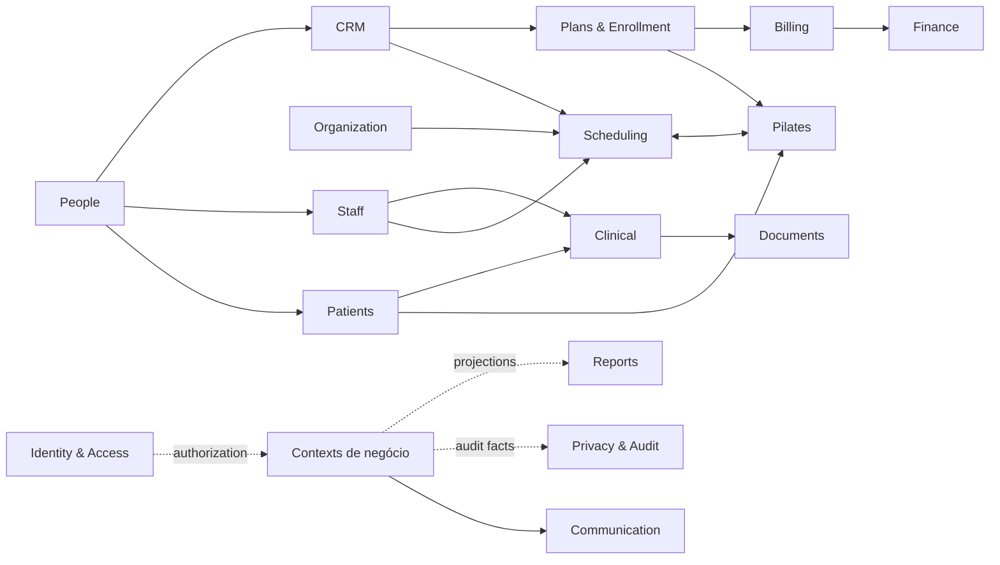
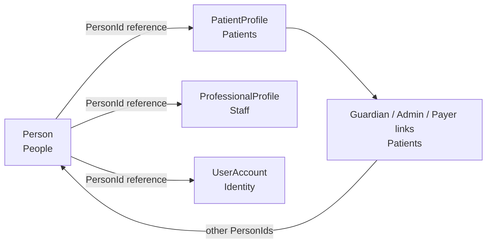
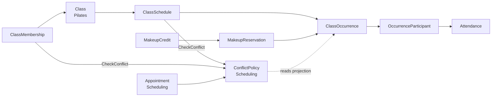
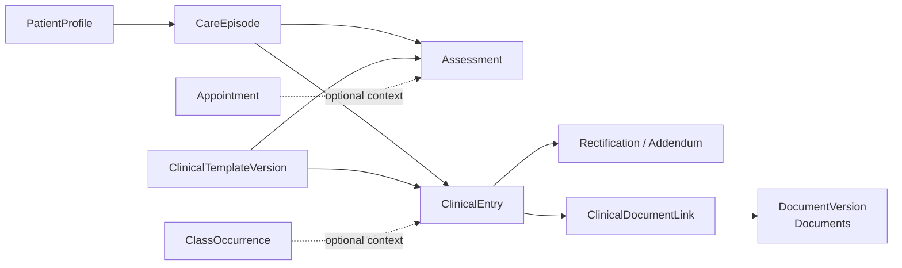
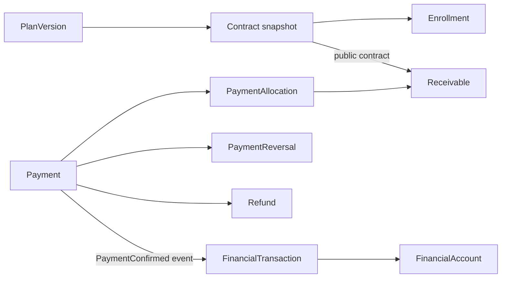
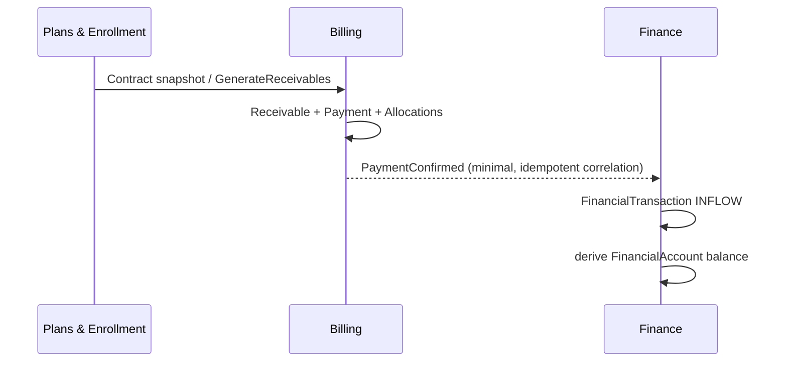
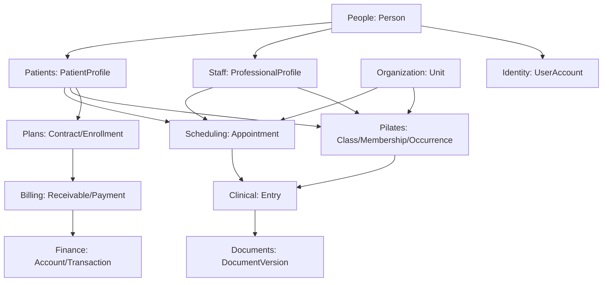

# MODEL-005 — Integrated Conceptual Model

## 1. Status

- **Tarefa:** MODEL-005
- **Status:** DONE
- **Data:** 2026-09-15
- **Natureza:** baseline conceitual integrada
- **Modelos integrados:** MODEL-001, MODEL-002, MODEL-003 e MODEL-004
- **Boundaries normativos:** ARC-001 e ARC-002
- **Próxima tarefa:** STATE-001 — Máquinas de Estado

Resultado: **PASS**. Os 16 contextos permanecem separados, todos os conceitos adotados têm owner, as referências e cardinalidades globais são coerentes, não existe aggregate cross-context nem ciclo conhecido de escrita síncrona, e não há blocker para STATE-001.

## 2. Objetivo

Integrar os modelos conceituais aprovados sem redesenhá-los, tornar explícitas as relações cross-context, auditar ownership, cardinalidade, processos, regras, snapshots, eventos e dependências, e estabelecer a baseline para state machines, catálogo final de eventos, permissões, arquitetura física e modelo lógico.

## 3. Escopo

- integração conceitual dos 16 contextos oficiais;
- catálogo mestre de conceitos, aggregates, referências, cardinalidades, snapshots, read models e invariantes;
- cobertura de processos e regras do Gate M1;
- fluxos end-to-end e diagramas globais;
- conflitos, gaps, órfãos, ambiguidades e open questions;
- readiness conceitual de VS-01.

Ficam fora: banco, tabelas, chaves, SQL, ORM, código, API, módulos físicos, UI, providers, retenção jurídica, MFA e decisões de implementação.

## 4. Fontes

`PROJECT_OS.md`; último handoff MODEL-004; `GATE_M1_AUDIT.md`; `CONTEXT_MAP.md`; `OWNERSHIP_MAP.md`; MODEL-001 a MODEL-004; `GLOSSARY.md`; `BUSINESS_PARAMETERS.md`; `RULES_INDEX.md`; `PROCESS_INDEX.md`; `DECISIONS.md`.

## 5. Princípios de Integração

1. Um conceito transacional tem exatamente um owner.
2. Referência, contrato público, evento, snapshot e read model não transferem ownership.
3. Nenhum aggregate atravessa contextos.
4. Nenhum contexto escreve diretamente o estado interno de outro.
5. Eventos propagam fatos já decididos; validações imediatas usam contrato público.
6. Snapshot histórico é imutável para sua finalidade e não acompanha a fonte corrente.
7. O presente não reescreve o passado; vigência, versão, correção, reversão e adendo preservam história.
8. Clinical permanece segregado; eventos clínicos públicos levam somente metadados mínimos.
9. Reports e read models nunca são fontes transacionais.
10. `Payment != FinancialTransaction`; `Attendance != ClinicalEntry`; `Appointment != ClassOccurrence`; `Contract != Enrollment`.

## 6. Contextos Integrados

| Contexto | Owner de | Integrações dominantes | Guardrail |
|---|---|---|---|
| Identity & Access | UserAccount, sessão, roles, permissions | PersonId; decisões de autorização; audit | não possui Person nem regra de negócio |
| Organization | Clinic, Unit, Room, calendário/feriado | referências institucionais e calendário | Room é informativa, nunca recurso de conflito |
| People | Person, contatos, relações, merge | identidade para todos os papéis | nenhuma duplicação civil downstream |
| Patients | PatientProfile e vínculos de responsáveis/pagador | People, Organization, consumers de PatientId | não possui prontuário, contrato ou turma |
| Staff | ProfessionalProfile, vínculos, disponibilidade e afastamento | People, Organization, Scheduling/Pilates/Clinical | não possui conta, agenda ou prontuário |
| CRM | Opportunity, pipeline, atividade, tarefa e proposta | People, Scheduling, Plans, Communication | Lead é view; conversão não depende de pagamento |
| Scheduling | Appointment, regra geral não-turma, blocks, exceções e conflito | Staff, Patients, Organization, Pilates | não possui turma, ocorrência ou capacidade |
| Pilates | turma, recorrência, ocorrência, membership, chamada e reposição | Scheduling, Plans, Billing e cadastros | não possui Appointment, Enrollment ou prontuário |
| Clinical | episódio, avaliação, evolução, templates, correções e vínculo documental | Patients, Staff, Scheduling, Pilates, Documents | conteúdo clínico segregado |
| Plans & Enrollment | catálogo, versão, acordo e direito operacional | Patients/People, Pilates, Billing, CRM | não registra dinheiro nem membership |
| Billing | obrigação, pagamento, alocação, reversão, refund e restrição | Plans, Finance, Communication | não possui conta/movimento financeiro |
| Finance | contas, movimentos, despesas, transferências e closing | Billing, Organization, Reports | não altera Receivable/Payment |
| Communication | mensagem, template, tentativa e status técnico | originadores e People | não decide regra originadora |
| Documents | arquivo, versão e metadados técnicos | contextos de negócio autorizados | não possui significado de negócio |
| Privacy & Audit | evidência, AuditRecord, PrivacyRequest e legal hold | todos os contexts por fatos mínimos | não corrige facts dos owners diretamente |
| Reports | projeções, KPIs e definições de relatório | read models/eventos autorizados | somente leitura/rebuild |

## 7. Master Concept Catalog

### 7.1 Identity, organization, people, roles e contextos ainda rasos

| Conceito | Contexto | Tipo | Aggregate Root? | Owner | Lifecycle? | Histórico? |
|---|---|---|---:|---|---:|---:|
| UserAccount / Role / Permission / Session | Identity & Access | entities | a detalhar | Identity & Access | sim | sim |
| Clinic | Organization | entity | sim | Organization | ACTIVE/INACTIVE | sim |
| Unit | Organization | entity | sim | Organization | ACTIVE/INACTIVE | sim |
| Room | Organization | child entity | não | Organization | ACTIVE/INACTIVE | sim |
| InstitutionalCalendar | Organization | entity | sim | Organization | ACTIVE/INACTIVE | vigência |
| Holiday | Organization | child entity | não | Organization | registrado/retirado | sim |
| Person | People | entity | sim | People | CURRENT/INACTIVE/MERGED_ALIAS | sim |
| ContactPoint | People | child entity | não | People | ACTIVE/INACTIVE | limitado |
| Address | People | value object | não | People | corrente | não adotado |
| PersonRelationship | People | entity | sim | People | ACTIVE/ENDED | vigência opcional |
| PersonMerge | People | entity | sim | People | proposta→conclusão/reversão | sim |
| MergeManifest | People | immutable child | não | People | criado na conclusão | permanente |
| PatientProfile | Patients | entity | sim | Patients | ACTIVE/INACTIVE | sim |
| GuardianLink | Patients | child entity | não | Patients | ACTIVE/ENDED | vigência |
| AdministrativeResponsibleLink | Patients | child entity | não | Patients | ACTIVE/ENDED | vigência |
| ResponsiblePayerLink | Patients | child entity | não | Patients | ACTIVE/ENDED | vigência |
| EmergencyContact | Patients | child entity | não | Patients | ACTIVE/INACTIVE | sim |
| ProfessionalProfile | Staff | entity | sim | Staff | ACTIVE/INACTIVE | autoria preservada |
| EmploymentLink | Staff | child entity | não | Staff | ACTIVE/ENDED | vigência |
| ProfessionalUnitLink | Staff | child entity | não | Staff | ACTIVE/ENDED | vigência |
| Availability | Staff | entity | sim, candidata | Staff | ACTIVE/ENDED | vigência |
| ProfessionalLeave | Staff | entity | sim, candidata | Staff | PLANNED/ACTIVE/ENDED/CANCELLED | sim |
| Opportunity / PipelineStage | CRM | entities | a detalhar | CRM | sim | sim |
| Activity / Task / LossReason | CRM | entities | a detalhar | CRM | sim | sim |
| CommercialProposal | CRM | snapshot entity | a detalhar | CRM | versionada | sim |
| Lead | CRM | read model | não | CRM (projeção) | reconstruível | não transacional |
| Message / Template / DeliveryAttempt | Communication | entities | a detalhar | Communication | sim | tentativas preservadas |
| Document / StoredFile / Metadata / Version | Documents | entities | a detalhar | Documents | retenção/versionamento | sim |
| AuditLog / PrivacyRequest / BreakGlassAudit | Privacy & Audit | entities | a detalhar | Privacy & Audit | sim | imutável/auditável |
| ReadModel / Projection / ReportDefinition | Reports | projection/definition | não | Reports | rebuild/versionamento | derivado |

### 7.2 Scheduling e Pilates

| Conceito | Contexto | Tipo | Aggregate Root? | Owner | Lifecycle? | Histórico? |
|---|---|---|---:|---|---:|---:|
| Appointment | Scheduling | entity | sim | Scheduling | SCHEDULED/CONFIRMED/COMPLETED/CANCELLED/NO_SHOW | reschedule/cancel preservados |
| ScheduleRule | Scheduling | entity | sim, candidata | Scheduling | futura/vigente/encerrada | vigência |
| FixedSchedule | Scheduling | alias, não entidade | não | Scheduling | segue ScheduleRule | — |
| ScheduleBlock | Scheduling | entity | sim | Scheduling | ACTIVE/CANCELLED/ENDED | sim |
| CalendarException | Scheduling | entity | sim | Scheduling | PLANNED/APPLIED/CANCELLED | sim |
| ConflictPolicy | Scheduling | policy | não | Scheduling | vigente | explicável |
| AvailabilityProjection / AgendaView | Scheduling | read models | não | Scheduling (projeção) | reconstruível | não transacional |
| Class | Pilates | entity | sim | Pilates | ACTIVE/INACTIVE | sim |
| ClassSchedule | Pilates | entity | sim, candidata | Pilates | futura/vigente/encerrada | vigência |
| ClassMembership | Pilates | entity | sim, candidata | Pilates | ACTIVE/ENDED | vigência |
| ClassOccurrence | Pilates | entity | sim | Pilates | PLANNED/IN_PROGRESS/COMPLETED/CANCELLED | snapshot operacional |
| OccurrenceParticipant | Pilates | child/snapshot | não | Pilates | esperado/liberado/cancelado | por ocorrência |
| Attendance | Pilates | child entity | não | Pilates | PENDING e estados terminais | sim |
| AttendanceCorrection | Pilates | immutable child | não | Pilates | append-only | sim |
| MakeupCredit | Pilates | entity | sim | Pilates | AVAILABLE/RESERVED/CONSUMED/EXPIRED/CANCELLED | sim |
| MakeupReservation | Pilates | child/entity | não | Pilates | ativa/cancelada/consumida | sim |
| Capacity / RecurrencePattern / TimeRange | Pilates/Scheduling | value objects | não | owner do uso | por vigência/valor | snapshot quando aplicado |

### 7.3 Clinical

| Conceito | Contexto | Tipo | Aggregate Root? | Owner | Lifecycle? | Histórico? |
|---|---|---|---:|---|---:|---:|
| CareEpisode | Clinical | entity | sim | Clinical | OPEN/PAUSED/CLOSED | sim |
| Assessment | Clinical | entity | sim | Clinical | DRAFT/FINALIZED | imutável após finalização |
| ClinicalTemplate | Clinical | entity | sim | Clinical | ACTIVE/INACTIVE | sim |
| ClinicalTemplateVersion | Clinical | immutable entity | sim | Clinical | publicada/disponível/inativa | imutável |
| ClinicalEntry | Clinical | entity | sim | Clinical | DRAFT/FINALIZED | imutável após finalização |
| Rectification | Clinical | immutable child | não | Clinical | append-only | sim |
| Addendum | Clinical | immutable child | não | Clinical | append-only | sim |
| ClinicalDocumentLink | Clinical | child association | não | Clinical | linked/logically removed | sim |
| BreakGlassAccess | Clinical | entity | sim, candidata | Clinical | policy a formalizar | sim |
| ClinicalExportOperation | Clinical | operation | não | Clinical | execução/resultado | auditável |
| ClinicalFinalizationPolicy | Clinical | policy | não | Clinical | versionada/vigente | sim |
| ClinicalRecordContent / ContextReference / FinalizationMetadata | Clinical | value objects | não | Clinical | fixados na finalização | sim |
| ClinicalTimeline / PendingClinicalEntries / PatientClinicalSummary | Clinical | read models | não | Clinical (projeção) | reconstruível | não transacional |

### 7.4 Plans, Billing e Finance

| Conceito | Contexto | Tipo | Aggregate Root? | Owner | Lifecycle? | Histórico? |
|---|---|---|---:|---|---:|---:|
| Plan | Plans & Enrollment | entity | sim | Plans & Enrollment | ACTIVE/INACTIVE | sim |
| PlanVersion | Plans & Enrollment | immutable entity | sim | Plans & Enrollment | publicada/disponível/encerrada | imutável |
| Contract | Plans & Enrollment | snapshot entity | sim | Plans & Enrollment | DRAFT/ACCEPTED/CANCELLED/COMPLETED | snapshot |
| Enrollment | Plans & Enrollment | entity | sim | Plans & Enrollment | DRAFT/ACTIVE/PAUSED/CANCELLED/COMPLETED | vigência/frequência |
| Benefit / Entitlement / ContractAmendment | Plans & Enrollment | deferred concepts | não adotados | Plans & Enrollment se confirmados | — | — |
| Receivable | Billing | entity | sim | Billing | OPEN/PARTIALLY_PAID/PAID/OVERDUE/CANCELLED | snapshot/ajustes |
| BillingAdjustment | Billing | immutable child | não | Billing | append/compensação | sim |
| Payment | Billing | entity | sim | Billing | CONFIRMED/PARTIALLY_REVERSED/REVERSED | preservado |
| PaymentAllocation | Billing | child entity | não | Billing | válida/substituída | sim |
| PaymentReversal | Billing | immutable child | não | Billing | append-only | sim |
| Refund | Billing | entity | sim | Billing | ISSUED/COMPLETED/CANCELLED | sim |
| Negotiation | Billing | entity | sim | Billing | a formalizar | termos preservados |
| FinancialRestriction | Billing | entity | sim | Billing | aplicada/removida | vigência |
| FinancialAccount | Finance | entity | sim | Finance | ACTIVE/INACTIVE | base auditável |
| FinancialTransaction | Finance | entity | sim | Finance | append/counter-entry | sim |
| ExpenseCategory | Finance | catalog entity | sim | Finance | ACTIVE/INACTIVE | vigência quando necessária |
| Expense | Finance | entity | sim | Finance | OPEN/PAID/OVERDUE/CANCELLED | previsto/realizado |
| Transfer | Finance | entity | sim | Finance | a formalizar | par correlacionado |
| ReconciliationAdjustment | Finance | immutable entity | sim | Finance | registrado | sim |
| Closing | Finance | entity | sim | Finance | OPEN/CLOSED/REOPENED | versionado |
| ClosingSnapshot | Finance | immutable child | não | Finance | append por fechamento | imutável |
| Money / BillingPeriod / DueDate / Discount | owners de uso | value objects | não | owner do fato | imutáveis | acompanham fato |

Todos os conceitos dos quatro modelos estão representados; conceitos rejeitados/deferred constam para impedir reintrodução silenciosa.

## 8. Aggregate Catalog

| Aggregate Root | Contexto | Responsabilidade | Principais children | Referências externas |
|---|---|---|---|---|
| Clinic | Organization | identidade institucional | — | ator auditável |
| Unit | Organization | unidade e salas | Room | Clinic local |
| InstitutionalCalendar | Organization | calendário por escopo | Holiday | Unit local opcional |
| Person | People | identidade, CPF e contatos | ContactPoint, Address | UnitId? |
| PersonRelationship | People | relação geral entre Persons | — | PersonIds locais |
| PersonMerge | People | revisão/execução de merge | MergeManifest | UserAccountIds |
| PatientProfile | Patients | papel e responsáveis | Guardian, AdministrativeResponsible, Payer, EmergencyContact | PersonIds, UnitId |
| ProfessionalProfile | Staff | papel e vínculos profissionais | EmploymentLink, ProfessionalUnitLink | PersonId, UnitId |
| Availability | Staff | disponibilidade efetiva | — | ProfessionalId, UnitId? |
| ProfessionalLeave | Staff | afastamento | — | ProfessionalId, UserAccountId |
| Appointment | Scheduling | compromisso ad-hoc | histórico local | Patient/Person, Professional, Unit, Room?, Opportunity? |
| ScheduleRule | Scheduling | recorrência geral não-turma | — | participantes/Unit |
| ScheduleBlock | Scheduling | indisponibilidade operacional | — | ProfessionalId?, UnitId? |
| CalendarException | Scheduling | exceção operacional | — | Holiday/Calendar? |
| Class | Pilates | identidade da turma | — | — |
| ClassSchedule | Pilates | configuração recorrente vigente | — | ClassId, UnitId, ProfessionalId, RoomId? |
| ClassMembership | Pilates | vínculo paciente–turma | — | ClassId, PatientId, EnrollmentId? |
| ClassOccurrence | Pilates | execução e chamada | OccurrenceParticipant, Attendance, AttendanceCorrection | ScheduleId, Patient/Professional/Unit |
| MakeupCredit | Pilates | direito e consumo de reposição | MakeupReservation | PatientId, occurrence/source refs |
| CareEpisode | Clinical | correlação longitudinal leve | — | PatientId, ProfessionalId? |
| Assessment | Clinical | avaliação finalizável | Rectification, Addendum, links | patient, author, context, template version |
| ClinicalEntry | Clinical | evolução finalizável | Rectification, Addendum, links | patient, episode, author, context, template version |
| ClinicalTemplate | Clinical | identidade do template | — | autoria |
| ClinicalTemplateVersion | Clinical | estrutura publicada imutável | — | TemplateId |
| BreakGlassAccess | Clinical | acesso excepcional | — | patient, user, professional? |
| Plan | Plans & Enrollment | catálogo | — | — |
| PlanVersion | Plans & Enrollment | condição publicada | — | PlanId |
| Contract | Plans & Enrollment | acordo/snapshot aceito | — | PatientId, payer PersonId, PlanVersionId |
| Enrollment | Plans & Enrollment | direito operacional contínuo | frequência/pausas locais | PatientId, ContractIds |
| Receivable | Billing | obrigação e saldo devido | BillingAdjustment | Contract/Enrollment/Patient/payer |
| Payment | Billing | recebimento, alocação e reversão | PaymentAllocation, PaymentReversal | ReceivableIds, AccountId, UserAccountId |
| Refund | Billing | devolução real elegível | — | Payment/Allocation/Receivable, AccountId |
| Negotiation | Billing | termos multi-obrigação | — | ReceivableIds, actor |
| FinancialRestriction | Billing | restrição operacional | — | PatientId, EnrollmentId? |
| FinancialAccount | Finance | identidade da conta/base inicial | — | — |
| FinancialTransaction | Finance | movimento append-only | — | AccountId, source correlation |
| ExpenseCategory | Finance | catálogo de categorias | — | — |
| Expense | Finance | obrigação/saída prevista | — | CategoryId, UnitId?, Account/Transaction? |
| Transfer | Finance | par entre contas | — | duas AccountIds, duas transactions |
| ReconciliationAdjustment | Finance | evidência de divergência | — | AccountId, transaction |
| Closing | Finance | fechamento mensal | ClosingSnapshot | Billing read models/source versions |

Nenhum root atravessa contexts. As roots de alto volume ficam separadas para evitar contenção e coleções crescentes.

## 9. Cross-Context Reference Catalog

| Origem | Referência | Owner destino | Finalidade | Snapshot? |
|---|---|---|---|---:|
| UserAccount | PersonId | People | vincular conta à pessoa | não |
| Person | primaryUnitId? | Organization | unidade informativa | não |
| PatientProfile | PersonId / UnitId | People / Organization | identidade e unidade principal | não |
| Guardian/Administrative/Payer links | PersonId | People | papel contextual | não |
| ProfessionalProfile | PersonId | People | identidade civil | não |
| ProfessionalUnitLink/Availability | UnitId | Organization | atuação/disponibilidade | não |
| Appointment | PatientId ou PersonId | Patients/People | participante | histórico mínimo possível |
| Appointment | ProfessionalId / UnitId / RoomId? | Staff / Organization | profissional e local | contexto passado |
| Appointment experimental | OpportunityId | CRM | correlação comercial | não |
| ClassSchedule | ProfessionalId / UnitId / RoomId? | Staff / Organization | condução/local | occurrence snapshota aplicação |
| ClassMembership | PatientId / EnrollmentId? | Patients / Plans | membro e elegibilidade | não |
| ClassOccurrence | ScheduleId / ProfessionalIds / UnitId | Pilates / Staff / Organization | origem e execução | sim, contexto operacional |
| MakeupReservation | ClassOccurrenceId / PatientId | Pilates / Patients | reservar vaga e paciente | histórico local |
| Clinical records | PatientId | Patients | sujeito assistencial | não |
| Clinical records | ProfessionalId / UserAccountId | Staff / Identity | autoria e prova autenticada | autoria preservada |
| Assessment/ClinicalEntry | AppointmentId? | Scheduling | contexto assistencial | referência histórica |
| Assessment/ClinicalEntry | ClassOccurrenceId? | Pilates | contexto assistencial | referência histórica |
| ClinicalDocumentLink | DocumentId / VersionId? | Documents | arquivo privado | versão quando exigida |
| Contract | PatientId / payer PersonId / PayerLinkId? | Patients / People | partes do acordo | sim |
| Contract | PlanVersionId | Plans & Enrollment | oferta aceita | sim |
| Enrollment | ContractIds | Plans & Enrollment | períodos comerciais sucessivos | histórico local |
| Enrollment | ClassMembershipId? | Pilates | correlação/read | não |
| Receivable | ContractId / EnrollmentId | Plans & Enrollment | origem da obrigação | sim |
| Receivable | PatientId / payer PersonId | Patients / People | devedor histórico | sim |
| PaymentAllocation | ReceivableId | Billing | aplicar valor | histórico local |
| Payment/Refund | FinancialAccountId | Finance | conta declarada de entrada/saída | valor/ID preservados |
| Payment | UserAccountId | Identity & Access | registrador autenticado | sim |
| FinancialTransaction | Payment/Reversal/RefundId? | Billing | correlação/idempotência | payload mínimo |
| Expense | UnitId? | Organization | escopo UNIT | contexto preservado |
| Closing | Billing read models | Billing | previsto/realizado/pendências | ClosingSnapshot |
| Communication | PersonId/ContactPointId | People | entrega autorizada | não |
| AuditRecord | ActorId/resource ID | Identity/owner do recurso | evidência opaca | sim, mínimo |

Referências nunca autorizam navegação ou escrita no storage do owner.

### 9.1 Master Reference Catalog

| Origem | Destino | Referência | Tipo | Consistência |
|---|---|---|---|---|
| Identity & Access | People | PersonId | REFERENCE_BY_ID | síncrona na vinculação |
| Patients | People / Organization | PersonId / UnitId | REFERENCE_BY_ID + contrato de validação | CROSS_CONTEXT_SYNC |
| Staff | People / Organization | PersonId / UnitId | REFERENCE_BY_ID + contrato de validação | CROSS_CONTEXT_SYNC |
| CRM | People | PersonId | REFERENCE_BY_ID | CROSS_CONTEXT_SYNC na criação |
| CRM | Scheduling | OpportunityId em Appointment | SYNCHRONOUS_CONTRACT + evento de resultado | WORKFLOW |
| Scheduling | Patients / Staff / Organization | Patient/PersonId, ProfessionalId, UnitId, RoomId? | REFERENCE_BY_ID | CROSS_CONTEXT_SYNC |
| Scheduling | Pilates | ClassOccurrenceProjection | READ_MODEL | EVENTUAL |
| Pilates | Scheduling | sujeitos + TimeRange | SYNCHRONOUS_CONTRACT | CROSS_CONTEXT_SYNC |
| Pilates | Plans & Enrollment | EnrollmentId + elegibilidade/frequência | SYNCHRONOUS_CONTRACT | CROSS_CONTEXT_SYNC |
| Pilates | Billing | Patient/Enrollment + restriction | contrato/read projection | CROSS_CONTEXT_SYNC quando impeditivo |
| Clinical | Patients / Staff | PatientId / ProfessionalId | REFERENCE_BY_ID + contrato de validação | CROSS_CONTEXT_SYNC |
| Clinical | Scheduling / Pilates | AppointmentId? / ClassOccurrenceId? | REFERENCE_BY_ID | CROSS_CONTEXT_SYNC na criação/finalização |
| Clinical | Documents | DocumentId / DocumentVersionId? | SYNCHRONOUS_CONTRACT + REFERENCE_BY_ID | CROSS_CONTEXT_SYNC |
| Plans & Enrollment | Patients / People | PatientId / payer PersonId / PayerLinkId? | contrato + snapshot | CROSS_CONTEXT_SYNC no aceite |
| Plans & Enrollment | Billing | Contract snapshot/correlation | SYNCHRONOUS_CONTRACT + eventos posteriores | CROSS_CONTEXT_SYNC / WORKFLOW |
| Billing | Finance | FinancialAccountId | SYNCHRONOUS_CONTRACT de leitura | CROSS_CONTEXT_SYNC |
| Billing | Finance | Payment/Reversal/Refund facts | INTEGRATION_EVENT | EVENTUAL idempotente |
| Finance | Billing | Billing projections/source IDs | READ_MODEL + REFERENCE_BY_ID | CROSS_CONTEXT_SYNC no cutoff / EVENTUAL |
| Contextos | Privacy & Audit | actor/resource/correlation | INTEGRATION_EVENT | EVENTUAL |
| Reports | Contextos proprietários | projections/source versions | READ_MODEL | EVENTUAL |

## 10. Global Cardinalities

| A | Cardinalidade | B | Relação | Owner da relação |
|---|---|---|---|---|
| Clinic | 1 → 0..N | Unit | possui | Organization |
| Unit | 1 → 0..N | Room | contém | Organization |
| InstitutionalCalendar | 1 → 0..N | Holiday | inclui | Organization |
| Person | 1 → 0..1 | PatientProfile | exerce papel | Patients |
| Person | 1 → 0..1 | ProfessionalProfile | exerce papel | Staff |
| Person | 1 → 0..1 ativo | UserAccount | associa conta | Identity & Access |
| PatientProfile | 1 → 0..N | links de responsável/pagador | possui no tempo | Patients |
| ProfessionalProfile | 1 → 0..N | Employment/Unit links | possui | Staff |
| Class | 1 → 0..N | ClassSchedule | configurações vigentes | Pilates |
| Class | 1 → 0..N | ClassMembership | vínculos históricos | Pilates |
| ClassSchedule | 1 → 0..N | ClassOccurrence | gera | Pilates |
| ClassOccurrence | 1 → 0..N | OccurrenceParticipant | espera | Pilates |
| OccurrenceParticipant | 1 → 0..1 | Attendance | resultado corrente | Pilates |
| Attendance | 1 → 0..N | AttendanceCorrection | corrige | Pilates |
| MakeupCredit | 1 → 0..N | MakeupReservation | histórico; máx. uma ativa | Pilates |
| PatientProfile | 1 → 0..N | CareEpisode | sujeito | Clinical |
| CareEpisode | 1 → 0..N | Assessment/ClinicalEntry | relação por ID, roots separados | Clinical |
| ClinicalTemplate | 1 → 0..N | ClinicalTemplateVersion | versiona | Clinical |
| registro finalizado | 1 → 0..N | Rectification/Addendum | corrige/complementa | Clinical |
| Plan | 1 → 0..N | PlanVersion | versiona | Plans & Enrollment |
| PlanVersion | 1 → 0..N | Contract | origina acordo | Plans & Enrollment |
| PatientProfile | 1 → 0..N | Contract | contrata | Plans & Enrollment |
| PatientProfile | 1 → 0..N | Enrollment | mantém vínculo | Plans & Enrollment |
| Enrollment ativado | 1 → 1..N no tempo | Contract | sustentado por períodos comerciais | Plans & Enrollment |
| Contract aceito | 1 → 0..1 antes da ativação; 1 após sustentar vínculo | Enrollment | coordenação comercial-operacional | Plans & Enrollment |
| Enrollment | 1 → 0..N | ClassMembership | habilita por referência | Pilates |
| Contract | 1 → 1..N | Receivable | origina lote | Billing |
| Receivable | 1 → 0..N | BillingAdjustment | ajusta | Billing |
| Payment | 1 → 0..N | PaymentAllocation | distribui valor | Billing |
| Payment | 1 → 0..N | PaymentReversal | corrige | Billing |
| Payment | N ↔ N | Receivable | via Allocation | Billing |
| FinancialAccount | 1 → 0..N | FinancialTransaction | conta referenciada | Finance |
| Expense | 1 → 0..1 | FinancialTransaction | pagamento sem parcial adotado | Finance |
| Transfer | 1 → 2 | FinancialTransaction | saída + entrada | Finance |
| Closing | 1 → 1..N após fechar | ClosingSnapshot | versões | Finance |

Cardinalidade final crítica: um paciente pode ter vários Contracts e Enrollments ao longo da história; cada Contract usa exatamente uma PlanVersion. Um Enrollment contínuo pode ser sustentado por vários Contracts sucessivos, mas cada Contract, quando passa a sustentar operação, liga-se a exatamente um Enrollment. Renovação não exige novo Enrollment; cancelamento preserva ambos os históricos.

## 11. Snapshot Catalog

| Snapshot | Owner | Fonte original | Motivo |
|---|---|---|---|
| CommercialProposal | CRM | Opportunity + oferta/catalogue público | provar o que foi apresentado |
| Contract | Plans & Enrollment | PlanVersion + People/Patients | provar condições e partes aceitas |
| Receivable | Billing | Contract/Enrollment + pagador vigente na origem | provar obrigação, valor e vencimento |
| ClassOccurrence context | Pilates | ClassSchedule, Unit, Professional e Capacity vigentes | provar o aplicado na data |
| OccurrenceParticipant | Pilates | Membership/Reservation/admission | provar quem era esperado |
| ClinicalTemplateVersion utilizada | Clinical | versão publicada do template | interpretar registro histórico |
| FinalizationMetadata | Clinical | UserAccount + Professional + versão do registro | provar finalização/autoria |
| ClosingSnapshot | Finance | movimentos Finance + read models Billing | provar posição no cutoff |
| DocumentVersion | Documents | bytes/metadados técnicos | preservar integridade do arquivo |

Snapshot não é cópia corrente atualizável. Mudança posterior de nome, pagador, catálogo, schedule, conta ou template não reescreve o snapshot.

## 12. Read Model Catalog

| Read model | Responsável pela projeção | Fontes | Uso |
|---|---|---|---|
| AgendaView / ScheduleReadModel | Scheduling | Appointment, blocks, exceptions, ClassOccurrence projection, Staff | agenda operacional |
| AvailabilityProjection | Scheduling | Staff, Scheduling, Pilates, Organization | conflito explicável |
| ClassDayList / OccurrenceOccupancy | Pilates | occurrence, participants, attendance | chamada/capacidade |
| AvailableMakeupCredits | Pilates | credits/reservations | reposição |
| ClinicalTimeline | Clinical | episodes, assessments, entries, corrections, links | prontuário longitudinal autorizado |
| PendingClinicalEntries | Clinical | DRAFTs e policy | pendências profissionais |
| PatientClinicalSummary | Clinical | fatos clínicos minimizados | continuidade assistencial |
| ContractOverview | Plans & Enrollment | contracts/enrollment | acordo e renovações |
| PatientBillingSummary | Billing | receivables/payments/adjustments/refunds/restriction | posição do paciente |
| OpenReceivables | Billing | receivable balances | cobrança |
| DelinquencyQueue | Billing | due/tolerance/actions/restriction | inadimplência |
| CashFlowProjection | Finance | contas, movimentos e previstos autorizados | fluxo de caixa |
| FinancialPosition / AccountBalanceView | Finance | accounts/transactions | saldos derivados |
| ExpectedVsActual | Finance/Reports projection | Billing + Expense + transactions | competência versus caixa |
| MonthlyClosingSummary | Finance | ClosingSnapshot | conferência mensal |
| Lead | CRM | Person + Opportunity | operação comercial |

CRM/Reports adicionais permanecem limitados ao que ARC-001/002 sustenta. Nenhum read model recebe autoridade transacional.

## 13. Cross-Context Invariants

| ID | Invariante | Owner da decisão | Informação externa | Validação conceitual | Consistência |
|---|---|---|---|---|---|
| XINV-001 | papel não duplica Person | People para identidade; owner do papel para perfil | PersonId/canonical alias | contrato People + unicidade local | CROSS_CONTEXT_SYNC |
| XINV-002 | membership compatível com frequência/direito | Pilates para membership; Plans para elegibilidade | Enrollment status/frequency/vigência | consulta pública antes da inclusão | CROSS_CONTEXT_SYNC |
| XINV-003 | conflito temporal cobre Appointment e turma | Scheduling | projeções Pilates e Availability/Leave Staff | CheckConflict público | CROSS_CONTEXT_SYNC |
| XINV-004 | capacidade é respeitada | Pilates | resultado de conflito e eligibilidade | decisão atômica dentro do boundary Pilates | LOCAL_STRONG |
| XINV-005 | autoria clínica é profissional autorizada | Clinical | ProfessionalProfile, UserAccount e contexto | validação Staff/Identity + policy Clinical | CROSS_CONTEXT_SYNC |
| XINV-006 | ClinicalEntry usa contexto assistencial válido | Clinical | Appointment ou ClassOccurrence | validação mínima no owner | CROSS_CONTEXT_SYNC |
| XINV-007 | mudança de pagador não reescreve snapshots | Patients para vínculo; snapshot owners para história | evento/referência vigente | novos fatos usam novo payer; antigos preservados | EVENTUAL |
| XINV-008 | Contract aceito gera lote único de Receivables | Plans inicia; Billing decide criação | Contract snapshot/correlation | contrato público idempotente | CROSS_CONTEXT_SYNC |
| XINV-009 | pausa/cancelamento afeta apenas dados do consumidor | Plans para ciclo; Billing/Pilates para efeitos | eventos de Enrollment | cada owner reage localmente | WORKFLOW |
| XINV-010 | PaymentConfirmed gera no máximo um movimento equivalente | Billing publica; Finance decide movimento | ID/correlation, amount, account | consumo idempotente | EVENTUAL |
| XINV-011 | reversal/refund geram efeitos financeiros distintos | Billing | evento e correlação mínimos | Finance cria movimentos próprios | EVENTUAL |
| XINV-012 | fechamento não altera Billing | Finance | read models versionados/cutoff | snapshot somente leitura | CROSS_CONTEXT_SYNC |
| XINV-013 | ClinicalDocumentLink aponta arquivo privado válido | Clinical para semântica; Documents para arquivo | DocumentId/version/status | contrato público na vinculação/acesso | CROSS_CONTEXT_SYNC |
| XINV-014 | UserAccount não substitui autoria/autoridade de negócio | resource owner + Identity | autenticação e permissions | decisão contextual deny-by-default | CROSS_CONTEXT_SYNC |
| XINV-015 | merge preserva referências sem escrever owners | People publica | aliases source→target | reação idempotente por owner | WORKFLOW |

Não se atribui a mesma decisão a dois owners: o owner do estado solicitado decide sua mutação; o contexto consultado decide apenas a verdade que publica.

### 13.1 Master Invariant Catalog

| ID | Contexto | Resumo | Local/Cross-context | Modelo fonte |
|---|---|---|---|---|
| INV-ORG-001..005 | Organization | hierarquia, calendário e Room informativa | local/boundary | MODEL-001 |
| INV-PPL-001..008 | People | identidade única, CPF, contatos e merge | local + cross-context workflow | MODEL-001 |
| INV-PAC-001..009 | Patients | perfil sem duplicação e papéis responsáveis separados | local + referências | MODEL-001 |
| INV-STF-001..008 | Staff | perfil, vínculos, autoria e leave | local + referências | MODEL-001 |
| INV-AGD-001..010 | Scheduling | conflito, histórico e agenda não-turma | local + cross-context | MODEL-002 |
| INV-PIL-001..020 | Pilates | recorrência, capacidade, chamada e reposição | local + cross-context | MODEL-002 |
| INV-CLI-001..023 | Clinical | autoria, finalização, correção, documento e acesso sensível | local + cross-context | MODEL-003 |
| INV-PLN-001..004 | Plans & Enrollment | versão, snapshot e boundary | local/boundary | MODEL-004 |
| INV-ENR-001..005 | Plans & Enrollment | vínculo, pausa, cancelamento e frequência | local + workflow | MODEL-004 |
| INV-BIL-001..015 | Billing | obrigação, liquidação, reversão, refund e snapshots | local + cross-context | MODEL-004 |
| INV-FIN-001..012 | Finance | movimento, saldo, expense, transfer e closing | local + cross-context | MODEL-004 |
| XINV-001..015 | Integrado | regras que coordenam owners sem compartilhá-los | cross-context | MODEL-005 |

## 14. Consistency Classification

| Classe | Aplicação integrada |
|---|---|
| LOCAL_STRONG | unicidade/estado dentro de aggregate; capacidade de ocorrência; allocations/reversals no Payment; finalização clínica; Closing versionado |
| CROSS_CONTEXT_SYNC | existência/estado público necessário antes de criar papel, Appointment, membership, registro clínico, Contract, Payment account ou documento link |
| EVENTUAL | projeções de agenda/relatórios, efeitos de Payment em Finance, mudança pública de pagador/merge, notificações e restrições projetadas |
| WORKFLOW | merge, pausa, cancelamento, renovação/conversão, privacy request e efeitos coordenados em vários contexts |

`WORKFLOW` descreve coordenação conceitual; não escolhe saga, orchestrator, outbox ou transação distribuída.

## 15. Cross-Context Events

| Evento | Publisher | Consumers | Motivo | Sensibilidade |
|---|---|---|---|---|
| PersonMergeCompleted | People | Patients, Staff, CRM e detentores de PersonId | atualizar aliases/referências | PERSONAL |
| ExperimentalCompleted | Scheduling | CRM | decisão comercial posterior | PERSONAL |
| ClassScheduleChanged | Pilates | Scheduling, Reports | atualizar projeção de agenda | NORMAL |
| EnrollmentActivated | Plans & Enrollment | Pilates, Billing, CRM | publicar direito operacional | PERSONAL |
| EnrollmentPaused / Resumed / Cancelled | Plans & Enrollment | Pilates, Billing, Communication, Reports | efeitos locais coordenados | PERSONAL |
| EnrollmentFrequencyChanged | Plans & Enrollment | Pilates, Billing | aplicar nova vigência | PERSONAL |
| PaymentConfirmed | Billing | Finance, Communication, Reports | refletir recebimento confirmado | FINANCIAL |
| PaymentReversed | Billing | Finance, Communication, Reports | registrar efeito inverso | FINANCIAL |
| RefundCompleted | Billing | Finance, Communication, Reports | refletir saída real, se distinto de emissão | FINANCIAL |
| FinancialRestrictionApplied / Removed | Billing | Pilates, Scheduling, Plans, Communication | efeito operacional sem PAUSED | FINANCIAL |
| ClinicalEntryFinalized | Clinical | Privacy & Audit; projeções clínicas autorizadas | integridade e timeline | CLINICAL_METADATA |
| MonthClosed / ClosingReopened | Finance | Reports, Privacy & Audit | preservar versão mensal | FINANCIAL |

Este é um subconjunto de integração, não o catálogo EVT-001. `RefundIssued` continua fato possível de autorização/emissão; somente o fato que represente saída real pode originar a movimentação em Finance, a fechar em STATE-001/EVT-001.

## 16. Sensibilidade dos Eventos

- **NORMAL:** IDs operacionais e metadados sem informação pessoal desnecessária.
- **PERSONAL:** IDs de pessoa/paciente e mudança de vínculo; payload minimizado.
- **FINANCIAL:** valores, conta/correlação e status estritamente necessários; sem dados pessoais excedentes.
- **CLINICAL_METADATA:** IDs, autor e timestamp mínimos; nunca narrativa, respostas clínicas ou anexo integral.

## 17. Process Coverage

| Processo | Contextos envolvidos | Suporte | Gap |
|---|---|---|---|
| PROC-PPL-001 | People | SUPPORTED | nenhum |
| PROC-PAC-001 | People, Patients, Organization | SUPPORTED | nenhum |
| PROC-AGD-001 | Scheduling, Staff, Organization, Pilates(read) | SUPPORTED | ScheduleRule restrita a não-turma |
| PROC-AGD-002 | Scheduling, Patients/People, Staff, Organization | SUPPORTED | nenhum |
| PROC-PIL-001 | Pilates, Scheduling, Staff, Organization | SUPPORTED | nenhum |
| PROC-PIL-002 | Pilates, Scheduling, Patients, Plans | SUPPORTED | nenhum |
| PROC-PIL-003 | Pilates, Scheduling, Plans | SUPPORTED | nenhum |
| PROC-PIL-004 | Pilates | SUPPORTED | nenhum |
| PROC-PIL-005 | Pilates, Scheduling, Plans | SUPPORTED | policy durante pausa futura |
| PROC-CLI-001 | Clinical, Patients, Staff | SUPPORTED | nenhum |
| PROC-CLI-002 | Clinical, Scheduling, Patients, Staff | SUPPORTED | campos concretos futuros |
| PROC-CLI-003 | Clinical, Pilates/Scheduling, Patients, Staff | SUPPORTED | nenhum |
| PROC-CLI-004 | Clinical, Identity, Privacy & Audit | SUPPORTED | permissions detalhadas futuras |
| PROC-CLI-005 | Clinical, Identity, Privacy & Audit | SUPPORTED | alçada futura |
| PROC-PLN-001 | Plans, Patients/People | SUPPORTED | nenhum |
| PROC-ENR-001 | Plans, Billing, Pilates | SUPPORTED | nenhum |
| PROC-ENR-002 | Plans, Billing, Pilates | SUPPORTED | MakeupCredit futuro |
| PROC-ENR-003 | Plans, Pilates | SUPPORTED | disponibilidade no retorno |
| PROC-ENR-004 | Plans, Billing, Pilates | SUPPORTED | vencidos antes da implementação |
| PROC-ENR-005 | Plans, Billing, CRM | SUPPORTED | nenhum |
| PROC-ENR-006 | Plans, Billing, Pilates | SUPPORTED | nenhum |
| PROC-ENR-007 | Plans, Pilates | SUPPORTED | nenhum |
| PROC-BIL-001 | Billing, Plans | SUPPORTED | nenhum |
| PROC-BIL-002 | Billing, Finance(account ref/event consumer) | SUPPORTED | nenhum |
| PROC-BIL-003 | Billing, Finance(account ref/event consumer) | SUPPORTED | nenhum |
| PROC-BIL-004 | Billing | SUPPORTED | desconto configurável futuro |
| PROC-BIL-005 | Billing | SUPPORTED | alçadas/limites futuros |
| PROC-BIL-006 | Billing, Finance | SUPPORTED | precedência concorrente futura |
| PROC-BIL-007 | Billing, Finance | SUPPORTED | fato de caixa a formalizar em STATE/EVT |
| PROC-BIL-008 | Billing, Pilates, Scheduling, Plans | SUPPORTED | nenhum |
| PROC-BIL-009 | Billing, Pilates, Scheduling, Plans | SUPPORTED | nenhum |
| PROC-FIN-001 | Finance, Organization | SUPPORTED | nenhum |
| PROC-FIN-002 | Finance | SUPPORTED | pagamento parcial não adotado |
| PROC-FIN-003 | Finance | SUPPORTED | nenhum |
| PROC-FIN-004 | Finance | SUPPORTED | algoritmo futuro |
| PROC-FIN-005 | Finance, Billing(read), Reports, Audit | SUPPORTED | granularidade física futura |
| PROC-FIN-006 | Finance, Reports, Audit | SUPPORTED | nenhum |

Cobertura: **37/37 processos catalogados são conceitualmente suportados**. Pendências listadas não impedem o modelo de expressar o processo.

## 18. Rule Coverage

| Domínio | Total rules | Represented | Partially represented | Future implementation concern |
|---|---:|---:|---:|---|
| People | 4 | 4 | 0 | algoritmo/alçada de merge |
| Patients | 4 | 4 | 0 | catálogo de autorizações de responsáveis |
| CRM | 7 | 7 | 0 | state machine e SLA operacional |
| Scheduling | 9 | 9 | 0 | algoritmo/atomicidade de conflito |
| Pilates | 10 | 10 | 0 | exceções e crédito durante pausa |
| Clinical | 8 | 8 | 0 | permissions, conteúdo, retenção/assinatura |
| Plans | 3 | 3 | 0 | state machine |
| Enrollment | 7 | 7 | 0 | precedência e efeitos simultâneos |
| Billing | 12 | 12 | 0 | alçadas, vencidos, reallocation |
| Finance | 7 | 7 | 0 | fechamento/concorrência física |
| Security | 2 | 2 | 0 | AUTH-001/IAM |
| Audit | 1 | 1 | 0 | baseline técnica |
| Communication | 1 | 1 | 0 | DOM-019/provider |
| **Total** | **75** | **75** | **0** | — |

Todas as regras são expressáveis. Questões de implementação não foram promovidas a `RULE_MODEL_GAP`.

## 19. Orphan Concepts

| Conceito | Situação | Classificação | Justificativa |
|---|---|---|---|
| Benefit | citado no ownership, sem lifecycle | DEFERRED | Enrollment cobre direito atual |
| Entitlement | citado no ownership, sem lifecycle | DEFERRED | não criar alias de Enrollment |
| ContractAmendment | possível mudança contratual | DEFERRED | frequência usa vigência; renovação cria Contract |
| CommunicationPreference | boundary conhecido, sem decisão jurídica | DEFERRED | DOM-019/LGPD |
| ConsentRecord | não adotado | NEEDS_REVIEW | depende de inventário LGPD/jurídico |
| Credential profissional | termo ambíguo | NEEDS_REVIEW | separar licença profissional de credencial de acesso |
| ClinicalExportRequest | lifecycle não sustentado | DEFERRED | operação auditável é suficiente hoje |
| ClinicalAlert | sem regra/lifecycle | DEPRECATED | não sustentado por fonte canônica |
| PatientMedicalRecord | nome de composição | VALID | read model, não aggregate |
| Lead | nome operacional | VALID | read model Person + Opportunity |
| FixedSchedule | alias | VALID | ScheduleRule não-turma, não entidade paralela |
| CashSession / CashTransaction | nomes residuais | DEPRECATED | FinancialAccount(CASH)/FinancialTransaction são canônicos |
| Commission | explicitamente fora do MVP | DEPRECATED | DEC-021 / RB-FIN-007 |
| EquipmentReservation / RoomReservation | rejeitados | DEPRECATED | Room informativa; equipamento fora de Scheduling |

Não há conceito adotado sem owner. Conceitos rasos de IAM/CRM/Communication/Documents/Privacy/Reports têm owner no ARC-002 e não foram detalhados além da baseline.

## 20. Aggregate Size Review

| Root | Risco | Conclusão integrada |
|---|---|---|
| Person | contatos podem crescer; relações e merges seriam expansivos | mantém apenas ContactPoint/Address; Relationship/Merge são roots separados |
| PatientProfile | links históricos podem crescer | aceitável conceitualmente; monitorar volume sem mover ownership |
| ProfessionalProfile | vínculo/unidades podem crescer | Availability e Leave separados evitam aggregate gigante |
| Class | schedules, memberships e occurrences são grandes/concorrentes | root leve; três roots separados |
| ClassOccurrence | participantes/Attendance crescem por capacidade | fronteira adequada para chamada; split físico futuro preservará invariantes |
| CareEpisode | histórico clínico potencialmente ilimitado | root leve; registros apenas referenciam episodeId |
| ClinicalEntry | corrections/links crescem por registro | adequado; nunca agregar todo prontuário |
| Payment | allocations/reversals podem crescer | fronteira necessária ao valor disponível; não inclui Receivable/Finance |
| FinancialAccount | transactions ilimitadas | conta leve; FinancialTransaction é root separado |
| Closing | snapshots crescem por reabertura | volume mensal/versionado controlado; não contém fatos originários |

Risco explícito: qualquer implementação que carregue todos os memberships/schedules pela Class, todos os registros pelo CareEpisode, todos os movimentos pela FinancialAccount ou todo o prontuário pelo PatientProfile violará esta baseline.

## 21. Dependency Cycle Review

| Relação auditada | Direções permitidas | Resultado |
|---|---|---|
| Scheduling ↔ Pilates | Pilates chama ConflictCheck; Scheduling lê projeção de Pilates | sem escrita/sync circular |
| Plans ↔ Billing | Plans solicita lote/produz fatos; Billing não comanda estado de Plans | sem ciclo |
| Billing ↔ Finance | Billing valida Account por contrato; Finance consome fatos e lê Billing no closing | sem escrita circular; leitura/evento assimétricos |
| Clinical ↔ Documents | Clinical solicita storage e mantém link; Documents não decide semântica | sem ciclo de ownership |
| People ↔ Patients | Patients referencia/valida Person; People publica merge | sem escrita circular |
| People ↔ Staff | Staff referencia/valida Person; People publica merge | sem escrita circular |
| CRM ↔ Scheduling | CRM comanda Appointment; Scheduling publica resultado | command→event, sem escrita circular |

Não existe `INTEGRATION_CONFLICT` de dependência. A arquitetura física deverá manter essas assimetrias e impedir chamadas síncronas reversas que transformem read/event em escrita.

## 22. End-to-End — Cadastro até Turma

1. Identity autentica `UserAccount` e fornece decisão contextual; isso não cria PatientProfile.
2. People localiza/cria a única `Person` e aplica deduplicação.
3. Patients cria/ativa `PatientProfile(PersonId)` e seus vínculos próprios.
4. Pilates recebe PatientId, seleciona `Class`/`ClassSchedule` e consulta Plans sobre `Enrollment`/frequência.
5. Pilates consulta Scheduling sobre conflito de paciente/profissional; Scheduling usa Appointment, Staff e projeção de occurrences.
6. Pilates protege capacidade recorrente e cria `ClassMembership` com vigência.
7. Privacy & Audit recebe evidência mínima da operação sensível.

Todos os conceitos existem. As setas Person→PatientProfile e PatientProfile→Enrollment são referências entre owners; Enrollment→ClassMembership é validação por contrato; ClassMembership→Class é vínculo interno de Pilates.

| Seta da cadeia principal | Significado exato |
|---|---|
| Person → PatientProfile | referência `PersonId` + validação síncrona; Patients é owner do perfil |
| PatientProfile → Enrollment | referência `PatientId`; Plans & Enrollment é owner do direito |
| Enrollment → ClassMembership | contrato síncrono de elegibilidade/frequência; Pilates é owner do vínculo |
| ClassMembership → ClassSchedule | vínculo interno indireto via `Class`; membership ocupa recorrências vigentes da mesma turma, sem conter schedule |
| ClassSchedule → ClassOccurrence | vínculo interno de geração/materialização em Pilates |
| ClassOccurrence → Attendance | composição interna via OccurrenceParticipant no aggregate da ocorrência |
| Attendance → ClinicalEntry | etapa de processo/read context; não é referência estrutural nem evento que crie prontuário automaticamente |

## 23. End-to-End — Turma até Clínico

1. `ClassSchedule` gera `ClassOccurrence` com snapshot de horário, Unit, professional e capacidade.
2. Memberships efetivos, reservations e admissões autorizadas geram `OccurrenceParticipant`.
3. Pilates registra `Attendance`; presença/falta é fato operacional, não conteúdo clínico.
4. O profissional seleciona o paciente e Clinical valida PatientProfile, ProfessionalProfile e ClassOccurrence por contratos públicos.
5. Clinical cria `ClinicalEntry` DRAFT associado a CareEpisode e, quando aplicável, ao ClassOccurrenceId.
6. Finalização fixa conteúdo, autoria, timestamps e template version; evento público contém apenas `CLINICAL_METADATA`.

`Attendance → ClinicalEntry` nesta jornada significa seleção/contexto de processo, não composição, referência obrigatória ou transferência de ownership.

## 24. End-to-End — Contratação até Finance

1. Plans seleciona `PlanVersion` publicada e cria `Contract` com snapshot aceito.
2. Plans ativa/associa `Enrollment`; renovações futuras criam novos Contracts no mesmo Enrollment quando o vínculo continua.
3. Plans solicita a Billing a geração única de todos os `Receivables`.
4. Billing confirma `Payment`, cria `PaymentAllocations` e publica `PaymentConfirmed`.
5. Finance consome o evento idempotentemente, cria `FinancialTransaction(INFLOW)` e referencia `FinancialAccount`.

Contract→Receivable é contrato público coordenado; Payment→Allocation→Receivable é vínculo interno de Billing; PaymentConfirmed→FinancialTransaction é evento; transaction→account é referência interna de Finance. Payment e FinancialTransaction continuam entidades distintas.

## 25. End-to-End — CRM até Conversão

1. `Person` é referenciada por `Opportunity`; CRM não cria Lead duplicado.
2. CRM solicita `Appointment(EXPERIMENTAL)` a Scheduling com OpportunityId de correlação.
3. Scheduling publica `ExperimentalCompleted`; CRM decide a próxima ação/estágio.
4. Proposta aceita inicia contratação em Plans por contrato público.
5. `ContractAccepted`/`EnrollmentActivated` confirmam conversão para CRM; Payment não é pré-condição de conversão.

Não existe entidade transversal `LeadPatientContract`.

## 26. End-to-End — Pausa

1. Plans valida limite vigente e registra `EnrollmentPaused`, sem prolongar Contract.
2. Pilates reage no próprio boundary e libera a vaga/encerra efeitos operacionais aplicáveis, preservando membership histórico.
3. Billing cria `BillingAdjustments` sobre obrigações afetadas e `Refund` se houver valor pago elegível.
4. Resume depende de disponibilidade; nenhum consumidor escreve Enrollment.
5. Histórico de Contract, Enrollment, Membership, Receivable, Payment e movimento financeiro permanece.

O efeito sobre disponibilidade/expiração de MakeupCredit é `NON_BLOCKING` para STATE-001 em geral e `BLOCKING BEFORE IMPLEMENTATION` desse comportamento específico.

## 27. End-to-End — Cancelamento

1. Plans cancela Contract/Enrollment conforme transições a formalizar, com efeito operacional imediato e sem multa.
2. Pilates encerra direitos/memberships futuros nos próprios aggregates e preserva participações passadas.
3. Billing cancela/ajusta cobranças futuras elegíveis; valores já pagos podem originar Refund proporcional.
4. Receivables vencidos anteriores não são perdoados por inferência.
5. Finance reflete somente reversal/refund efetivamente confirmados por eventos correlacionados.

## 28. Diagramas

### 28.1 Macro dos 16 contextos

As setas resumem dependências conceituais; a reciprocidade Scheduling/Pilates é contrato de conflito em uma direção e read model na outra, não escrita circular.

### 28.2 Identity / people / patient / staff

### 28.3 Scheduling / Pilates

### 28.4 Clinical

### 28.5 Comercial / financeiro

### 28.6 Jornada operacional do paciente

### 28.7 Jornada financeira

### 28.8 Referências cross-context principais

## 29. Integration Conflicts

| ID | Achado inicial | Evidência/resolução | Estado |
|---|---|---|---|
| INTEGRATION_CONFLICT-001 | cadeia solicitada poderia sugerir Attendance→ClinicalEntry estrutural | MODEL-002/003 determinam conceitos independentes; seta é etapa de seleção/contexto | RESOLVED |
| INTEGRATION_CONFLICT-002 | Contract↔Enrollment poderia parecer 1:1 ou recriado a cada renovação | MODEL-004 fixa Enrollment contínuo com Contracts sucessivos e Contract 0..1 antes da ativação | RESOLVED |
| INTEGRATION_CONFLICT-003 | Billing→Finance valida Account enquanto Finance consome Billing | validação é read contract; fluxo monetário é evento unilateral; não há escrita síncrona circular | RESOLVED |
| INTEGRATION_CONFLICT-004 | Scheduling↔Pilates aparece bidirecional | Pilates chama conflito; Scheduling consome projeção; owners e tipos são distintos | RESOLVED |
| INTEGRATION_CONFLICT-005 | RefundIssued e RefundCompleted podem ambos parecer saída financeira | somente o fato que representa saída real gera transaction; decisão final fica para STATE/EVT | RESOLVED WITH OPEN QUESTION |

Nenhum conflito crítico foi escondido ou exigiu alteração de regra aprovada.

## 30. Decision Model Conflicts

Nenhum `DECISION_MODEL_CONFLICT` encontrado. DEC-001 a DEC-026 estão representadas sem contradição. Em especial: Room não bloqueia; recorrência difere de ocorrência; FINALIZED é imutável; pausa não prolonga contrato; FinancialRestriction não é PAUSED; Billing/Finance têm owners distintos; Commission está fora do MVP.

## 31. Rule Model Gaps

Nenhum `RULE_MODEL_GAP`. As 75 regras canônicas são expressáveis. Conteúdo clínico concreto, alçadas, detalhes de segurança e algoritmos físicos são preocupações futuras, não incapacidade do modelo.

## 32. Process Model Gaps

Nenhum `MODEL_GAP` para os 37 processos catalogados. Os processos são conceitualmente suportados; alguns dependem de políticas antes de implementação, conforme seção 35.

## 33. Ambiguidades Resolvidas

1. Person é a identidade única; PatientProfile, ProfessionalProfile e UserAccount são papéis/conta por referência.
2. `ScheduleRule` é somente recorrência geral não-turma; `ClassSchedule` é recorrência de Pilates.
3. Appointment e ClassOccurrence são compromissos de owners e naturezas diferentes.
4. Attendance é chamada operacional; ClinicalEntry é conteúdo assistencial.
5. Pagador vigente pertence a Patients; Contract e Receivable têm snapshots históricos próprios.
6. Enrollment pode continuar por Contracts sucessivos; renovação não recria paciente ou matrícula por padrão.
7. Contract origina Receivables; Payment os liquida via Allocation; FinancialTransaction movimenta conta.
8. PaymentReversal corrige Payment; Refund devolve dinheiro.
9. Expense é obrigação/saída prevista; FinancialTransaction é realizado.
10. ClinicalDocumentLink possui significado; Documents possui arquivo/versão.
11. Audit possui evidência; domain history permanece no owner do fato.
12. Reports projeta; nunca corrige fonte transacional.

## 34. Ambiguidades Restantes

| Tema | Impacto atual |
|---|---|
| forma interna de Availability | não bloqueia estados; contrato público abstrato basta |
| EmergencyContact externo simplificado | não bloqueia STATE-001 |
| licença/registro profissional | não confundir com UserAccount; implementação futura |
| fonte/precedência final de Holiday | não bloqueia estados; bloqueia configuração final |
| Benefit/Entitlement/ContractAmendment | deferred, sem necessidade comprovada |
| ad-hoc em turma e consumo de crédito fora de turma | comportamento específico antes de implementação |
| RefundIssued versus RefundCompleted como fato de caixa | deve ser fechado em STATE-001/EVT-001 |
| ClinicalExportRequest persistente | depende de lifecycle operacional |
| DocumentVersion obrigatória por categoria | arquitetura/retenção futura |

## 35. Open Questions

### BLOCKING BEFORE STATE MACHINES

Nenhum. Durante STATE-001 devem ser decididos o fato de Refund que representa saída real e as transições Contract/Enrollment; são conteúdo da tarefa, não pré-condições para iniciá-la.

### BLOCKING BEFORE ARCHITECTURE

- fechar estratégia conceitual de idempotência/correlação e direção dos contratos para preservar ausência de ciclos;
- definir matriz de dependências, contratos públicos e política de snapshots/read models sem acesso direto a storage.

### BLOCKING BEFORE IMPLEMENTATION

- permissões/alçadas detalhadas, autenticação, MFA/step-up, sessão e recovery;
- tratamento de Receivables vencidos no cancelamento;
- alçadas/limites de desconto e negociação;
- efeito da pausa sobre MakeupCredits;
- precedência entre pausa, cancelamento, frequência, Payment, allocation, reversal e refund;
- reallocation e allocations afetadas por reversal;
- conteúdo clínico mínimo, templates, documentos, exportação e retificações concorrentes;
- IDs, timezone, Money/arredondamento, concorrência e baseline técnica de auditoria/idempotência.

### BLOCKING BEFORE GO-LIVE

- retenção clínica/documental, legal hold e requisitos regulatórios;
- assinatura/finalização, campos clínicos, exportação e regras para menores;
- inventário LGPD, finalidades, bases, compartilhamentos e solicitações;
- backup/restore, RPO/RTO, incident response e suporte privilegiado;
- migração/reconciliação/aceite de fontes legadas.

### NON_BLOCKING

- provider final de canais/storage/observabilidade, catálogo de categorias/motivos, KPIs, feriados, comprovantes opcionais, política avançada entre unidades, granularidade física de ClosingSnapshot e pagamento parcial de Expense.

## 36. Consequências para State Machines

STATE-001 pode começar sem mudar ownership. Deve formalizar, ao menos, Opportunity, Appointment, Contract, Enrollment, ClassOccurrence, MakeupCredit, Assessment, ClinicalEntry, Receivable, Payment, Refund/Restriction quando necessário, Task e PrivacyRequest. Cada transição deve preservar snapshots, distinguir evento de comando e explicitar reações cross-context. Não há blocker conceitual para iniciar.

## 37. Consequências para Events

EVT-001 deverá:

- distinguir eventos internos de contratos públicos;
- escolher nomes canônicos (`PlanFrequencyChanged` versus `EnrollmentFrequencyChanged`, `RefundIssued` versus `RefundCompleted`);
- definir owner, versão semântica, payload mínimo, sensibilidade e correlação;
- garantir idempotência para Payment/Reversal/Refund→Finance;
- não transportar conteúdo clínico integral nem dados pessoais desnecessários;
- não promover eventos candidatos locais deste documento a catálogo final automaticamente.

## 38. Consequências para Permissions

AUTH-001 deve combinar identidade autenticada com permission, contexto do recurso, Unit/Professional/Patient e alçada. ProfessionalProfile não concede acesso sozinho; Proprietária/Developer não recebem Clinical/Finance por papel técnico ou propriedade; UserAccount complementa autoria clínica sem substituí-la. Break-glass e exportação exigem permissions próprias e auditoria reforçada.

## 39. Consequências para Arquitetura Física

- preservar boundaries e owners desta baseline;
- nenhum módulo acessa tabelas/repositories internos de outro;
- implementar referências opacas, contratos públicos, eventos e projeções conforme a consistência classificada;
- impedir dependências síncronas circulares, especialmente Scheduling/Pilates e Billing/Finance;
- manter aggregates pequenos e evitar coleções históricas ilimitadas carregadas para consistência;
- decidir transações, outbox, retries, locks, IDs, banco e módulos somente nas fases próprias.

## 40. Validation Criteria

- [x] MODEL-001 a MODEL-004 integrados.
- [x] Todos os conceitos principais têm owner.
- [x] Nenhum ownership conflitante conhecido.
- [x] Referências cross-context explícitas.
- [x] Cardinalidades globais coerentes, inclusive Contract/Enrollment.
- [x] Snapshots catalogados e não tratados como fontes correntes.
- [x] Invariantes cross-context têm owner e consistência.
- [x] Nenhum ciclo síncrono de escrita conhecido.
- [x] 37/37 processos catalogados são conceitualmente suportados.
- [x] 75/75 regras canônicas são representáveis.
- [x] Conceitos órfãos/residuais classificados.
- [x] Nenhum aggregate atravessa contexts.
- [x] Nenhum conflito crítico oculto.
- [x] Person é única; PatientProfile/ProfessionalProfile não duplicam dados civis.
- [x] UserAccount permanece em Identity & Access.
- [x] Scheduling/Pilates e ScheduleRule/ClassSchedule permanecem separados.
- [x] Appointment/ClassOccurrence, Attendance/ClinicalEntry e Contract/Enrollment permanecem distintos.
- [x] Receivable/Payment/FinancialTransaction permanecem distintos.
- [x] Refund/PaymentReversal e Expense/FinancialTransaction permanecem distintos.
- [x] ClinicalDocumentLink/StoredFile permanecem distintos.
- [x] Reports não virou owner; não há escrita cross-context direta.
- [x] Room continua informativa e fora de conflito/capacidade.
- [x] VS-01 é conceitualmente representável.
- [x] Não há blocker para iniciar STATE-001.

### VS-01 Readiness Check

**CONCEPTUALLY_READY.** A baseline contém referência a Identity/UserAccount, Person, PatientProfile, ProfessionalProfile, Unit, Class, ClassSchedule, ClassMembership, Enrollment, ConflictPolicy, Capacity e requisito de auditoria. Isso não significa readiness de implementação: permissions, use cases, arquitetura física, API, UI, banco e testes ainda pertencem às fases seguintes.
