# STATE-001 — State Machines

## 1. Status

- **Tarefa:** STATE-001
- **Status:** DONE — PASS
- **Data:** 2026-09-15
- **Natureza:** formalização conceitual de lifecycles
- **Baseline:** Gate M1, ARC-001/002 e MODEL-001 a MODEL-005
- **Próxima tarefa:** EVT-001 — Catálogo Final de Eventos

Este documento formaliza estados, transições, guards, efeitos, histórico, auditoria e ownership. Não define enums físicos, storage, código, API, autorização completa nem catálogo final de eventos.

## 2. Objetivo

Transformar os lifecycles já aprovados em máquinas verificáveis, separando estado persistido, condição derivada, evento histórico, status de projeção, vigência temporal e registro imutável. A formalização impede estados impossíveis sem criar processos de negócio novos.

## 3. Escopo

- máquinas prioritárias de CRM, Scheduling, Pilates, Clinical, Plans & Enrollment, Billing e Finance;
- lifecycles adicionais sustentados de PatientProfile, ProfessionalProfile, Task e Refund;
- lifecycles temporais e registros imutáveis relevantes;
- dependências de estado cross-context, auditoria, cobertura de processos/regras e diagramas;
- eventos apenas como `EVENT CANDIDATE`, sujeitos a EVT-001.

## 4. Fora de Escopo

- C#, enums físicos, classes, banco, tabelas, migrations, SQL, endpoints, DTOs e frontend;
- workflow engine, BPMN executável, filas, handlers, locks, autorização completa ou arquitetura física;
- catálogo final, envelope, transporte, retry, outbox ou versionamento técnico de eventos;
- políticas ainda não aprovadas de negociação, gateway, reallocation, desconto, retenção ou precedência concorrente.

## 5. Princípios

1. Uma máquina existe somente quando o conceito possui comportamento de lifecycle significativo.
2. `PERSISTED_STATE` é verdade do owner; `DERIVED_CONDITION` é calculada; `TRANSITION_EVENT` preserva o fato; `READ_MODEL_STATUS` serve somente à projeção.
3. Estado atual nunca substitui histórico. Transição preserva origem, destino, ator/processo, instante, motivo quando exigido e correlação.
4. Effective dating não vira enum artificial. Vínculos temporais são encerrados e substituídos por nova vigência.
5. Reversão financeira é compensação por novo fato; não edita o passado.
6. Estado terminal significa ausência de nova transição operacional de estado, não apagabilidade.
7. Owner do aggregate decide a transição. Efeitos cross-context são contratos/eventos, nunca escrita direta.
8. Eventos deste documento são candidatos; EVT-001 decide nomes, exposição e payload.
9. Guards são regras de domínio. Autorização detalhada fica para AUTH-001, mas toda transição pressupõe ator/processo autorizado e deny-by-default.
10. Reversibilidade usa apenas `REVERSIBLE`, `COMPENSATABLE`, `IRREVERSIBLE` ou `NOT_APPLICABLE`.

## 6. Lifecycle Classification

| Classificação | Semântica |
|---|---|
| `STATE_MACHINE` | estado persistido governa comandos e transições relevantes |
| `TEMPORAL` | validade decorre de `effectiveFrom/effectiveTo`, sem enum necessário |
| `IMMUTABLE_RECORD` | fato append-only; correção cria novo fato |
| `DERIVED` | condição/status calculado a partir de fatos fonte |
| `DEFERRED` | há conceito, mas não há estados/guards aprovados suficientes |

Classificação de status:

| Tipo | Uso |
|---|---|
| `PERSISTED_STATE` | discriminador canônico da máquina no owner |
| `DERIVED_CONDITION` | resultado calculável, sem verdade independente |
| `TRANSITION_EVENT` | fato histórico de uma mudança; não é estado |
| `READ_MODEL_STATUS` | rótulo de UI/projeção, reconstruível |

## 7. Master State Registry

| Conceito | Contexto | Tipo de lifecycle | Estado inicial | Estados | Terminais | Fonte |
|---|---|---|---|---|---|---|
| Opportunity | CRM | STATE_MACHINE | NEW | NEW, CONTACT_INITIATED, QUALIFIED, EXPERIMENTAL_SCHEDULED, EXPERIMENTAL_COMPLETED, PROPOSAL_PRESENTED, NEGOTIATION, CONVERTED, LOST, DISQUALIFIED | CONVERTED, DISQUALIFIED; LOST é reativável | RB-CRM-001..007; DOM-012 |
| Task | CRM | STATE_MACHINE | OPEN | OPEN, IN_PROGRESS, DONE, CANCELLED | DONE, CANCELLED | DOM-012; MODEL-005 |
| Appointment | Scheduling | STATE_MACHINE | SCHEDULED | SCHEDULED, CONFIRMED, COMPLETED, CANCELLED, NO_SHOW | COMPLETED, CANCELLED, NO_SHOW | RB-AGD-002/003/008/009; MODEL-002 |
| ScheduleRule | Scheduling | TEMPORAL | effectiveFrom | vigência | effectiveTo encerra | RB-AGD-004/005 |
| Class | Pilates | STATE_MACHINE | ACTIVE | ACTIVE, INACTIVE | nenhum; reativação autorizada conforme operação futura | MODEL-002 |
| ClassSchedule | Pilates | TEMPORAL | effectiveFrom | vigência | effectiveTo encerra | RB-PIL-001; MODEL-002 |
| ClassMembership | Pilates | TEMPORAL | effectiveFrom | vigência | effectiveTo encerra | RB-PIL-002/003 |
| ClassOccurrence | Pilates | STATE_MACHINE | PLANNED | PLANNED, IN_PROGRESS, COMPLETED, CANCELLED | COMPLETED, CANCELLED | MODEL-002; INV-PIL-017/020 |
| Attendance | Pilates | STATE_MACHINE | PENDING | PENDING, PRESENT, LATE, ABSENT_JUSTIFIED, ABSENT_UNJUSTIFIED, CANCELLED_IN_ADVANCE, CANCELLED_LATE | nenhum absoluto; resultados são corrigíveis somente por AttendanceCorrection | RB-PIL-007..009; MODEL-002 |
| AttendanceCorrection | Pilates | IMMUTABLE_RECORD | criação | append-only | N/A | INV-PIL-010 |
| MakeupCredit | Pilates | STATE_MACHINE | AVAILABLE | AVAILABLE, RESERVED, CONSUMED, EXPIRED, CANCELLED | CONSUMED, EXPIRED, CANCELLED | MODEL-002 |
| MakeupReservation | Pilates | DERIVED | N/A | reservada/cancelada/consumida derivados do crédito e da ocorrência | N/A | MODEL-002; evidência insuficiente para máquina própria |
| CareEpisode | Clinical | STATE_MACHINE | OPEN | OPEN, PAUSED, CLOSED | CLOSED | DOM-015; MODEL-003 |
| Assessment | Clinical | STATE_MACHINE | DRAFT | DRAFT, FINALIZED | FINALIZED | INV-CLI-003 |
| ClinicalEntry | Clinical | STATE_MACHINE | DRAFT | DRAFT, FINALIZED | FINALIZED | DEC-007; INV-CLI-002 |
| Rectification / Addendum | Clinical | IMMUTABLE_RECORD | criação | append-only | N/A | RB-CLI-004; MODEL-003 |
| ClinicalTemplateVersion | Clinical | IMMUTABLE_RECORD | publicação | publicada; disponibilidade futura pode encerrar | N/A | INV-CLI-008 |
| Contract | Plans & Enrollment | STATE_MACHINE | DRAFT | DRAFT, ACTIVE, COMPLETED, CANCELLED | COMPLETED, CANCELLED | RB-PLN-002/003; MODEL-004; baseline STATE-001 |
| Enrollment | Plans & Enrollment | STATE_MACHINE | DRAFT | DRAFT, ACTIVE, PAUSED, CANCELLED, COMPLETED | CANCELLED, COMPLETED | RB-ENR-002..006; MODEL-004 |
| Receivable | Billing | STATE_MACHINE | OPEN | OPEN, PARTIALLY_PAID, PAID, CANCELLED | CANCELLED; PAID pode ser compensado por reversal | RB-BIL-001..010; INV-BIL-006/013 |
| Receivable overdue | Billing | DERIVED | N/A | overdue/not overdue | N/A | DOM-017; MODEL-004 |
| Payment | Billing | STATE_MACHINE | PENDING, ou CONFIRMED em registro manual atômico | PENDING, CONFIRMED, FAILED, PARTIALLY_REVERSED, REVERSED | FAILED, REVERSED | RB-BIL-008..011; baseline STATE-001 |
| PaymentReversal | Billing | IMMUTABLE_RECORD | criação | append-only | N/A | DEC-017; MODEL-004 |
| Refund | Billing | STATE_MACHINE | ISSUED | ISSUED, COMPLETED, CANCELLED | COMPLETED, CANCELLED | MODEL-004/005 |
| FinancialRestriction | Billing | STATE_MACHINE | ACTIVE | ACTIVE, REMOVED | REMOVED | DEC-022; MODEL-004 |
| Negotiation | Billing | DEFERRED | — | — | — | lifecycle/alçadas não aprovados |
| Expense | Finance | STATE_MACHINE | OPEN | OPEN, PAID, CANCELLED | PAID, CANCELLED | MODEL-004 |
| Expense overdue | Finance | DERIVED | N/A | overdue/not overdue | N/A | MODEL-004 |
| Closing | Finance | STATE_MACHINE | OPEN | OPEN, CLOSED, REOPENED | nenhum | DEC-018; MODEL-004 |
| ClosingSnapshot | Finance | IMMUTABLE_RECORD | cada fechamento | append-only/versionado | N/A | RB-FIN-006 |
| Transfer | Finance | IMMUTABLE_RECORD | conclusão atômica | fato concluído | N/A | RB-FIN-004; MODEL-004 |
| FinancialTransaction | Finance | IMMUTABLE_RECORD | registro | append/contrapartida por novo fato | N/A | RB-FIN-002; MODEL-004 |
| PatientProfile | Patients | STATE_MACHINE | ACTIVE na ativação | ACTIVE, INACTIVE | nenhum | MODEL-001 |
| ProfessionalProfile | Staff | STATE_MACHINE | ACTIVE na ativação | ACTIVE, INACTIVE | nenhum | MODEL-001 |
| Guardian/Payer/Employment/ProfessionalUnit links | Patients/Staff | TEMPORAL | effectiveFrom | vigência | effectiveTo encerra | MODEL-001 |
| Person / Unit / Room | respectivos owners | sem máquina formal nesta tarefa | — | atributos de disponibilidade/inativação simples | — | regra central de não artificializar |
| PersonMerge | People | DEFERRED | — | estados candidatos existentes, reversal ainda depende de policy | — | MODEL-001; OQ-M001-006 |
| ProfessionalLeave | Staff | DEFERRED | — | candidatos PLANNED/ACTIVE/ENDED/CANCELLED | — | MODEL-001; DOM-020 futuro |
| UserAccount | Identity & Access | DEFERRED | — | não aprofundado | — | IAM/AUTH futuros |
| PrivacyRequest | Privacy & Audit | DEFERRED | — | não definido | — | MODEL-005 |

## 8. CRM — Opportunity

### Concept

**Owner:** CRM. **Context:** ciclo comercial de uma Person; Lead é read model.

### State Classification

- **Initial State:** `NEW`.
- **Terminal States:** `CONVERTED`, `DISQUALIFIED`.
- **Persisted States:** pipeline e saídas listados no registry.
- **Derived Conditions:** SLA vencido, follow-up devido e ausência de próxima ação.
- **Transition Events:** contato/experimental/proposta registrados são fatos, não estados adicionais.

### Transition Matrix

| From | Trigger / Command | Guard | To | Effects | Event Candidate | Reversible? |
|---|---|---|---|---|---|---|
| criação | CreateOpportunity | Person válida; novo ciclo/interesse identificável; owner atribuído | NEW | cria ciclo e próxima ação inicial quando aplicável | OpportunityCreated | NOT_APPLICABLE |
| NEW | InitiateContact | tentativa/contato comercial registrado por ator autorizado | CONTACT_INITIATED | exige next action, salvo evento futuro já registrado | FirstContactAttempted / OpportunityStageChanged | IRREVERSIBLE |
| CONTACT_INITIATED | QualifyOpportunity | critérios comerciais avaliados; next action mantida | QUALIFIED | preserva atividades/owner | OpportunityQualified | IRREVERSIBLE |
| QUALIFIED | ScheduleExperimental | Appointment(EXPERIMENTAL) criado por Scheduling e correlacionado | EXPERIMENTAL_SCHEDULED | guarda AppointmentId; CRM não escreve Appointment | ExperimentalScheduled | COMPENSATABLE |
| EXPERIMENTAL_SCHEDULED | RecordExperimentalCompleted | fato público de Scheduling confirma realização | EXPERIMENTAL_COMPLETED | cria next action no prazo configurado | ExperimentalCompleted / OpportunityStageChanged | IRREVERSIBLE |
| EXPERIMENTAL_COMPLETED | PresentProposal | proposta versionada apresentada | PROPOSAL_PRESENTED | preserva ProposalSnapshot; agenda follow-up | ProposalPresented | IRREVERSIBLE |
| PROPOSAL_PRESENTED | StartNegotiation | negociação comercial efetivamente iniciada | NEGOTIATION | preserva proposta anterior | OpportunityNegotiationStarted | IRREVERSIBLE |
| NEGOTIATION | ConvertOpportunity | Contract aceito e Enrollment ativado/aceito; Payment não é guard | CONVERTED | guarda correlações; encerra ciclo comercial | OpportunityConverted | IRREVERSIBLE |
| qualquer não terminal, exceto LOST | LoseOpportunity | decisão humana; LossReason obrigatório; silêncio não automatiza perda | LOST | encerra ações correntes sem apagar histórico | OpportunityLost | REVERSIBLE |
| NEW/CONTACT_INITIATED/QUALIFIED | DisqualifyOpportunity | razão objetiva de não elegibilidade/adequação registrada | DISQUALIFIED | encerra ciclo sem classificar como perda comercial | OpportunityDisqualified | IRREVERSIBLE |
| LOST | ReactivateOpportunity | mesmo interesse/ciclo; motivo; contexto ainda válido; alvo é o último estágio acionável preservado | último estágio acionável anterior | nova next action; mantém LossReason/histórico | OpportunityReactivated | REVERSIBLE |

Saltos de pipeline não estão autorizados por padrão. Eventos externos podem satisfazer o guard de uma transição, mas não autorizam pular silenciosamente os estados intermediários. Nova Opportunity é criada quando há interesse distinto, novo ciclo após `CONVERTED`/`DISQUALIFIED`, ou quando a retomada não é continuação demonstrável do ciclo perdido.

### Invalid Transitions

| From | Attempt | Reason prohibited |
|---|---|---|
| NEW | CONVERTED | pipeline e aceite contratual não foram representados |
| LOST | CONVERTED diretamente | exige reativação explícita e retomada do pipeline |
| DISQUALIFIED | reativar | ciclo foi encerrado por inadequação; novo contexto exige nova Opportunity |
| CONVERTED | voltar a NEGOTIATION | conversão histórica não é desfeita; novo ciclo usa nova Opportunity |
| qualquer | LOST sem LossReason | viola RB-CRM-003 |
| qualquer | perda automática por silêncio | viola RB-CRM-004 |

### History Requirements

`SENSITIVE_AUDIT`: previous/new state, actor, timestamp, reason para perda/desqualificação/reativação, owner anterior/novo, next action, correlação com Appointment/Contract/Enrollment e ProposalSnapshot.

### Cross-Context Effects

CRM comanda Scheduling por contrato público; Scheduling publica resultado. Plans confirma aceite/ativação. Communication somente entrega intenções. Nenhum consumidor move o pipeline.

### Open Questions

- catálogo/alçada de desconto da proposta: `BLOCKING BEFORE IMPLEMENTATION`;
- calendário de SLA: `NON_BLOCKING`.

### CRM — Task

#### Concept

**Owner:** CRM. **Context:** próxima ação/tarefa comercial; não é estágio da Opportunity.

#### State Classification

Initial `OPEN`; persisted `OPEN`, `IN_PROGRESS`, `DONE`, `CANCELLED`; terminals `DONE`, `CANCELLED`; `OVERDUE` é derived por due date + estado não terminal.

#### Transition Matrix

| From | Trigger / Command | Guard | To | Effects | Event Candidate | Reversible? |
|---|---|---|---|---|---|---|
| criação | CreateTask | Opportunity/owner/due context válidos | OPEN | registra próxima ação | TaskCreated | NOT_APPLICABLE |
| OPEN | StartTask | tarefa acionável | IN_PROGRESS | registra início | TaskStarted | REVERSIBLE |
| OPEN/IN_PROGRESS | CompleteTask | resultado registrado | DONE | encerra ação | TaskCompleted | IRREVERSIBLE |
| OPEN/IN_PROGRESS | CancelTask | motivo quando aplicável | CANCELLED | encerra sem apagar | TaskCancelled | IRREVERSIBLE |

#### Invalid Transitions

`DONE/CANCELLED → OPEN` é proibida: reabertura não foi aprovada; nova ação cria nova Task.

#### History Requirements

`STANDARD_AUDIT`, com reason obrigatório no cancelamento quando não for autoexplicativo.

#### Cross-Context Effects

Communication pode entregar lembrete, mas não conclui/cancela Task nem move Opportunity.

#### Open Questions

Nenhuma para EVT-001.

## 9. Scheduling — Appointment

### Concept

**Owner:** Scheduling. **Context:** compromisso ad-hoc; não é ClassOccurrence nem vínculo recorrente.

### State Classification

- **Initial State:** `SCHEDULED`.
- **Terminal States:** `COMPLETED`, `CANCELLED`, `NO_SHOW`.
- **Persisted States:** `SCHEDULED`, `CONFIRMED`, `COMPLETED`, `CANCELLED`, `NO_SHOW`.
- **Derived Conditions:** atraso, conflito potencial, início futuro/passado.
- **Transition Event:** `AppointmentRescheduled`; reschedule não é estado.

### Transition Matrix

| From | Trigger / Command | Guard | To | Effects | Event Candidate | Reversible? |
|---|---|---|---|---|---|---|
| criação | ScheduleAppointment | pessoa/paciente quando exigido, Professional e Unit válidos; intervalo coerente; ConflictPolicy aprova | SCHEDULED | reserva intervalo; preserva origem | AppointmentScheduled | NOT_APPLICABLE |
| SCHEDULED | ConfirmAppointment | compromisso ainda futuro/válido; confirmação autorizada | CONFIRMED | registra confirmação | AppointmentConfirmed | IRREVERSIBLE |
| SCHEDULED/CONFIRMED | CompleteAppointment | realização registrada; contexto consistente | COMPLETED | disponibiliza fato de realização sem criar registro clínico | AppointmentCompleted | IRREVERSIBLE |
| SCHEDULED/CONFIRMED | CancelAppointment | motivo/ator; efeitos de política avaliados pelo owner correspondente | CANCELLED | libera intervalo futuro; preserva Appointment | AppointmentCancelled | IRREVERSIBLE |
| SCHEDULED/CONFIRMED | MarkNoShow | horário aplicável transcorreu; ausência verificada | NO_SHOW | registra resultado sem gerar crédito automaticamente | AppointmentNoShowRecorded | IRREVERSIBLE |
| SCHEDULED/CONFIRMED | RescheduleAppointment | novo intervalo coerente; referências válidas; novo ConflictCheck aprovado; motivo | mesmo estado | preserva horário anterior/novo, ator, motivo e timestamp | AppointmentRescheduled | COMPENSATABLE |

### Invalid Transitions

| From | Attempt | Reason prohibited |
|---|---|---|
| CANCELLED | CONFIRMED/SCHEDULED | “descancelar” não foi aprovado; criar novo Appointment correlacionado se necessário |
| COMPLETED | SCHEDULED/CONFIRMED | realização não é apagada |
| NO_SHOW | COMPLETED | correção de resultado exige operação histórica futura; não sobrescrita silenciosa |
| qualquer terminal | reschedule | compromisso encerrado não muda intervalo vigente |

### History Requirements

`SENSITIVE_AUDIT` para cancelamento/reagendamento; `STANDARD_AUDIT` para confirmação/conclusão/no-show. Reschedule preserva obrigatoriamente horário anterior/novo, actor, reason, timestamp e correlation.

### Cross-Context Effects

CRM recebe resultado da experimental; Clinical pode referenciar Appointment, mas não o conclui; Communication recebe intenção de lembrete; Pilates não é alterado.

### Open Questions

- operação formal para corrigir `NO_SHOW` registrado incorretamente: `BLOCKING BEFORE IMPLEMENTATION`, não bloqueia EVT-001.

## 10. Pilates — ClassOccurrence

### Concept

**Owner:** Pilates. **Context:** execução concreta de ClassSchedule com snapshot operacional.

### State Classification

- **Initial State:** `PLANNED`.
- **Terminal States:** `COMPLETED`, `CANCELLED`.
- **Persisted States:** `PLANNED`, `IN_PROGRESS`, `COMPLETED`, `CANCELLED`.
- **Derived Conditions:** lotada, chamada pendente, profissional substituído.

### Transition Matrix

| From | Trigger / Command | Guard | To | Effects | Event Candidate | Reversible? |
|---|---|---|---|---|---|---|
| criação | GenerateOccurrence | ClassSchedule válido na data; snapshot de Unit, horário, professional e capacity | PLANNED | cria participantes esperados conforme fontes válidas | ClassOccurrenceCreated | NOT_APPLICABLE |
| PLANNED | StartOccurrence | contexto ainda válido; professional real definido; chamada pode iniciar | IN_PROGRESS | abre operação/chamada | ClassOccurrenceStarted | IRREVERSIBLE |
| PLANNED | CancelOccurrence | decisão autorizada; motivo | CANCELLED | preserva participantes; libera vagas; avalia créditos por policy | ClassOccurrenceCancelled | IRREVERSIBLE |
| IN_PROGRESS | CompleteOccurrence | todas Attendances resolvidas ou exceção explicitamente auditada | COMPLETED | encerra chamada | ClassOccurrenceCompleted | IRREVERSIBLE |
| IN_PROGRESS | CancelOccurrence | impedimento superveniente documentado; motivo obrigatório; efeitos individuais avaliados | CANCELLED | preserva chamada parcial e aplica policy sem apagá-la | ClassOccurrenceCancelled | IRREVERSIBLE |
| PLANNED/IN_PROGRESS | AssignSubstitute | Professional válido; conflito aprovado; motivo/ator | mesmo estado | altera somente actualProfessionalId e histórico | SubstituteAssigned | COMPENSATABLE |

`IN_PROGRESS → CANCELLED` é sustentada por `CancelOccurrence`, pela preservação da ocorrência cancelada e pela necessidade de tratar impedimento durante execução; exige motivo e auditoria reforçada. Não é cancelamento silencioso.

### Invalid Transitions

| From | Attempt | Reason prohibited |
|---|---|---|
| COMPLETED | PLANNED/IN_PROGRESS | conclusão não é reaberta pela baseline |
| CANCELLED | PLANNED/IN_PROGRESS | ocorrência cancelada permanece histórica |
| PLANNED | COMPLETED sem chamada resolvida | viola INV-PIL-020; iniciar/concluir deve representar a execução |
| qualquer | alterar ClassSchedule por substituição pontual | mudança real de um dia pertence à occurrence |

### History Requirements

`SENSITIVE_AUDIT`: cancelamento durante execução, exceção de chamada e substituição; demais transições `STANDARD_AUDIT`. Snapshot e participantes nunca são apagados.

### Cross-Context Effects

Scheduling recebe projeção; Communication pode receber intenção; Clinical referencia a occurrence sem alterá-la; créditos são decididos por Pilates.

### Open Questions

Nenhuma que impeça EVT-001.

## 11. Pilates — Attendance

### Concept

**Owner:** Pilates. **Context:** classificação individual de OccurrenceParticipant, corrigível com trilha append-only.

### State Classification

- **Initial State:** `PENDING`.
- **Terminal States:** nenhum absoluto; resultados são finais para a chamada, mas corrigíveis por comando explícito.
- **Persisted States:** os sete estados canônicos.
- **Derived Conditions:** elegibilidade a crédito, atraso segundo tolerância e chamada completa.

### Transition Matrix

| From | Trigger / Command | Guard | To | Effects | Event Candidate | Reversible? |
|---|---|---|---|---|---|---|
| PENDING | RecordAttendance(result) | participante esperado; resultado canônico; actor; arrivalAt/motivo quando aplicável | qualquer resultado não-PENDING | resolve chamada individual; avalia policy de crédito sem criá-lo implicitamente | AttendanceRecorded | IRREVERSIBLE |
| qualquer resultado | CorrectAttendance(newResult) | correção autorizada; novo resultado diferente; reason, actor e timestamp obrigatórios | novo resultado não-PENDING | anexa AttendanceCorrection com before/after; reavalia efeitos por fatos compensatórios | AttendanceCorrected | COMPENSATABLE |

Não existem transições ordinárias diretas entre resultados. Toda mudança posterior passa por `CorrectAttendance` e preserva o valor anterior.

### Invalid Transitions

| From | Attempt | Reason prohibited |
|---|---|---|
| resultado registrado | sobrescrever status | viola INV-PIL-010 |
| PENDING | registrar para paciente não esperado | Attendance exige OccurrenceParticipant legítimo |
| resultado | voltar a PENDING | correção deve produzir classificação resolvida, não apagar a chamada |
| ausência em reposição | gerar crédito automático | viola RB-PIL-009 |

### History Requirements

`SENSITIVE_AUDIT` para toda correction; `STANDARD_AUDIT` para registro inicial. Before, after, actor, reason, timestamp, occurrence, patient e correlation são obrigatórios na correction.

### Cross-Context Effects

Clinical pode usar contexto mínimo, mas Attendance não cria ClinicalEntry. Reports projeta; Makeup policy pode conceder no máximo um crédito elegível.

### Open Questions

- catálogo/alçada de correções e conflitos entre correções: `BLOCKING BEFORE IMPLEMENTATION`.

## 12. Pilates — MakeupCredit

### Concept

**Owner:** Pilates. **Context:** direito individual rastreável, não reutilizável, a uma reposição elegível.

### State Classification

- **Initial State:** `AVAILABLE`.
- **Terminal States:** `CONSUMED`, `EXPIRED`, `CANCELLED`.
- **Persisted States:** `AVAILABLE`, `RESERVED`, `CONSUMED`, `EXPIRED`, `CANCELLED`.
- **Derived Conditions:** dentro da validade, limite mensal disponível, paciente elegível e vaga compatível.

### Transition Matrix

| From | Trigger / Command | Guard | To | Effects | Event Candidate | Reversible? |
|---|---|---|---|---|---|---|
| criação | GrantMakeupCredit | fato elegível; no máximo um crédito por origem; policy vigente identificada | AVAILABLE | registra validade/origem | MakeupCreditGranted | NOT_APPLICABLE |
| AVAILABLE | ReserveMakeup | validade; limite/policy; Enrollment elegível; occurrence compatível; vaga real; sem conflito; nenhuma reserva ativa | RESERVED | cria MakeupReservation e ocupa vaga | MakeupReserved | REVERSIBLE |
| RESERVED | ConsumeMakeupCredit | participação elegível realizada na occurrence reservada | CONSUMED | encerra direito e reserva | MakeupConsumed | IRREVERSIBLE |
| RESERVED | CancelMakeupReservation | cancelamento elegível conforme policy | AVAILABLE | preserva reservation cancelada e libera vaga | MakeupReservationCancelled / MakeupCreditReleased | REVERSIBLE |
| AVAILABLE/RESERVED | ExpireMakeupCredit | validade/policy alcançada; se reservado, aplica regra vigente | EXPIRED | encerra direito; libera reserva quando aplicável | MakeupExpired | IRREVERSIBLE |
| AVAILABLE/RESERVED | CancelMakeupCredit | cancelamento autorizado com reason | CANCELLED | encerra direito; libera vaga/reserva quando aplicável | MakeupCreditCancelled | IRREVERSIBLE |

### Invalid Transitions

| From | Attempt | Reason prohibited |
|---|---|---|
| CONSUMED/EXPIRED/CANCELLED | RESERVED | crédito terminal não é reutilizável |
| RESERVED | RESERVED em outra occurrence | no máximo uma reserva ativa |
| AVAILABLE | CONSUMED sem reserva/uso correlacionado | consumo exige uso elegível |
| qualquer | criar cadeia por falta em reposição | viola RB-PIL-009 |

### History Requirements

`SENSITIVE_AUDIT`: concessão excepcional, cancelamento e liberação por policy; demais `STANDARD_AUDIT`. Origem, policy version, validade, actor/process, reason e reservation history são preservados.

### Cross-Context Effects

Consulta Scheduling para conflito e Plans para elegibilidade; não altera Enrollment, Appointment ou ClassMembership.

### Open Questions

- efeito de Enrollment.PAUSED sobre disponibilidade/expiração: `BLOCKING BEFORE IMPLEMENTATION`; nenhuma transição é inferida aqui.
- consumo de crédito em reposição ad-hoc fora de turma: `BLOCKING BEFORE IMPLEMENTATION`.

## 13. Pilates — Other Lifecycles

### ClassMembership

`TEMPORAL_LIFECYCLE`. `effectiveFrom/effectiveTo` é suficiente; `ACTIVE/ENDED` é leitura derivada da data. Transferência encerra a vigência antiga e cria outro membership. Pausa de Enrollment libera vaga por reação de Pilates, preservando o vínculo histórico; a forma exata do novo vínculo no retorno depende de disponibilidade.

### MakeupReservation

Não recebe máquina independente. Seu status operacional é `DERIVED` dos fatos imutáveis de reserva/cancelamento e do estado do MakeupCredit/Occurrence. Adotar `RESERVED/CANCELLED/COMPLETED` como enum duplicaria a fonte do crédito sem evidência adicional.

### Class / ClassSchedule

#### Concept

**Owner:** Pilates. **Context:** Class é a identidade duradoura da turma; ClassSchedule é sua configuração recorrente temporal.

#### State Classification

Class nasce `ACTIVE`, usa `ACTIVE/INACTIVE` e não possui terminal absoluto porque a baseline permite lifecycle de inativação sem apagar histórico. ClassSchedule é `TEMPORAL`; futura/vigente/encerrada são condições por data.

#### Transition Matrix

| From | Trigger / Command | Guard | To | Effects | Event Candidate | Reversible? |
|---|---|---|---|---|---|---|
| criação | CreateClass | identidade operacional válida | ACTIVE | permite novas vigências | ClassCreated | NOT_APPLICABLE |
| ACTIVE | InactivateClass | reason; efeitos futuros tratados sem apagar schedules/occurrences | INACTIVE | impede novas vigências/occurrences ordinárias | ClassInactivated | REVERSIBLE |
| INACTIVE | ReactivateClass | operação futura autorizada; configuração válida | ACTIVE | permite novas vigências, sem reabrir occurrences | ClassReactivated | REVERSIBLE |

#### Invalid Transitions

Inativar Class não cancela/apaga ClassOccurrences passadas nem altera ClassMembership histórico. Alteração de horário/profissional/capacity não é mudança de estado da Class.

#### History Requirements

`STANDARD_AUDIT`; reason obrigatório na inativação.

#### Cross-Context Effects

Scheduling recebe projeção; nenhum estado de agenda é escrito diretamente.

#### Open Questions

Alçada de reativação fica para AUTH-001; não bloqueia EVT-001.

## 14. Clinical — CareEpisode

### Concept

**Owner:** Clinical. **Context:** agrupador longitudinal leve; não contém todo o prontuário.

### State Classification

- **Initial State:** `OPEN`.
- **Terminal States:** `CLOSED`.
- **Persisted States:** `OPEN`, `PAUSED`, `CLOSED`.
- **Derived Conditions:** possui drafts pendentes, responsável vigente, atividade recente.

### Transition Matrix

| From | Trigger / Command | Guard | To | Effects | Event Candidate | Reversible? |
|---|---|---|---|---|---|---|
| criação | OpenCareEpisode | PatientProfile válido; actor clínico autorizado; contexto/objetivo quando informado | OPEN | cria correlação clínica | CareEpisodeOpened | NOT_APPLICABLE |
| OPEN | PauseCareEpisode | motivo/actor; pausa não altera registros/agenda/contrato | PAUSED | suspende continuidade operacional do episódio | CareEpisodePaused | REVERSIBLE |
| PAUSED | ResumeCareEpisode | PatientProfile/contexto ainda válidos; actor autorizado | OPEN | retoma continuidade | CareEpisodeResumed | REVERSIBLE |
| OPEN/PAUSED | CloseCareEpisode | encerramento clínico autorizado; motivo/timestamp aplicável | CLOSED | fecha episódio sem finalizar/apagar registros implicitamente | CareEpisodeClosed | IRREVERSIBLE |

### Invalid Transitions

| From | Attempt | Reason prohibited |
|---|---|---|
| CLOSED | OPEN/PAUSED | reabertura não foi aprovada; novo período usa novo CareEpisode |
| PAUSED | PAUSED | comando idempotente pode retornar estado atual, mas não cria nova transição |
| qualquer | alterar Appointment/Enrollment ao pausar/fechar | viola ownership |

### History Requirements

`CLINICAL_AUDIT`: actor, ProfessionalId/UserAccountId aplicáveis, reason, previous/new state, timestamp e correlation, sem conteúdo clínico em audit genérico.

### Cross-Context Effects

Nenhuma escrita fora de Clinical. Fechar/pausar não cancela Appointment, ClassOccurrence, Contract ou Enrollment.

### Open Questions

- eventual reabertura de CLOSED: `NON_BLOCKING`; exigiria decisão futura.

## 15. Clinical — Assessment

### Concept

**Owner:** Clinical. **Context:** avaliação/reavaliação estruturada independente.

### State Classification

- **Initial State:** `DRAFT`.
- **Terminal States:** `FINALIZED`.
- **Persisted States:** `DRAFT`, `FINALIZED`.
- **Derived Conditions:** atrasada para finalização, conteúdo incompleto conforme policy/template.

### Transition Matrix

| From | Trigger / Command | Guard | To | Effects | Event Candidate | Reversible? |
|---|---|---|---|---|---|---|
| criação | CreateAssessment | PatientProfile e author válidos; contexto autorizado; CareEpisode quando aplicável; template version válida se usada | DRAFT | fixa author, createdAt real e versão escolhida | AssessmentCreated | NOT_APPLICABLE |
| DRAFT | SaveAssessmentDraft | autor/ator autorizado; versão corrente; ainda DRAFT | DRAFT | atualiza conteúdo sem alterar createdAt | — | REVERSIBLE |
| DRAFT | FinalizeAssessment | autor válido; acesso autorizado; conteúdo atende template e futura policy mínima; justificativa retroativa quando exigida | FINALIZED | fixa conteúdo, autoria, serviceDate, template/contexto e FinalizationMetadata | AssessmentFinalized | IRREVERSIBLE |

### Invalid Transitions

| From | Attempt | Reason prohibited |
|---|---|---|
| FINALIZED | DRAFT | viola INV-CLI-003 |
| FINALIZED | sobrescrever conteúdo/template/contexto | correção usa Rectification/Addendum |
| DRAFT | finalizar sem author/contexto válido | viola autoria e autorização clínica |

### History Requirements

`CLINICAL_AUDIT` em criação/finalização; saves mantêm versão/concurrency history adequada sem logar payload em trilha genérica.

### Cross-Context Effects

Valida Patients, Staff e contexto assistencial por contratos; Documents mantém arquivo; Audit recebe metadados mínimos.

### Open Questions

- campos mínimos e policy final: `BLOCKING BEFORE GO-LIVE`; não autoriza schema inventado.

## 16. Clinical — ClinicalEntry

### Concept

**Owner:** Clinical. **Context:** evolução longitudinal finalizável e imutável após finalização.

### State Classification

- **Initial State:** `DRAFT`.
- **Terminal States:** `FINALIZED`.
- **Persisted States:** `DRAFT`, `FINALIZED`.
- **Derived Conditions:** pendente, tardia, editável pelo autor autorizado.

### Transition Matrix

| From | Trigger / Command | Guard | To | Effects | Event Candidate | Reversible? |
|---|---|---|---|---|---|---|
| criação | CreateClinicalEntry | PatientProfile válido; CareEpisode obrigatório; author Professional válido; zero ou um contexto assistencial ordinário válido; acesso autorizado | DRAFT | fixa author, createdAt e template version se usada | ClinicalEntryCreated | NOT_APPLICABLE |
| DRAFT | SaveClinicalEntryDraft | autor/ator autorizado; versão corrente; ainda DRAFT | DRAFT | salva conteúdo sob proteção conceitual de concorrência | — | REVERSIBLE |
| DRAFT | FinalizeClinicalEntry | author válido; Patient/CareEpisode/contexto válidos; conteúdo atende template e futura policy mínima; justificativa quando exigida | FINALIZED | fixa conteúdo, autoria, datas, versão, contexto e metadata | ClinicalEntryFinalized | IRREVERSIBLE |

### Invalid Transitions

| From | Attempt | Reason prohibited |
|---|---|---|
| FINALIZED | DRAFT | proibida por DEC-007/RB-CLI-003 |
| FINALIZED | editar/sobrescrever | correção é append-only |
| FINALIZED | trocar template/contexto/autor | fato histórico foi fixado |
| qualquer | concluir Appointment/Attendance | Clinical não escreve Scheduling/Pilates |

### History Requirements

`CLINICAL_AUDIT`: actor, author ProfessionalId, UserAccountId, timestamp, serviceDate, createdAt, record version, template version, contexto e reason/justificativa; sem payload clínico integral no audit/evento público.

### Cross-Context Effects

Valida refs públicas de Patients/Staff/Scheduling/Pilates e publica apenas metadata mínima para Privacy & Audit/projeções autorizadas.

### Open Questions

- conteúdo mínimo, permissões e assinatura final: classificados antes de implementação/go-live, sem bloquear EVT-001.

## 17. Clinical — Immutable Clinical Records

Rectification e Addendum são `IMMUTABLE_RECORD`, não máquinas próprias. Só podem ser anexados a Assessment/ClinicalEntry `FINALIZED`; Rectification exige motivo e corrige, Addendum complementa. Ambos preservam original, autor, UserAccount, createdAt real, ordem e correlação. ClinicalTemplateVersion usada e FinalizationMetadata também são imutáveis. ClinicalDocumentLink consolidado não desaparece silenciosamente; mudanças posteriores usam fato explícito e respeitam retenção.

## 18. Plans — Contract

### Concept

**Owner:** Plans & Enrollment. **Context:** snapshot do acordo comercial aceito.

### State Classification

- **Initial State:** `DRAFT`.
- **Terminal States:** `COMPLETED`, `CANCELLED`.
- **Persisted States:** `DRAFT`, `ACTIVE`, `COMPLETED`, `CANCELLED`.
- **Derived Conditions:** expirado por data; próximo do término; possui Receivables em aberto.
- **Transition Event:** aceite é o fato que leva a `ACTIVE`; `ACCEPTED` não permanece como estado concorrente.

### Transition Matrix

| From | Trigger / Command | Guard | To | Effects | Event Candidate | Reversible? |
|---|---|---|---|---|---|---|
| criação | CreateContract | Patient/payer/PlanVersion válidos; condições/datas coerentes | DRAFT | prepara snapshot ainda não aceito | ContractCreated | NOT_APPLICABLE |
| DRAFT | AcceptContract | PlanVersion publicada/vigente para contratação; partes/pagador validados; dueDay permitido; condições completas; aceite registrado | ACTIVE | fixa snapshot; coordena geração única de Receivables e futura ativação | ContractAccepted / ContractActivated | IRREVERSIBLE |
| ACTIVE | CompleteContract | término regular alcançado e operação de conclusão autorizada | COMPLETED | encerra período comercial; não altera Enrollment/Receivables diretamente | ContractCompleted | IRREVERSIBLE |
| ACTIVE | CancelContract | cancelamento autorizado; efeito imediato; motivo; sem multa | CANCELLED | publica fato para efeitos próprios de Billing/Pilates; snapshot permanece | ContractCancelled | IRREVERSIBLE |

`ACTIVE` resolve a divergência terminológica com `ACCEPTED` dos modelos: aceite é comando/fato de transição; o estado persistido vigente é `ACTIVE`, conforme baseline explícita desta tarefa. Nenhum ownership ou processo muda.

### Invalid Transitions

| From | Attempt | Reason prohibited |
|---|---|---|
| DRAFT | CANCELLED | cancelamento de acordo ainda não aceito não está aprovado; abandono/expiração do draft requer policy futura |
| COMPLETED/CANCELLED | ACTIVE | contrato terminal não reabre |
| ACTIVE | ACTIVE para renovar | renovação cria novo Contract conforme RB-PLN-003 |
| qualquer aceito | alterar snapshot | viola RB-PLN-002 |

### History Requirements

`SENSITIVE_AUDIT`: aceite/cancelamento; `STANDARD_AUDIT`: conclusão. Preservar ator/processo, timestamp, reason, previous/new state, PlanVersion, partes, condições e correlação.

### Cross-Context Effects

Billing recebe snapshot por contrato público e cria Receivables próprios. CRM observa aceite/ativação. Contract não edita Payment, Membership ou Finance.

### Open Questions

- destino de DRAFT abandonado: `BLOCKING BEFORE IMPLEMENTATION`, não bloqueia EVT-001.

## 19. Plans — Enrollment

### Concept

**Owner:** Plans & Enrollment. **Context:** vínculo/direito operacional contínuo, distinto de Contract e ClassMembership.

### State Classification

- **Initial State:** `DRAFT`.
- **Terminal States:** `CANCELLED`, `COMPLETED`.
- **Persisted States:** `DRAFT`, `ACTIVE`, `PAUSED`, `CANCELLED`, `COMPLETED`.
- **Derived Conditions:** elegível para turma em data; frequência vigente; Contract atual expirado; restrição financeira externa.

### Transition Matrix

| From | Trigger / Command | Guard | To | Effects | Event Candidate | Reversible? |
|---|---|---|---|---|---|---|
| criação | CreateEnrollment | Patient válido; Contract aceito/ativo ou coordenação de contratação válida | DRAFT | prepara vínculo | EnrollmentCreated | NOT_APPLICABLE |
| DRAFT | ActivateEnrollment | Contract válido/ativo; datas e frequência coerentes; vínculo não duplicado | ACTIVE | publica elegibilidade; Billing/Pilates reagem localmente | EnrollmentActivated | IRREVERSIBLE |
| ACTIVE | PauseEnrollment | duração > 0 e ≤ 15 dias; dentro do término original; motivo; não há pausa concorrente | PAUSED | libera vaga por reação de Pilates; Billing calcula ajuste; Contract não é prolongado | EnrollmentPaused | REVERSIBLE |
| PAUSED | ResumeEnrollment | pausa vigente encerrada/retomada autorizada; disponibilidade operacional confirmada | ACTIVE | Pilates cria/retoma efeitos próprios; não restaura vaga automaticamente | EnrollmentResumed | REVERSIBLE |
| ACTIVE/PAUSED | CancelEnrollment | decisão autorizada; motivo; efeito imediato e sem multa | CANCELLED | encerra direito futuro; Billing trata futuras elegíveis sem perdoar vencidas | EnrollmentCancelled | IRREVERSIBLE |
| ACTIVE/PAUSED | CompleteEnrollment | término regular do vínculo/Contract alcançado | COMPLETED | encerra direito regularmente | EnrollmentCompleted | IRREVERSIBLE |

Mudança de frequência/unidade/turma não é transição de estado. Frequência cria nova vigência; unidade/turma altera ClassMembership em Pilates.

### Invalid Transitions

| From | Attempt | Reason prohibited |
|---|---|---|
| CANCELLED/COMPLETED | ACTIVE/PAUSED | vínculo terminal não reabre; nova contratação segue domínio |
| ACTIVE | PAUSED por mais de 15 dias | viola RB-ENR-002/PAR-ENR-001 |
| PAUSED | ACTIVE sem disponibilidade | viola RB-ENR-004 |
| qualquer | PAUSED por inadimplência | FinancialRestriction é conceito independente |
| qualquer | estender Contract pela pausa | viola RB-ENR-003 |

### History Requirements

`SENSITIVE_AUDIT`: pausa, retomada, cancelamento e frequência. Período/motivo da pausa, policy version, actor, timestamps, previous/new state, Contract correlacionado e vigências são preservados.

### Cross-Context Effects

Pilates libera/recria efeitos próprios; Billing ajusta obrigações/refunds; Communication recebe intenção quando solicitada. Plans não escreve nos consumidores e não exige ciclo síncrono reverso.

### Open Questions

- precedência de operações simultâneas: `BLOCKING BEFORE IMPLEMENTATION`;
- efeito sobre MakeupCredit: `BLOCKING BEFORE IMPLEMENTATION`.

## 20. Billing — Receivable

### Concept

**Owner:** Billing. **Context:** obrigação financeira com saldo derivado de valor original, ajustes, allocations e reversals.

### State Classification

- **Initial State:** `OPEN`.
- **Terminal States:** `CANCELLED`; `PAID` é compensável, não terminal absoluto.
- **Persisted States:** `OPEN`, `PARTIALLY_PAID`, `PAID`, `CANCELLED`.
- **Derived Conditions:** `OVERDUE`, saldo, valor pago, delinquent.
- **Transition Event:** passagem do limiar de atraso pode gerar `ReceivableBecameOverdue`, sem estado persistido.

`OVERDUE` constava em listas conceituais antigas, mas DOM-017 e INV-BIL-013 afirmam expressamente que atraso deriva de saldo positivo + DueDate + tolerância. A decisão consistente é `DERIVED_CONDITION`; eventual materialização é `PROJECTION_CACHE_CANDIDATE`, nunca segunda fonte.

### Transition Matrix

| From | Trigger / Command | Guard | To | Effects | Event Candidate | Reversible? |
|---|---|---|---|---|---|---|
| criação | GenerateReceivable | Contract snapshot/correlação válidos; lote ainda não gerado; valor/due date/pró-rata rastreáveis | OPEN | fixa obrigação original/payer/due date | ReceivableCreated / ReceivablesGenerated | NOT_APPLICABLE |
| OPEN | AllocatePayment | allocation válida > 0 e < saldo; Payment confirmado/disponível | PARTIALLY_PAID | recalcula saldo derivado | ReceivablePartiallyPaid | COMPENSATABLE |
| OPEN | AllocatePayment | allocation válida quita saldo exatamente | PAID | saldo zero | ReceivablePaid | COMPENSATABLE |
| PARTIALLY_PAID | AllocatePayment | allocation válida ≤ saldo | PARTIALLY_PAID ou PAID | recalcula conforme saldo resultante | ReceivablePaymentApplied / ReceivablePaid | COMPENSATABLE |
| PAID | ApplyPaymentReversalEffect | reversal append-only reduz valor pago; saldo resultante > 0 | PARTIALLY_PAID ou OPEN | não edita Payment/Allocation; reflete saldo resultante | ReceivableReopenedByReversal | COMPENSATABLE |
| PARTIALLY_PAID | ApplyPaymentReversalEffect | saldo pago resultante = 0 | OPEN | preserva allocations/reversals | ReceivableBalanceRestored | COMPENSATABLE |
| OPEN/PARTIALLY_PAID | CancelReceivable | obrigação futura elegível; ajuste/cancelamento autorizado e rastreável; saldo devido remanescente tratado | CANCELLED | não apaga dívida/pagamentos históricos | ReceivableCancelled | IRREVERSIBLE |

### Invalid Transitions

| From | Attempt | Reason prohibited |
|---|---|---|
| qualquer | OVERDUE como mutação de estado | atraso é derivado |
| CANCELLED | OPEN/PARTIALLY_PAID/PAID | obrigação cancelada não reabre sem regra aprovada |
| PAID | CANCELLED para apagar histórico | pagamento/obrigação histórica permanecem; use ajuste/refund conforme caso |
| qualquer | saldo negativo | viola INV-BIL-006 |
| vencido | cancelar por Enrollment sem policy | tratamento de vencidos permanece aberto |

### History Requirements

`FINANCIAL_AUDIT`: snapshot original, ajustes, allocations, reversals, actor/process, reason, timestamps, previous/new state, saldo anterior/resultante, Contract/Enrollment e correlation.

### Cross-Context Effects

Plans origina o snapshot; Finance apenas lê projeção no Closing; Communication reage a intenção de cobrança; FinancialRestriction é decisão separada de Billing.

### Open Questions

- Receivables vencidos no cancelamento, reallocation e precedência concorrente: `BLOCKING BEFORE IMPLEMENTATION`.

## 21. Billing — Payment

### Concept

**Owner:** Billing. **Context:** recebimento registrado/confirmado, distinto de Receivable e FinancialTransaction.

### State Classification

- **Initial State:** `PENDING`; registro manual autorizado pode executar criação + confirmação atomicamente e nascer observado como `CONFIRMED`, preservando ambos os fatos conceituais.
- **Terminal States:** `FAILED`, `REVERSED`.
- **Persisted States:** `PENDING`, `CONFIRMED`, `FAILED`, `PARTIALLY_REVERSED`, `REVERSED`.
- **Derived Conditions:** valor disponível, valor reversível, total alocado.

### Transition Matrix

| From | Trigger / Command | Guard | To | Effects | Event Candidate | Reversible? |
|---|---|---|---|---|---|---|
| criação | InitiatePayment | valor positivo; payer/origin/correlation; modo de confirmação válido | PENDING | registra tentativa sem afirmar dinheiro confirmado | PaymentInitiated | NOT_APPLICABLE |
| PENDING | ConfirmPayment | valor positivo; FinancialAccount válido; registrador/processo; não confirmado/falhado antes; idempotência conceitual | CONFIRMED | habilita allocation; publica fato para Finance | PaymentConfirmed | COMPENSATABLE |
| criação | RegisterConfirmedPayment | mesmos guards de confirmação; fluxo manual autorizado | CONFIRMED | criação e confirmação atômicas, com audit equivalente | PaymentRegistered / PaymentConfirmed | COMPENSATABLE |
| PENDING | FailPayment | falha definitiva/abandono confirmado com motivo | FAILED | encerra tentativa; não cria dinheiro | PaymentFailed | IRREVERSIBLE |
| CONFIRMED | ReversePayment(partial) | valor > 0 e < reversível; motivo/actor; allocations afetadas validadas | PARTIALLY_REVERSED | anexa PaymentReversal; Finance cria efeito próprio | PaymentPartiallyReversed | COMPENSATABLE |
| CONFIRMED | ReversePayment(total) | valor = reversível total; motivo/actor | REVERSED | anexa reversal total; preserva original | PaymentReversed | COMPENSATABLE |
| PARTIALLY_REVERSED | ReverseRemainingPayment | valor ≤ restante reversível | PARTIALLY_REVERSED ou REVERSED | anexa novo reversal | PaymentPartiallyReversed / PaymentReversed | COMPENSATABLE |

“Compensatable” significa que o recebimento confirmado não é desconfirmado; novo PaymentReversal produz o efeito inverso.

### Invalid Transitions

| From | Attempt | Reason prohibited |
|---|---|---|
| CONFIRMED/PARTIALLY_REVERSED | PENDING/FAILED | confirmação histórica não desaparece |
| REVERSED | CONFIRMED | reversal total não é apagado; novo pagamento é novo Payment |
| FAILED | CONFIRMED | tentativa terminal falha não é reaproveitada; nova tentativa usa nova identidade/correlação |
| qualquer | editar/apagar Payment confirmado | viola RB-BIL-008/009 |
| qualquer | reversal acima do reversível | viola INV-BIL-008 |

### History Requirements

`FINANCIAL_AUDIT` em todas as transições: account, registrador/processo, payer, amount, method, external reference/correlation, previous/new state, timestamps e reason de falha/reversal. Idempotência conceitual é obrigatória.

### Cross-Context Effects

Finance valida apenas FinancialAccount por contrato e cria FinancialTransaction própria ao receber `PaymentConfirmed`/reversal; Payment não escreve Finance. Communication/Reports recebem fatos mínimos.

### Open Questions

- precedência de allocations/reallocation/reversal: `BLOCKING BEFORE IMPLEMENTATION`.

## 22. Billing — FinancialRestriction

### Concept

**Owner:** Billing. **Context:** restrição operacional decorrente de inadimplência, independente de Enrollment.

### State Classification

- **Initial State:** `ACTIVE` na aplicação.
- **Terminal States:** `REMOVED` para aquela ocorrência da restrição.
- **Persisted States:** `ACTIVE`, `REMOVED`.
- **Derived Conditions:** paciente financeiramente restrito = existe restrição ACTIVE aplicável; inadimplente = saldo vencido além da tolerância.

### Transition Matrix

| From | Trigger / Command | Guard | To | Effects | Event Candidate | Reversible? |
|---|---|---|---|---|---|---|
| criação | ApplyFinancialRestriction | base vencida além da tolerância ou decisão autorizada; reason; Patient/Enrollment quando aplicável | ACTIVE | publica restrição mínima aos consumidores | FinancialRestrictionApplied | REVERSIBLE |
| ACTIVE | RemoveFinancialRestriction | regularização/regra autorizada; removal reason, actor/process e timestamp | REMOVED | publica remoção; preserva base e período | FinancialRestrictionRemoved | IRREVERSIBLE |

Nova inadimplência após remoção cria nova FinancialRestriction; não reabre a anterior.

### Invalid Transitions

| From | Attempt | Reason prohibited |
|---|---|---|
| REMOVED | ACTIVE | nova ocorrência exige novo registro e nova vigência |
| qualquer | mudar Enrollment para PAUSED | viola DEC-022/RB-BIL-007 |
| criação | ACTIVE sem reason/base | restrição precisa ser explicável/auditável |

### History Requirements

`FINANCIAL_AUDIT`: motivo/base, início, remoção, actor/process, timestamps, patient/enrollment, previous/new state e correlation.

### Cross-Context Effects

Pilates/Scheduling/Plans consomem contrato/evento público e aplicam apenas efeitos próprios. Nenhum deles remove/aplica a restrição diretamente.

### Open Questions

Nenhuma que impeça EVT-001; alçadas detalhadas ficam para AUTH-001.

## 23. Billing — Other Lifecycles

### PaymentReversal

`IMMUTABLE_RECORD`. Criação exige Payment confirmado/parcialmente revertido, valor reversível, motivo, actor e timestamp. Nunca é editado/apagado.

### Refund

#### Concept

**Owner:** Billing. **Context:** devolução real de valor elegível, distinta de PaymentReversal.

#### State Classification

Initial `ISSUED`; persisted `ISSUED`, `COMPLETED`, `CANCELLED`; terminals `COMPLETED`, `CANCELLED`; elegibilidade restante é derived.

#### Transition Matrix

| From | Trigger / Command | Guard | To | Effects | Event Candidate | Reversible? |
|---|---|---|---|---|---|---|
| criação | IssueRefund | elegibilidade > 0; valor ≤ elegível restante; conta de saída; motivo/actor/correlation | ISSUED | reserva a elegibilidade; ainda não afirma saída real | RefundIssued | COMPENSATABLE |
| ISSUED | CompleteRefund | devolução real confirmada uma única vez | COMPLETED | Finance cria OUTFLOW idempotente | RefundCompleted | IRREVERSIBLE |
| ISSUED | CancelRefund | devolução não realizada; motivo/actor | CANCELLED | libera elegibilidade reservada; nenhum OUTFLOW | RefundCancelled | IRREVERSIBLE |

`COMPLETED` e `CANCELLED` são terminais. Assim, `RefundCompleted` — não `RefundIssued` — é o único fato candidato que representa saída real para Finance. Não se inventa provider nem estados requested/pending/failed.

#### Invalid Transitions

`COMPLETED/CANCELLED → ISSUED` e `COMPLETED → CANCELLED` são proibidas. Refund não pode exceder a elegibilidade nem substituir PaymentReversal.

#### History Requirements

`FINANCIAL_AUDIT`, com sources elegíveis, amount, account, actor/process, reason, timestamps e correlation.

#### Cross-Context Effects

Somente `RefundCompleted` autoriza Finance a criar OUTFLOW próprio; Finance não altera Refund.

#### Open Questions

Nenhuma para EVT-001; integração/provider futuro não muda estes fatos de domínio sem nova decisão.

### Negotiation

`STATE_DEFERRED`: há root e processo, mas proposta/contraproposta/aprovação/encerramento e alçadas não estão suficientemente aprovados. Seus efeitos somente podem ocorrer por BillingAdjustment explícito; nenhum perdão é inferido.

## 24. Finance — Expense

### Concept

**Owner:** Finance. **Context:** obrigação/saída prevista da clínica, separada do movimento realizado.

### State Classification

- **Initial State:** `OPEN`.
- **Terminal States:** `PAID`, `CANCELLED`.
- **Persisted States:** `OPEN`, `PAID`, `CANCELLED`.
- **Derived Conditions:** `OVERDUE` por saldo/ausência de pagamento + due date; competência corrente.

### Transition Matrix

| From | Trigger / Command | Guard | To | Effects | Event Candidate | Reversible? |
|---|---|---|---|---|---|---|
| criação | RegisterExpense | valor/competência/due date/categoria; scope UNIT com UnitId ou GLOBAL sem Unit artificial | OPEN | registra previsto | ExpenseRegistered | NOT_APPLICABLE |
| OPEN | PayExpense | pagamento integral autorizado; FinancialAccount válida; ainda não paga/cancelada | PAID | cria/correlaciona FinancialTransaction OUTFLOW | ExpensePaid | COMPENSATABLE |
| OPEN | CancelExpense | obrigação ainda não paga; motivo/actor | CANCELLED | preserva obrigação cancelada; sem apagar | ExpenseCancelled | IRREVERSIBLE |

### Invalid Transitions

| From | Attempt | Reason prohibited |
|---|---|---|
| qualquer | OVERDUE como mutação | condição é derivada |
| OPEN | PARTIALLY_PAID | pagamento parcial não está aprovado |
| PAID | OPEN/CANCELLED | saída realizada exige contrapartida/correção própria, não rewind |
| CANCELLED | OPEN/PAID | obrigação cancelada não reabre |

### History Requirements

`FINANCIAL_AUDIT`: amount, category, scope/Unit, account/transaction, actor, reason, timestamps, previous/new state e correlation.

### Cross-Context Effects

Organization fornece Unit; Closing lê Expense/Transaction; nenhum efeito em Billing.

### Open Questions

- pagamento parcial de Expense: `NON_BLOCKING/FUTURE`; não foi adotado.

## 25. Finance — Closing

### Concept

**Owner:** Finance. **Context:** conferência mensal versionada; não é trava irreversível nem correção de Billing.

### State Classification

- **Initial State:** `OPEN` para cada novo período.
- **Terminal States:** nenhum; `CLOSED` pode ser reaberto autorizadamente.
- **Persisted States:** `OPEN`, `CLOSED`, `REOPENED`.
- **Derived Conditions:** possui pendências, versão mais recente, valores previsto/realizado.

### Transition Matrix

| From | Trigger / Command | Guard | To | Effects | Event Candidate | Reversible? |
|---|---|---|---|---|---|---|
| criação do período | OpenClosingPeriod | período mensal válido e único | OPEN | prepara conferência | ClosingPeriodOpened | NOT_APPLICABLE |
| OPEN | CloseMonth | cutoff/fontes coerentes; usuário autorizado; pendências não bloqueiam | CLOSED | acrescenta ClosingSnapshot imutável v1 | MonthClosed | REVERSIBLE |
| CLOSED | ReopenClosing | permissão financeira; motivo obrigatório; versão atual identificada | REOPENED | preserva todos os snapshots | ClosingReopened | REVERSIBLE |
| REOPENED | CloseMonth | novo cutoff/fontes coerentes; correções ocorreram nos owners | CLOSED | acrescenta snapshot imutável vN+1 | MonthClosed | REVERSIBLE |

### Invalid Transitions

| From | Attempt | Reason prohibited |
|---|---|---|
| CLOSED | OPEN | reabertura usa estado explícito REOPENED e preserva versão |
| REOPENED | apagar/editar snapshot | viola RB-FIN-006 |
| qualquer | fechar alterando Receivable/Payment | Finance só lê projeções de Billing |
| OPEN/REOPENED | fechar sem snapshot | cada confirmação CLOSED acrescenta versão |

### History Requirements

`FINANCIAL_AUDIT`: actor, reason na reabertura, timestamps, cutoff, source versions/correlations, previous/new state e snapshot version. Snapshot é imutável.

### Cross-Context Effects

Reports/Audit consomem fatos; Finance lê Billing no cutoff e não escreve nele.

### Open Questions

- granularidade física do snapshot: `NON_BLOCKING`; arquitetura futura.

## 26. Finance — Other Lifecycles

- **Transfer:** `IMMUTABLE_RECORD`. Operação conceitualmente atômica cria um OUTFLOW e um INFLOW correlacionados entre contas distintas. Não há evidência para `PENDING/CONFIRMED`; falha antes da conclusão não cria Transfer concluída.
- **FinancialTransaction:** `IMMUTABLE_RECORD`; correção usa contrapartida/ajuste correlacionado.
- **ReconciliationAdjustment:** `IMMUTABLE_RECORD`; registra esperado, real, diferença, reason, actor e timestamp.
- **FinancialAccount:** ACTIVE/INACTIVE simples; saldo é sempre derivado. Máquina detalhada não agrega valor nesta tarefa.

## 27. Temporal Lifecycles

| Conceito | Início | Fim | Regra de sobreposição | Histórico / substituição |
|---|---|---|---|---|
| ScheduleRule | effectiveFrom | effectiveTo opcional | regras equivalentes impeditivas não se contradizem no mesmo escopo | mudança permanente encerra anterior e cria nova vigência |
| ClassSchedule | effectiveFrom | effectiveTo opcional | mesma Class não possui configurações recorrentes ambíguas no intervalo | ocorrência passada preserva snapshot; nova configuração é novo registro |
| ClassMembership | effectiveFrom | effectiveTo opcional | memberships equivalentes/vigências contraditórias são proibidos | remoção/transferência encerra antigo; transferência cria novo |
| GuardianLink | effectiveFrom | effectiveTo opcional | principalidade vigente por finalidade é única | mudança encerra link, não apaga |
| AdministrativeResponsibleLink | effectiveFrom | effectiveTo opcional | autorizações vigentes não podem se contradizer | nova autorização/vigência preserva anterior |
| ResponsiblePayerLink | effectiveFrom | effectiveTo opcional | no máximo um payer principal vigente | Contract/Receivable antigos não são reescritos |
| PersonRelationship | effectiveFrom quando aplicável | effectiveTo opcional | relações equivalentes incompatíveis não se sobrepõem | encerramento preservado |
| EmploymentLink | effectiveFrom | effectiveTo opcional | vínculos equivalentes incompatíveis não se sobrepõem | desligamento preserva autoria |
| ProfessionalUnitLink | effectiveFrom | effectiveTo opcional | atuação equivalente contraditória não se sobrepõe | mudança de Unit cria/encerra vigência |
| Availability | effectiveFrom | effectiveTo opcional | definições incompatíveis exigem resolução no owner Staff | Scheduling consome versão aplicável |
| Enrollment frequency | effectiveFrom | effectiveTo opcional | uma frequência aplicável por instante | alteração cria nova vigência |

`active membership by date`, `active payer by date` e `professional assigned/available by date` são condições derivadas dessas vigências, não enums concorrentes.

### PatientProfile / ProfessionalProfile

#### Concept

**Owners:** Patients e Staff, respectivamente. **Context:** papéis administrativos/ocupacionais de Person; não duplicam identidade nem UserAccount.

#### State Classification

Ambos usam state machine simples `ACTIVE ↔ INACTIVE`, com `ACTIVE` como estado observado após ativação e sem terminal absoluto. EmploymentLink e ProfessionalUnitLink continuam temporais; a inativação do perfil não reescreve esses fatos nem apaga autoria.

#### Transition Matrix

| Concept | From | Trigger / Command | Guard | To | Effects | Event Candidate | Reversible? |
|---|---|---|---|---|---|---|---|
| PatientProfile | criação/INACTIVE | Activate/ReactivatePatient | Person válida; unidade; requisitos mínimos; guardian vigente se menor; payer explícito quando distinto | ACTIVE | habilita novos fluxos, sem criar Contract/Enrollment | PatientActivated | REVERSIBLE |
| PatientProfile | ACTIVE | DeactivatePatient | reason/actor; sem hard delete | INACTIVE | impede novos usos ordinários; preserva históricos | PatientDeactivated | REVERSIBLE |
| ProfessionalProfile | criação/INACTIVE | Activate/ReactivateProfessional | Person válida; vínculo/requisitos profissionais públicos aplicáveis | ACTIVE | habilita atuação futura, sem conceder permission | ProfessionalActivated | REVERSIBLE |
| ProfessionalProfile | ACTIVE | InactivateProfessional | reason/actor | INACTIVE | remove elegibilidade futura/acesso por reação; preserva autoria | ProfessionalDeactivated | REVERSIBLE |

#### Invalid Transitions

Inativação não apaga Person, ClinicalEntry, Appointment, ClassOccurrence, Contract ou Payment. Ativação não concede UserAccount, role, permission clínica ou financeira. Mudança de Unit não recria perfil.

#### History Requirements

`SENSITIVE_AUDIT`: actor, reason na inativação, timestamps e previous/new state; autoria clínica histórica permanece referenciável.

#### Cross-Context Effects

Consumers recebem fatos mínimos/projeções e decidem seus próprios efeitos. Patients/Staff não escrevem Scheduling, Pilates, Clinical ou Identity.

#### Open Questions

Licenças profissionais e permissões detalhadas ficam para modelagem específica/AUTH-001; não bloqueiam EVT-001.

## 28. Derived Conditions

| Condição | Derivada de | Owner da decisão | Classificação / Persistir? |
|---|---|---|---|
| Receivable overdue | saldo > 0 + DueDate + tolerância/calendário | Billing | DERIVED_CONDITION; PROJECTION_CACHE_CANDIDATE |
| delinquent | conjunto de Receivables overdue/saldos e policy | Billing | DERIVED_CONDITION; PROJECTION_CACHE_CANDIDATE |
| patient financially restricted | existência de FinancialRestriction ACTIVE aplicável | Billing | DERIVED_CONDITION a partir de SOURCE_STATE; projeção permitida |
| Receivable balance/paid amount | original + adjustments − allocations válidas/reversals | Billing | DERIVED_CONDITION; nunca saldo digitado |
| Payment available/reversible | amount − allocations/reversals válidos | Billing | DERIVED_CONDITION |
| Expense overdue | OPEN + DueDate ultrapassada | Finance | DERIVED_CONDITION; PROJECTION_CACHE_CANDIDATE |
| FinancialAccount balance | opening basis + inflows − outflows | Finance | DERIVED_CONDITION; PROJECTION_CACHE_CANDIDATE |
| Contract expired | end date alcançada + estado atual | Plans | DERIVED_CONDITION; conclusão é comando/transição explícita quando necessária |
| active membership by date | effectivePeriod contém a data | Pilates | DERIVED_CONDITION |
| active payer/guardian/employment/unit link | effectivePeriod contém a data | owner do vínculo | DERIVED_CONDITION |
| professional available | Availability − Leave − blocks/appointments/occurrences | Scheduling usando fontes dos owners | READ_MODEL_STATUS / DERIVED_CONDITION |
| capacity available | occurrence/schedule capacity − ocupação válida | Pilates | DERIVED_CONDITION; owner único Pilates |
| Task overdue | due date ultrapassada + OPEN/IN_PROGRESS | CRM | DERIVED_CONDITION |
| Clinical record overdue | prazo da policy + DRAFT | Clinical | DERIVED_CONDITION |
| ClassSchedule future/current/ended | effectivePeriod versus data | Pilates | READ_MODEL_STATUS |
| MakeupCredit valid/usable | state + validity + eligibility/restriction aplicável | Pilates | DERIVED_CONDITION; state permanece source local |

Nenhuma decisão de persistência física é tomada. `SOURCE_STATE` identifica o estado canônico; caches/projeções são reconstruíveis.

## 29. Cross-Context State Dependencies

| Contexto | Conceito local/operação | Estado/condição externa consultada | Owner externo | Motivo |
|---|---|---|---|---|
| Patients | ActivatePatientProfile | Person canônica/válida | People | não duplicar identidade |
| Staff | ActivateProfessionalProfile | Person canônica/válida | People | não duplicar identidade |
| CRM | ScheduleExperimental | disponibilidade/conflito e Appointment resultante | Scheduling | CRM não possui agenda |
| CRM | ConvertOpportunity | Contract aceito/ACTIVE e Enrollment ativado | Plans & Enrollment | conversão não depende de Payment |
| Scheduling | Schedule/RescheduleAppointment | Patient/Professional válidos; Availability/Leave; Unit/calendário; occurrences projetadas | Patients, Staff, Organization, Pilates | validar referências/conflito |
| Pilates | CreateClassSchedule/Membership/Reservation | conflito temporal | Scheduling | política geral de conflito |
| Pilates | AddPatientToClass/ReserveMakeup | Enrollment ACTIVE/elegibilidade/frequência | Plans & Enrollment | direito operacional |
| Pilates | operações impeditivas | FinancialRestriction ACTIVE ou condição pública | Billing | aplicar restrição sem copiar source |
| Clinical | Create/FinalizeAssessment/Entry | PatientProfile válido; Professional válido/autorizado | Patients, Staff | sujeito/autoria |
| Clinical | Create/FinalizeAssessment/Entry | Appointment/ClassOccurrence válido quando informado | Scheduling/Pilates | contexto assistencial |
| Clinical | AttachDocument | Document privado/disponível | Documents | arquivo existe; Clinical mantém semântica |
| Plans | AcceptContract | Patient/payer link vigentes; PlanVersion publicada | Patients/People; owner local para version | partes e condições aceitas |
| Plans | ResumeEnrollment | disponibilidade operacional | Pilates | retorno não garante vaga |
| Billing | GenerateReceivables | Contract ACTIVE/snapshot e Enrollment correlation | Plans & Enrollment | origem da obrigação |
| Billing | ConfirmPayment/CompleteRefund | FinancialAccount válida | Finance | referência de conta; Billing não lê saldo |
| Finance | Create movement from Payment/Reversal/Refund | fato confirmado/completed e correlação ainda não consumida | Billing | idempotência e origem financeira |
| Finance | CloseMonth | Billing read model em cutoff | Billing | previsto/recebido/pendências sem escrita |

Estado externo nunca é copiado como source of truth local. Snapshot histórico só é criado quando o fato local precisa provar o contexto aceito.

## 30. Transition Audit Requirements

### Audit levels

- `STANDARD_AUDIT`: actor/process, timestamp, resource, previous/new state e correlation.
- `SENSITIVE_AUDIT`: STANDARD + reason quando aplicável, before/after relevante, contexto e revisão possível.
- `CLINICAL_AUDIT`: SENSITIVE minimizado; author, patient/context e record version; sem conteúdo clínico integral em audit genérico.
- `FINANCIAL_AUDIT`: SENSITIVE + amount/account/source/cutoff/idempotency correlation e saldos derivados relevantes.

Toda transição preserva actor/process, timestamp, previous/new state e correlation/context. Reason é obrigatório em cancelamentos, perda/desqualificação/reativação, correções, reversals, refunds cancelados, restrição/remoção, reabertura e exceções.

| Conceito | Transição | Audit Level | Reason obrigatório? | Observação |
|---|---|---|---:|---|
| Opportunity | loss/disqualify/reactivate/convert | SENSITIVE_AUDIT | sim para loss/disqualify/reactivate | preserva owner, next action e refs |
| Appointment | reschedule/cancel | SENSITIVE_AUDIT | sim | before/after de horário no reschedule |
| Appointment | confirm/complete/no-show | STANDARD_AUDIT | no-show conforme policy | resultado preservado |
| ClassOccurrence | cancel/substitute/exception completion | SENSITIVE_AUDIT | sim | chamada parcial preservada |
| Attendance | record | STANDARD_AUDIT | quando resultado exige | participante/occurrence |
| Attendance | correction | SENSITIVE_AUDIT | sim | before/after obrigatório |
| MakeupCredit | grant/reserve/consume/expire | STANDARD_AUDIT | conforme policy | origem/policy version |
| MakeupCredit | cancel/release exception | SENSITIVE_AUDIT | sim | reservation/vaga correlacionadas |
| CareEpisode | pause/resume/close | CLINICAL_AUDIT | pause/close sim | metadata mínima |
| Assessment/ClinicalEntry | finalize | CLINICAL_AUDIT | justificativa se tardia/policy | fixa version/author/context |
| Rectification/Addendum | append | CLINICAL_AUDIT | Rectification sim | original permanece |
| Contract | accept/cancel | SENSITIVE_AUDIT | cancel sim | snapshot completo permanece |
| Enrollment | activate/pause/resume/cancel/complete | SENSITIVE_AUDIT | pause/cancel sim | período/policy da pausa |
| Receivable | payment/reversal/cancel adjustment | FINANCIAL_AUDIT | ajuste/cancel sim | saldo before/after |
| Payment | confirm/fail/reverse | FINANCIAL_AUDIT | fail/reverse sim | account/amount/correlation |
| Refund | issue/complete/cancel | FINANCIAL_AUDIT | issue/cancel sim | complete é fato de caixa |
| FinancialRestriction | apply/remove | FINANCIAL_AUDIT | sim | base, início e remoção |
| Expense | pay/cancel | FINANCIAL_AUDIT | cancel sim | transaction/account |
| Closing | close/reopen | FINANCIAL_AUDIT | reopen sim | cutoff/source versions/snapshot |
| Patient/Professional Profile | activate/inactivate/reactivate | SENSITIVE_AUDIT | inactivate sim | histórico/autoria preservados |

## 31. Master Transition Matrix

As linhas abaixo são o índice normativo; as seções locais contêm guards/efeitos completos.

| Conceito | From | Trigger | Guard | To | Reversibilidade | Evento candidato |
|---|---|---|---|---|---|---|
| Opportunity | criação | CreateOpportunity | Person/ciclo/owner válidos | NEW | NOT_APPLICABLE | OpportunityCreated |
| Opportunity | NEW | InitiateContact | contato/tentativa registrada | CONTACT_INITIATED | IRREVERSIBLE | FirstContactAttempted |
| Opportunity | CONTACT_INITIATED | QualifyOpportunity | avaliação + next action | QUALIFIED | IRREVERSIBLE | OpportunityQualified |
| Opportunity | QUALIFIED | ScheduleExperimental | Appointment correlacionado | EXPERIMENTAL_SCHEDULED | COMPENSATABLE | ExperimentalScheduled |
| Opportunity | EXPERIMENTAL_SCHEDULED | ExperimentalCompleted | fato Scheduling | EXPERIMENTAL_COMPLETED | IRREVERSIBLE | ExperimentalCompleted |
| Opportunity | EXPERIMENTAL_COMPLETED | PresentProposal | snapshot apresentado | PROPOSAL_PRESENTED | IRREVERSIBLE | ProposalPresented |
| Opportunity | PROPOSAL_PRESENTED | StartNegotiation | negociação iniciada | NEGOTIATION | IRREVERSIBLE | OpportunityNegotiationStarted |
| Opportunity | NEGOTIATION | ConvertOpportunity | Contract/Enrollment aceitos | CONVERTED | IRREVERSIBLE | OpportunityConverted |
| Opportunity | não terminal | LoseOpportunity | decisão humana + LossReason | LOST | REVERSIBLE | OpportunityLost |
| Opportunity | NEW/CONTACT_INITIATED/QUALIFIED | DisqualifyOpportunity | razão objetiva | DISQUALIFIED | IRREVERSIBLE | OpportunityDisqualified |
| Opportunity | LOST | ReactivateOpportunity | mesmo ciclo + alvo anterior | estágio anterior acionável | REVERSIBLE | OpportunityReactivated |
| Task | OPEN | StartTask | tarefa acionável | IN_PROGRESS | REVERSIBLE | TaskStarted |
| Task | OPEN/IN_PROGRESS | CompleteTask | resultado registrado | DONE | IRREVERSIBLE | TaskCompleted |
| Task | OPEN/IN_PROGRESS | CancelTask | motivo quando aplicável | CANCELLED | IRREVERSIBLE | TaskCancelled |
| Appointment | criação | ScheduleAppointment | refs/intervalo/conflito válidos | SCHEDULED | NOT_APPLICABLE | AppointmentScheduled |
| Appointment | SCHEDULED | ConfirmAppointment | compromisso válido | CONFIRMED | IRREVERSIBLE | AppointmentConfirmed |
| Appointment | SCHEDULED/CONFIRMED | CompleteAppointment | realização verificada | COMPLETED | IRREVERSIBLE | AppointmentCompleted |
| Appointment | SCHEDULED/CONFIRMED | CancelAppointment | motivo/actor | CANCELLED | IRREVERSIBLE | AppointmentCancelled |
| Appointment | SCHEDULED/CONFIRMED | MarkNoShow | horário transcorrido + ausência | NO_SHOW | IRREVERSIBLE | AppointmentNoShowRecorded |
| Appointment | SCHEDULED/CONFIRMED | RescheduleAppointment | novo ConflictCheck + reason | mesmo | COMPENSATABLE | AppointmentRescheduled |
| ClassOccurrence | criação | GenerateOccurrence | schedule válido + snapshot | PLANNED | NOT_APPLICABLE | ClassOccurrenceCreated |
| ClassOccurrence | PLANNED | StartOccurrence | contexto/profissional válidos | IN_PROGRESS | IRREVERSIBLE | ClassOccurrenceStarted |
| ClassOccurrence | PLANNED/IN_PROGRESS | CancelOccurrence | reason; efeitos avaliados | CANCELLED | IRREVERSIBLE | ClassOccurrenceCancelled |
| ClassOccurrence | IN_PROGRESS | CompleteOccurrence | chamada resolvida/exceção auditada | COMPLETED | IRREVERSIBLE | ClassOccurrenceCompleted |
| Attendance | PENDING | RecordAttendance | participante + resultado válidos | resultado | IRREVERSIBLE | AttendanceRecorded |
| Attendance | resultado | CorrectAttendance | actor/reason/before/after | novo resultado | COMPENSATABLE | AttendanceCorrected |
| MakeupCredit | criação | GrantMakeupCredit | origem elegível/idempotente | AVAILABLE | NOT_APPLICABLE | MakeupCreditGranted |
| MakeupCredit | AVAILABLE | ReserveMakeup | válido + vaga + conflito/eligibilidade | RESERVED | REVERSIBLE | MakeupReserved |
| MakeupCredit | RESERVED | ConsumeMakeupCredit | uso elegível realizado | CONSUMED | IRREVERSIBLE | MakeupConsumed |
| MakeupCredit | RESERVED | CancelMakeupReservation | policy permite retorno | AVAILABLE | REVERSIBLE | MakeupReservationCancelled |
| MakeupCredit | AVAILABLE/RESERVED | ExpireMakeupCredit | fim da validade/policy | EXPIRED | IRREVERSIBLE | MakeupExpired |
| MakeupCredit | AVAILABLE/RESERVED | CancelMakeupCredit | autorização + reason | CANCELLED | IRREVERSIBLE | MakeupCreditCancelled |
| CareEpisode | criação | OpenCareEpisode | Patient/actor/contexto válidos | OPEN | NOT_APPLICABLE | CareEpisodeOpened |
| CareEpisode | OPEN | PauseCareEpisode | reason/actor | PAUSED | REVERSIBLE | CareEpisodePaused |
| CareEpisode | PAUSED | ResumeCareEpisode | contexto válido | OPEN | REVERSIBLE | CareEpisodeResumed |
| CareEpisode | OPEN/PAUSED | CloseCareEpisode | encerramento autorizado | CLOSED | IRREVERSIBLE | CareEpisodeClosed |
| Assessment | criação | CreateAssessment | patient/author/context/template válidos | DRAFT | NOT_APPLICABLE | AssessmentCreated |
| Assessment | DRAFT | FinalizeAssessment | policy/conteúdo/autoria válidos | FINALIZED | IRREVERSIBLE | AssessmentFinalized |
| ClinicalEntry | criação | CreateClinicalEntry | patient/episode/author/context válidos | DRAFT | NOT_APPLICABLE | ClinicalEntryCreated |
| ClinicalEntry | DRAFT | FinalizeClinicalEntry | policy/conteúdo/autoria válidos | FINALIZED | IRREVERSIBLE | ClinicalEntryFinalized |
| Contract | criação | CreateContract | partes/version/datas válidas | DRAFT | NOT_APPLICABLE | ContractCreated |
| Contract | DRAFT | AcceptContract | aceite e snapshot completos | ACTIVE | IRREVERSIBLE | ContractAccepted |
| Contract | ACTIVE | CompleteContract | término regular | COMPLETED | IRREVERSIBLE | ContractCompleted |
| Contract | ACTIVE | CancelContract | imediato/sem multa + reason | CANCELLED | IRREVERSIBLE | ContractCancelled |
| Enrollment | criação | CreateEnrollment | patient/Contract válidos | DRAFT | NOT_APPLICABLE | EnrollmentCreated |
| Enrollment | DRAFT | ActivateEnrollment | Contract/datas/frequência válidos | ACTIVE | IRREVERSIBLE | EnrollmentActivated |
| Enrollment | ACTIVE | PauseEnrollment | ≤15 dias; não prolonga | PAUSED | REVERSIBLE | EnrollmentPaused |
| Enrollment | PAUSED | ResumeEnrollment | disponibilidade confirmada | ACTIVE | REVERSIBLE | EnrollmentResumed |
| Enrollment | ACTIVE/PAUSED | CancelEnrollment | imediato/sem multa + reason | CANCELLED | IRREVERSIBLE | EnrollmentCancelled |
| Enrollment | ACTIVE/PAUSED | CompleteEnrollment | término regular | COMPLETED | IRREVERSIBLE | EnrollmentCompleted |
| Receivable | criação | GenerateReceivable | snapshot/lote idempotente | OPEN | NOT_APPLICABLE | ReceivableCreated |
| Receivable | OPEN/PARTIALLY_PAID | AllocatePayment | allocation válida; saldo ≥ 0 | PARTIALLY_PAID/PAID | COMPENSATABLE | ReceivablePaymentApplied |
| Receivable | PAID/PARTIALLY_PAID | ApplyReversalEffect | reversal válido; saldo resultante | PARTIALLY_PAID/OPEN | COMPENSATABLE | ReceivableReopenedByReversal |
| Receivable | OPEN/PARTIALLY_PAID | CancelReceivable | futuro elegível + audit | CANCELLED | IRREVERSIBLE | ReceivableCancelled |
| Payment | criação | InitiatePayment | valor/correlation válidos | PENDING | NOT_APPLICABLE | PaymentInitiated |
| Payment | PENDING | ConfirmPayment | account/registrador/idempotência | CONFIRMED | COMPENSATABLE | PaymentConfirmed |
| Payment | criação | RegisterConfirmedPayment | guards de confirmação | CONFIRMED | COMPENSATABLE | PaymentRegistered/Confirmed |
| Payment | PENDING | FailPayment | falha definitiva + reason | FAILED | IRREVERSIBLE | PaymentFailed |
| Payment | CONFIRMED | ReversePayment | reversal parcial/total válido | PARTIALLY_REVERSED/REVERSED | COMPENSATABLE | PaymentPartiallyReversed/Reversed |
| Payment | PARTIALLY_REVERSED | ReverseRemainingPayment | valor ≤ reversível | PARTIALLY_REVERSED/REVERSED | COMPENSATABLE | PaymentPartiallyReversed/Reversed |
| Refund | criação | IssueRefund | elegibilidade/account/reason | ISSUED | COMPENSATABLE | RefundIssued |
| Refund | ISSUED | CompleteRefund | saída real idempotente | COMPLETED | IRREVERSIBLE | RefundCompleted |
| Refund | ISSUED | CancelRefund | não realizado + reason | CANCELLED | IRREVERSIBLE | RefundCancelled |
| FinancialRestriction | criação | ApplyFinancialRestriction | base/policy/reason | ACTIVE | REVERSIBLE | FinancialRestrictionApplied |
| FinancialRestriction | ACTIVE | RemoveFinancialRestriction | regularização/regra + reason | REMOVED | IRREVERSIBLE | FinancialRestrictionRemoved |
| Expense | criação | RegisterExpense | valor/category/scope/due válidos | OPEN | NOT_APPLICABLE | ExpenseRegistered |
| Expense | OPEN | PayExpense | integral + account válida | PAID | COMPENSATABLE | ExpensePaid |
| Expense | OPEN | CancelExpense | não paga + reason | CANCELLED | IRREVERSIBLE | ExpenseCancelled |
| Closing | criação mensal | OpenClosingPeriod | período único | OPEN | NOT_APPLICABLE | ClosingPeriodOpened |
| Closing | OPEN | CloseMonth | cutoff/fontes coerentes | CLOSED | REVERSIBLE | MonthClosed |
| Closing | CLOSED | ReopenClosing | permission + reason | REOPENED | REVERSIBLE | ClosingReopened |
| Closing | REOPENED | CloseMonth | novo cutoff/fontes | CLOSED | REVERSIBLE | MonthClosed |
| PatientProfile | ACTIVE | DeactivatePatient | reason; preservar históricos | INACTIVE | REVERSIBLE | PatientDeactivated |
| PatientProfile | INACTIVE | ReactivatePatient | requisitos mínimos válidos | ACTIVE | REVERSIBLE | PatientActivated |
| ProfessionalProfile | ACTIVE | InactivateProfessional | reason; preservar autoria | INACTIVE | REVERSIBLE | ProfessionalDeactivated |
| ProfessionalProfile | INACTIVE | ReactivateProfessional | vínculo/requisitos válidos | ACTIVE | REVERSIBLE | ProfessionalActivated |

## 32. Invalid Transition Matrix

| Conceito | From | Tentativa | Motivo |
|---|---|---|---|
| Opportunity | NEW | CONVERTED | pipeline/aceite não representados |
| Opportunity | qualquer | LOST sem LossReason | RB-CRM-003 |
| Opportunity | CONVERTED/DISQUALIFIED | reativar | novo ciclo exige nova Opportunity |
| Task | DONE/CANCELLED | OPEN | reabertura não aprovada |
| Appointment | CANCELLED | SCHEDULED/CONFIRMED | descancelamento silencioso proibido |
| Appointment | COMPLETED/NO_SHOW | SCHEDULED | resultado histórico não é apagado |
| ClassOccurrence | COMPLETED/CANCELLED | PLANNED/IN_PROGRESS | terminal operacional |
| ClassOccurrence | PLANNED | COMPLETED sem chamada | INV-PIL-020 |
| Attendance | resultado | sobrescrever diretamente | correction obrigatória |
| Attendance | resultado | PENDING | não apagar classificação resolvida |
| MakeupCredit | CONSUMED/EXPIRED/CANCELLED | RESERVED/AVAILABLE | terminal e não reutilizável |
| MakeupCredit | RESERVED | segunda reserva | uma reserva ativa |
| CareEpisode | CLOSED | OPEN/PAUSED | reabertura não aprovada |
| Assessment | FINALIZED | DRAFT | imutabilidade clínica |
| ClinicalEntry | FINALIZED | DRAFT | DEC-007 |
| Contract | DRAFT | CANCELLED | fluxo de abandono não aprovado |
| Contract | COMPLETED/CANCELLED | ACTIVE | contrato terminal não reabre |
| Contract | ACTIVE | ACTIVE por renewal | renovação cria novo Contract |
| Enrollment | CANCELLED/COMPLETED | ACTIVE | vínculo terminal não reabre |
| Enrollment | ACTIVE | PAUSED > 15 dias | RB-ENR-002 |
| Enrollment | qualquer | PAUSED por inadimplência | DEC-022 |
| Receivable | qualquer | OVERDUE persistido | condição derivada |
| Receivable | CANCELLED | OPEN/PAID | reabertura não aprovada |
| Receivable | qualquer | saldo negativo | INV-BIL-006 |
| Payment | CONFIRMED | PENDING/FAILED | confirmação preservada |
| Payment | REVERSED | CONFIRMED | reversal não é apagado |
| Payment | qualquer confirmado | delete/edit | RB-BIL-008/009 |
| Refund | COMPLETED/CANCELLED | ISSUED | estado terminal |
| FinancialRestriction | REMOVED | ACTIVE | nova ocorrência exige novo registro |
| FinancialRestriction | qualquer | alterar Enrollment | ownership/DEC-022 |
| Expense | OPEN | PARTIALLY_PAID | não aprovado |
| Expense | PAID/CANCELLED | OPEN | terminal; correção por novo fato |
| Closing | CLOSED | OPEN | usar REOPENED e preservar snapshot |
| Closing | qualquer | apagar snapshot | RB-FIN-006 |

## 33. Diagrams

### 33.1 Opportunity

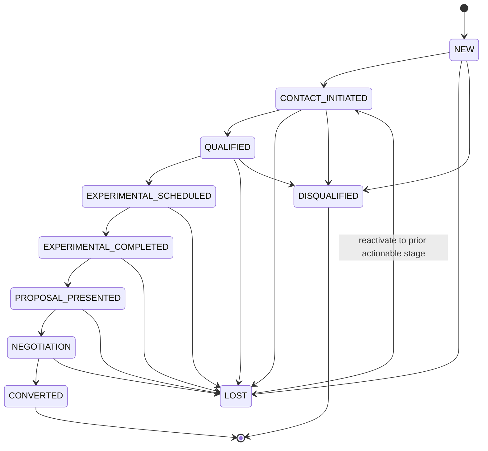

O alvo real da reativação é o último estágio acionável preservado, não necessariamente `CONTACT_INITIATED`; a seta é abreviação visual.

### 33.2 Appointment

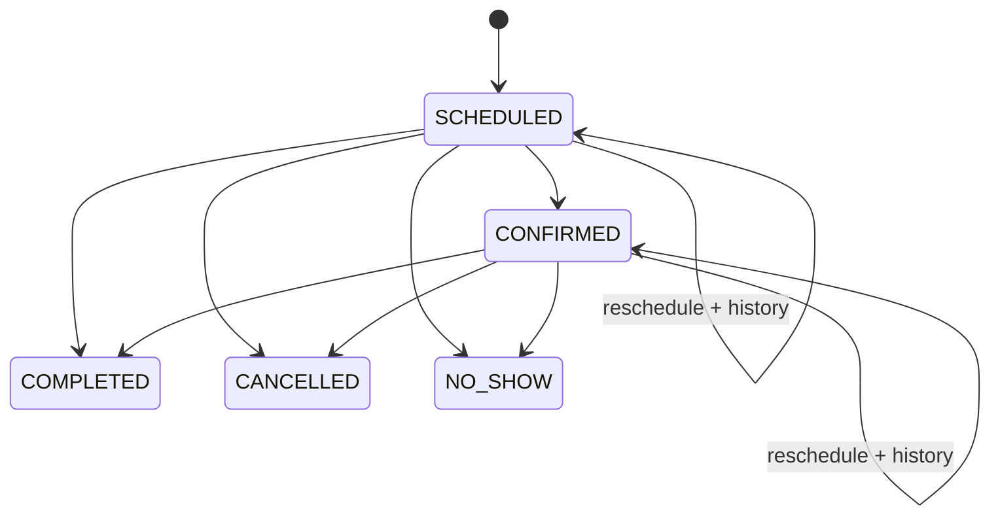

### 33.3 ClassOccurrence

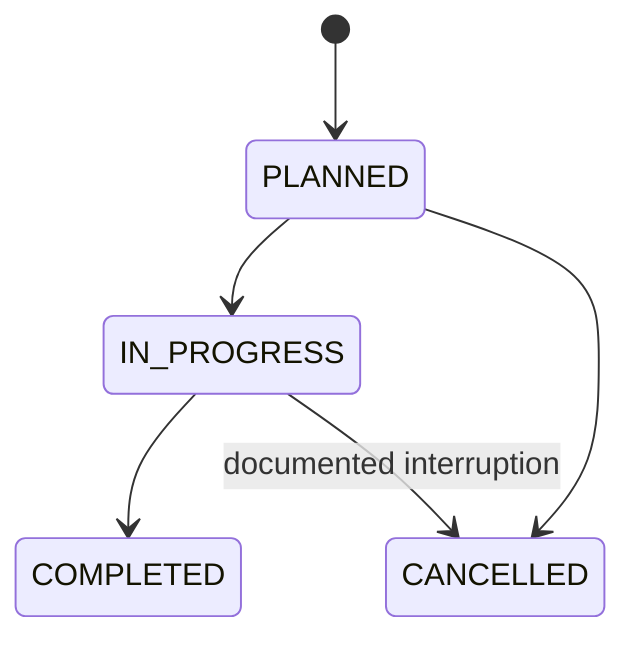

### 33.4 Attendance

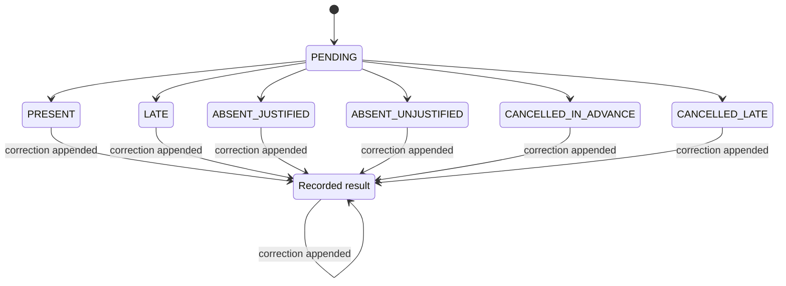

`R` representa qualquer novo resultado canônico; não é estado persistido adicional.

### 33.5 MakeupCredit

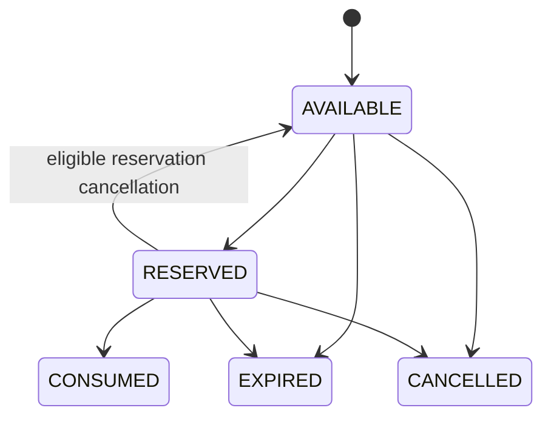

### 33.6 CareEpisode

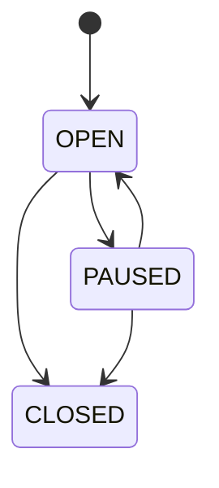

### 33.7 Assessment

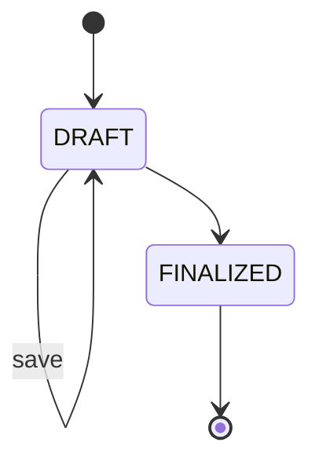

### 33.8 ClinicalEntry

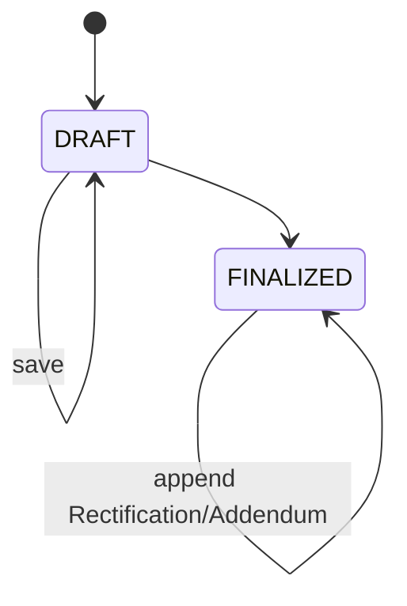

Append não muda o estado nem o conteúdo original.

### 33.9 Contract

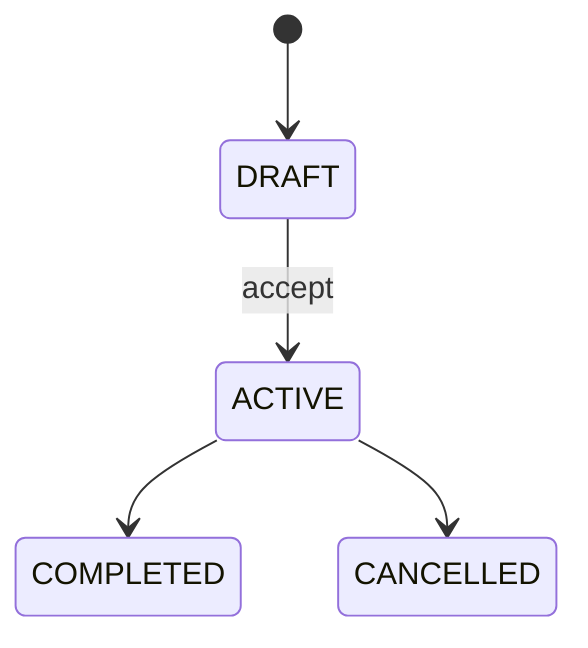

### 33.10 Enrollment

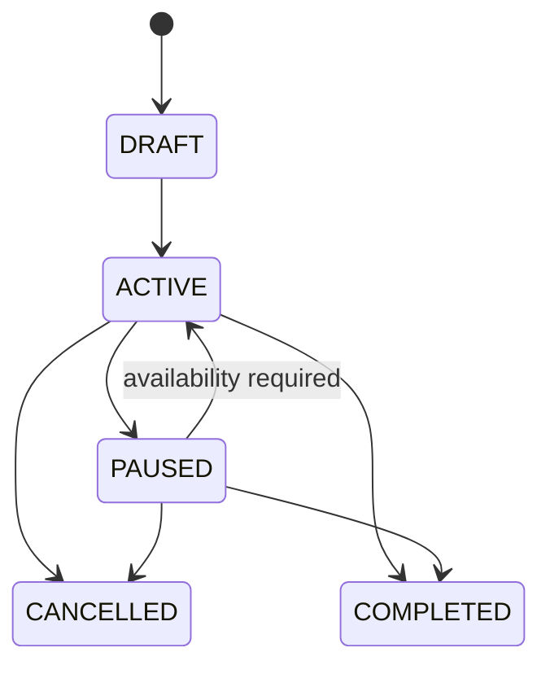

### 33.11 Receivable

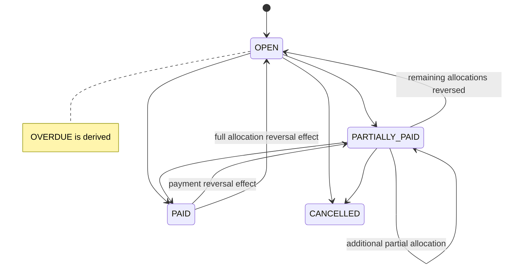

### 33.12 Payment

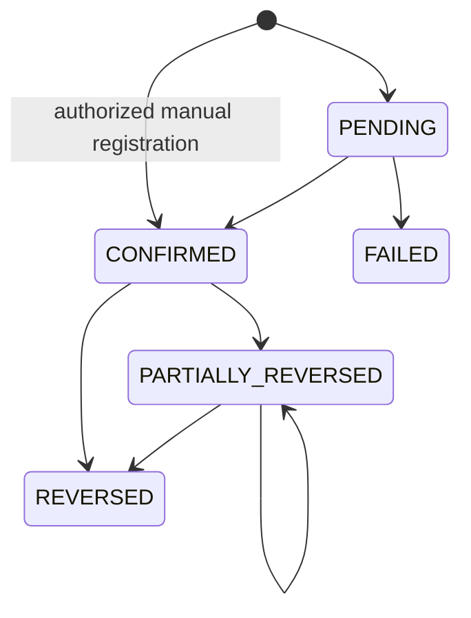

### 33.13 FinancialRestriction

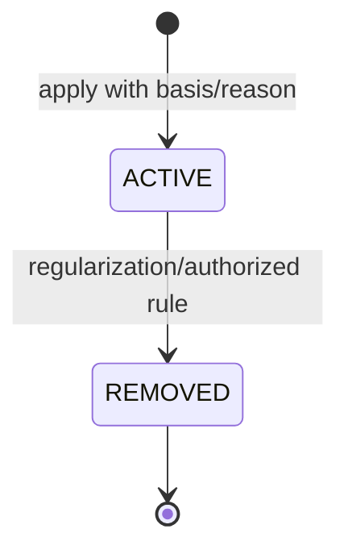

### 33.14 Expense

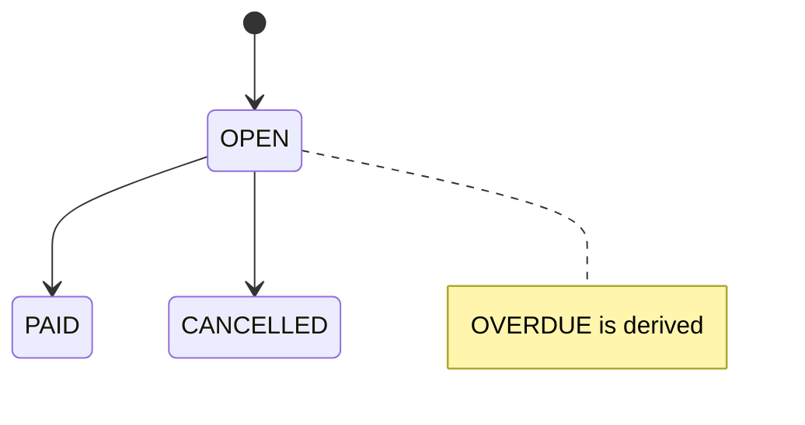

### 33.15 Closing

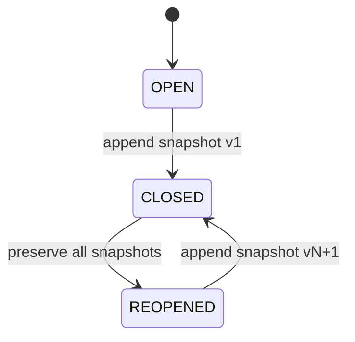

## 34. Process Coverage

Cada processo que altera lifecycle possui estado inicial, comando, guard e resultado representáveis.

| Processo | Estado inicial / condição | Comando principal | Guard de lifecycle | Estado/fato resultante | Resultado |
|---|---|---|---|---|---|
| PROC-PPL-001 | inexistente | CreatePerson | deduplicação/CPF | Person criada | SUPPORTED; sem máquina necessária |
| PROC-PAC-001 | Person válida | Create/ActivatePatient | requisitos mínimos/guardian quando menor | PatientProfile ACTIVE | SUPPORTED |
| PROC-AGD-001 | nova/atual vigência | Create/Change/EndScheduleRule | refs/conflito/vigência | nova vigência/encerramento | SUPPORTED (TEMPORAL) |
| PROC-AGD-002 | inexistente/SCHEDULED | Schedule/RescheduleAppointment | refs + ConflictPolicy | SCHEDULED ou mesmo estado com history | SUPPORTED |
| PROC-PIL-001 | Class ativa | CreateClassSchedule | refs, conflito, capacity, vigência | schedule vigente + occurrence PLANNED futura | SUPPORTED |
| PROC-PIL-002 | ausência de membership vigente | AddPatientToClass | Patient, Enrollment, conflito, capacity | ClassMembership efetivo | SUPPORTED (TEMPORAL) |
| PROC-PIL-003 | membership vigente | TransferPatient | benefício, conflito, capacity destino | antigo encerrado + novo efetivo | SUPPORTED (TEMPORAL) |
| PROC-PIL-004 | occurrence PLANNED | Start/Record/Complete | participantes e chamada resolvidos | IN_PROGRESS → COMPLETED | SUPPORTED |
| PROC-PIL-005 | fato elegível / credit AVAILABLE | Grant/Reserve/Consume | policy, validade, vaga, conflito | AVAILABLE → RESERVED → CONSUMED | SUPPORTED |
| PROC-CLI-001 | inexistente | OpenCareEpisode | Patient/actor/contexto | OPEN | SUPPORTED |
| PROC-CLI-002 | inexistente/DRAFT | Create/FinalizeAssessment | autoria/contexto/template/policy | DRAFT → FINALIZED | SUPPORTED |
| PROC-CLI-003 | inexistente | CreateClinicalEntry | Patient/Episode/author/contexto | DRAFT | SUPPORTED |
| PROC-CLI-004 | DRAFT | FinalizeClinicalEntry | autoria/policy/conteúdo | FINALIZED | SUPPORTED |
| PROC-CLI-005 | registro FINALIZED | RectifyClinicalRecord | actor autorizado + reason | Rectification append-only | SUPPORTED |
| PROC-PLN-001 | Contract DRAFT | AcceptContract | partes/version/condições/aceite | ACTIVE | SUPPORTED |
| PROC-ENR-001 | Enrollment DRAFT | ActivateEnrollment | Contract/datas/frequência | ACTIVE | SUPPORTED |
| PROC-ENR-002 | ACTIVE | PauseEnrollment | ≤15 dias; término preservado | PAUSED | SUPPORTED |
| PROC-ENR-003 | PAUSED | ResumeEnrollment | disponibilidade | ACTIVE | SUPPORTED |
| PROC-ENR-004 | ACTIVE/PAUSED | CancelEnrollment | reason/efeito imediato | CANCELLED | SUPPORTED |
| PROC-ENR-005 | Contract atual | RenewContract | nova PlanVersion/aceite | novo Contract ACTIVE; Enrollment preservado | SUPPORTED |
| PROC-ENR-006 | Enrollment ativo/pausado | ChangeFrequency | nova vigência válida | state inalterado + nova vigência | SUPPORTED |
| PROC-ENR-007 | membership vigente | ChangeUnit/Class via Pilates | benefício/conflito/capacity | memberships com vigência | SUPPORTED |
| PROC-BIL-001 | Contract aceito/ACTIVE | GenerateReceivables | correlação/lote único | Receivables OPEN | SUPPORTED |
| PROC-BIL-002 | PENDING ou criação manual | Confirm/RegisterPayment | amount/account/registrador/idempotência | CONFIRMED | SUPPORTED |
| PROC-BIL-003 | Receivable OPEN/PARTIALLY_PAID | AllocatePayment | saldo/disponível | PARTIALLY_PAID/PAID | SUPPORTED |
| PROC-BIL-004 | Receivables futuros | AllocatePayment + discount/adjustment autorizado | policy/alçada futura | saldo/estado derivados | SUPPORTED; valor/alçada pendentes |
| PROC-BIL-005 | Receivables existentes | CreateNegotiation | alçada/termos | negotiation deferred; efeitos por adjustments | SUPPORTED conceitualmente; STATE_DEFERRED |
| PROC-BIL-006 | Payment CONFIRMED/PARTIALLY_REVERSED | ReversePayment | reversível + reason | PARTIALLY_REVERSED/REVERSED | SUPPORTED |
| PROC-BIL-007 | valor elegível | Issue/CompleteRefund | eligibility/account/idempotência | ISSUED → COMPLETED | SUPPORTED |
| PROC-BIL-008 | condição de atraso/policy | ApplyFinancialRestriction | base/reason | ACTIVE | SUPPORTED |
| PROC-BIL-009 | restriction ACTIVE | RemoveFinancialRestriction | regularização/regra/reason | REMOVED | SUPPORTED |
| PROC-FIN-001 | inexistente | RegisterExpense | amount/category/scope/due | OPEN | SUPPORTED |
| PROC-FIN-002 | Expense OPEN | PayExpense | integral/account | PAID + OUTFLOW | SUPPORTED |
| PROC-FIN-003 | dados válidos | TransferMoney | contas distintas/amount | immutable Transfer + par | SUPPORTED |
| PROC-FIN-004 | divergência verificada | ReconcileAccount | expected/actual/reason | immutable adjustment + transaction | SUPPORTED |
| PROC-FIN-005 | Closing OPEN/REOPENED | CloseMonth | cutoff/fontes/permission | CLOSED + snapshot | SUPPORTED |
| PROC-FIN-006 | Closing CLOSED | ReopenClosing | permission/reason | REOPENED | SUPPORTED |

**Cobertura:** 37/37 processos do PROCESS_INDEX são representáveis. Nenhum processo exige estado artificial, escrita cross-context ou transição proibida.

## 35. Rule Coverage

| Regras | Mapeamento de lifecycle | Resultado |
|---|---|---|
| RB-PPL-001..004 | perfis separados; Person sem máquina artificial; merge preservado e deferred até policy de reversal | COVERED |
| RB-PAC-001..004 | PatientProfile ACTIVE/INACTIVE; vínculos temporais; sem hard delete | COVERED |
| RB-CRM-001..007 | Opportunity/pipeline, LossReason, human loss, next action, conversion guard e experimental externa | COVERED |
| RB-AGD-001..009 | ScheduleRule temporal; Appointment; conflict guards; reschedule/cancel history; ad-hoc sem membership | COVERED |
| RB-PIL-001..010 | recurrence/occurrence, temporal membership, capacity, attendance correction e Makeup lifecycle | COVERED |
| RB-CLI-001..008 | Clinical segregado; autoria; FINALIZED imutável; append corrections; audit sensível | COVERED |
| RB-PLN-001..003 | PlanVersion/Contract snapshot; renewal por novo Contract | COVERED |
| RB-ENR-001..007 | guards de pró-rata downstream, pause, resume, cancel e frequência temporal | COVERED |
| RB-BIL-001..012 | Receivable/Payment separados, due/pró-rata, partial/advance, overdue derivado, reversal/refund/restriction | COVERED |
| RB-FIN-001..007 | accounts, saldo derivado, Expense, Transfer immutable, Closing versionado, sem Commission | COVERED |
| RB-SEC-001/002 | guards pressupõem permission/context; nenhuma autoridade técnica implícita | COVERED para STATE; detalhar AUTH-001 |
| RB-AUD-001 | quatro níveis e campos mínimos definidos | COVERED |
| RB-COM-001 | efeitos são intenções/eventos; Communication não decide transição | COVERED |

**Cobertura:** 75/75 regras canônicas são compatíveis e mapeadas. Parâmetros PAR-CRM, PAR-AGD, PAR-PIL, PAR-ENR, PAR-BIL, PAR-CLI e PAR-FIN aparecem como guards/conditions com vigência, nunca constantes estruturais.

## 36. State Process Gaps

Nenhum `STATE_PROCESS_GAP` foi encontrado nos 37 processos catalogados.

Itens ainda sem processo detalhado, mas que não tornam processo existente irrepresentável:

- abandono/expiração de Contract DRAFT;
- correção de Appointment.NO_SHOW/COMPLETED registrado incorretamente;
- policy operacional completa de Negotiation;
- consumo de MakeupCredit em Appointment ad-hoc fora de turma.

Esses itens são open questions antes da implementação; não foram inventados como transições.

## 37. State Rule Conflicts

Nenhum `STATE_RULE_CONFLICT` encontrado.

- `OVERDUE` foi reconciliado como condição derivada conforme DOM-017, MODEL-004 e INV-BIL-013, sem apagar o rótulo de read model/evento temporal.
- `ACCEPTED` em modelos anteriores foi reconciliado como trigger/fato de `DRAFT → ACTIVE`, usando os estados aprovados para Contract nesta baseline.
- `RefundIssued` e `RefundCompleted` foram separados: emissão reserva/autoriza; conclusão representa saída real.
- Nenhuma regra foi alterada silenciosamente.

## 38. Ambiguities Resolved

1. `OVERDUE` de Receivable e Expense é `DERIVED_CONDITION`, não estado persistido.
2. Delinquency é derivada; o efeito persistido é FinancialRestriction própria.
3. Contract usa `ACTIVE`; `ContractAccepted` é fato da transição, não estado paralelo.
4. Renovação cria novo Contract e não executa `ACTIVE → ACTIVE`.
5. Enrollment pode ser cancelado/concluído a partir de PAUSED; a pausa não imuniza o vínculo contra encerramento imediato ou término regular.
6. `IN_PROGRESS → CANCELLED` de ClassOccurrence é permitido somente para impedimento superveniente documentado e auditado.
7. Attendance é state machine corrigível: resultados mudam somente por AttendanceCorrection append-only.
8. MakeupReservation não possui máquina independente; lifecycle é derivado dos fatos da reserva, crédito e occurrence.
9. Payment pode iniciar PENDING em fluxo de confirmação ou ser criado+confirmado atomicamente no registro manual, sem inventar provider.
10. Payment confirmado é compensado por reversal; nunca “desconfirmado”.
11. Refund usa ISSUED → COMPLETED/CANCELLED; somente COMPLETED representa saída real para Finance.
12. FinancialRestriction removida não reabre; recorrência cria novo registro.
13. Transfer é fato atômico imutável; não foram inventados estados bancários externos.
14. Closing.CLOSED é não terminal porque pode reabrir; cada fechamento adiciona snapshot.
15. ClassMembership e demais links efetivos são temporais; ACTIVE/ENDED pode ser lido por data sem enum obrigatório.
16. `expired`, `available capacity`, `payment balance`, `active membership` e `financially restricted` foram classificados sem duplicar source of truth.

## 39. Remaining Ambiguities

| ID | Tema | Classificação | Tratamento nesta baseline |
|---|---|---|---|
| STATE-OQ-001 | efeito de Enrollment.PAUSED em MakeupCredit | BLOCKING BEFORE IMPLEMENTATION | nenhuma transição inferida |
| STATE-OQ-002 | Receivables vencidos no cancelamento | BLOCKING BEFORE IMPLEMENTATION | não cancelar/perdoar automaticamente |
| STATE-OQ-003 | precedência pausa/cancel/frequency/payment/reversal/refund | BLOCKING BEFORE IMPLEMENTATION | fatos preservados; ordem futura |
| STATE-OQ-004 | reallocation e allocations afetadas por reversal | BLOCKING BEFORE IMPLEMENTATION | reversal append-only, detalhes futuros |
| STATE-OQ-005 | alçadas/limites de Negotiation/Discount | BLOCKING BEFORE IMPLEMENTATION | máquina de Negotiation deferred |
| STATE-OQ-006 | abandono/expiração de Contract DRAFT | BLOCKING BEFORE IMPLEMENTATION | DRAFT→CANCELLED não adotado |
| STATE-OQ-007 | correção de resultado de Appointment terminal | BLOCKING BEFORE IMPLEMENTATION | sem descancelar/sobrescrever |
| STATE-OQ-008 | MakeupCredit em reposição ad-hoc | BLOCKING BEFORE IMPLEMENTATION | contrato futuro necessário |
| STATE-OQ-009 | campos/policies clínicas mínimas e assinatura | BLOCKING BEFORE GO-LIVE | guards referenciam futura policy |
| STATE-OQ-010 | reabertura de CareEpisode CLOSED | NON_BLOCKING | novo episódio é regra atual |
| STATE-OQ-011 | forma interna de Availability/feriados | NON_BLOCKING | dependência pública abstrata suficiente |
| STATE-OQ-012 | pagamento parcial de Expense | NON_BLOCKING/FUTURE | não adotado |

## 40. Open Questions

### BLOCKING FOR EVT-001

Nenhuma. Os nomes permanecem candidatos, mas todos os fatos necessários e seus owners estão identificados. A ambiguidade de saída de Refund foi resolvida em favor de `RefundCompleted`.

### BLOCKING BEFORE AUTH-001

Nenhuma para iniciar AUTH-001. AUTH-001 deverá fechar atores, permissions e alçadas por transição, especialmente Clinical, Finance, merge, corrections, exceptions e Closing.

### BLOCKING BEFORE ARCHITECTURE

- estratégia conceitual de correlação/idempotência para Payment/Reversal/Refund → Finance;
- contratos públicos que preservem as dependências assimétricas e impeçam ciclos síncronos;
- baseline técnica de audit/correlation sem alterar os níveis definidos aqui.

### BLOCKING BEFORE IMPLEMENTATION

STATE-OQ-001 a 008; matriz de permissions/alçadas; autenticação/MFA/session; IDs/timezone/Money/arredondamento; concorrência de capacidade, agenda e finanças.

### BLOCKING BEFORE GO-LIVE

STATE-OQ-009; retenção/legal hold/LGPD; exportação/menores; backup/restore/RPO/RTO; migração/reconciliação.

### NON_BLOCKING

STATE-OQ-010 a 012; provider/canais/storage; catálogo de categorias/motivos; KPIs; comprovantes opcionais; granularidade física de ClosingSnapshot.

## 41. Consequences for EVT-001

EVT-001 deve:

- promover ou rejeitar cada `EVENT CANDIDATE`, sem assumir que todo self-transition publica evento;
- distinguir comando de fato e evento interno de integração;
- definir owner, payload mínimo, sensibilidade, versão semântica, correlation e idempotency key conceitual;
- usar `RefundCompleted` para a saída real e diferenciar `PaymentPartiallyReversed` de `PaymentReversed`;
- representar `ReceivableBecameOverdue` como fato de condição derivada, não mudança do enum persistido;
- preservar metadata clínica mínima e nunca transportar conteúdo integral;
- não criar eventos que permitam escrita cross-context.

## 42. Consequences for AUTH-001

AUTH-001 deve mapear cada comando/transição a permission + resource/context + alçada, deny-by-default. Deve separar autor clínico de UserAccount autenticado; exigir authority específica para finalização, rectification/addendum, break-glass/export, financial reversal/refund/restriction, Closing reopen, Attendance correction, Makeup exceptions e Opportunity loss/reactivation. Proprietária e Desenvolvedor não recebem Clinical/Finance implicitamente.

## 43. Validation Criteria

- [x] principais lifecycles classificados;
- [x] máquinas prioritárias formalizadas;
- [x] transições permitidas explícitas;
- [x] transições inválidas críticas explícitas;
- [x] guards conceituais documentados;
- [x] reversibilidade, compensação e irreversibilidade classificadas;
- [x] temporalidade separada de state machine;
- [x] condições derivadas separadas de estado persistido;
- [x] dependencies cross-context documentadas sem duplicar source of truth;
- [x] auditoria classificada;
- [x] 37/37 processos representáveis;
- [x] 75/75 regras compatíveis;
- [x] ownership e 15 invariantes cross-context do MODEL-005 preservados;
- [x] nenhum cross-context write ou ciclo síncrono novo;
- [x] FINALIZED nunca retorna a DRAFT;
- [x] CLOSED/CANCELLED não é apagado;
- [x] renewal cria novo Contract;
- [x] pause não vira cancellation e FinancialRestriction não vira PAUSED;
- [x] Attendance correction preserva before/after;
- [x] reschedule preserva Appointment e histórico;
- [x] Payment reversal preserva Payment;
- [x] Closing reopen preserva snapshots;
- [x] nenhum blocker impede EVT-001;
- [x] nenhum detalhe físico/implementação foi introduzido.

**Resultado:** STATE-001 — PASS.
